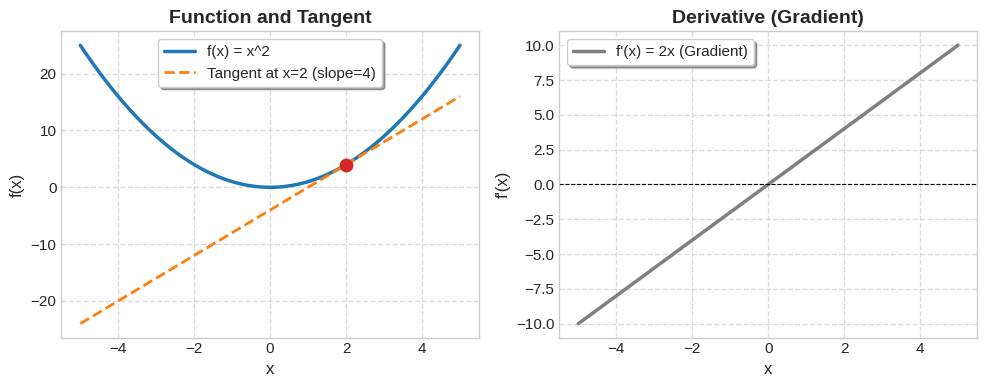
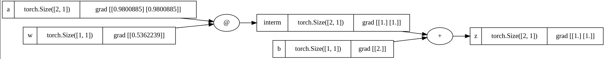
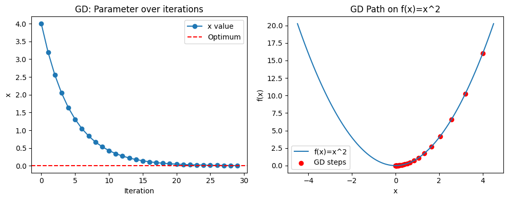
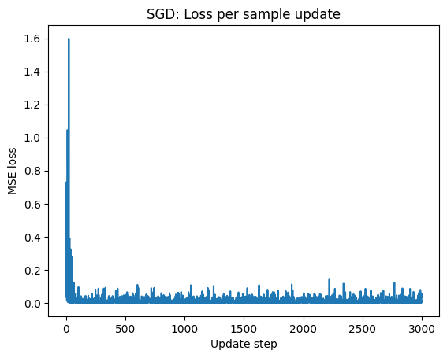
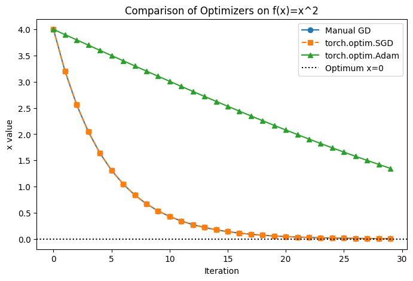
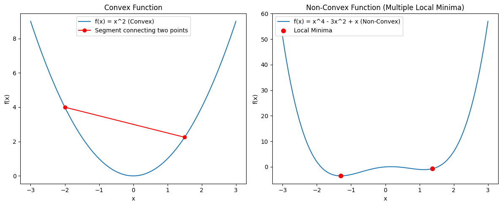

# 00 · Mathematical Foundation

The three pieces of maths that almost every ML algorithm is built on: **linear algebra** (how data and models are stored), **probability** (how uncertainty is described) and **calculus** (how models learn).

> **Notebooks:** [linear_algebra](linear_algebra.ipynb) · [probability_statistics](probability_statistics.ipynb) · [calculus_optimization](calculus_optimization.ipynb) · [optimization_algorithms](optimization_algorithms.ipynb) · [autograd(scalar)](autograd%28scalar%29.ipynb) · [autograd(tensor)](autograd%28tensor%29.ipynb)
>
> **Quick revision:** [CHEATSHEET.md](CHEATSHEET.md)
>
> **Explore in your browser:** [Spread and averages](https://sandeshjung.github.io/Machine-Learning-Foundation/normal-distribution.html) · [Optimiser race](https://sandeshjung.github.io/Machine-Learning-Foundation/gradient-descent.html)

## Contents

1. [Linear algebra](#1-linear-algebra)
2. [Probability and statistics](#2-probability-and-statistics)
3. [Calculus and gradients](#3-calculus-and-gradients)
4. [Automatic differentiation (autograd)](#4-automatic-differentiation-autograd)
5. [Optimisation algorithms](#5-optimisation-algorithms)

---

## 1. Linear algebra

Linear algebra is the language ML uses to store data and parameters. A dataset is a matrix, one sample is a vector, and a neural network layer is a matrix multiplication.

### 1.1 The building blocks

| Object | What it is | NumPy / PyTorch | Where you meet it in ML |
|---|---|---|---|
| **Scalar** | A single number | `np.array(5)` · `torch.tensor(5.0)` | Learning rate, loss value |
| **Vector** | An ordered list of numbers (1-D) | `np.array([1, 2, 3])` | One sample's features, a weight vector, an embedding |
| **Matrix** | A grid of numbers (2-D) | `np.array([[1, 2], [3, 4]])` | A dataset (samples × features), a layer's weights |
| **Tensor** | Any number of dimensions | `torch.randn(3, 4, 5)` | An image (C × H × W), a batch of images (N × C × H × W) |

### 1.2 Vector operations

- **Addition / subtraction** works element by element, so both vectors need the same length: $c_i = a_i + b_i$.
- **Scalar multiplication** scales every element: $b_i = s \cdot a_i$.
- **Dot product** multiplies matching elements and adds them up. The result is a single number:

```math
\mathbf{a} \cdot \mathbf{b} = \sum_i a_i b_i = \lVert \mathbf{a} \rVert \, \lVert \mathbf{b} \rVert \cos\theta
```

It measures how much two vectors point the same way. It's the core of linear models ($\mathbf{w}^\top \mathbf{x}$) and of similarity measures.

- **Norms** measure a vector's length:
  - L2 (Euclidean): $\lVert \mathbf{x} \rVert_2 = \sqrt{x_1^2 + x_2^2 + \dots}$
  - L1 (Manhattan): $\lVert \mathbf{x} \rVert_1 = |x_1| + |x_2| + \dots$

Both appear as regularisation penalties (Ridge uses L2, Lasso uses L1) and in distance calculations.

### 1.3 Matrix operations

| Operation | Rule | Shape |
|---|---|---|
| Addition | $C_{ij} = A_{ij} + B_{ij}$ | Same shapes in and out |
| Transpose | $(A^\top)_{ij} = A_{ji}$ | $m \times n \to n \times m$ |
| Multiplication | $C_{ij} = \sum_k A_{ik} B_{kj}$ | $(m \times n)(n \times p) \to m \times p$ |
| Identity $I$ | 1s on the diagonal, 0s elsewhere | $AI = IA = A$ |
| Inverse $A^{-1}$ | $AA^{-1} = A^{-1}A = I$ | Square matrices with $\det A \ne 0$ only |

> [!TIP]
> For matrix multiplication, the **inner** dimensions must match: the columns of $A$ must equal the rows of $B$. Most shape errors in deep learning come from this rule.

### 1.4 Decompositions

**Eigenvalues and eigenvectors.** An eigenvector $\mathbf{v}$ of a square matrix $A$ only gets *stretched* by $A$, never rotated. The stretch factor is its eigenvalue $\lambda$:

```math
A\mathbf{v} = \lambda \mathbf{v}
```

If $A$ is diagonalisable, it can be written as $A = V \Lambda V^{-1}$, where:

- the columns of $V$ are the eigenvectors
- $\Lambda$ is a diagonal matrix of eigenvalues
- for a symmetric $A$, $V$ is orthogonal, so $V^{-1} = V^\top$

*In ML:* PCA finds the eigenvectors of the covariance matrix. Those are the directions in which the data varies most.

**Singular value decomposition (SVD).** Unlike eigen-decomposition, SVD works for *any* $m \times n$ matrix:

```math
A = U \Sigma V^\top
```

- $U$ ($m \times m$) and $V$ ($n \times n$) are orthogonal. Their columns are the left and right singular vectors.
- $\Sigma$ is diagonal and holds the singular values, sorted from largest to smallest.
- The singular values are the square roots of the eigenvalues of $A^\top A$.

*In ML:* keeping only the top $k$ singular values gives the best rank-$k$ approximation of $A$. This is used for dimensionality reduction (PCA), recommender systems, noise removal and the pseudo-inverse.

---

## 2. Probability and statistics

Probability describes **uncertainty**: noisy data, and predictions that are never 100% sure. Statistics gives us the tools to **learn from data**: estimate parameters, evaluate models and compare them.

### 2.1 Common distributions

A probability distribution says how likely each possible value of a random variable is.

**Discrete** (countable outcomes):

| Distribution | Models | Parameters | PMF $P(X = k)$ | Used for |
|---|---|---|---|---|
| Bernoulli | One yes/no trial | $p$ | $p^k (1-p)^{1-k}$, $k \in \{0, 1\}$ | Binary classification outputs |
| Binomial | Successes in $n$ trials | $n, p$ | $\binom{n}{k} p^k (1-p)^{n-k}$ | Click counts over many impressions |
| Categorical | One trial, $K$ outcomes | $p_1, \dots, p_K$ | $p_k$ | Multi-class outputs (softmax) |

**Continuous** (any value in a range):

| Distribution | Parameters | PDF $f(x)$ | Used for |
|---|---|---|---|
| Uniform | $a, b$ | $\frac{1}{b-a}$ for $a \le x \le b$ | Weight initialisation, "no prior knowledge" |
| Normal (Gaussian) | $\mu, \sigma^2$ | $\frac{1}{\sqrt{2\pi\sigma^2}} \exp\left(-\frac{(x-\mu)^2}{2\sigma^2}\right)$ | Noise models, priors, Gaussian mixtures |

> [!NOTE]
> The normal distribution is everywhere because of the **Central Limit Theorem**: the average of many independent random variables tends towards a normal distribution, whatever their original distribution.

### 2.2 PMF, PDF and CDF

- **PMF** (discrete): $P(X = x)$ is a probability. Every value is $\ge 0$, and they sum to 1.
- **PDF** (continuous): $f(x)$ is a *density*, not a probability. Probabilities come from areas under the curve:

```math
P(c \le X \le d) = \int_c^d f(x)\,dx
```

This is why $P(X = x) = 0$ for any single point.

- **CDF**: $F(x) = P(X \le x)$. It rises from 0 to 1, never decreases, and gives interval probabilities directly: $P(a < X \le b) = F(b) - F(a)$. For continuous variables the PDF is its derivative, $f(x) = F'(x)$.

### 2.3 Bayes' theorem

Bayes' theorem tells you how to **update a belief** when new evidence arrives:

```math
\underbrace{P(H \mid E)}_{\text{posterior}} = \frac{\overbrace{P(E \mid H)}^{\text{likelihood}} \; \overbrace{P(H)}^{\text{prior}}}{\underbrace{P(E)}_{\text{evidence}}}
```

- **Prior** $P(H)$: what you believed before seeing the evidence.
- **Likelihood** $P(E \mid H)$: how likely the evidence is if $H$ is true.
- **Evidence** $P(E)$: a normalising constant, $P(E) = P(E \mid H)P(H) + P(E \mid \neg H)P(\neg H)$.
- **Posterior** $P(H \mid E)$: your updated belief.

The notebook works through a medical test. Even a fairly accurate test gives a surprisingly low posterior when the disease is rare, because the prior is so small.

*In ML:* Naive Bayes classifiers, Bayesian models (priors on parameters), spam filtering and A/B testing.

### 2.4 Sampling

| Technique | How it works | Used for |
|---|---|---|
| Sampling from a distribution | Draw values with `torch.distributions.<Dist>.sample()` | Synthetic data, Monte Carlo estimates, dropout masks |
| Simple random sampling | Every item has the same chance (`torch.randperm`, `np.random.choice`) | Train/test splits, bootstrapping |
| Stratified sampling | Split into groups first, then sample from each group in proportion | Keeping class balance in train/test splits |

> [!TIP]
> For classification, use a **stratified** split (`train_test_split(..., stratify=y)`), especially with imbalanced classes. Otherwise the test set may barely contain the rare class.

---

## 3. Calculus and gradients

Training a model means finding the parameters that make the **loss** as small as possible. Calculus tells us *which direction* to move the parameters to make the loss smaller.

### 3.1 Derivatives and gradients

- The **derivative** $f'(x)$ is the slope of $f$ at $x$: how fast $f$ changes when $x$ changes a little.
- For a function of many variables, the **gradient** collects all the partial derivatives into a vector:

```math
\nabla f(\mathbf{x}) = \left[ \frac{\partial f}{\partial x_1}, \frac{\partial f}{\partial x_2}, \dots, \frac{\partial f}{\partial x_n} \right]^\top
```

**Intuition:** the gradient points in the direction of **steepest ascent**, so $-\nabla f$ points downhill. Gradient descent simply keeps stepping downhill.

<p align="center">
  
  <br>
  <em>Left: f(x) = x² and its tangent at x = 2 (slope 4). Right: the derivative f′(x) = 2x gives that slope at every x.</em>
</p>

### 3.2 Numerical gradients (finite differences)

You can also *estimate* a derivative by nudging the input by a tiny step $h$ (for example $10^{-5}$) and watching how much $f$ changes:

| Method | Formula | Error | Cost per input dimension |
|---|---|---|---|
| Forward difference | $\dfrac{f(x+h) - f(x)}{h}$ | $O(h)$ | 1 extra evaluation of $f$ |
| Central difference | $\dfrac{f(x+h) - f(x-h)}{2h}$ | $O(h^2)$ | 2 evaluations of $f$ |

**Why central is more accurate.** Expand $f(x \pm h)$ with a Taylor series:

```math
f(x \pm h) = f(x) \pm f'(x)\,h + \tfrac{1}{2} f''(x)\,h^2 \pm \dots
```

Subtracting the two expansions cancels the $h^2$ term, so the error drops from $O(h)$ to $O(h^2)$.

For a function of many variables, nudge **one coordinate at a time**:

```text
grad = zeros_like(x)
for i in range(n):
    x_plus  = x.copy(); x_plus[i]  += h
    x_minus = x.copy(); x_minus[i] -= h
    grad[i] = (f(x_plus) - f(x_minus)) / (2 * h)
```

> [!NOTE]
> Numerical gradients are too slow to train with, but they are perfect for **gradient checking**: verifying that hand-written or autograd gradients are correct.

---

## 4. Automatic differentiation (autograd)

Autograd computes exact gradients automatically. It's the engine behind every neural network library. The two autograd notebooks build a tiny engine from scratch, inspired by [micrograd](https://github.com/karpathy/micrograd): first for scalars, then for tensors. They then check it against PyTorch.

### 4.1 The idea: a computation graph

Every operation (`+`, `*`, `tanh`, …) creates a **node** that remembers:

- its value (`data`)
- which nodes it was computed from (`_prev`)
- how to pass gradients back to them (`_backward`)

Together these nodes form a directed acyclic graph that ends at the loss.

### 4.2 The backward pass

1. **Sort the graph topologically**, so that every node comes after all the nodes it depends on.
2. **Seed the output:** set `loss.grad = 1`, because $\partial L / \partial L = 1$.
3. **Walk the graph in reverse.** At each node, apply the chain rule and **add** its contribution to each parent's gradient:

```math
\frac{\partial L}{\partial \text{parent}} \mathrel{+}= \frac{\partial L}{\partial \text{node}} \cdot \frac{\partial \text{node}}{\partial \text{parent}}
```

When the walk is finished, every leaf's `.grad` holds $\partial L / \partial \text{leaf}$.

> [!IMPORTANT]
> Gradients are **added**, not assigned, because a value used in several places receives gradient from each of them. That's also why PyTorch needs `optimizer.zero_grad()` before every backward pass.

<p align="center">
  
  <br>
  <em>Computation graph drawn by the tensor autograd notebook.</em>
</p>

### 4.3 Autograd in PyTorch

| Tool | What it does |
|---|---|
| `requires_grad=True` | Track every operation on this tensor |
| `loss.backward()` | Run the backward pass from a scalar |
| `x.grad` | Where the gradient $\partial L / \partial x$ ends up (it accumulates) |
| `y.backward(gradient=g)` | For a non-scalar `y`: computes the vector-Jacobian product $g^\top J$ |
| `x.detach()` | Same data, but cut off from the graph |
| `with torch.no_grad():` | Turn tracking off, for inference and manual parameter updates |

---

## 5. Optimisation algorithms

### 5.1 Gradient descent (GD)

Repeatedly take a small step **against** the gradient:

```math
\boldsymbol{\theta}^{(t+1)} = \boldsymbol{\theta}^{(t)} - \eta \, \nabla_{\boldsymbol{\theta}} L\big(\boldsymbol{\theta}^{(t)}\big)
```

- $\boldsymbol{\theta}$ holds the parameters.
- $\eta$ is the **learning rate**. Too small and training crawls. Too large and it overshoots or diverges.
- In plain GD, the gradient is computed over the **whole** dataset.

<p align="center">
  
  <br>
  <em>Gradient descent on f(x) = x², starting from x = 4: each step moves closer to the minimum at 0.</em>
</p>

The algorithm:

1. Initialise $\boldsymbol{\theta}$, randomly or with zeros.
2. Repeat $T$ times, or until the loss stops improving:
   1. compute the gradient $\nabla L(\boldsymbol{\theta})$
   2. update $\boldsymbol{\theta} \leftarrow \boldsymbol{\theta} - \eta \nabla L(\boldsymbol{\theta})$

### 5.2 Stochastic and mini-batch gradient descent

Computing the gradient over millions of samples for every step is expensive. Instead, **estimate** it from a small random part of the data:

| Variant | Gradient computed from | Behaviour |
|---|---|---|
| Batch GD | All $m$ samples | Smooth but slow per step |
| Stochastic GD | 1 random sample | Very noisy, very cheap |
| **Mini-batch GD** | $B$ samples (32–256) | The practical default: stable *and* GPU-friendly |

```math
\nabla L_{\text{batch}}(\boldsymbol{\theta}) = \frac{1}{B} \sum_{j=1}^{B} \nabla L_j(\boldsymbol{\theta})
```

The estimate is noisy but **unbiased**: on average it equals the true gradient. Each epoch, shuffle the data, split it into mini-batches, and take one step per batch.

<p align="center">
  
  <br>
  <em>SGD: the loss is noisy from step to step but trends downwards.</em>
</p>

> [!NOTE]
> When a deep learning library says "SGD", it almost always means **mini-batch** SGD.

### 5.3 Using `torch.optim`

PyTorch ships ready-made optimisers (SGD, Adam, RMSprop, …). Every training loop has the same three lines:

```python
optimizer = torch.optim.SGD(model.parameters(), lr=0.01)

for x, y in loader:
    optimizer.zero_grad()           # 1. clear old gradients
    loss = loss_fn(model(x), y)
    loss.backward()                 # 2. compute new gradients
    optimizer.step()                # 3. update the parameters
```

<p align="center">
  
  <br>
  <em>Manual GD and torch.optim.SGD follow exactly the same path, so their lines overlap. Adam, with the same learning rate, moves more slowly here.</em>
</p>

### 5.4 Convexity: when optimisation is easy

A function is **convex** if the straight line between any two points on its graph never dips below the graph, like a bowl.

- In 1-D: $f''(x) \ge 0$ everywhere.
- In many dimensions: the Hessian (the matrix of second derivatives) is positive semi-definite.

**Why it matters:** for a convex function, **every local minimum is the global minimum**, so gradient descent with a suitable learning rate is guaranteed to find it. Linear regression with MSE, logistic regression and SVMs are all convex.

Deep networks are **not** convex. They have many local minima and saddle points, which is why optimiser choice, initialisation and learning-rate schedules matter so much.

<p align="center">
  
  <br>
  <em>Left: convex x², where any chord lies above the curve. Right: non-convex x⁴ − 3x² + x, with two local minima.</em>
</p>
