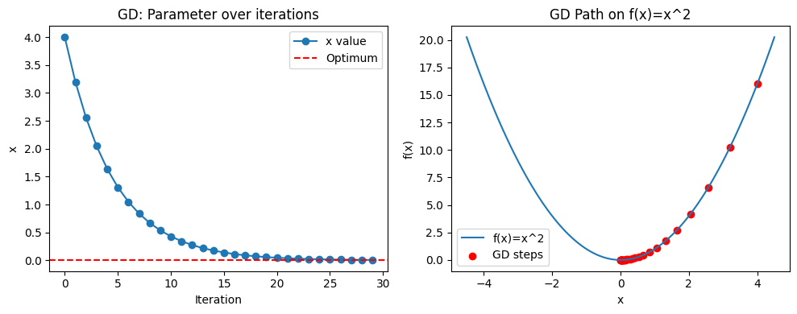
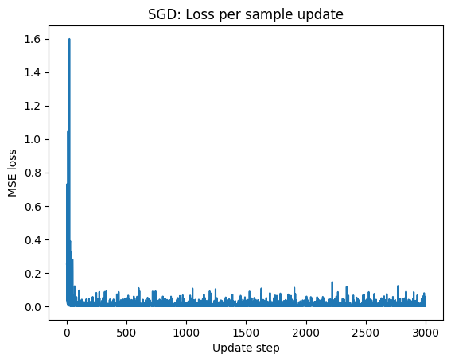

# Mathematical Foundation

## Linear Algebra Fundamentals for Machine Learning

This provides a practical demonstration of key Linear Algebra concepts crucial for understanding and implementing Machine Learning algorithms. For Linear Algebra, scalars, vectors, matrices, along with essential operations and decompositions like Eigen-decomposition and Singular Value Decomposition (SVD) are explored.

The examples are primarily shown using [NumPy](https://numpy.org/) and [PyTorch](https://pytorch.org/).

### 1. Core Concepts

- **Scalars**
    - A scalar is a single numerical value. 
    - Representation: 
        - Python: Standard Numbers (e.g., `5`, `3.14`, etc.).
        - NumPy: 0-dimensional `ndarray` (e.g., `np.array(5)`).
        - PyTorch: 0-dimensional `torch.Tensor` (e.g., `torch.tensor(5.0)`).
    - ML Relevance: Learning rates, regularization parameters, individual feature values, loss values.

- **Vectors**
    - A 2-dimensional array (grid) of numbers, arranged in rows and columns.
    - Representation:
        - NumPy: 2-dimensional `ndarray` (e.g., `np.array([[1,2],[3,4]])`).
        - PyTorch: 2-dimensional `torch.Tensor` (e.g., `torch.tensor([[1.,2.],[3.,4.]])`).
    - ML Relevance: Datasets (samples x features), weight matrices in neural networks, covariance matrices, transformation matrices.

- **Matrices**
    - A 2-dimensional array (grid) of numbers, arranged in rows and columns.
    - Representation: 
        - NumPy: 2-dimensional `ndarray` (e.g., `np.array([[1,2],[3,4]])`).
        - PyTorch: 2-dimensional `torch.Tensor` (e.g., `torch.tensor([[1.,2.],[3.,4.]])`).
    - ML Relevance: Datasets (samples × features), weight matrices in neural networks, covariance matrices, transformation matrices.

### 2. Vector Operations

- **Vector Addition & Substraction**
    - Element-wise addition or subtraction. Vectors must have the same dimensions.
    - `c = a + b` => `c_i = a_i + b_i`

- **Vector Scalar Multiplication**
    - Multiplying each element of the vector by a scalar.
    - `b = s * a` => `b_i = s * a_i`   

- **Dot Product**
    - Sum of the products of corresponding elements of two vectors. The result is a scalar.
    - `a · b = Σ (a_i * b_i)` = a₁b₁ + a₂b₂ + ... + aₙbₙ`
    - Geometrically: `a · b = ||a|| ||b|| cos(θ)`, where `θ` is the angle between `a` and `b`. 
    - ML Relevance: Core of linear models (`w^T * x`), calculating projections, similarity measures.

- **Norm (Magnitude/Length)**
    - A function that assigns a strictly positive length or size to each vector in a vector space (except for the zero vector, which has a norm of zero).
    - L2 Norm (Euclidean Norm): `√(x₁² + x₂² + ...)`. Standard notion of length.
    - L1 Norm (Manhattan Norm): `|x₁| + |x₂| + ...`. Sum of absolute values.
    - ML Relevance: Regularization (L1/L2 penalties in Lasso/Ridge regression), distance calculations, error measurement.

### 3. Matrix Operations

- **Matrix Addition & Subtraction**
    - Element-wise addition or subtraction. Matrices must have the same dimensions.
    - `C = A + B` => `C_ij = A_ij + B_ij`

- **Matrix Scalar Multiplication**
    - Multiplying each element of the matrix by a scalar.
    - `B = s * A` => `B_ij = s * A_ij`

- **Matrix Transpose**
    - Swaps rows and columns of a matrix. `(A^T)_ij = A_ji`.
    - If `A` is `m × n`, then `A^T` is `n × m`.

- **Matrix Multiplication**
    - If `A` is `m × n` and `B` is `n × p`, their product `C = A @ B` is `m × p`.
    - `C_ij = Σ_k (A_ik * B_kj)` (sum over common dimension `k`).
    - The number of columns in the first matrix must equal the number of rows in the second.
    - ML Relevance: Fundamental for linear transformations, composing operations in neural networks (layer outputs `y = Wx + b`), solving systems of equations.

- **Identity Matrix (`I`)**
    - A square matrix with `1`s on the main diagonal and `0`s elsewhere.
    - Multiplying any matrix `A` by an appropriately sized identity matrix `I` leaves `A` unchanged (`A @ I = A`, `I @ A = A`).

- **Matrix Inverse (`A⁻¹`)**
    - For a square matrix `A`, its inverse `A⁻¹` is a matrix such that `A @ A⁻¹ = I` and `A⁻¹ @ A = I`.
    - Only non-singular (determinant ≠ 0) square matrices have an inverse.
    - ML Relevance: Solving systems of linear equations (e.g., Normal Equation in Linear Regression: `θ = (X^T X)⁻¹ X^T y`), theoretical derivations.

### 4. Matrix Decomposition & Advanced Concepts
- **Eigenvalues and Eigenvectors**
    - For a square matrix `A`, an **eigenvector** `v` is a non-zero vector that, when transformed by `A`, only changes in scale (not direction). The scaling factor is the **eigenvalue** `λ`.
    - Equation: `A @ v = λ * v`
    - Eigen-decomposition: If a matrix `A` is diagonalizable, it can be written as `A = V @ diag(Λ) @ V⁻¹`, where:
        - `V` is a matrix whose columns are the eigenvectors of `A`.
        - `diag(Λ)` is a diagonal matrix whose diagonal entries are the corresponding eigenvalues.
        - For symmetric matrices, `V` is orthogonal, so `V⁻¹ = V^T`.
    - ML Relevance: Principal Component Analysis (PCA) uses eigenvalues/vectors of the covariance matrix to find directions of maximum variance. Understanding stability of systems, graph analysis (spectral clustering).

- **Singular Value Decomposition (SVD)**
    - A factorization of *any* `m × n` matrix `A` into three matrices: `A = U @ Σ @ Vᵀ` (or `U @ Σ @ Vh` in PyTorch where `Vh` is conjugate transpose).
        - `U`: `m × m` orthogonal matrix (left singular vectors).
        - `Σ` (Sigma): `m × n` diagonal matrix with non-negative real numbers called singular values on its diagonal, sorted in descending order.
        - `Vᵀ` (or `Vh`): `n × n` orthogonal matrix (transpose of right singular vectors).
    - Properties:
        - Singular values are the square roots of the non-zero eigenvalues of `A^T @ A` (or `A @ A^T`).
        - Always exists for any matrix.
    - ML Relevance:
        - Dimensionality Reduction: PCA can be performed using SVD. Truncated SVD (keeping top `k` singular values) gives the best rank-`k` approximation of the matrix.
        - Recommender Systems: Matrix factorization techniques often rely on SVD-like methods.
        - Noise Reduction: Smaller singular values often correspond to noise.
        - Solving Linear Systems: Calculating pseudo-inverse.

### 5. Why is this important for ML?

Linear Algebra is the language of data and models in Machine Learning:

- Data Representation: Datasets are typically represented as matrices (samples × features). Individual data points are vectors.
- Model Parameters: Many models (Linear Regression, Logistic Regression, Neural Networks) have parameters (weights, biases) organized as vectors or matrices.
- Transformations: Linear transformations (matrix multiplications) are fundamental to how many models process data (e.g., layers in a neural network).
- Optimization: Gradients (vectors) are used in optimization algorithms (like Gradient Descent) to update model parameters. Hessians (matrices of second derivatives) can also be used.
- Dimensionality Reduction: Techniques like PCA rely heavily on eigendecomposition or SVD to find more compact representations of data.
- Similarity & Distance: Dot products and norms are used to measure similarity or distance between data points or vectors.
- Underlying Theory: Many ML algorithms have their roots and derivations firmly planted in linear algebra. Understanding it allows for a deeper comprehension of *why* algorithms work and how to troubleshoot or improve them.

## Probability and Statistics Fundamentals

This provides a practical demonstration of Probability and Statistics that are essential for understanding and building Machine Learning models.Common probability distributions, the intuition and application of Bayes' Theorem, and various sampling techniques are explored.

### 1. Introduction to Probability & Statistics in ML
Probability theory provides a framework for quantifying uncertainty, while statistics offers tools to analyze and interpret data, draw inferences, and make predictions. In Machine Learning:
- Probability helps us model the inherent randomness or uncertainty in data and in model predictions.
- Statistics provides methods for learning from data, estimating model parameters, evaluating model performance, and testing hypotheses.

### 2. Probability Distributions

A *probability distribution* is a mathematical function that describes the likelihood of different possible outcomes for a random variable.

#### 2.1 Discrete Distributions

For random variables that can take on a finite or countably infinite number of distinct values.

- **Bernoulli Distribution**
    - Models a single trial with two possible outcomes (e.g., success/failure, 0/1, head/tail).
    - Parameter: $p$ (probability of success, i.e., outcome 1).
    - PMF: $\large P(X=k) = p^k (1-p)^{1-k}$ for $\large k \in \{0, 1\}$.
    - ML Relevance: Modeling binary classification outputs, presence/absence of a feature.

- **Binomial Distribution**
    - Models the number of successes in a fixed number, $n$, of independent Bernoulli trials.
    - Parameters: $n$ (total number of trials), $p$ (probability of success in each trial).
    - PMF: $\large P(X=k) = \binom{n}{k} p^k (1-p)^{n-k}$ for $\large k \in \{0, 1, ..., n\}$.
    - ML Relevance: Analyzing success counts in experiments, modeling click-through rates over multiple impressions.

- **Categorical Distribution**
    - Generalizes the Bernoulli distribution to a single trial with $\large K$ possible outcomes (categories).
    - Parameter: A vector of $\large K$ probabilities $\large \mathbf{p} = [p_1, p_2, ..., p_K]$, where $\large p_i \ge 0$ and $\large \sum p_i = 1$.
    - PMF: $\large P(X=k_i) = p_i$.
    - ML Relevance: Modeling outputs of multi-class classification (e.g., Softmax output), representing discrete latent variables.

#### 2.2 Continuous Distributions

For random variables that can take on any value within a continuous range.

- **Uniform Distribution**
    - All values within a given range $\large [a, b]$ are equally likely.
    - Parameters: $\large a$ (lower bound), $\large b$ (upper bound).
    - PDF: $\large f(x) = \frac{1}{b-a}$ for $\large a \le x \le b$, and $\large 0$ otherwise.
    - ML Relevance: Initializing weights in neural networks within a certain range, representing a lack of prior knowledge over an interval.

- **Normal (Gaussian) Distribution**
    - The ubiquitous "bell curve," characterized by its mean and standard deviation. Central Limit Theorem states that the sum/average of many independent random variables tends towards a normal distribution.
    - Parameters: $\large \mu$ (mean, location), $\large \sigma^2$ (variance; $\large \sigma$ is standard deviation, scale).
    - PDF: $\large f(x | \mu, \sigma^2) = \frac{1}{\sqrt{2\pi\sigma^2}} \exp\left(-\frac{(x-\mu)^2}{2\sigma^2}\right)$.
    - ML Relevance: Modeling noise in data, prior distributions for model parameters (Bayesian ML), basis for Gaussian Mixture Models, assumption in many statistical tests.

### Key Concepts for Distributions

#### Probability Mass Function (PMF) / Probability Density Function (PDF)
- PMF (Discrete): $\large P(X=x)$ gives the probability that a discrete random variable $\large X$ is exactly equal to some value $\large x$.
    - Properties: $\large P(X=x) \ge 0$ for all $\large x$, and $\large \sum_x P(X=x) = 1$.
- PDF (Continuous): $\large f(x)$ describes the relative likelihood for a continuous random variable $X$ to take on a given value $\large x$. The probability of $X$ falling within a range $\large [c,d]$ is given by the integral of the PDF over that range: $\large P(c \le X \le d) = \int_c^d f(x)dx$.
    - Properties: $\large f(x) \ge 0$ for all $\large x$, and $\large \int_{-\infty}^{\infty} f(x)dx = 1$. Note that for continuous variables, the probability of $X$ being exactly equal to a single point $\large x$ is $\large P(X=x) = 0$.

#### Cumulative Distribution Function (CDF)
- The CDF, denoted $\large F(x)$, gives the probability that the random variable $X$ takes on a value less than or equal to $\large x$.
    $\large F(x) = P(X \le x)$
- For Discrete Variables:
    $\large F(x) = \sum_{x_i \le x} P(X=x_i)$
- For Continuous Variables:
    $\large F(x) = \int_{-\infty}^{x} f(t)dt$
    (where $\large f(t)$ is the PDF).
- Properties:
    1. $\large 0 \le F(x) \le 1$.
    2. $\large F(x)$ is a non-decreasing function (i.e., if $\large a < b$, then $\large F(a) \le F(b)$).
    3. $\large \lim_{x\to-\infty} F(x) = 0$.
    4. $\large \lim_{x\to\infty} F(x) = 1$.
    5. For a continuous random variable, $\large P(a < X \le b) = F(b) - F(a)$.
    6. The PDF can be obtained from the CDF (for continuous variables) by differentiation: $\large f(x) = \frac{dF(x)}{dx}$.
- ML Relevance: Generating random samples via inverse transform sampling, calculating p-values.

### 3. Bayes' Theorem

#### Formula and Intuition
Bayes' Theorem is a fundamental theorem in probability that describes how to update the probability of a hypothesis based on new evidence.

- **Formula:**
    $\large  P(H|E) = \frac{P(E|H) \cdot P(H)}{P(E)}$
  
    Where:
    - $\large P(H|E)$: **Posterior probability** – Probability of hypothesis $\large H$ given evidence $\large E$.
    - $\large P(E|H)$: **Likelihood** – Probability of observing evidence $\large E$ if hypothesis $\large H$ is true.
    - $\large P(H)$: **Prior probability** – Initial belief in hypothesis $\large H$ before observing $\large E$.
    - $\large P(E)$: **Evidence (or Marginal Likelihood)** – Total probability of observing evidence $\large E$.
        It acts as a normalization constant: $\large P(E) = \sum_i P(E|H_i) P(H_i)$ over all possible mutually exclusive hypotheses $\large H_i$. For a single hypothesis $\large H$ and its complement $\large \neg H$: $\large P(E) = P(E|H)P(H) + P(E|\neg H)P(\neg H)$.

#### Example Application
The notebook demonstrates a classic medical diagnosis example, showing how a prior belief about a disease's prevalence is updated given the result of a diagnostic test with known sensitivity and specificity.

- **ML Relevance:**
    - Foundation of Naive Bayes classifiers.
    - Core of Bayesian Machine Learning (e.g., Bayesian Linear Regression, Bayesian Neural Networks) where parameters are treated as random variables with prior distributions, updated to posterior distributions given data.
    - Used in spam filtering, A/B testing analysis, and many other areas involving updating beliefs.

### 4. Sampling Techniques

Sampling is the process of selecting a subset of individuals, items, or data points from a larger population to estimate characteristics of or draw inferences about the whole population.

#### Sampling from Distributions
- Generating random numbers that follow a specific probability distribution.
- Code: The notebook shows how to use `torch.distributions.Distribution.sample()` for various distributions.
- ML Relevance: Generating synthetic data, Monte Carlo methods (e.g., for integration or optimization), initializing model parameters, dropout in neural networks.

#### Simple Random Sampling from a Dataset
- Each item in the population has an equal chance of being selected. Can be done with or without replacement.
- Code: Demonstrated using `torch.randperm` and `numpy.random.choice` on tensor indices.
- ML Relevance: Creating training/testing splits (though often stratified sampling is preferred for classification), bootstrapping.

#### Stratified Sampling (Conceptual)
- The population is divided into homogeneous subgroups (strata), and simple random samples are drawn from each stratum, often proportionally to the stratum's size in the population.
- Benefit: Ensures that the sample accurately reflects the population's structure with respect to the stratification variable(s), especially useful for small or imbalanced subgroups.
- ML Relevance: Crucial for creating representative training and testing sets in classification tasks, especially with imbalanced classes, to ensure model evaluation is reliable. (Often implemented using libraries like `scikit-learn`).

### 5. Why is this important for ML?

A solid grasp of probability and statistics is indispensable for a Machine Learning practitioner:

- **Understanding Algorithms:** Many ML algorithms are derived from probabilistic principles (e.g., Naive Bayes, Logistic Regression as a GLM, Gaussian Mixture Models, Hidden Markov Models).
- **Model Building & Interpretation:** Choosing appropriate likelihood functions for loss functions, understanding uncertainty in predictions (e.g., confidence intervals, prediction intervals).
- **Data Analysis & Preprocessing:** Understanding data distributions helps in feature engineering, outlier detection, and choosing data transformations.
- **Model Evaluation:** Statistical hypothesis testing is used to compare models, assess significance of results, and interpret p-values.
- **Bayesian Methods:** A whole subfield of ML relies on Bayesian statistics for more robust modeling, uncertainty quantification, and incorporating prior knowledge.
- **Generative Models:** Models that learn the underlying probability distribution of the data (e.g., GANs, VAEs) are inherently probabilistic.
- **Reinforcement Learning:** Involves agents learning in probabilistic environments.

## Calculus & Optimization for Machine Learning

This delves into the essential calculus concepts and optimization techniques that form the bedrock of training many Machine Learning models, especially neural networks. We explore gradients, PyTorch's automatic differentiation capabilities (`autograd`), fundamental optimization algorithms like Gradient Descent and Stochastic Gradient Descent (including their mathematical underpinnings and algorithmic steps), and the significance of convexity in optimization.

### Introduction to Calculus & Optimization in ML
At its heart, training a Machine Learning model often involves finding the set of model parameters that minimize a **loss function** (or maximize an objective function). This loss function quantifies how well the model performs on the training data.
- Calculus, specifically differential calculus, provides the tools (like derivatives and gradients) to understand how the loss function changes with respect to the model parameters.
- Optimization algorithms leverage this information (primarily gradients) to iteratively adjust the parameters and navigate the "loss landscape" towards a minimum.

### Gradients

#### Definition and Intuition
- For a function of a single variable $f(x)$, its **derivative** $\large f'(x)$ or $\Large \frac{df}{dx}$ measures the instantaneous rate of change of $\large f(x)$ with respect to $\large x$. It represents the slope of the tangent line to the function's graph at point $x$.
- For a function of multiple variables $\large f(\mathbf{x}) = f(x_1, x_2, ..., x_n)$, the **gradient** $\large \nabla f(\mathbf{x})$ is a vector of its partial derivatives:
    $\large \nabla f(\mathbf{x}) = \left[ \frac{\partial f}{\partial x_1}, \frac{\partial f}{\partial x_2}, \dots, \frac{\partial f}{\partial x_n} \right]^T$
- **Intuition:** The gradient vector $\large \nabla f(\mathbf{x})$ points in the direction of the steepest ascent of the function $f$ at point $\large \mathbf{x}$. Conversely, the negative gradient, $\large -\nabla f(\mathbf{x})$, points in the direction of the steepest descent.


Fig. Visualizing Gradients

#### Calculation
For simple functions, derivatives and partial derivatives can be calculated analytically using the rules of differentiation (e.g., power rule, chain rule, product rule).

#### Numerical Approximation (Finite Differences)
Gradients can be approximated numerically using the finite difference method. For a function $\large f(x)$:
- Central Difference (more accurate):
    $\large \frac{df}{dx} \approx \frac{f(x+h) - f(x-h)}{2h}$
- Forward Difference:
    $\large \frac{df}{dx} \approx \frac{f(x+h) - f(x)}{h}$
    where $\large h$ is a very small step size (e.g., $\large 10^{-5}$). This can be extended to partial derivatives for multi-variable functions $\large f(\mathbf{x}) = f(x_1, \dots, x_n)$. To find $\large \frac{\partial f}{\partial x_i}$, we perturb only $\large x_i$ by $\large h$.

##### Algorithm for Numerical Gradient
For a function $\large f(\mathbf{x})$ where $\large \mathbf{x} = [x_1, x_2, \dots, x_n]$:
1.  Initialize an empty gradient vector $\large \nabla f_{num} = [0, \dots, 0]$.
2.  For each dimension $\large i$ from $\large 1$ to $\large n$:
    1. Create $\large \mathbf{x}_{plus\_h}$ by taking $\large \mathbf{x}$ and adding $\large h$ to its $\large i$-th component $\large x_i$.
    2. Create $\large \mathbf{x}_{minus\_h}$ by taking $\large \mathbf{x}$ and subtracting $h$ from its $\large i$-th component $\large x_i$.
    3. Compute the $\large i$-th component of the numerical gradient:
$$
\large (\nabla f_{num})_i = \frac{f(\mathbf{x}_{plus\_h}) - f(\mathbf{x}_{minus\_h})}{2h}
$$
3.  Return $\large \nabla f_{num}$.
- **Use:** While computationally more intensive and less precise than analytical or automatic differentiation, numerical gradients are invaluable for **gradient checking** (i.e., verifying the correctness of manually derived or autograd-computed gradients).

Here’s a concise side-by-side of **Forward** vs. **Central** finite-difference gradients—first the math (with their truncation-error orders), then a simple algorithmic pseudocode for each:


#### Forward Difference

##### Mathematics

$$
\large 
f'(x)\;\approx\;\frac{f(x+h) - f(x)}{h}
\quad\text{Error: }O(h)
$$

* Derived from the Taylor expansion

$$
\large 
f(x+h) = f(x) + f'(x)\,h + \tfrac12 f''(\xi)\,h^2
\;\implies\;
\frac{f(x+h)-f(x)}{h} = f'(x) + O(h).
$$

##### Algorithm

```text
Inputs:
  f: ℝⁿ → ℝ       (your function)
  x: length-n vector
  h: small step size

Initialize grad = zeros_like(x)

for i in 0…n-1:
    x_plus = x.copy()
    x_plus[i] += h

    # forward difference quotient
    grad[i] = (f(x_plus) - f(x)) / h

return grad
```


#### Central Difference

##### Mathematics

$$
\large 
f'(x)\;\approx\;\frac{f(x+h) - f(x-h)}{2\,h}
\quad\text{Error: }O(h^2)
$$

* From two Taylor expansions:

$$
\large 
f(x\pm h) = f(x) \pm f'(x)\,h + \tfrac12 f''(\xi_\pm)\,h^2
\;\implies\;
\frac{f(x+h)-f(x-h)}{2h} = f'(x) + O(h^2).
$$

##### Algorithm

```text
Inputs:
  f: ℝⁿ → ℝ
  x: length-n vector
  h: small step size

Initialize grad = zeros_like(x)

for i in 0…n-1:
    x_plus  = x.copy(); x_plus[i]  += h
    x_minus = x.copy(); x_minus[i] -= h

    # centered difference quotient
    grad[i] = (f(x_plus) - f(x_minus)) / (2*h)

return grad
```
***Note***:
* *Forward* is cheaper (1 eval of f per axis) but only *first‐order* accurate.
* *Central* costs twice as many f-evaluations but is *second-order* accurate—its error falls off like $\large h^2$ rather than $\large h$, making it far more precise for small $\large h$.

#### PyTorch Autograd: Automatic Differentiation

PyTorch's `autograd` package provides automatic differentiation for operations on Tensors. This is the engine that powers the training of neural networks.

##### The Core Idea: Computation Graphs and Backpropagation (Inspired by `micrograd`)
The Core Idea: Computation Graphs and Backpropagation (Inspired by `micrograd`)
Imagine every operation you perform (addition, multiplication, exponentiation, `tanh`, etc.) creates a *node* in a *computation graph*. This graph is a Directed Acyclic Graph (DAG).

##### Algorithm for Building the Computation Graph (Forward Pass)
1.  Start with input tensors (leaf nodes), potentially marked with `requires_grad=True`.
2.  For each operation performed on tensors:
    a.  If any input tensor to the operation has `requires_grad=True` (or is part of a graph that will lead to such a tensor), the output tensor of this operation will also be part of the graph.
    b.  Create a new node in the graph representing the output tensor.
    c.  Store the operation itself (or a reference to its backward function) as `grad_fn` for this new node.
    d.  Store pointers (`_prev` in `micrograd` terms) from the new output node to its input (parent) nodes.
    e.  Compute the numerical value (`data`) of the output tensor.
3.  Repeat step 2 for all operations until the final output (e.g., loss) is computed.

Each "value" or intermediate result can be thought of as an object (like `Value` in `micrograd`) that stores its `data`, pointers to `_prev` nodes, the `_op` performed, a placeholder for `grad`, and its specific `_backward` function. This `_backward` function encapsulates the local derivative logic for that operation and how to apply the chain rule.

##### Algorithm for Backpropagation (Backward Pass)
1. Topological Sort: Perform a topological sort on all nodes in the computation graph that contributed to the final scalar output. This results in an ordered list of nodes such_that a node always appears before any node that depends on it.
2. Initialization: Set the `grad` attribute of the final output node (e.g., `loss`) to `1.0` (since $\large \frac{\partial \text{loss}}{\partial \text{loss}} = 1$). For all other nodes, initialize their `grad` to `0.0`.
3. Reverse Iteration: Iterate through the topologically sorted nodes *in reverse order*. For each node `N` in this reversed list:
    a.  If node `N` has a `_backward` method (or `grad_fn` in PyTorch, meaning it's not a leaf node created by the user):
        i.  Call its `_backward()` function (or execute its `grad_fn`). This function will use the `grad` value currently stored in node `N` (which represents $\large \frac{\partial \text{Loss}}{\partial N_{output}}$) and the local derivatives of $\large N_{output}$ with respect to its inputs (parents $\large P_1, P_2, \dots$).
        ii. For each parent $P_j$ of node `N`, the `_backward` function calculates $\large \frac{\partial \text{Loss}}{\partial N_{output}} \cdot \frac{\partial N_{output}}{\partial P_j}$ and *adds* this value to the `grad` attribute of $\large P_j$.
4.  Result: After iterating through all nodes, the `.grad` attribute of each leaf node `X` (that had `requires_grad=True`) will contain the accumulated value of $\large \frac{\partial \text{Loss}}{\partial X}$.


Fig. Autograd (Tensor)

**Why this `micrograd`-like perspective is powerful:**
- Demystifies Backpropagation: It shows that backpropagation is not a monolithic, complex algorithm but rather a clever composition of simple, local derivative calculations on a graph.
- Dynamic Graphs: This approach naturally handles dynamic graphs where the structure of computation can change from one iteration to the next (as is common in PyTorch).
- Educational Value: It reveals the core mechanics that are scaled up and optimized in production frameworks like PyTorch and TensorFlow/JAX.

##### PyTorch `autograd` in Practice: `requires_grad` and `.backward()`
- `requires_grad=True`: This flag on a `torch.Tensor` tells PyTorch to track operations involving this tensor for gradient computation. If an operation involves at least one tensor with `requires_grad=True`, the output tensor will also have `requires_grad=True` and will store a `grad_fn` attribute. This `grad_fn` is a reference to the function (the node in the computation graph) that created this tensor and holds the logic similar to the `_backward` function described above.
- `.backward()`: When you call `.backward()` on a scalar output tensor `L` (e.g., a loss value), PyTorch initiates the backward pass through the dynamically created computation graph. It uses the chain rule to compute the gradients of `L` with respect to all "leaf" tensors (those created by the user with `requires_grad=True` and not resulting from an operation).
- `.grad` attribute: The computed gradients $\large \frac{dL}{dx}$ are accumulated in the `.grad` attribute of the respective leaf tensors `x`. It's crucial to call `optimizer.zero_grad()` or `tensor.grad.zero_()` before each `backward()` call in a training loop to prevent gradients from accumulating across iterations.

##### Computation Graph (in PyTorch)
PyTorch's `autograd` dynamically constructs a graph where nodes are Tensors and edges represent the functions (operations) that produced them. The `grad_fn` attribute of a non-leaf tensor points to this function. This graph is traversed during the backward pass.

##### Gradients for Non-Scalar Outputs
If `.backward()` is called on a non-scalar tensor `y`, it requires a `gradient` argument (often called `grad_tensors`). This tensor should have the same shape as `y` and represents an upstream gradient $\large \frac{dL}{dy}$ (where $L$ is some implicit final scalar loss). `autograd` then computes the vector-Jacobian product: `gradient^T @ J`, where `J` is the Jacobian of `y` with respect to the parameters. For example, `y.sum().backward()` is equivalent to `y.backward(gradient=torch.ones_like(y))`.

##### Gradient Tracking (`.detach()`, `torch.no_grad()`)
- `.detach()`: Returns a new tensor that shares data with the original but is detached from the computation graph. It won't have a `grad_fn` and `requires_grad` will be `False`.
- `with torch.no_grad():`: A context manager that disables gradient computation within its scope. This is essential for model inference/evaluation (to save memory and computation) and for operations like manually updating model parameters via an optimizer (so the update step itself isn't tracked for differentiation).


#### Optimization Algorithms
Optimization algorithms use the computed gradients to iteratively update model parameters $\large \mathbf{\theta}$ to minimize a loss function $\large L(\mathbf{\theta})$.

#### Gradient Descent (GD)

##### Mathematical Formulation
Gradient Descent is an iterative first-order optimization algorithm for finding a local minimum of a differentiable function. To find a local minimum of a function using gradient descent, one takes steps proportional to the negative of the gradient (or approximate gradient) of the function at the current point.

The update rule for a parameter vector $\large \mathbf{\theta}$ at iteration $\large t+1$ is:
$$
\large \mathbf{\theta}^{(t+1)} = \mathbf{\theta}^{(t)} - \eta \nabla_{\mathbf{\theta}} L(\mathbf{\theta}^{(t)})
$$
Where:
*   $\large \mathbf{\theta}^{(t)}$: Parameter vector at iteration $\large t$.
*   $\large \eta$: **Learning rate**, a positive scalar determining the step size. A small $\large \eta$ leads to slow convergence, while a large $\large \eta$ can cause overshooting and divergence.
*   $\large \nabla_{\mathbf{\theta}} L(\mathbf{\theta}^{(t)})$: Gradient of the loss function $\large L$ with respect to parameters $\large \mathbf{\theta}$, evaluated at $\large \mathbf{\theta}^{(t)}$. For standard GD, this gradient is computed using the *entire* training dataset.


Fig. Gradient Descent

##### Algorithm for Gradient Descent
1.  Initialize parameters $\large \mathbf{\theta}^{(0)}$ (e.g., randomly or with zeros).
2.  Choose a learning rate $\large \eta > 0$ and a number of iterations $\large T$ (or a convergence criterion).
3.  For $\large t = 0, 1, \dots, T-1$:
    1.  Compute Gradient: Calculate the gradient $\large \nabla_{\mathbf{\theta}} L(\mathbf{\theta}^{(t)})$ of the loss function with respect to the current parameters $\large \mathbf{\theta}^{(t)}$. This typically involves evaluating the loss over the entire dataset.
    2.  Update Parameters: Update the parameters using the rule:
        $\large \mathbf{\theta}^{(t+1)} = \mathbf{\theta}^{(t)} - \eta \nabla_{\mathbf{\theta}} L(\mathbf{\theta}^{(t)})$
4.  Return final parameters $\mathbf{\theta}^{(T)}$.

#### Implementation from Scratch (using Autograd)
The notebook demonstrates implementing GD from scratch to minimize a simple function $\large f(x)=(x-2)^2$, using PyTorch tensors and `autograd` for gradient computation. This highlights the core loop: zero gradients, compute loss, call `backward()`, and update parameters within a `torch.no_grad()` context.

#### Stochastic Gradient Descent (SGD)
Stochastic Gradient Descent (SGD) is a variation of Gradient Descent that addresses the computational burden of GD, especially for large datasets.

##### Mathematical Formulation
Instead of computing the exact gradient $\large \nabla_{\mathbf{\theta}} L(\mathbf{\theta})$ using the entire dataset, SGD uses an *estimate* of the gradient.
*   Pure SGD (Online SGD): The gradient is estimated using a single randomly chosen training sample $\large (x^{(i)}, y^{(i)})$ at each iteration:
    $\large \nabla_{\mathbf{\theta}} L_i(\mathbf{\theta}^{(t)})$
    where $\large L_i(\mathbf{\theta})$ is the loss computed on the $\large i$-th sample.
*   The update rule remains similar:
    $\large \mathbf{\theta}^{(t+1)} = \mathbf{\theta}^{(t)} - \eta \nabla_{\mathbf{\theta}} L_i(\mathbf{\theta}^{(t)})$

This gradient $\large \nabla_{\mathbf{\theta}} L_i(\mathbf{\theta}^{(t)})$ is a "noisy" but unbiased estimate of the true gradient $\large \nabla_{\mathbf{\theta}} L(\mathbf{\theta})$ (if samples are drawn uniformly). The stochasticity introduces noise into the updates.


Fig. Stochastic Gradient Descent: Loss per Sample Update"

##### Algorithm for Stochastic Gradient Descent (Online version)
1.  Initialize parameters $\large \mathbf{\theta}^{(0)}$.
2.  Choose a learning rate $\large \eta > 0$ and a number of epochs (passes through the dataset) or total iterations $\large T$.
3.  For $\large t = 0, 1, \dots, T-1$ (or for each epoch):
    1.  (Optional, if epoch-based: Shuffle the training dataset).
    2.  For each training sample $\large (x^{(i)}, y^{(i)})$ (or pick one randomly for non-epoch based):
        1.  Compute Gradient Estimate: Calculate the gradient $\large \nabla_{\mathbf{\theta}} L_i(\mathbf{\theta}^{(t)})$ of the loss function for the current sample $\large (x^{(i)}, y^{(i)})$ with respect to the current parameters $\large \mathbf{\theta}^{(t)}$.
        2. Update Parameters:
            $\large \mathbf{\theta}^{(t+1)} = \mathbf{\theta}^{(t)} - \eta \nabla_{\mathbf{\theta}} L_i(\mathbf{\theta}^{(t)})$
            (Note: $\large \mathbf{\theta}^{(t)}$ is updated after each sample in this online version).
4.  Return final parameters.

##### Mini-Batch SGD
A more common and practical variant is Mini-Batch SGD.
*   Gradient Estimate: The gradient is estimated using a small, randomly selected subset of training samples called a mini-batch (e.g., 32, 64, 128 samples).
    $\large \nabla_{\mathbf{\theta}} L_{batch}(\mathbf{\theta}^{(t)}) = \frac{1}{B} \sum_{j=1}^{B} \nabla_{\mathbf{\theta}} L_j(\mathbf{\theta}^{(t)})$
    where $\large B$ is the mini-batch size, and $L_j$ is the loss for the $\large j$-th sample in the mini-batch.
*   Algorithm for Mini-Batch SGD:
    1.  Initialize parameters $\large \mathbf{\theta}^{(0)}$.
    2.  Choose a learning rate $\large \eta > 0$, a mini-batch size $B$, and a number of epochs or total iterations.
    3.  For each epoch:
        1.  Shuffle the training dataset.
        2.  Divide the dataset into mini-batches of size $B$.
        3.  For each mini-batch:
            1.  Compute Gradient Estimate: Calculate $\large \nabla_{\mathbf{\theta}} L_{batch}(\mathbf{\theta}^{(t)})$ using the current mini-batch.
            2. Update Parameters:
                $\large \mathbf{\theta}^{(t+1)} = \mathbf{\theta}^{(t)} - \eta \nabla_{\mathbf{\theta}} L_{batch}(\mathbf{\theta}^{(t)})$
*   Benefits: Reduces variance of gradient estimates compared to pure SGD, leading to more stable convergence. Allows for efficient computation using vectorized operations on modern hardware (GPUs). Most "SGD" implementations in deep learning libraries actually refer to Mini-Batch SGD.

##### Using PyTorch's `torch.optim` Package
PyTorch provides a convenient `torch.optim` package containing implementations of various popular optimization algorithms (SGD, Adam, RMSprop, etc.).
*   Usage:
    1.  Instantiate an optimizer, passing it the model parameters that need to be updated and the learning rate (e.g., `optimizer = torch.optim.SGD(model.parameters(), lr=0.01)`).
    2.  In the training loop:
        1.  `optimizer.zero_grad()`: Clear old gradients from the parameters.
        2.  `loss.backward()`: Compute gradients of the current loss.
        3.  `optimizer.step()`: Update the parameters based on the computed gradients and the optimizer's logic.
*   The notebook shows examples using `torch.optim.SGD` and `torch.optim.Adam`.


Fig. Comparison between Manual GD, torch.optim.SGD, torch.optim.Adam
*Note*: The Manual GD and torch.optim.SGD lie on same Line

#### Convex Optimization: A Desirable Landscape

##### What is a Convex Function? 
A real-valued function $\large f$ is **convex** if the line segment connecting any two points on its graph lies on or above the graph.
* For a 1D differentiable function, convexity means its second derivative $\large f''(x) \ge 0$.
* For a multi-dimensional differentiable function, its Hessian matrix (matrix of second partial derivatives) must be positive semi-definite.

##### Why Convexity Matters: Local vs. Global Optima
* Key Property: For a convex function, any **local minimum is also a global minimum**.
* Optimization Implication: Optimization algorithms like Gradient Descent are guaranteed to converge to the global minimum of a convex function (given an appropriate learning rate and conditions).
*   Many traditional ML problems (e.g., Linear Regression with MSE loss, Logistic Regression, SVMs) are formulated as convex optimization problems.

##### Visualizing Convex vs. Non-Convex Functions

The notebook provides visualizations of simple 1D convex (e.g., $\large x^2$) and non-convex (e.g., $\large x^4 - 3x^2 + x$) functions. Non-convex functions can have multiple local minima and saddle points, making optimization more challenging. Loss landscapes for deep neural networks are typically highly non-convex.

#### Why is this important for ML? 

Calculus and optimization are the engines driving the learning process in most Machine Learning models:
- Training Models: The entire process of "training" or "learning" is typically an optimization problem: finding parameters that minimize a loss.
- Understanding Backpropagation: The chain rule from calculus is the mathematical foundation of backpropagation, the algorithm used to efficiently compute gradients in neural networks.
- Algorithm Design: Many ML algorithms are themselves solutions to optimization problems or use optimization subroutines.
- Hyperparameter Tuning: Understanding the behavior of optimizers (e.g., learning rate) is crucial for effective model training.
- Interpreting Model Behavior: The loss landscape's characteristics (convexity, saddle points, local minima) influence training dynamics and model performance.
