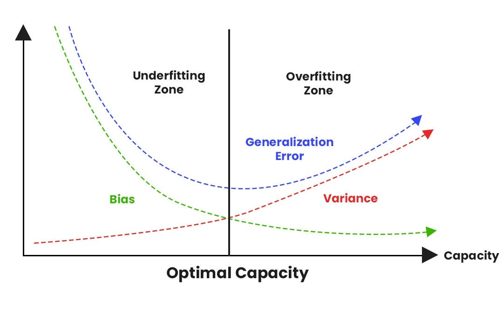
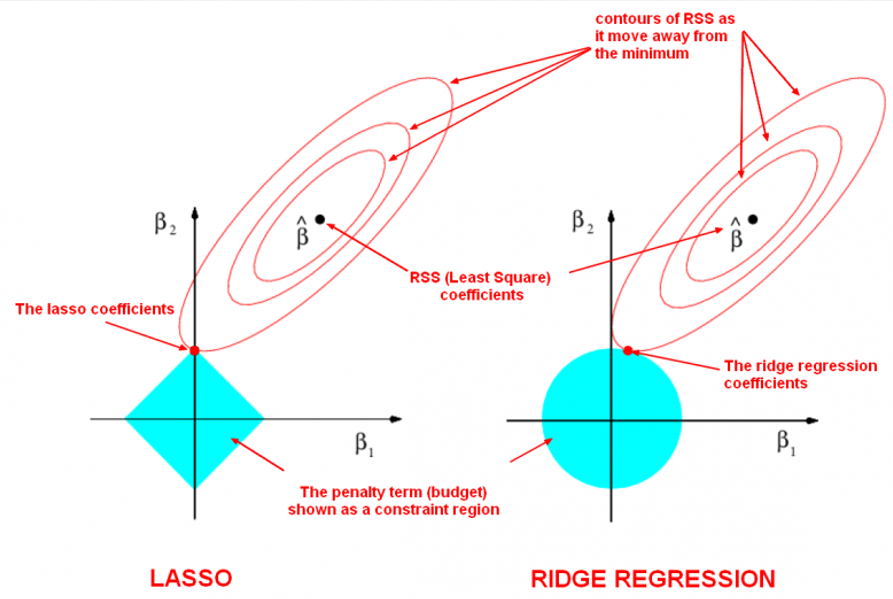

# Supervised Learning

## Linear Regression

### Hypothesis Function

The linear regression model assumes a linear relationship between the input features $\large \mathbf{X}$ and the output target $\large y$.

**For a single feature $\large x$:**

The hypothesis $\large h_{\mathbf{\theta}}(x)$ (predicted value) is given by:
<div align="center">
    
$$\large 
h_{\mathbf{\theta}}(x) = \theta_0 + \theta_1 x
$$

</div>

Where:
*   $\large \theta_0$: The bias term (intercept).
*   $\large \theta_1$: The weight (coefficient) for the feature $\large x$ (slope).
*   $\large \mathbf{\theta} = [\theta_0, \theta_1]^T$: The vector of parameters.

<div align="center">

<p>Fig. Visualizing Linear Regression</p>
</div>

**For multiple features $\large \mathbf{x} = [x_1, x_2, \dots, x_n]$:**

It's common to prepend a feature $\large x_0 = 1$ to the feature vector to incorporate the bias term.
So, $\large \mathbf{x}' = [x_0, x_1, x_2, \dots, x_n] = [1, x_1, x_2, \dots, x_n]$.
The parameter vector is $\large \mathbf{\theta} = [\theta_0, \theta_1, \dots, \theta_n]^T$.
The hypothesis is then the dot product:

<div align="center">
    
$$\large 
h_{\mathbf{\theta}}(\mathbf{x}') = \mathbf{x}' \cdot \mathbf{\theta} = \theta_0 x_0 + \theta_1 x_1 + \dots + \theta_n x_n = \sum_{j=0}^{n} \theta_j x_j
$$

</div>

**Vectorized form for $\large m$ training samples:**

Let $\large \mathbf{X}$ be the $\large m \times (n+1)$ design matrix (each row is a training sample $\large \mathbf{x}'^{(i)}$) and $\large \mathbf{y}$ be the $\large m \times 1$ vector of target values.
The predictions for all samples can be computed as:

<div align="center">
    
$$\large 
\mathbf{h}_{\mathbf{\theta}}(\mathbf{X}) = \mathbf{X} \mathbf{\theta}
$$

</div>

### Cost Function
To find the best parameters $\large \mathbf{\theta}$, we need a cost function (or loss function) that measures how well the model fits the training data. Cost function quantifies the error between predicted and expected values and present that error in the form of a single real number. The purpose of cost function is to be either:
- Minimized: The returned value is usually called cost, error or loss. The goal is to find the values of model parameters for which cost function return as small a number as possible.
- Maximized: In this case, the value it yields is named a reward. The goal is to find values of model parameters for which the returned number is as large as possible.

#### Mean Squared Error
For linear regression, the most common cost function is the Mean Squared Error (MSE). It penalizes larger errors more heavily due to the squaring operation.
For $m$ training samples:

<div align="center">
    
$$\large 
J_{MSE}(w, b) = \frac{1}{m} \sum_{i=1}^{m} ((w x^{(i)} + b) - y^{(i)})^2 \quad \text{(for single feature, often without } \frac{1}{2} \text{ for direct MSE interpretation)}
$$

</div>

Or more generally using $\large \mathbf{\theta}$:

<div align="center">
    
$$\large 
J_{MSE}(\mathbf{\theta}) = \frac{1}{2m} \sum_{i=1}^{m} (h_{\mathbf{\theta}}(\mathbf{x}'^{(i)}) - y^{(i)})^2
$$

</div>

The factor $\large \frac{1}{2}$ in the second form is included for mathematical convenience when taking derivatives (it cancels out the '2' from the power rule). If this factor is omitted, the cost function is directly the average of squared errors. The optimization result for the parameters $\large \mathbf{\theta}$ is the same regardless of this constant factor.

In vectorized form using the design matrix $\large \mathbf{X}$ (which includes the column of ones for the bias $\large \theta_0=b$):

<div align="center">
    
$$\large 
J_{MSE}(\mathbf{\theta}) = \frac{1}{2m} (\mathbf{X}\mathbf{\theta} - \mathbf{y})^T (\mathbf{X}\mathbf{\theta} - \mathbf{y})
$$

</div>

* **Properties:** Differentiable everywhere, convex (leading to a single global minimum for linear regression). Sensitive to outliers because large errors are squared.

#### Mean Absolute Error (MAE)
Another common loss function is the Mean Absolute Error (MAE), also known as L1 Loss. It measures the average magnitude of the errors without considering their direction. It is generally more robust to outliers than MSE because it does not square the errors.

For $\large m$ training samples:

<div align="center">
    
$$\large 
J_{MAE}(w, b) = \frac{1}{m} \sum_{i=1}^{m} |(w x^{(i)} + b) - y^{(i)}| \quad \text{(for single feature)}
$$

</div>

Or more generally using $\mathbf{\theta}$:

<div align="center">
    
$$\large 
J_{MAE}(\mathbf{\theta}) = \frac{1}{m} \sum_{i=1}^{m} |h_{\mathbf{\theta}}(\mathbf{x}'^{(i)}) - y^{(i)}|
$$

</div>

* **Properties:** Less sensitive to outliers than MSE. However, its derivative is not defined at points where the error $\large (h_{\mathbf{\theta}}(\mathbf{x}'^{(i)}) - y^{(i)})$ is zero. For gradient-based optimization, subgradients are used, or the points of non-differentiability are handled with specific techniques (e.g., smoothed approximations or by optimizers that can handle non-smooth functions). The resulting models might be different from those optimized with MSE.

#### Choice of Cost Function:
While MSE is standard for deriving the Normal Equation and for basic linear regression due to its mathematical convenience, MAE can be preferred in applications where outliers are frequent and shouldn't disproportionately influence the model. The notebook primarily focuses on MSE for simplicity and its direct connection to standard Linear Regression theory.

#### Goal
The goal is to find the parameters ($\large w, b$ or $\large \mathbf{\theta}$) that minimize the chosen cost function $\large J$:

<div align="center">
    
$$\large 
\min_{w,b} J(w,b) \quad \text{or} \quad \min_{\mathbf{\theta}} J(\mathbf{\theta})
$$
(Where $\large J$ could be $\large J_{MSE}$ or $\large J_{MAE}$ or another suitable loss function).

</div>

### Optimization Methods

#### Gradient Descent
Gradient Descent is an iterative optimization algorithm used to find the minimum of a function. It works by repeatedly moving in the direction of the negative gradient of the cost function.

<div align="center">

<p>Fig. Visualizing Gradient Descent</p>
</div>

##### Algorithm for Gradient Descent
1.  Initialize parameters $\large \mathbf{\theta}$ (e.g., randomly or with zeros).
2.  Choose a learning rate $\large \eta > 0$ and a number of iterations $\large T$ (or a convergence criterion).
3.  For $\large k = 0, 1, \dots, T-1$ (or until convergence):
    a.  Compute Gradient: Calculate the gradient of the cost function with respect to each parameter $\large \theta_j$:
        $\large \frac{\partial J(\mathbf{\theta})}{\partial \theta_j}$
    b.  Update Parameters: Simultaneously update all parameters $\large \theta_j$:
        $\large \theta_j \leftarrow \theta_j - \eta \frac{\partial J(\mathbf{\theta})}{\partial \theta_j} \quad \text{for all } j$
        In vector form:
        $\large \mathbf{\theta} \leftarrow \mathbf{\theta} - \eta \nabla_{\mathbf{\theta}} J(\mathbf{\theta})$
4.  Return final parameters $\large \mathbf{\theta}$.

##### Gradient Calculation for MSE
The partial derivative of the MSE cost function $J(\mathbf{\theta})$ with respect to a parameter $\large \theta_j$ is:
<div align="center">
    
$$\large 
\frac{\partial J(\mathbf{\theta})}{\partial \theta_j} = \frac{1}{m} \sum_{i=1}^{m} (h_{\mathbf{\theta}}(\mathbf{x}^{(i)}) - y^{(i)}) x_j^{(i)}
$$

</div>

(Assuming cost function $\large J(\mathbf{\theta}) = \frac{1}{2m} \sum (h_{\mathbf{\theta}}(\mathbf{x}^{(i)}) - y^{(i)})^2$. If $\large J(\mathbf{\theta}) = \frac{1}{m} \sum (\dots)^2$, then the gradient is $\large \frac{2}{m} \sum (\dots) x_j^{(i)}$).

Vectorized gradient calculation:

<div align="center">
    
$$\large 
\nabla_{\mathbf{\theta}} J(\mathbf{\theta}) = \frac{1}{m} \mathbf{X}^T (\mathbf{X}\mathbf{\theta} - \mathbf{y})
$$

</div>

### Normal Equation (Analytical Solution)
For Linear Regression with MSE loss, the cost function $\large J(\mathbf{\theta})$ is convex, meaning it has a single global minimum. This minimum can be found analytically by setting the gradient $\large \nabla_{\mathbf{\theta}} J(\mathbf{\theta})$ to zero and solving for $\large \mathbf{\theta}$.

#### Formula 
The solution is given by the Normal Equation:

<div align="center">
    
$$\large
\mathbf{\theta} = (\mathbf{X}^T \mathbf{X})^{-1} \mathbf{X}^T \mathbf{y}
$$

</div>

Where:
*   $\large \mathbf{X}$ is the design matrix (with $\large x_0=1$ for the bias term).
*   $\large \mathbf{y}$ is the vector of target values.
*   $\large (\mathbf{X}^T \mathbf{X})^{-1}$ is the inverse of the matrix $\large \mathbf{X}^T \mathbf{X}$.

<div align="center">

<p>. Linear Regression Fit (Normal Equation)</p>
</div>

#### Algorithm for Normal Equation
1.  Construct the design matrix $\large \mathbf{X}$ by adding a column of ones ($\large x_0=1$) to the feature matrix.
2.  Compute $\large \mathbf{X}^T \mathbf{X}$.
3.  Compute $\large (\mathbf{X}^T \mathbf{X})^{-1}$.
    *   This step requires $\large \mathbf{X}^T \mathbf{X}$ to be invertible (i.e., non-singular). This might not be the case if features are linearly dependent (collinearity) or if the number of features is greater than the number of samples.
    *   Numerically, it's often better to solve the linear system $\large (\mathbf{X}^T \mathbf{X}) \mathbf{\theta} = \mathbf{X}^T \mathbf{y}$ for $\large \mathbf{\theta}$ using methods like LU decomposition or QR decomposition (e.g., `torch.linalg.solve` or `numpy.linalg.lstsq`) rather than explicitly computing the inverse.
4.  Compute $\large \mathbf{X}^T \mathbf{y}$.
5.  Calculate $\large \mathbf{\theta} = (\mathbf{X}^T \mathbf{X})^{-1} \mathbf{X}^T \mathbf{y}$.

**Pros:**
*   No need to choose a learning rate $\eta$.
*   No iterations needed; direct solution.
**Cons:**
*   Computing $\large (\mathbf{X}^T \mathbf{X})^{-1}$ can be computationally expensive for a large number of features $\large n$ (typically $\large O(n^3)$).
*   May not work if $\large \mathbf{X}^T \mathbf{X}$ is singular. Gradient Descent can still work in such cases or when regularization is used.

### Implementation Approaches (Covered in Notebook)
The accompanying notebook `linear_regression.ipynb` demonstrates:
*   Manual Implementation: Using basic PyTorch tensor operations and `autograd` to compute gradients and manually implement the Gradient Descent update rule.
*   Using `torch.nn.Linear` and `torch.optim`: Leveraging PyTorch's high-level modules for defining the linear layer and using built-in optimizers like SGD.

### Evaluation Metrics 
To assess the performance of a regression model:

*   **Mean Squared Error (MSE):**

    <div align="center">
        
    $$\large 
    \text{MSE} = \frac{1}{m} \sum_{i=1}^{m} (y_{pred}^{(i)} - y_{actual}^{(i)})^2
    $$

    </div>

    Measures the average squared difference between predictions and actual values. Lower is better. Sensitive to outliers.

*   **Root Mean Squared Error (RMSE):**

    <div align="center">

    $$\large 
    \text{RMSE} = \sqrt{\text{MSE}} = \sqrt{\frac{1}{m} \sum_{i=1}^{m} (y_{pred}^{(i)} - y_{actual}^{(i)})^2}
    $$

    </div>

    The square root of MSE. It's in the same units as the target variable, making it more interpretable. Lower is better.

*   **R-squared (Coefficient of Determination, $R^2$):**

    <div align="center">

    $$\large 
    R^2 = 1 - \frac{\sum_{i=1}^{m} (y_{pred}^{(i)} - y_{actual}^{(i)})^2}{\sum_{i=1}^{m} (y_{mean} - y_{actual}^{(i)})^2} = 1 - \frac{\text{MSE}}{\text{Variance of } y}
    $$

    </div>

    Where $\large y_{mean} = \frac{1}{m} \sum_{i=1}^{m} y_{actual}^{(i)}$.
    Represents the proportion of the variance in the dependent variable that is predictable from the independent variable(s).
    *   $\large R^2 = 1$: Perfect fit.
    *   $\large R^2 = 0$: Model performs no better than predicting the mean of $\large y$.
    *   $\large R^2 < 0$: Model performs worse than predicting the mean (can happen with poor models).
    Higher is generally better (closer to 1).

## Regularization

This section explores regularization techniques, specifically Ridge (L2) and Lasso (L1) regularization, applied to linear regression models. Regularization helps to prevent overfitting, improve model generalization, and can also perform feature selection.

### Deep Dive into Regularization Motivation
Standard linear regression models aim to minimize the Mean Squared Error (MSE) between predicted and actual values. However, in certain scenarios, this can lead to issues:

- **Overfitting:**
    - When the number of features ($\large n$) is large compared to the number of training samples ($\large m$), or when features are highly complex, the model might learn the training data "too well," including its noise.
    - This results in a model with low training error but high error on unseen test data (poor generalization).
    - Overfitting often manifests as very large estimated coefficient (weight) values ($\large \theta_j$ or $\large w_j$). The model tries to contort itself to fit every data point, leading to extreme slopes.

- **Multicollinearity:**
    - When input features are highly correlated with each other, the design matrix $\large \mathbf{X}^T\mathbf{X}$ (used in the Normal Equation) becomes ill-conditioned or nearly singular.
    - This leads to unstable estimates of the regression coefficients, meaning small changes in the data can cause large swings in the coefficient values. The variance of the estimates becomes very high.

Regularization addresses these issues by adding a **penalty term** to the original cost function. This penalty term discourages excessively large coefficient values.

<div align="center">

$$\large 
J_{regularized}(\mathbf{\theta}) = J_{MSE}(\mathbf{\theta}) + \text{Penalty}(\mathbf{\theta})
$$

</div>

### Mathematical Foundation

#### The Bias-Variance Tradeoff

<div align="center">

<p>Fig. Bias vs Variance</p>
</div>

**Ridge Regression:**

-   Bias: `-α(X^TX + αI)^(-1)θ` (shrinkage toward zero)
-   Variance: Always smaller than OLS, decreases with α
-   Effect: Smooth shrinkage, keeps all features

**Lasso Regression:**

-   Bias: Shrinkage + selection bias
-   Variance: Reduced through feature selection + estimation
-   Effect: Sparse solutions, automatic feature selection

**Total Error Decomposition:** 

For any learning algorithm, the expected error can be decomposed as: 

<div align="center">

$$\large 
E[\text{Error}] = \text{Bias}^2 + \text{Variance} + \text{Irreducible Error}
$$

</div>

-   Bias: Error from overly simplistic assumptions
-   Variance: Error from sensitivity to small fluctuations in training data
-   Irreducible Error: Noise inherent in the problem

**Regularization's Role:**

-   Increases Bias: By constraining model complexity
-   Reduces Variance: By preventing overfitting
-   Optimal Regularization: Finds the sweet spot that minimizes total error

#### General Regularization Framework

**Unified Cost Function:** 

<div align="center">

$$\large 
J_{\text{reg}}(\theta) = J_{\text{MSE}}(\theta) + \alpha \cdot \Omega(\theta)
$$

</div>

Where:

-   $\large J_{\text{MSE}}(\theta)$: Original loss function (data fitting term)
-   $\large \Omega(\theta)$: Regularization penalty (complexity penalty)
-   $\large \alpha$: Regularization strength (hyperparameter)

**Types of Penalties:**

-   L1 (Lasso): $\large \Omega(\theta) = \sum_{j=1}^{n} |\theta_j|$ $\large = |\theta|_1$
-   L2 (Ridge): $\large \Omega(\theta) = \sum_{j=1}^{n} \theta_j^2$ $\large = |\theta|_2^2$
-   Elastic Net: $\large \Omega(\theta) = \lambda_1|\theta|_1 + \lambda_2|\theta|_2^2$

### Ridge Regression (L2 Regularization)
Ridge Regression adds a penalty equivalent to the **squared magnitude of the coefficients** (L2 norm squared) to the loss function.

#### Cost Function
The Ridge Regression cost function is:

<div align="center">

$$\large 
J_{Ridge}(\mathbf{\theta}) = \frac{1}{2m} \sum_{i=1}^{m} (h_{\mathbf{\theta}}(\mathbf{x}'^{(i)}) - y^{(i)})^2 + \alpha \sum_{j=1}^{n} \theta_j^2
$$

</div>

Or in vectorized form (using MSE = $\large \frac{1}{m}$ for simplicity in the MSE part):

<div align="center">

%20=%20\frac{1}{2m}%20\sum_{i=1}^{m}%20(h_{\mathbf{\theta}}(\mathbf{x}%27^{(i)})%20-%20y^{(i)})^2%20+%20\alpha%20\sum_{j=1}^{n}%20\theta_j^2)

</div>

Where:
*   $\large J_{MSE}(\mathbf{\theta})$ is the original Mean Squared Error term.
*   $\large \alpha \ge 0$ (often denoted as $\large \lambda$) is the **regularization parameter** (or strength). It controls the trade-off between fitting the data well (minimizing MSE) and keeping the weights small.
    *   If $\large \alpha = 0$, Ridge Regression becomes standard Linear Regression.
    *   As $\large \alpha \to \infty$, the weights $\theta_j$ are pushed towards zero.
*   $\large \sum_{j=1}^{n} \theta_j^2$ (or $\|\mathbf{\theta}_{1:n}\|_2^2$) is the L2 penalty. **Note:** The bias term $\large \theta_0$ (or $\large b$) is typically *not* regularized. The sum is usually from $\large j=1$ to $\large n$ (for features), not $\large j=0$.

#### Analytical Solution

**Closed-Form Solution:** Unlike standard linear regression, Ridge has a unique analytical solution: 

<div align="center">

$$\large 
\theta_{\text{Ridge}} = (X^TX + \alpha I)^{-1}X^Ty
$$

</div>

**Key Insights:**

-   Adding $\large \alpha I$ to $\large X^TX$ makes it invertible even when $\large X^TX$ is singular
-   As $\large \alpha \to 0$: Approaches standard linear regression
-   As $\large \alpha \to \infty$: $\large \theta \to 0$ (all coefficients shrink to zero)

#### Gradient Update
The gradient of the Ridge cost function with respect to $\theta_j$ (for $j > 0$) is:

<div align="center">

$$\large 
\frac{\partial J_{Ridge}(\mathbf{\theta})}{\partial \theta_j} = \left( \frac{1}{m} \sum_{i=1}^{m} (h_{\mathbf{\theta}}(\mathbf{x}^{(i)}) - y^{(i)}) x_j^{(i)} \right) + 2 \alpha \theta_j 
$$

</div>

(Using MSE term as $\large \frac{1}{m}$ for the first part of the gradient, so the derivative of MSE is $\large \frac{2}{m}(\dots)x_j$. If MSE definition uses $\large \frac{1}{2m}$, then the gradient of MSE is $\large \frac{1}{m}(\dots)x_j$. The $\large 2\alpha\theta_j$ term from regularization remains.)

The gradient descent update rule for $\theta_j$ ($j > 0$) becomes:

<div align="center">

$$\large 
\theta_j \leftarrow \theta_j - \eta \left( \text{MSE gradient part for } \theta_j + 2 \alpha \theta_j \right)
$$

$$\large 
\theta_j \leftarrow \theta_j (1 - 2\eta\alpha) - \eta (\text{MSE gradient part without } \theta_j \text{ term})
$$

</div>

This shows that Ridge performs a kind of "weight decay": at each step, the weights are first shrunk by a factor and then updated based on the MSE gradient.
For $\large \theta_0$ (bias), the update is the same as in standard linear regression as it's not penalized.

#### Properties and Effects

**Coefficient Shrinkage:**

- Shrinks coefficients toward zero proportionally
- Never sets coefficients exactly to zero (except with infinite $\alpha$)
- Preserves all features in the model
- Shrinkage is proportional to coefficient magnitude

**Handling Multicollinearity:**

- Distributes coefficients among correlated features
- Stabilizes estimates by adding positive definite term to $\large X^TX$
- Reduces variance of coefficient estimates

**Computational Advantages:**

- Differentiable everywhere: Easy to optimize with gradient-based methods
- Analytical solution exists: Can be solved directly without iteration
- Computationally stable: Well-conditioned optimization problem

### Lasso Regression (L1 Regularization)
Lasso (Least Absolute Shrinkage and Selection Operator) Regression adds a penalty equivalent to the **absolute magnitude of the coefficients** (L1 norm) to the loss function.

#### Cost Function
The Lasso Regression cost function is:

<div align="center">

$$\large 
J_{Lasso}(\mathbf{\theta}) = \frac{1}{2m} \sum_{i=1}^{m} (h_{\mathbf{\theta}}(\mathbf{x}'^{(i)}) - y^{(i)})^2 + \alpha \sum_{j=1}^{n} |\theta_j|
$$

</div>

Or in vectorized form (using MSE = $\large \frac{1}{m}$):

<div align="center">

%20=%20\frac{1}{m}%20|\mathbf{X}\mathbf{\theta}%20-%20\mathbf{y}|2^2%20+%20\alpha%20|\mathbf{\theta}{1:n}|_1)

</div>

Where $\large \alpha \ge 0$ is the regularization parameter and  is the L1 penalty. The bias term $\large \theta_0$ is typically not regularized.

#### Gradient Update (Subgradient)
The L1 penalty term $\large |\theta_j|$ is not differentiable at $\large \theta_j = 0$. We use a concept called the **subgradient**.
The subgradient of $\large \alpha |\theta_j|$ is $\large \alpha \cdot \text{sgn}(\theta_j)$ if $\large \theta_j \ne 0$, and any value in $\large [-\alpha, \alpha]$ if $\large \theta_j = 0$.

The (sub)gradient of the Lasso cost function with respect to $\large \theta_j$ (for $\large j > 0$) is:

<div align="center">

$$\large 
\frac{\partial J_{Lasso}(\mathbf{\theta})}{\partial \theta_j} = \left( \frac{1}{m} \sum_{i=1}^{m} (h_{\mathbf{\theta}}(\mathbf{x}^{(i)}) - y^{(i)}) x_j^{(i)} \right) + \alpha \cdot \text{sgn}(\theta_j)
$$

</div>

(Again, assuming MSE term as $\large \frac{1}{m}$ leads to $\large \frac{2}{m}(\dots)x_j$ for its gradient part).

Standard gradient descent can struggle with the non-differentiability. Specialized algorithms are often used:

#### Optimization Algorithms

#### Coordinate Descent (Most Common)

**Algorithm:**

```
for iteration in range(max_iter):
    for j in range(n_features):
        # Hold all other coefficients fixed
        # Update theta_j optimally
        theta_j = soft_threshold(theta_j_update, alpha * lambda)

```

**Soft Thresholding Operator:** 

<div align="center">

$$\large 
S_\lambda(z) = \text{sgn}(z) \max(0, |z| - \lambda)
$$

</div>

This operator:

-   Shrinks $\large z$ toward zero by amount $\large \lambda$
-   Sets to zero if $\large |z| \leq \lambda$
-   Preserves sign if $\large |z| > \lambda$

#### Proximal Gradient Methods (ISTA/FISTA)

**Two-Step Process:**

1.  Gradient Step: $\large \tilde{\theta}_j = \theta_j - \eta \cdot \text{MSE gradient}$
2.  Proximal Step: $\large \theta_j = S_{\eta\alpha}(\tilde{\theta}_j)$

#### Properties and Effects

**Sparsity-Inducing:**

-   Sets coefficients exactly to zero when $\large \alpha$ is sufficiently large
-   Automatic feature selection: Zero coefficients correspond to irrelevant features
-   Sparse solutions: Only a subset of features remain in the final model

**Feature Selection Mechanism:** The L1 penalty has "corners" at zero, making it more likely for coefficients to be driven exactly to zero during optimization.

**Limitations:**

-   Grouping Effect: Among correlated features, Lasso tends to select one arbitrarily
-   Limited Selection: Can select at most $m$ features when $\large n > m$
-   Instability: Small changes in data can change which features are selected


### Hyperparameter Tuning Strategies

#### Cross-Validation Approach

**K-Fold Cross-Validation:**

```python
from sklearn.model_selection import cross_val_score
from sklearn.linear_model import RidgeCV, LassoCV

# Automatic cross-validation
ridge_cv = RidgeCV(alphas=[0.1, 1.0, 10.0, 100.0], cv=5)
lasso_cv = LassoCV(alphas=[0.1, 1.0, 10.0, 100.0], cv=5)
```

**Grid Search:**

```python
from sklearn.model_selection import GridSearchCV

param_grid = {'alpha': np.logspace(-4, 4, 50)}
grid_search = GridSearchCV(Ridge(), param_grid, cv=5, scoring='neg_mean_squared_error')
```

#### Regularization Path

**Concept:** Plot model performance (or coefficient values) as a function of $\alpha$ to understand:

-   How coefficients shrink with increasing regularization
-   Optimal $\alpha$ value
-   Feature selection pattern (for Lasso)

**Implementation:**

```python
alphas = np.logspace(-4, 2, 100)
ridge_path = Ridge()
coefs = []
for alpha in alphas:
    ridge_path.set_params(alpha=alpha)
    ridge_path.fit(X_train, y_train)
    coefs.append(ridge_path.coef_)
```

#### Information Criteria

**AIC (Akaike Information Criterion):** $\large AIC = 2k - 2\ln(L)$ Where $\large k$ is the number of parameters and $\large L$ is the likelihood.

**BIC (Bayesian Information Criterion):** $\large BIC = k\ln(m) - 2\ln(L)$ Where $\large m$ is the number of samples.

For regularized models, effective degrees of freedom must be calculated differently.

#### Geometric Intuition 

#### Constraint Optimization Perspective

**Equivalent Formulation:** Ridge and Lasso can be viewed as constrained optimization problems:

**Ridge (L2):** 

<div align="center">


</div>

**Lasso (L1):** 

<div align="center">


</div>

#### Geometric Interpretation

**2D Visualization:**

<div align="center">

<p>Fig. Lasso and Ridge Regularization</p>
</div>

-   Contour lines: Represent constant values of MSE (elliptical)
-   Constraint region:
    -   Ridge: Circle ($\large \theta_1^2 + \theta_2^2 \leq t$)
    -   Lasso: Diamond ($\large |\theta_1| + |\theta_2| \leq t$)
-   Solution: Point where MSE contour touches constraint boundary

**Why Lasso Produces Sparsity:**

-   Diamond shape has corners at axes
-   Contour lines are more likely to touch corners
-   Corner touching results in one coordinate being zero

**Why Ridge Doesn't:**

-   Circular constraint has no corners
-   Smooth boundary makes it unlikely for coordinates to be exactly zero

### Advanced Topics 

#### Elastic Net Regularization

**Combination of L1 and L2:** 

<div align="center">

$$\large 
J_{\text{ElasticNet}}(\theta) = \frac{1}{2m} |X\theta - y|_2^2 + \alpha_1 |\theta|_1 + \alpha_2 |\theta|_2^2
$$

</div>

**Benefits:**

-   Grouping effect: Tends to select groups of correlated features (unlike Lasso)
-   Sparsity: Can still set coefficients to zero (unlike Ridge)
-   Stability: More stable feature selection than pure Lasso

**When to Use:**

-   Grouped features: When features naturally cluster
-   $\large n \gg m$: When you have more features than samples
-   Correlation: When features are highly correlated

#### Adaptive Regularization

**Adaptive Lasso:** Uses different penalties for different coefficients: 

<div align="center">

%20=%20\frac{1}{2m}%20|X\theta%20-%20y|_2^2%20+%20\alpha%20\sum_{j=1}^{n}%20w_j%20|\theta_j|)

</div>

Where $\large w_j = \frac{1}{|\hat{\theta}_j^{OLS}|^\gamma}$ are adaptive weights.

**Benefits:**

-   Oracle property: Asymptotically selects true model
-   Reduced bias: Less bias for large coefficients
-   Better selection: More accurate feature selection

#### Group Regularization

**Group Lasso:** For grouped features (e.g., categorical variables with multiple dummy variables): 

<div align="center">

%20=%20\frac{1}{2m}%20|X\theta%20-%20y|_2^2%20+%20\alpha%20\sum_{g=1}^{G}%20\sqrt{|g|}%20|\theta_g|_2)

</div>

**Benefits:**

-   Group selection: Selects entire groups of features
-   Structured sparsity: Maintains meaningful feature groupings

#### Bayesian Perspective

**Ridge as MAP Estimation:** Ridge regression corresponds to Maximum A Posteriori (MAP) estimation with Gaussian priors: 

<div align="center">

$$\large 
p(\theta_j) \sim \mathcal{N}(0, \sigma^2)
$$

</div>

**Lasso as MAP Estimation:** Lasso corresponds to MAP estimation with Laplace priors: 

<div align="center">

$$\large 
p(\theta_j) \sim \text{Laplace}(0, b)
$$

</div>

This perspective provides:

-   Uncertainty quantification: Posterior distributions over coefficients
-   Hyperparameter selection: Hierarchical Bayesian approaches
-   Model comparison: Bayesian model selection criteria