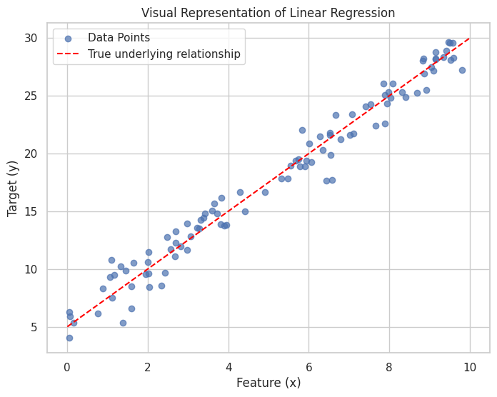
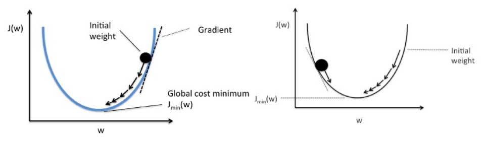
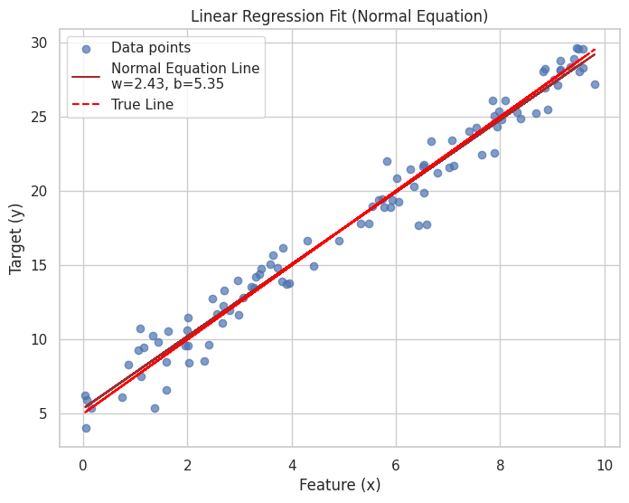
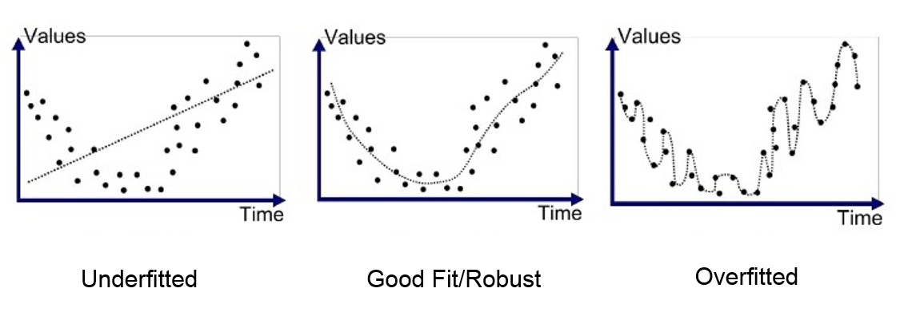
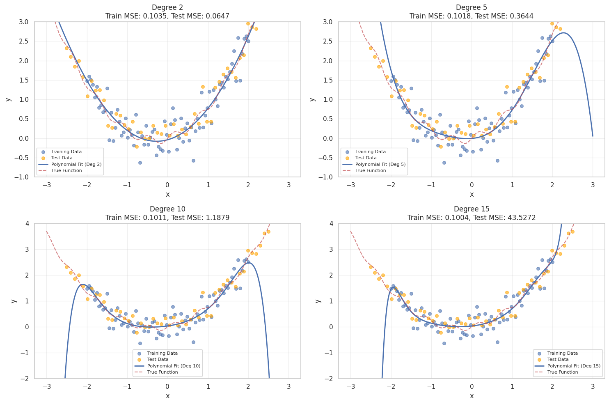
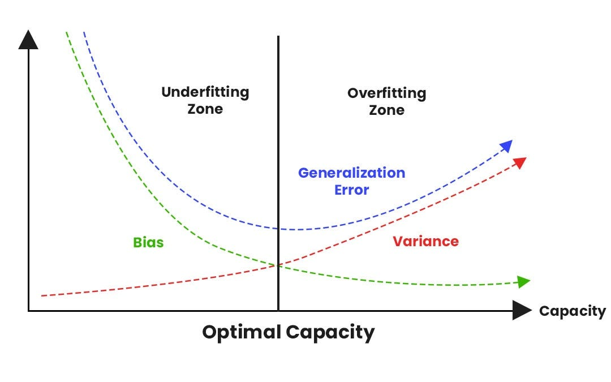
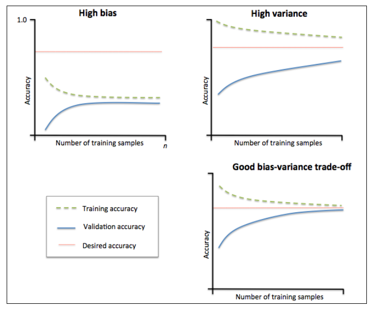
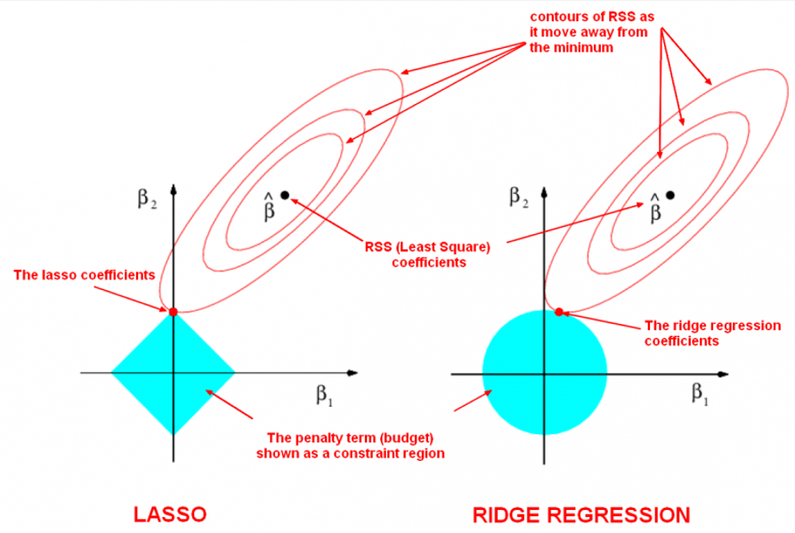

# 01 · Supervised Regression

Regression predicts a **number**: a house price, a temperature, a sales figure. This module starts with the simplest model, linear regression. It then shows what goes wrong when a model is too simple or too complex, and how regularisation keeps a model in check.

> **Notebooks:** [linear_regression](linear_regression.ipynb) · [polynomial_overfitting](polynomial_overfitting.ipynb) · [regularization](regularization.ipynb)
>
> **Quick revision:** [CHEATSHEET.md](CHEATSHEET.md)
>
> **Explore in your browser:** [Fitting a line](https://sandeshjung.github.io/Machine-Learning-Foundation/linear-regression.html) · [Bias and variance](https://sandeshjung.github.io/Machine-Learning-Foundation/bias-variance.html) · [Ridge vs Lasso](https://sandeshjung.github.io/Machine-Learning-Foundation/regularization.html)

## Contents

1. [Linear regression](#1-linear-regression)
2. [Training: gradient descent vs the normal equation](#2-training-gradient-descent-vs-the-normal-equation)
3. [Evaluating a regression model](#3-evaluating-a-regression-model)
4. [Polynomial regression and overfitting](#4-polynomial-regression-and-overfitting)
5. [Regularisation: Ridge and Lasso](#5-regularisation-ridge-and-lasso)
6. [Going further](#6-going-further)

---

## 1. Linear regression

### 1.1 The model

Linear regression assumes the target is a **weighted sum of the features** plus a constant.

With a single feature $x$, the model is a straight line:

```math
\hat{y} = \theta_0 + \theta_1 x
```

- $\theta_0$ is the **bias** (intercept): where the line crosses the y-axis.
- $\theta_1$ is the **weight** (slope): how much $\hat{y}$ changes when $x$ goes up by 1.

<p align="center">
  
  <br>
  <em>Noisy data generated from a straight line (red). Linear regression tries to recover that line.</em>
</p>

With $n$ features, it's the same idea in more dimensions:

```math
\hat{y} = \theta_0 + \theta_1 x_1 + \dots + \theta_n x_n
```

### 1.2 The vectorised form

Writing a sum for every prediction gets messy. The usual trick is to add a constant feature $x_0 = 1$ to every sample, so the bias becomes just another weight. Then:

- each sample is a row of the **design matrix** $X$ ($m$ samples × $(n+1)$ columns)
- all predictions come from one matrix–vector product:

```math
\hat{\mathbf{y}} = X\boldsymbol{\theta}
```

### 1.3 The loss: how wrong is the model?

To find good parameters we need a single number that says how badly the model fits. That number is the **loss** (also called the cost).

**Mean squared error (MSE)** is the standard choice:

```math
J(\boldsymbol{\theta}) = \frac{1}{m} \sum_{i=1}^{m} \left(\hat{y}^{(i)} - y^{(i)}\right)^2 = \frac{1}{m} \lVert X\boldsymbol{\theta} - \mathbf{y} \rVert^2
```

- Squaring makes every error positive and punishes **big** errors much more than small ones.
- It's smooth and **convex** (bowl-shaped), so there is exactly one best solution.
- Its weakness is **outliers**: one wild point can pull the whole line towards it.

**Mean absolute error (MAE)** is the robust alternative:

```math
J_{\text{MAE}}(\boldsymbol{\theta}) = \frac{1}{m} \sum_{i=1}^{m} \left|\hat{y}^{(i)} - y^{(i)}\right|
```

It grows linearly with the error, so outliers matter less. The downside is that it isn't differentiable at zero, so optimisers have to use sub-gradients.

> [!NOTE]
> Many textbooks write MSE with $\frac{1}{2m}$ instead of $\frac{1}{m}$. The ½ only cancels the 2 that appears when you differentiate. It scales the loss but **doesn't change the best parameters**. These notes and the notebooks use $\frac{1}{m}$.

---

## 2. Training: gradient descent vs the normal equation

There are two ways to find the $\boldsymbol{\theta}$ that minimises the MSE.

### 2.1 Gradient descent (iterative)

Start somewhere and keep stepping **downhill** on the loss surface.

<p align="center">
  
  <br>
  <em>Each step follows the negative gradient until it reaches the minimum of J(w).</em>
</p>

The gradient of the MSE is:

```math
\nabla_{\boldsymbol{\theta}} J = \frac{2}{m} X^\top (X\boldsymbol{\theta} - \mathbf{y})
```

Each step updates **all** parameters at once:

```math
\boldsymbol{\theta} \leftarrow \boldsymbol{\theta} - \eta \, \nabla_{\boldsymbol{\theta}} J
```

The algorithm:

1. Initialise $\boldsymbol{\theta}$, for example with zeros.
2. Pick a learning rate $\eta$ and a number of steps.
3. Repeat: compute the predictions, the error and the gradient, then update $\boldsymbol{\theta}$.

> [!TIP]
> **Standardise your features** (zero mean, unit variance) before running gradient descent. If one feature is in metres and another in millimetres, the loss surface becomes a long, narrow valley and GD zig-zags slowly.

### 2.2 The normal equation (closed form)

Because the MSE is a convex bowl, its minimum is where the gradient is exactly zero. Setting $\nabla J = 0$ and solving gives:

```math
\boldsymbol{\theta}^* = (X^\top X)^{-1} X^\top \mathbf{y}
```

<p align="center">
  
  <br>
  <em>The line found by the normal equation, in a single step.</em>
</p>

> [!TIP]
> In code, **solve** the linear system $(X^\top X)\,\boldsymbol{\theta} = X^\top \mathbf{y}$ with `torch.linalg.solve` or `np.linalg.lstsq` instead of computing the inverse. It's faster and numerically safer.

### 2.3 Which one to use?

| | Gradient descent | Normal equation |
|---|---|---|
| Learning rate to tune | Yes | No |
| Iterations | Many | None, one solve |
| Cost | $O(mn)$ per step | $O(n^3)$ for the solve |
| Many features (> ~10,000) | ✅ Works well | ❌ Gets slow |
| $X^\top X$ not invertible (correlated features, $n > m$) | ✅ Still works | ❌ Fails, unless regularised |
| Works for other models (logistic regression, neural networks) | ✅ Yes | ❌ Linear regression only |

The [linear_regression](linear_regression.ipynb) notebook implements both. It does gradient descent by hand with autograd, then repeats it with `nn.Linear` and `torch.optim`, and checks the results against scikit-learn.

---

## 3. Evaluating a regression model

| Metric | Formula | How to read it |
|---|---|---|
| **MSE** | $\frac{1}{m} \sum (\hat{y} - y)^2$ | Lower is better. In squared units, sensitive to outliers |
| **RMSE** | $\sqrt{\text{MSE}}$ | Lower is better. Same units as $y$, so easy to interpret |
| **MAE** | $\frac{1}{m} \sum \lvert \hat{y} - y \rvert$ | Lower is better. Robust to outliers |
| **$R^2$** | $1 - \dfrac{\sum (y - \hat{y})^2}{\sum (y - \bar{y})^2}$ | 1 is perfect. 0 is no better than predicting the mean. Below 0 is worse than the mean |

> [!IMPORTANT]
> Always report these metrics on **held-out test data**. A model can score perfectly on the data it was trained on and still be useless.

---

## 4. Polynomial regression and overfitting

### 4.1 When a straight line isn't enough

If the true relationship is curved, a straight line can't follow it, however well it's trained. This is **underfitting**: the model is too simple.

<p align="center">
  
  <br>
  <em>Underfitting (too simple), a good fit, and overfitting (too complex).</em>
</p>

### 4.2 Polynomial features

The fix is to give the linear model **new features** built from the old ones: $x^2, x^3, \dots, x^d$.

```math
\hat{y} = b + w_1 x + w_2 x^2 + \dots + w_d x^d
```

This is still *linear regression*, because the model is linear in the **weights**. Only the features are curved, so gradient descent and the normal equation work unchanged.

With several input features, `sklearn.preprocessing.PolynomialFeatures` also adds **interaction terms** such as $x_1 x_2$.

### 4.3 Overfitting

Raise the degree too far and the model starts fitting the **noise** instead of the pattern.

<p align="center">
  
  <br>
  <em>A high-degree polynomial passes through the training points but generalises badly.</em>
</p>

**Signs of overfitting:** very low training error, much higher test error, and often very large weights.

**Common causes:**

- a model too complex for the amount of data
- too many (irrelevant) features
- too little training data
- training for too long, in iterative models

### 4.4 The bias–variance trade-off

The expected error of any model on new data splits into three parts:

```math
\mathbb{E}\left[(y - \hat{f}(x))^2\right] = \underbrace{\text{Bias}[\hat{f}(x)]^2}_{\text{too simple}} + \underbrace{\text{Var}[\hat{f}(x)]}_{\text{too sensitive}} + \underbrace{\sigma^2}_{\text{noise}}
```

| | **High bias** (underfitting) | **High variance** (overfitting) |
|---|---|---|
| What it means | The model's assumptions are too strong | The model changes a lot with the training sample |
| Example | A straight line through U-shaped data | A degree-15 polynomial through 20 points |
| Training error | High | Low |
| Test error | High (close to training) | High (far from training) |
| Fixes | More features, a more complex model, less regularisation | More data, a simpler model, more regularisation |

The noise term $\sigma^2$ can't be removed by any model. The goal is the complexity that minimises the **sum** of bias² and variance.

<p align="center">
  
  <br>
  <em>As complexity grows, bias falls and variance rises. Total error is lowest in between.</em>
</p>

### 4.5 Diagnosing with learning curves

A **learning curve** plots training and validation scores against the number of training samples.

<p align="center">
  
  <br>
  <em>How learning curves look for high bias, high variance and a good fit.</em>
</p>

| Pattern | Diagnosis | What helps |
|---|---|---|
| Both curves low and close together | **High bias** | A more complex model. More data won't help |
| Big gap between training and validation | **High variance** | More data, regularisation, a simpler model |
| Both curves high and close together | **Good fit** | Nothing, you're done |

---

## 5. Regularisation: Ridge and Lasso

### 5.1 The idea

Overfit models tend to have **huge weights**: they bend sharply to hit every point. Regularisation adds a **penalty on the size of the weights** to the loss:

```math
J_{\text{reg}}(\boldsymbol{\theta}) = \underbrace{\text{MSE}(\boldsymbol{\theta})}_{\text{fit the data}} + \alpha \cdot \underbrace{\Omega(\mathbf{w})}_{\text{keep weights small}}
```

- $\alpha \ge 0$ sets the strength. $\alpha = 0$ is plain linear regression. A large $\alpha$ pushes all the weights towards 0.
- It trades a little **bias** for a lot less **variance**.
- Regularisation also helps with **multicollinearity**. When features are strongly correlated, $X^\top X$ is nearly singular and plain least-squares weights swing wildly.

> [!IMPORTANT]
> The **bias** $\theta_0$ is not penalised, only the feature weights $\mathbf{w} = (\theta_1, \dots, \theta_n)$. Also standardise the features first, otherwise the penalty hits large-scale features unfairly.

### 5.2 Ridge (L2)

Ridge penalises the **sum of squared weights**:

```math
J_{\text{Ridge}} = \text{MSE} + \alpha \sum_{j=1}^{n} w_j^2
```

- **Gradient:** the penalty adds $2\alpha w_j$ to each weight's gradient. So every step first shrinks the weight a little and then follows the data. That's why L2 is also called **weight decay**.
- **Closed form** (for the $\frac{1}{m}$-free form $\lVert X\boldsymbol{\theta} - \mathbf{y} \rVert^2 + \alpha \lVert \mathbf{w} \rVert^2$):

```math
\boldsymbol{\theta}_{\text{Ridge}} = (X^\top X + \alpha I)^{-1} X^\top \mathbf{y}
```

Adding $\alpha I$ makes the matrix invertible even when $X^\top X$ isn't.

**Effect:** all weights shrink smoothly towards zero, but **none become exactly zero**. Correlated features end up sharing the weight between them.

### 5.3 Lasso (L1)

Lasso penalises the **sum of absolute weights**:

```math
J_{\text{Lasso}} = \text{MSE} + \alpha \sum_{j=1}^{n} \lvert w_j \rvert
```

- **Gradient:** $|w|$ has no derivative at 0, so we use the **sub-gradient** $\alpha \cdot \text{sign}(w_j)$. This is what the notebook does.
- **In practice**, libraries use coordinate descent or proximal gradient methods (ISTA). Both rely on the **soft-thresholding** operator:

```math
S_\lambda(z) = \text{sign}(z) \cdot \max(0, |z| - \lambda)
```

It shrinks $z$ towards 0 by $\lambda$, and sets it to **exactly 0** if $|z| \le \lambda$.

**Effect:** many weights become **exactly zero**, so Lasso does **automatic feature selection**.

**Caveats:**

- Among correlated features it tends to keep one arbitrarily.
- It selects at most $m$ features when $n > m$.
- The chosen features can change with small changes in the data.

### 5.4 Why L1 gives zeros and L2 doesn't

Regularisation is equivalent to minimising the MSE **inside a budget** for the weights: a circle for L2, a diamond for L1.

<p align="center">
  
  <br>
  <em>The solution is where the MSE ellipses first touch the constraint region.</em>
</p>

- The L1 diamond has **corners on the axes**, and the ellipses usually hit a corner first, where one weight is exactly 0.
- The L2 circle is smooth, so the touching point almost never lies exactly on an axis.

### 5.5 Ridge vs Lasso vs Elastic Net

| | Ridge (L2) | Lasso (L1) | Elastic Net (L1 + L2) |
|---|---|---|---|
| Penalty | $\alpha \sum w_j^2$ | $\alpha \sum \lvert w_j \rvert$ | $\alpha \left[\rho \sum \lvert w_j \rvert + (1-\rho) \sum w_j^2\right]$ |
| Exact zeros (feature selection) | ❌ | ✅ | ✅ |
| Correlated features | Shares weight | Picks one | Keeps groups together |
| Closed form | ✅ | ❌ | ❌ |
| Use when | Many useful, correlated features | Few features really matter | Many correlated features *and* you want sparsity |

### 5.6 Choosing α

Pick $\alpha$ with **cross-validation**, searching on a log scale:

```python
from sklearn.linear_model import RidgeCV, LassoCV

ridge = RidgeCV(alphas=np.logspace(-3, 3, 50), cv=5).fit(X_train, y_train)
lasso = LassoCV(alphas=np.logspace(-3, 1, 50), cv=5).fit(X_train, y_train)
print(ridge.alpha_, lasso.alpha_)
```

A **regularisation path**, which plots each weight against $\alpha$, shows how the weights shrink and, for Lasso, in which order the features drop out.

> [!WARNING]
> Each library scales $\alpha$ differently. scikit-learn's `Ridge` minimises $\lVert \mathbf{y} - X\mathbf{w} \rVert^2 + \alpha \lVert \mathbf{w} \rVert^2$ (no $\frac{1}{m}$). Its `Lasso` minimises $\frac{1}{2m} \lVert \mathbf{y} - X\mathbf{w} \rVert^2 + \alpha \lVert \mathbf{w} \rVert_1$. The [regularization](regularization.ipynb) notebook rescales $\alpha$ before comparing its results with scikit-learn.

---

## 6. Going further

Short notes on related ideas that aren't implemented in the notebooks.

- **Bayesian view.** Ridge is the MAP estimate with a **Gaussian** prior on the weights, $w_j \sim \mathcal{N}(0, \sigma^2)$. Lasso is the MAP estimate with a **Laplace** prior, which has a sharp peak at zero. That peak is why Lasso likes exact zeros.
- **Adaptive Lasso.** Gives each weight its own penalty, $\alpha \sum_j \frac{|w_j|}{|\hat{w}_j^{\text{OLS}}|^{\gamma}}$, so large, important weights are penalised less.
- **Group Lasso.** Penalises groups of weights together, $\alpha \sum_g \sqrt{|g|}\, \lVert \mathbf{w}_g \rVert_2$, so for example all the one-hot columns of one categorical feature are kept or dropped as a unit.
- **Information criteria.** As an alternative to cross-validation, $\text{AIC} = 2k - 2\ln L$ and $\text{BIC} = k \ln m - 2\ln L$ trade off fit ($L$) against the number of parameters $k$.
