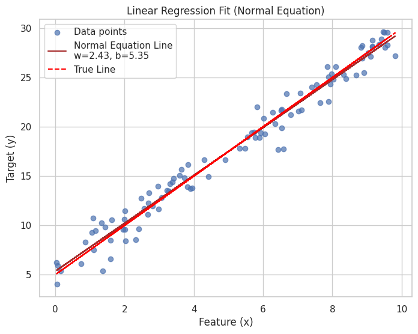

# Supervised Learning

## Linear Regression

### Hypothesis Function

The linear regression model assumes a linear relationship between the input features $\large \mathbf{X}$ and the output target $\large y$.

**For a single feature $\large x$:**
The hypothesis $\large h_{\mathbf{\theta}}(x)$ (predicted value) is given by:
$$\large 
h_{\mathbf{\theta}}(x) = \theta_0 + \theta_1 x
$$
Where:
*   $\large \theta_0$: The bias term (intercept).
*   $\large \theta_1$: The weight (coefficient) for the feature $\large x$ (slope).
*   $\large \mathbf{\theta} = [\theta_0, \theta_1]^T$: The vector of parameters.

Fig. Visualizing Linear Regression

**For multiple features $\large \mathbf{x} = [x_1, x_2, \dots, x_n]$:**
It's common to prepend a feature $\large x_0 = 1$ to the feature vector to incorporate the bias term.
So, $\large \mathbf{x}' = [x_0, x_1, x_2, \dots, x_n] = [1, x_1, x_2, \dots, x_n]$.
The parameter vector is $\large \mathbf{\theta} = [\theta_0, \theta_1, \dots, \theta_n]^T$.
The hypothesis is then the dot product:
$$\large 
h_{\mathbf{\theta}}(\mathbf{x}') = \mathbf{x}' \cdot \mathbf{\theta} = \theta_0 x_0 + \theta_1 x_1 + \dots + \theta_n x_n = \sum_{j=0}^{n} \theta_j x_j
$$

**Vectorized form for $\large m$ training samples:**
Let $\large \mathbf{X}$ be the $\large m \times (n+1)$ design matrix (each row is a training sample $\large \mathbf{x}'^{(i)}$) and $\large \mathbf{y}$ be the $\large m \times 1$ vector of target values.
The predictions for all samples can be computed as:
$$\large 
\mathbf{h}_{\mathbf{\theta}}(\mathbf{X}) = \mathbf{X} \mathbf{\theta}
$$

### Cost Function
To find the best parameters $\large \mathbf{\theta}$, we need a cost function (or loss function) that measures how well the model fits the training data. Cost function quantifies the error between predicted and expected values and present that error in the form of a single real number. The purpose of cost function is to be either:
- Minimized: The returned value is usually called cost, error or loss. The goal is to find the values of model parameters for which cost function return as small a number as possible.
- Maximized: In this case, the value it yields is named a reward. The goal is to find values of model parameters for which the returned number is as large as possible.

#### Mean Squared Error
For linear regression, the most common cost function is the Mean Squared Error (MSE). It penalizes larger errors more heavily due to the squaring operation.
For $m$ training samples:

$$\large 
J_{MSE}(w, b) = \frac{1}{m} \sum_{i=1}^{m} ((w x^{(i)} + b) - y^{(i)})^2 \quad \text{(for single feature, often without } \frac{1}{2} \text{ for direct MSE interpretation)}
$$
Or more generally using $\large \mathbf{\theta}$:
$$
\large J_{MSE}(\mathbf{\theta}) = \frac{1}{2m} \sum_{i=1}^{m} (h_{\mathbf{\theta}}(\mathbf{x}'^{(i)}) - y^{(i)})^2
$$
The factor $\large \frac{1}{2}$ in the second form is included for mathematical convenience when taking derivatives (it cancels out the '2' from the power rule). If this factor is omitted, the cost function is directly the average of squared errors. The optimization result for the parameters $\large \mathbf{\theta}$ is the same regardless of this constant factor.

In vectorized form using the design matrix $\large \mathbf{X}$ (which includes the column of ones for the bias $\large \theta_0=b$):
$$\large 
J_{MSE}(\mathbf{\theta}) = \frac{1}{2m} (\mathbf{X}\mathbf{\theta} - \mathbf{y})^T (\mathbf{X}\mathbf{\theta} - \mathbf{y})
$$
* **Properties:** Differentiable everywhere, convex (leading to a single global minimum for linear regression). Sensitive to outliers because large errors are squared.

#### Mean Absolute Error (MAE)
Another common loss function is the Mean Absolute Error (MAE), also known as L1 Loss. It measures the average magnitude of the errors without considering their direction. It is generally more robust to outliers than MSE because it does not square the errors.

For $\large m$ training samples:
$$\large 
J_{MAE}(w, b) = \frac{1}{m} \sum_{i=1}^{m} |(w x^{(i)} + b) - y^{(i)}| \quad \text{(for single feature)}
$$
Or more generally using $\mathbf{\theta}$:
$$\large 
J_{MAE}(\mathbf{\theta}) = \frac{1}{m} \sum_{i=1}^{m} |h_{\mathbf{\theta}}(\mathbf{x}'^{(i)}) - y^{(i)}|
$$
* **Properties:** Less sensitive to outliers than MSE. However, its derivative is not defined at points where the error $\large (h_{\mathbf{\theta}}(\mathbf{x}'^{(i)}) - y^{(i)})$ is zero. For gradient-based optimization, subgradients are used, or the points of non-differentiability are handled with specific techniques (e.g., smoothed approximations or by optimizers that can handle non-smooth functions). The resulting models might be different from those optimized with MSE.

#### Choice of Cost Function:
While MSE is standard for deriving the Normal Equation and for basic linear regression due to its mathematical convenience, MAE can be preferred in applications where outliers are frequent and shouldn't disproportionately influence the model. The notebook primarily focuses on MSE for simplicity and its direct connection to standard Linear Regression theory.

#### Goal
The goal is to find the parameters ($\large w, b$ or $\large \mathbf{\theta}$) that minimize the chosen cost function $\large J$:
$$\large 
\min_{w,b} J(w,b) \quad \text{or} \quad \min_{\mathbf{\theta}} J(\mathbf{\theta})
$$
(Where $\large J$ could be $\large J_{MSE}$ or $\large J_{MAE}$ or another suitable loss function).

### Optimization Methods

#### Gradient Descent
Gradient Descent is an iterative optimization algorithm used to find the minimum of a function. It works by repeatedly moving in the direction of the negative gradient of the cost function.

Fig. Visualizing Gradient Descent

##### Algorithm for Gradient Descent
1.  Initialize parameters $\large \mathbf{\theta}$ (e.g., randomly or with zeros).
2.  Choose a learning rate $\large \eta > 0$ and a number of iterations $\large T$ (or a convergence criterion).
3.  For $\large k = 0, 1, \dots, T-1$ (or until convergence):
    a.  Compute Gradient: Calculate the gradient of the cost function with respect to each parameter $\large \theta_j$:
        $\large \frac{\partial J(\mathbf{\theta})}{\partial \theta_j}$
    b.  Update Parameters: Simultaneously update all parameters $\large \theta_j$:
        $\large \theta_j \leftarrow \theta_j - \eta \frac{\partial J(\mathbf{\theta})}{\partial \theta_j} \quad \text{for all } j$
        In vector form:
        $\large \mathbf{\theta} \leftarrow \mathbf{\theta} - \eta \nabla_{\mathbf{\theta}} J(\mathbf{\theta})$
4.  Return final parameters $\large \mathbf{\theta}$.

##### Gradient Calculation for MSE
The partial derivative of the MSE cost function $J(\mathbf{\theta})$ with respect to a parameter $\large \theta_j$ is:
$$\large 
\frac{\partial J(\mathbf{\theta})}{\partial \theta_j} = \frac{1}{m} \sum_{i=1}^{m} (h_{\mathbf{\theta}}(\mathbf{x}^{(i)}) - y^{(i)}) x_j^{(i)}
$$
(Assuming cost function $\large J(\mathbf{\theta}) = \frac{1}{2m} \sum (h_{\mathbf{\theta}}(\mathbf{x}^{(i)}) - y^{(i)})^2$. If $\large J(\mathbf{\theta}) = \frac{1}{m} \sum (\dots)^2$, then the gradient is $\large \frac{2}{m} \sum (\dots) x_j^{(i)}$).

Vectorized gradient calculation:
$$\large 
\nabla_{\mathbf{\theta}} J(\mathbf{\theta}) = \frac{1}{m} \mathbf{X}^T (\mathbf{X}\mathbf{\theta} - \mathbf{y})
$$

### Normal Equation (Analytical Solution)
For Linear Regression with MSE loss, the cost function $\large J(\mathbf{\theta})$ is convex, meaning it has a single global minimum. This minimum can be found analytically by setting the gradient $\large \nabla_{\mathbf{\theta}} J(\mathbf{\theta})$ to zero and solving for $\large \mathbf{\theta}$.

#### Formula 
The solution is given by the Normal Equation:
$$\large
\mathbf{\theta} = (\mathbf{X}^T \mathbf{X})^{-1} \mathbf{X}^T \mathbf{y}
$$
Where:
*   $\large \mathbf{X}$ is the design matrix (with $\large x_0=1$ for the bias term).
*   $\large \mathbf{y}$ is the vector of target values.
*   $\large (\mathbf{X}^T \mathbf{X})^{-1}$ is the inverse of the matrix $\large \mathbf{X}^T \mathbf{X}$.

Fig. Linear Regression Fit (Normal Equation)

#### Algorithm for Normal Equation
1.  Construct the design matrix $\large \mathbf{X}$ by adding a column of ones ($\large x_0=1$) to the feature matrix.
2.  Compute $\large \mathbf{X}^T \mathbf{X}$.
3.  Compute $\large (\mathbf{X}^T \mathbf{X})^{-1}$.
    *   This step requires $\large \mathbf{X}^T \mathbf{X}$ to be invertible (i.e., non-singular). This might not be the case if features are linearly dependent (collinearity) or if the number of features is greater than the number of samples.
    *   Numerically, it's often better to solve the linear system $\large (\mathbf{X}^T \mathbf{X}) \mathbf{\theta} = \mathbf{X}^T \mathbf{y}$ for $\large \mathbf{\theta}$ using methods like LU decomposition or QR decomposition (e.g., `torch.linalg.solve` or `numpy.linalg.lstsq`) rather than explicitly computing the inverse.
4.  Compute $\large \mathbf{X}^T \mathbf{y}$.
5.  Calculate $\large \mathbf{\theta} = (\mathbf{X}^T \mathbf{X})^{-1} \mathbf{X}^T \mathbf{y}$.

**Pros:**
*   No need to choose a learning rate $\eta$.
*   No iterations needed; direct solution.
**Cons:**
*   Computing $\large (\mathbf{X}^T \mathbf{X})^{-1}$ can be computationally expensive for a large number of features $\large n$ (typically $\large O(n^3)$).
*   May not work if $\large \mathbf{X}^T \mathbf{X}$ is singular. Gradient Descent can still work in such cases or when regularization is used.

### Implementation Approaches (Covered in Notebook)
The accompanying notebook `linear_regression.ipynb` demonstrates:
*   Manual Implementation: Using basic PyTorch tensor operations and `autograd` to compute gradients and manually implement the Gradient Descent update rule.
*   Using `torch.nn.Linear` and `torch.optim`: Leveraging PyTorch's high-level modules for defining the linear layer and using built-in optimizers like SGD.

### Evaluation Metrics 
To assess the performance of a regression model:

*   **Mean Squared Error (MSE):**
    $$\large 
    \text{MSE} = \frac{1}{m} \sum_{i=1}^{m} (y_{pred}^{(i)} - y_{actual}^{(i)})^2
    $$
    Measures the average squared difference between predictions and actual values. Lower is better. Sensitive to outliers.

*   **Root Mean Squared Error (RMSE):**
    $$\large 
    \text{RMSE} = \sqrt{\text{MSE}} = \sqrt{\frac{1}{m} \sum_{i=1}^{m} (y_{pred}^{(i)} - y_{actual}^{(i)})^2}
    $$
    The square root of MSE. It's in the same units as the target variable, making it more interpretable. Lower is better.

*   **R-squared (Coefficient of Determination, $R^2$):**
    $$\large 
    R^2 = 1 - \frac{\sum_{i=1}^{m} (y_{pred}^{(i)} - y_{actual}^{(i)})^2}{\sum_{i=1}^{m} (y_{mean} - y_{actual}^{(i)})^2} = 1 - \frac{\text{MSE}}{\text{Variance of } y}
    $$
    Where $\large y_{mean} = \frac{1}{m} \sum_{i=1}^{m} y_{actual}^{(i)}$.
    Represents the proportion of the variance in the dependent variable that is predictable from the independent variable(s).
    *   $\large R^2 = 1$: Perfect fit.
    *   $\large R^2 = 0$: Model performs no better than predicting the mean of $\large y$.
    *   $\large R^2 < 0$: Model performs worse than predicting the mean (can happen with poor models).
    Higher is generally better (closer to 1).
