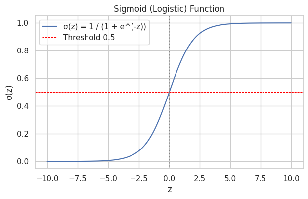
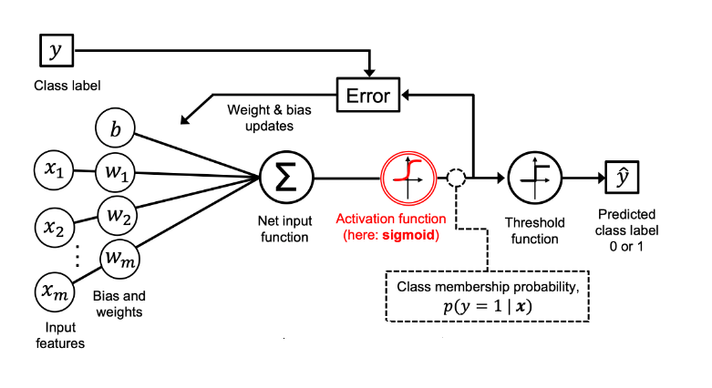
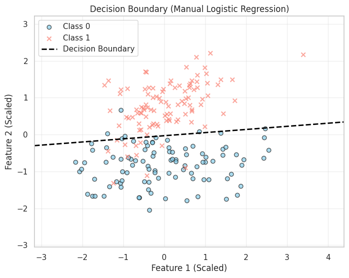

# Supervised Classification

## Logistic Regression

### Introduction

Logistic Regression is a fundamental statistical method for binary classification problems, where we need to predict whether an instance belongs to one of two classes (e.g., spam/not spam, pass/fail, malignant/benign). Despite its name containing "regression," it is primarily a classification algorithm. It aims to model the probability $P(y=1 | \mathbf{x}; \mathbf{\theta})$ that an input $\mathbf{x}$ belongs to class 1, given parameters $\mathbf{\theta}$.

#### Why Not Use Linear Regression for Classification?

Linear regression predicts continuous values, but classification requires probabilities bounded between 0 and 1. If we use linear regression directly:

-   Predictions can exceed 1 or fall below 0, which doesn't make sense for probabilities
-   The linear model assumes that changes in input features have constant effects on the output, which isn't realistic for probabilities
-   The relationship between features and class membership is often non-linear

#### The Logistic Approach

Logistic Regression solves these issues by:

1.  Modeling probabilities directly: Instead of predicting class labels, it predicts the probability of belonging to a class
2.  Using a link function: The sigmoid function transforms any real-valued input into a probability between 0 and 1
3.  Maintaining linearity in log-odds: While the probability relationship is non-linear, the log-odds remain linear in the features

#### Mathematical Foundation

#### The Odds and Log-Odds Concept

Before diving into the sigmoid function, let's understand **odds** and **log-odds**:

**Odds**: If the probability of an event is $p$, then the odds are: $$\text{Odds} = \frac{p}{1-p}$$

-   If $p = 0.5$, odds = 1:1 (equal chance)
-   If $p = 0.8$, odds = 4:1 (4 times more likely to occur)
-   If $p = 0.2$, odds = 1:4 (4 times less likely to occur)

**Log-Odds (Logit)**: The natural logarithm of the odds: $$\text{Logit}(p) = \ln\left(\frac{p}{1-p}\right)$$

The log-odds can range from $-\infty$ to $+\infty$, making it suitable for linear modeling.

### The Sigmoid (Logistic) Function

The sigmoid function is the inverse of the logit function: $$\sigma(z) = \frac{1}{1 + e^{-z}} = \frac{e^z}{1 + e^z}$$

<div align="center">

<p>Fig. Sigmoid Function</p>
</div>

**Key Properties:**

-   Range: $(0, 1)$ - perfect for probabilities
-   Monotonic: Always increasing, so higher $z$ values always correspond to higher probabilities
-   S-shaped curve: Gentle transitions at extremes, steep in the middle
-   Symmetric around 0.5: $\sigma(-z) = 1 - \sigma(z)$
-   Derivative: $\sigma'(z) = \sigma(z)(1 - \sigma(z))$ - this elegant property simplifies gradient calculations

**Interpretation of $z$ values:**

-   $z = 0 \Rightarrow \sigma(z) = 0.5$ (neutral/uncertain)
-   $z > 0 \Rightarrow \sigma(z) > 0.5$ (favors class 1)
-   $z < 0 \Rightarrow \sigma(z) < 0.5$ (favors class 0)
-   $z = \pm 2 \Rightarrow \sigma(z) \approx 0.88/0.12$ (fairly confident)
-   $z = \pm 4 \Rightarrow \sigma(z) \approx 0.98/0.02$ (very confident)

### The Logistic Regression Model

For input features $\mathbf{x} = [x_1, x_2, \ldots, x_n]^T$ and parameters $\boldsymbol{\theta} = [\theta_0, \theta_1, \ldots, \theta_n]^T$:

**Linear combination (logit)**: $$z = \theta_0 + \theta_1 x_1 + \theta_2 x_2 + \cdots + \theta_n x_n = \boldsymbol{\theta}^T \mathbf{x}'$$

where $\mathbf{x}' = [1, x_1, x_2, \ldots, x_n]^T$ includes the bias term.

**Probability prediction**: $$P(y = 1 | \mathbf{x}; \boldsymbol{\theta}) = h_{\boldsymbol{\theta}}(\mathbf{x}) = \sigma(z) = \frac{1}{1 + e^{-\boldsymbol{\theta}^T \mathbf{x}'}}$$

**Class prediction**: $$\hat{y} = \begin{cases} 1 & \text{if } h_{\boldsymbol{\theta}}(\mathbf{x}) \geq 0.5 \text{ (i.e., } z \geq 0\text{)} \ 0 & \text{if } h_{\boldsymbol{\theta}}(\mathbf{x}) < 0.5 \text{ (i.e., } z < 0\text{)} \end{cases}$$

<div align="center">

<p>Fig. Logistic Regression in Machine Learning</p>
</div>

### Decision Boundary
### Linear Decision Boundaries

The decision boundary occurs where $P(y=1|\mathbf{x}) = 0.5$, which happens when $z = 0$: $$\theta_0 + \theta_1 x_1 + \theta_2 x_2 + \cdots + \theta_n x_n = 0$$

This is a **hyperplane** in $n$-dimensional space:

-   In 2D: A straight line
-   In 3D: A plane
-   In higher dimensions: A hyperplane

<div align="center">

<p>Fig. Decision Boundary in 2D</p>
</div>

**Geometric Interpretation:**

-   The normal vector to the decision boundary is $[\theta_1, \theta_2, \ldots, \theta_n]^T$
-   The distance from origin to the boundary is $|\theta_0|/||\boldsymbol{\theta}||$
-   Points are classified based on which side of the hyperplane they fall on

### Non-linear Decision Boundaries

While basic logistic regression produces linear boundaries, we can create non-linear boundaries by:

**Polynomial features**: $$z = \theta_0 + \theta_1 x_1 + \theta_2 x_2 + \theta_3 x_1^2 + \theta_4 x_2^2 + \theta_5 x_1 x_2$$

**Interaction terms**: $$z = \theta_0 + \theta_1 x_1 + \theta_2 x_2 + \theta_3 x_1 x_2$$

**Other transformations**:

-   Logarithmic: $\log(x_i)$
-   Trigonometric: $\sin(x_i), \cos(x_i)$
-   Radial basis functions: $e^{-||x_i - c||^2}$

### Cost Function: Binary Cross-Entropy (Log Loss)
For classification, Mean Squared Error (MSE) is generally not a good cost function because it can lead to a non-convex optimization problem when combined with the sigmoid function. Instead, **Binary Cross-Entropy (BCE) Loss**, also known as Log Loss, is used.

#### Motivation for Log-Likelihood

Logistic regression uses **Maximum Likelihood Estimation (MLE)** to find optimal parameters. Given training data, we want to find parameters that make the observed data most likely.

**Likelihood for a single sample**: $$L(\boldsymbol{\theta}) = P(y|\mathbf{x}; \boldsymbol{\theta}) = h_{\boldsymbol{\theta}}(\mathbf{x})^y \cdot (1 - h_{\boldsymbol{\theta}}(\mathbf{x}))^{1-y}$$

This clever formulation works because:

-   If $y = 1$: $L = h_{\boldsymbol{\theta}}(\mathbf{x})^1 \cdot (1 - h_{\boldsymbol{\theta}}(\mathbf{x}))^0 = h_{\boldsymbol{\theta}}(\mathbf{x})$
-   If $y = 0$: $L = h_{\boldsymbol{\theta}}(\mathbf{x})^0 \cdot (1 - h_{\boldsymbol{\theta}}(\mathbf{x}))^1 = 1 - h_{\boldsymbol{\theta}}(\mathbf{x})$

**Likelihood for all samples** (assuming independence): $$L(\boldsymbol{\theta}) = \prod_{i=1}^{m} h_{\boldsymbol{\theta}}(\mathbf{x}^{(i)})^{y^{(i)}} \cdot (1 - h_{\boldsymbol{\theta}}(\mathbf{x}^{(i)}))^{1-y^{(i)}}$$

**Log-likelihood** (easier to optimize): $$\ell(\boldsymbol{\theta}) = \log L(\boldsymbol{\theta}) = \sum_{i=1}^{m} \left[ y^{(i)} \log h_{\boldsymbol{\theta}}(\mathbf{x}^{(i)}) + (1-y^{(i)}) \log(1 - h_{\boldsymbol{\theta}}(\mathbf{x}^{(i)})) \right]$$

#### Binary Cross-Entropy Loss

Since we typically minimize cost functions rather than maximize likelihood, we define: $$J(\boldsymbol{\theta}) = -\frac{1}{m} \ell(\boldsymbol{\theta}) = -\frac{1}{m} \sum_{i=1}^{m} \left[ y^{(i)} \log h_{\boldsymbol{\theta}}(\mathbf{x}^{(i)}) + (1-y^{(i)}) \log(1 - h_{\boldsymbol{\theta}}(\mathbf{x}^{(i)})) \right]$$

**Properties of BCE Loss:**

-   Convex: Guarantees a global minimum (unlike MSE with sigmoid, which can have local minima)
-   Differentiable: Enables gradient-based optimization
-   Proper scoring rule: Encourages honest probability estimates
-   Penalizes confident wrong predictions heavily: The cost approaches infinity as predictions approach the wrong extreme

**Intuitive Understanding:**

-   When $y = 1$ and $h_{\boldsymbol{\theta}}(\mathbf{x}) \to 1$: Cost $\to 0$ (correct and confident)
-   When $y = 1$ and $h_{\boldsymbol{\theta}}(\mathbf{x}) \to 0$: Cost $\to \infty$ (wrong and confident)
-   When $y = 0$ and $h_{\boldsymbol{\theta}}(\mathbf{x}) \to 0$: Cost $\to 0$ (correct and confident)
-   When $y = 0$ and $h_{\boldsymbol{\theta}}(\mathbf{x}) \to 1$: Cost $\to \infty$ (wrong and confident)

### Optimization with Gradient Descent

#### Detailed Gradient Calculation

To derive the gradient, we need the partial derivative of $J(\boldsymbol{\theta})$ with respect to each parameter $\theta_j$.

**Step 1: Derivative of sigmoid function** $$\frac{d\sigma(z)}{dz} = \sigma(z)(1 - \sigma(z))$$

**Step 2: Chain rule application** For a single sample $(x^{(i)}, y^{(i)})$: $$\frac{\partial}{\partial \theta_j} \left[-y^{(i)} \log h_{\boldsymbol{\theta}}(\mathbf{x}^{(i)}) - (1-y^{(i)}) \log(1 - h_{\boldsymbol{\theta}}(\mathbf{x}^{(i)}))\right]$$

**Step 3: After applying chain rule and simplifying** $$\frac{\partial J(\boldsymbol{\theta})}{\partial \theta_j} = \frac{1}{m} \sum_{i=1}^{m} (h_{\boldsymbol{\theta}}(\mathbf{x}^{(i)}) - y^{(i)}) x_j^{(i)}$$

This looks identical to the gradient for linear regression with MSE, but remember that $h_{\mathbf{\theta}}(\mathbf{x}^{(i)})$ here is $\sigma(\mathbf{x}^{(i)} \cdot \mathbf{\theta})$

**Vectorized form:** $$\nabla J(\boldsymbol{\theta}) = \frac{1}{m} \mathbf{X}^T (\mathbf{h} - \mathbf{y})$$

where:

-   $\mathbf{X}$ is the $m \times (n+1)$ design matrix
-   $\mathbf{h} = \sigma(\mathbf{X}\boldsymbol{\theta})$ is the vector of predictions
-   $\mathbf{y}$ is the vector of true labels

#### Gradient Descent Algorithm

**Standard Gradient Descent:**

```
Initialize θ randomly
For epoch = 1 to max_epochs:
    h = σ(Xθ)
    gradient = (1/m) * X^T * (h - y)
    θ = θ - η * gradient
    if convergence_criteria_met:
        break

```

**Variants:**

-   **Stochastic Gradient Descent (SGD)**: Update after each sample
-   **Mini-batch GD**: Update after small batches
-   **Adaptive methods**: Adam, RMSprop, AdaGrad adjust learning rates

#### Learning Rate Considerations

**Too large**: Oscillation or divergence **Too small**: Slow convergence **Adaptive scheduling**: Start large, decrease over time

Common schedules:

-   Step decay: $\eta_t = \eta_0 \cdot \gamma^{t/k}$
-   Exponential decay: $\eta_t = \eta_0 \cdot e^{-\lambda t}$
-   Cosine annealing: $\eta_t = \eta_{min} + \frac{1}{2}(\eta_{max} - \eta_{min})(1 + \cos(\frac{t\pi}{T}))$


### Related Topics

#### Regularization

**L1 Regularization (Lasso)**: $$J(\boldsymbol{\theta}) = \text{BCE}(\boldsymbol{\theta}) + \lambda \sum_{j=1}^{n} |\theta_j|$$

-   Promotes sparsity (feature selection)
-   Some coefficients become exactly zero

**L2 Regularization (Ridge)**: $$J(\boldsymbol{\theta}) = \text{BCE}(\boldsymbol{\theta}) + \lambda \sum_{j=1}^{n} \theta_j^2$$

-   Prevents overfitting by penalizing large weights
-   Keeps all features but shrinks coefficients

**Elastic Net**: $$J(\boldsymbol{\theta}) = \text{BCE}(\boldsymbol{\theta}) + \lambda_1 \sum_{j=1}^{n} |\theta_j| + \lambda_2 \sum_{j=1}^{n} \theta_j^2$$

-   Combines L1 and L2 penalties

#### Feature Scaling and Preprocessing

**Why scaling matters:**

-   Features with larger scales can dominate the optimization
-   Gradient descent converges faster with scaled features
-   Regularization affects features proportionally to their scale

**Common scaling methods:**

-   Standardization: $x' = \frac{x - \mu}{\sigma}$
-   Min-Max scaling: $x' = \frac{x - \min(x)}{\max(x) - \min(x)}$
-   Robust scaling: Uses median and IQR instead of mean and std

#### Handling Imbalanced Datasets

**Class weight adjustment**:

-   Assign higher weights to minority class samples
-   Common approach: inverse proportion weighting

**Threshold tuning**:

-   Instead of 0.5, choose threshold based on business requirements
-   Use ROC curve or precision-recall curve to select optimal threshold

**Sampling techniques**:

-   Oversampling
-   Undersampling: Random, edited nearest neighbors
-   Hybrid methods: Combine over and undersampling

### Comprehensive Evaluation Metrics

#### Confusion Matrix Analysis

For binary classification:

```
                 Predicted
                0       1
Actual  0    TN      FP     (N)
        1    FN      TP     (P)

```

**Derived Metrics:**

**Accuracy**: Overall correctness $$\text{Accuracy} = \frac{TP + TN}{TP + TN + FP + FN}$$

**Precision**: Exactness of positive predictions $$\text{Precision} = \frac{TP}{TP + FP}$$

**Recall (Sensitivity/TPR)**: Completeness of positive detection $$\text{Recall} = \frac{TP}{TP + FN}$$

**Specificity (TNR)**: Correct rejection rate $$\text{Specificity} = \frac{TN}{TN + FP}$$

**F1-Score**: Harmonic mean of precision and recall $$F_1 = 2 \cdot \frac{\text{Precision} \cdot \text{Recall}}{\text{Precision} + \text{Recall}}$$

**F-Beta Score**: Weighted harmonic mean $$F_\beta = (1 + \beta^2) \cdot \frac{\text{Precision} \cdot \text{Recall}}{\beta^2 \cdot \text{Precision} + \text{Recall}}$$

-   $\beta > 1$: Emphasizes recall
-   $\beta < 1$: Emphasizes precision

#### ROC and AUC Analysis

**ROC Curve**: Plots TPR vs FPR at various thresholds

-   AUC (Area Under Curve): Single metric summarizing ROC
-   AUC = 0.5: Random classifier
-   AUC = 1.0: Perfect classifier
-   AUC > 0.8: Generally considered good

**Precision-Recall Curve**: Better for imbalanced datasets

-   Plots Precision vs Recall at various thresholds
-   AP (Average Precision): Area under PR curve

#### Business-Oriented Metrics

**Cost-sensitive evaluation**: $$\text{Total Cost} = C_{FP} \cdot FP + C_{FN} \cdot FN$$

where $C_{FP}$ and $C_{FN}$ are business costs of false positives and false negatives.

### Assumptions and Limitations

#### Key Assumptions

1.  Linear relationship: Between log-odds and features
2.  Independence: Observations are independent
3.  No multicollinearity: Features shouldn't be highly correlated
4.  Large sample size: Asymptotic properties require sufficient data
5.  No extreme outliers: Can heavily influence the model

#### Limitations

1.  Linear decision boundary: May not capture complex patterns
2.  Sensitive to outliers: Extreme values can skew results
3.  Requires feature engineering: May need polynomial or interaction terms
4.  Assumes linear log-odds: Real relationships might be more complex

#### When to Use Logistic Regression

**Good for:**

-   Binary classification problems
-   When you need probability estimates
-   When interpretability is important
-   As a baseline model
-   When you have limited data
-   When features have roughly linear relationships with log-odds

**Consider alternatives when:**

-   You have highly non-linear relationships
-   You have many irrelevant features
-   You need to capture complex interactions
-   You have very large datasets where tree-based methods might be faster

#### Hyperparameter Tuning

**Key hyperparameters:**

-   Learning rate: Use learning rate scheduling or adaptive methods
-   Regularization strength: Cross-validation to find optimal λ
-   Maximum iterations: Based on convergence criteria
-   Tolerance: For stopping criteria

**Cross-validation strategy:**

-   K-fold cross-validation for parameter selection
-   Stratified sampling to maintain class proportions
-   Time series split for temporal data