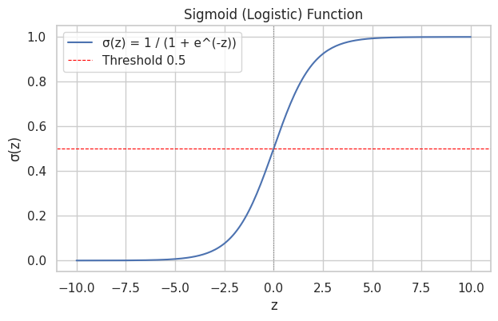
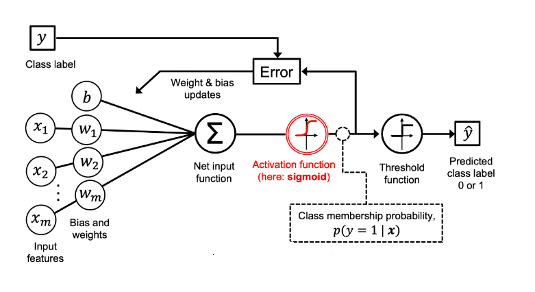
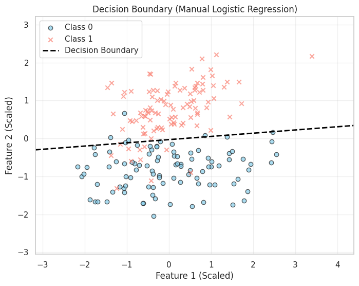
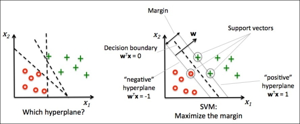
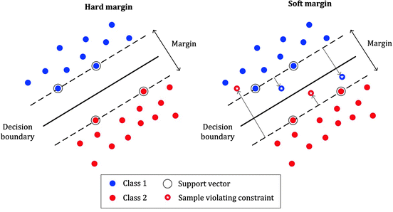
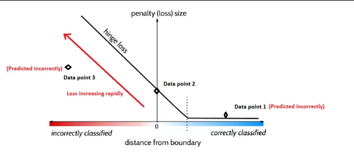
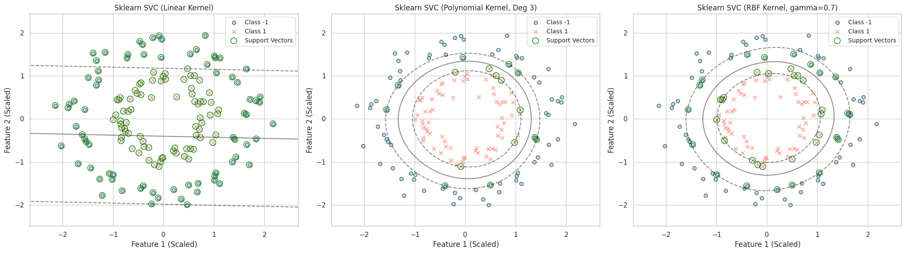
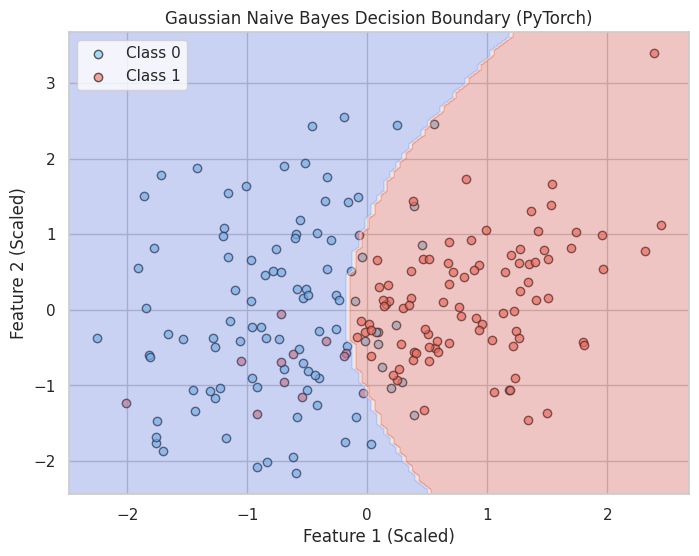

# 02 · Supervised Classification

Classification predicts a **category**: spam or not spam, which digit, which species. This module covers six classic classifiers, from the simplest probabilistic model to the ensembles that still win most tabular-data competitions.

> **Notebooks:** [logistic_regression](logistic_regression.ipynb) · [svm_kernels](svm_kernels.ipynb) · [naive_bayes](naive_bayes.ipynb) · [knn](knn.ipynb) · [decision_trees](decision_trees.ipynb) · [ensembles](ensembles.ipynb)
>
> **Quick revision:** [CHEATSHEET.md](CHEATSHEET.md) · **Evaluating classifiers** (precision, recall, ROC, calibration) is covered in [module 03](../03_Model_evaluation_selection/README.md).

## Contents

1. [Logistic regression](#1-logistic-regression)
2. [Support vector machines and kernels](#2-support-vector-machines-and-kernels)
3. [Naive Bayes](#3-naive-bayes)
4. [k-nearest neighbours](#4-k-nearest-neighbours)
5. [Decision trees](#5-decision-trees)
6. [Ensembles: bagging, random forests and boosting](#6-ensembles-bagging-random-forests-and-boosting)
7. [Which classifier should I use?](#7-which-classifier-should-i-use)

---

## 1. Logistic regression

Despite its name, logistic regression is a **classification** model. It predicts the probability that a sample belongs to class 1.

### 1.1 Why not just use linear regression?

A straight line outputs any number from $-\infty$ to $+\infty$, but a probability must lie between 0 and 1. We need a way to **squash** the line's output into $(0, 1)$.

### 1.2 Odds, log-odds and the sigmoid

- The **odds** of an event with probability $p$ are $\frac{p}{1-p}$. For example, $p = 0.8$ gives odds of 4 : 1.
- The **log-odds** (the *logit*) are $\ln \frac{p}{1-p}$. They range over all real numbers, so they *can* be modelled by a straight line.

Logistic regression models the log-odds as linear, $z = \mathbf{w}^\top \mathbf{x} + b$. Solving for $p$ gives the **sigmoid** function:

```math
p = \sigma(z) = \frac{1}{1 + e^{-z}}
```

<p align="center">
  
  <br>
  <em>The sigmoid squashes any number into (0, 1).</em>
</p>

**Useful properties:**

- $\sigma(0) = 0.5$, $\sigma(2) \approx 0.88$, $\sigma(4) \approx 0.98$
- symmetric: $\sigma(-z) = 1 - \sigma(z)$
- a neat derivative: $\sigma'(z) = \sigma(z)\,(1 - \sigma(z))$

### 1.3 The model

```math
P(y = 1 \mid \mathbf{x}) = \sigma(\mathbf{w}^\top \mathbf{x} + b)
```

Predict class 1 when this probability is $\ge 0.5$, which is the same as $z \ge 0$.

<p align="center">
  
  <br>
  <em>Logistic regression as a single neuron: weighted sum → sigmoid → threshold.</em>
</p>

### 1.4 The decision boundary

The boundary is where $P = 0.5$, that is, where $\mathbf{w}^\top \mathbf{x} + b = 0$. This is a **straight line** in 2-D, a plane in 3-D and a *hyperplane* in general. The vector $\mathbf{w}$ points perpendicular to it.

<p align="center">
  
  <br>
  <em>The linear boundary learned by the from-scratch model in the notebook.</em>
</p>

For a **curved** boundary, add polynomial or interaction features ($x_1^2$, $x_1 x_2$, …) just as in polynomial regression.

### 1.5 The loss: binary cross-entropy

We choose $\mathbf{w}$ to make the observed labels **as likely as possible** (maximum likelihood). For one sample, the probability of its label is $\hat{p}^{\,y} (1 - \hat{p})^{1-y}$. This equals $\hat{p}$ when $y = 1$ and $1 - \hat{p}$ when $y = 0$.

Taking the negative log and averaging over all samples gives the **binary cross-entropy (log loss)**:

```math
J(\mathbf{w}, b) = -\frac{1}{m} \sum_{i=1}^{m} \Big[ y^{(i)} \log \hat{p}^{(i)} + \big(1 - y^{(i)}\big) \log\big(1 - \hat{p}^{(i)}\big) \Big]
```

| True label | Prediction $\hat{p}$ | Loss |
|---|---|---|
| 1 | close to 1 | ≈ 0 ✅ |
| 1 | close to 0 | → ∞ ❌ (confident and wrong) |
| 0 | close to 0 | ≈ 0 ✅ |
| 0 | close to 1 | → ∞ ❌ |

> [!NOTE]
> Why not MSE? Combined with the sigmoid, MSE gives a **non-convex** loss with flat regions. Cross-entropy is **convex**, so gradient descent finds the global minimum.

### 1.6 The gradient

Using $\sigma' = \sigma(1-\sigma)$ and the chain rule, almost everything cancels:

```math
\nabla_{\mathbf{w}} J = \frac{1}{m} X^\top (\hat{\mathbf{p}} - \mathbf{y})
```

This has the same form as linear regression's gradient, but now $\hat{\mathbf{p}} = \sigma(X\mathbf{w})$. Training is ordinary gradient descent: predict, compute $\hat{\mathbf{p}} - \mathbf{y}$, step.

### 1.7 In practice

- **Regularisation:** add $\lambda \lVert \mathbf{w} \rVert_2^2$ (L2) or $\lambda \lVert \mathbf{w} \rVert_1$ (L1), exactly as in [module 01](../01_Supervised_Regression/README.md#5-regularisation-ridge-and-lasso). In scikit-learn, `C` is the **inverse** strength: small `C` means strong regularisation.
- **Scale the features** so that gradient descent converges quickly and the penalty treats all features fairly.
- **Imbalanced classes:** use `class_weight="balanced"` or move the decision threshold away from 0.5. The notebook has a threshold slider.
- **More than two classes:** replace the sigmoid with **softmax**, $P(y = k) = \frac{e^{z_k}}{\sum_j e^{z_j}}$.

**Good for:** a fast, interpretable baseline with probability outputs. **Limited by:** a linear boundary unless you engineer features.

---

## 2. Support vector machines and kernels

### 2.1 The idea: maximise the margin

Many lines can separate two classes. An SVM picks the one with the **widest gap** (the *margin*) to the nearest points of each class. Those nearest points are the **support vectors**. They alone determine the boundary, and every other point could be removed without changing it.

<p align="center">
  
  <br>
  <em>The widest possible "street" between the classes; support vectors sit on its edges.</em>
</p>

For a boundary $\mathbf{w}^\top \mathbf{x} + b = 0$, scaled so that the closest points satisfy $|\mathbf{w}^\top \mathbf{x} + b| = 1$:

- the margin width is $\frac{2}{\lVert \mathbf{w} \rVert}$
- so **maximising the margin** is the same as **minimising** $\frac{1}{2}\lVert \mathbf{w} \rVert^2$

A wide margin is more robust to noise and tends to generalise better.

### 2.2 Hard margin vs soft margin

<p align="center">
  
  <br>
  <em>Hard margin: no point may enter the street. Soft margin: some may, at a cost.</em>
</p>

**Hard margin** (data must be perfectly separable):

```math
\min_{\mathbf{w}, b} \; \frac{1}{2}\lVert \mathbf{w} \rVert^2 \quad \text{subject to} \quad y_i(\mathbf{w}^\top \mathbf{x}_i + b) \ge 1 \;\; \text{for all } i
```

**Soft margin** (real data). Each point gets a **slack** $\xi_i \ge 0$ that measures how far it violates the margin:

```math
\min_{\mathbf{w}, b, \boldsymbol{\xi}} \; \frac{1}{2}\lVert \mathbf{w} \rVert^2 + C \sum_{i} \xi_i \quad \text{subject to} \quad y_i(\mathbf{w}^\top \mathbf{x}_i + b) \ge 1 - \xi_i
```

| Slack | Meaning |
|---|---|
| $\xi_i = 0$ | Correct and outside the margin |
| $0 < \xi_i < 1$ | Correct but inside the margin |
| $\xi_i > 1$ | Misclassified |

**`C` sets the trade-off.** A small `C` gives a wide margin and tolerates errors (more regularisation). A large `C` gives a narrow margin and tries hard to classify every point, at the risk of overfitting.

### 2.3 Hinge loss: the same thing as an unconstrained loss

The soft-margin problem is equivalent to minimising the **hinge loss** plus L2 regularisation. This is how the notebook trains a linear SVM with gradient descent in PyTorch:

```math
J(\mathbf{w}, b) = \frac{1}{m} \sum_{i} \max\big(0,\; 1 - y_i(\mathbf{w}^\top \mathbf{x}_i + b)\big) + \frac{\lambda}{2}\lVert \mathbf{w} \rVert^2, \qquad y_i \in \{-1, +1\}
```

<p align="center">
  
  <br>
  <em>Points beyond the margin on the correct side cost nothing; the loss grows linearly the further a point is on the wrong side.</em>
</p>

- The loss is **zero** for points that are correct *and* outside the margin, so only the support vectors contribute.
- It isn't differentiable at $y f(\mathbf{x}) = 1$, so we use the sub-gradient: $-y_i \mathbf{x}_i$ if the point violates the margin, otherwise $0$.
- The two forms match when $C = \frac{1}{\lambda m}$.

### 2.4 The dual problem (why kernels are possible)

Solving the soft-margin problem with Lagrange multipliers $\alpha_i$ gives the **dual** form:

```math
\max_{\boldsymbol{\alpha}} \; \sum_i \alpha_i - \frac{1}{2} \sum_{i,j} \alpha_i \alpha_j y_i y_j \, \mathbf{x}_i^\top \mathbf{x}_j \quad \text{subject to} \quad 0 \le \alpha_i \le C, \;\; \sum_i \alpha_i y_i = 0
```

Two things to notice:

1. The data appears **only through dot products** $\mathbf{x}_i^\top \mathbf{x}_j$.
2. The solution is $\mathbf{w} = \sum_i \alpha_i y_i \mathbf{x}_i$, and $\alpha_i > 0$ only for **support vectors**. So predictions are:

```math
f(\mathbf{x}) = \sum_{i \in \text{SV}} \alpha_i y_i \, \mathbf{x}_i^\top \mathbf{x} + b
```

Libraries solve the dual with **SMO** (Sequential Minimal Optimisation), which repeatedly optimises two $\alpha$'s at a time in closed form.

### 2.5 The kernel trick

Some data can't be separated by any straight line, such as one class forming a ring around the other.

The fix is to map the data to a **higher-dimensional space** $\phi(\mathbf{x})$ where a flat boundary *does* work. Because the dual only needs dot products, we never have to compute $\phi$ itself. We just replace every $\mathbf{x}_i^\top \mathbf{x}_j$ with a **kernel** $K(\mathbf{x}_i, \mathbf{x}_j) = \phi(\mathbf{x}_i)^\top \phi(\mathbf{x}_j)$.

| Kernel | $K(\mathbf{x}, \mathbf{x}')$ | Notes |
|---|---|---|
| Linear | $\mathbf{x}^\top \mathbf{x}'$ | For data that's already (nearly) separable, like high-dimensional text |
| Polynomial | $(\gamma\, \mathbf{x}^\top \mathbf{x}' + r)^d$ | All feature products up to degree $d$ |
| **RBF (Gaussian)** | $\exp\left(-\gamma \lVert \mathbf{x} - \mathbf{x}' \rVert^2\right)$ | The default. Its feature space is infinite-dimensional |
| Sigmoid | $\tanh(\gamma\, \mathbf{x}^\top \mathbf{x}' + r)$ | Not always a valid kernel |

<p align="center">
  
  <br>
  <em>Ring-shaped data: the linear kernel fails, while the polynomial and RBF kernels find a circular boundary.</em>
</p>

> [!NOTE]
> A function is a valid kernel if every Gram matrix $K_{ij} = K(\mathbf{x}_i, \mathbf{x}_j)$ it produces is symmetric and positive semi-definite (**Mercer's condition**).

### 2.6 Hyperparameters

| Parameter | Small value | Large value |
|---|---|---|
| `C` | Wide margin, smoother boundary (may underfit) | Narrow margin, fits every point (may overfit) |
| `gamma` (RBF) | Each point influences far away, so a smooth boundary | Each point only influences nearby, so a wiggly boundary |
| `degree` (poly) | Simpler curves | More complex curves |

Tune `C` and `gamma` **together** with a log-scale grid search, and always **scale the features** first. The notebook has sliders for both.

---

## 3. Naive Bayes

### 3.1 Classification with Bayes' theorem

Naive Bayes picks the class with the highest posterior probability:

```math
P(C_k \mid \mathbf{x}) = \frac{P(\mathbf{x} \mid C_k)\, P(C_k)}{P(\mathbf{x})}
```

- **Prior** $P(C_k)$: how common the class is in the training data.
- **Likelihood** $P(\mathbf{x} \mid C_k)$: how typical these features are for the class.
- **Evidence** $P(\mathbf{x})$: the same for every class, so it can be ignored when choosing the best one.

### 3.2 The "naive" assumption

Estimating $P(x_1, \dots, x_n \mid C_k)$ jointly needs huge amounts of data. Naive Bayes assumes the features are **independent given the class**, so the likelihood factorises:

```math
P(\mathbf{x} \mid C_k) = \prod_{j=1}^{n} P(x_j \mid C_k)
```

This is rarely true. Words like "machine" and "learning" clearly appear together. But the *ranking* of the classes is often still right, which is all classification needs.

### 3.3 Predicting in log space

Multiplying many small probabilities underflows to 0, so we add logs instead:

```math
\hat{y} = \arg\max_k \Big[ \log P(C_k) + \sum_{j=1}^{n} \log P(x_j \mid C_k) \Big]
```

### 3.4 The three variants

The only difference between them is how $P(x_j \mid C_k)$ is modelled:

| Variant | Features | Likelihood $P(x_j \mid C_k)$ | Typical use |
|---|---|---|---|
| **Gaussian** | Continuous | $\mathcal{N}(x_j;\, \mu_{kj}, \sigma^2_{kj})$ | Sensor readings, measurements |
| **Multinomial** | Counts | $\dfrac{N_{kj} + \alpha}{N_k + \alpha V}$ | Word counts in documents |
| **Bernoulli** | Binary (0/1) | $p_{kj}^{x_j} (1 - p_{kj})^{1 - x_j}$, with $p_{kj} = \dfrac{N_{kj} + \alpha}{N_k + 2\alpha}$ | Word present or absent |

**Training is just counting** (closed form, one pass over the data):

- **Gaussian:** the per-class mean and variance of each feature. Add a tiny $\epsilon$ to the variances to avoid dividing by zero.
- **Multinomial:** $N_{kj}$ is the total count of word $j$ in class $k$, $N_k$ the total count of all words in class $k$, and $V$ the vocabulary size.
- **Bernoulli:** $N_{kj}$ is the number of class-$k$ documents that contain word $j$, and $N_k$ the number of class-$k$ documents. Bernoulli also penalises words that are **absent**, which Multinomial ignores.

<p align="center">
  
  <br>
  <em>Gaussian NB gives curved (quadratic) boundaries because each class has its own variances.</em>
</p>

### 3.5 Laplace smoothing

If a word never appears in class $k$ during training, its probability is 0, and a single 0 wipes out the whole product. **Smoothing** adds a pseudo-count $\alpha$ (usually 1) to every count, which is the $\alpha$ in the formulas above.

### 3.6 Strengths and weaknesses

| ✅ Strengths | ❌ Weaknesses |
|---|---|
| Very fast to train and predict | The independence assumption hurts when features are strongly correlated |
| Works with little data | Gaussian NB assumes bell-shaped features |
| Handles thousands of features (text) | Probabilities are poorly **calibrated**, often too close to 0 or 1 |
| A strong baseline for text classification | Needs smoothing for unseen feature values |

---

## 4. k-nearest neighbours

### 4.1 The idea

k-NN has no training step. It simply **stores the training set**, which is why it's called a *lazy* learner. To classify a new point:

1. find the $k$ training points closest to it
2. let them **vote**

```math
\hat{y}(\mathbf{x}) = \arg\max_{c} \sum_{i \in \mathcal{N}_k(\mathbf{x})} w_i \, \mathbb{1}[y_i = c]
```

- **Uniform** weights: $w_i = 1$, one neighbour one vote.
- **Distance** weights: $w_i = 1 / d(\mathbf{x}, \mathbf{x}_i)$, so closer neighbours count more.
- For **regression**, predict the (weighted) mean of the neighbours' targets.

### 4.2 Distance metrics

| Metric | Formula | Notes |
|---|---|---|
| Euclidean (default) | $\sqrt{\sum_j (x_j - z_j)^2}$ | Straight-line distance |
| Manhattan | $\sum_j \lvert x_j - z_j \rvert$ | Less affected by one large difference |
| Minkowski | $\left(\sum_j \lvert x_j - z_j \rvert^p\right)^{1/p}$ | $p = 1$ is Manhattan, $p = 2$ is Euclidean |
| Cosine | $1 - \frac{\mathbf{x}^\top \mathbf{z}}{\lVert \mathbf{x} \rVert \lVert \mathbf{z} \rVert}$ | Text and embeddings, where direction matters more than length |

> [!IMPORTANT]
> Every feature contributes to the distance, so **standardise the features first**. Otherwise a feature measured in thousands (income) swamps one measured in units (age).

### 4.3 Choosing k

| $k$ | Boundary | Risk |
|---|---|---|
| 1 | Wraps around every training point | High variance (overfits noise) |
| Moderate | Smooth but flexible | The sweet spot, so choose by cross-validation |
| $n$ (everything) | Always predicts the majority class | High bias |

Use an **odd** $k$ for two classes to avoid ties.

### 4.4 Limitations

- **Curse of dimensionality.** In many dimensions all points end up roughly the same distance apart, so "nearest" means little. k-NN works best in low dimensions or after PCA.
- **Slow predictions.** Brute force costs $O(nd)$ per query. KD-trees and ball trees help in low dimensions, and approximate indexes (FAISS, HNSW) scale to millions of vectors.

---

## 5. Decision trees

### 5.1 The idea

A decision tree asks a sequence of **yes/no questions** of the form "is $x_j \le t$?". Each question splits the data in two. You follow the answers down to a **leaf**, which predicts the majority class (or, for regression, the mean value).

Predictions are fast ($O(\text{depth})$) and easy to explain.

### 5.2 Measuring impurity

A good split produces **pure** children, each containing mostly one class. For a node with class proportions $p_1, \dots, p_K$:

```math
\text{Gini} = 1 - \sum_{k} p_k^2 \qquad\qquad \text{Entropy} = -\sum_{k} p_k \log_2 p_k
```

Both are 0 for a pure node and largest for an even mix. They usually give very similar trees, and Gini is slightly cheaper. For regression, the impurity is the variance of the targets.

### 5.3 Choosing a split

At every node, try every feature $j$ and threshold $t$, and keep the split with the largest **impurity decrease**:

```math
\Delta I = I(\text{parent}) - \frac{n_L}{n} I(\text{left}) - \frac{n_R}{n} I(\text{right})
```

With entropy, $\Delta I$ is called **information gain**. The notebook sorts each feature once and sweeps the thresholds with running class counts, so each feature costs $O(n \log n)$. Thresholds are placed midway between consecutive values.

### 5.4 Controlling overfitting

Left alone, a tree keeps splitting until every leaf is pure, which means it memorises the training data. Two ways to stop it:

- **Pre-pruning** (stop early): `max_depth`, `min_samples_split`, `min_samples_leaf`, `max_leaf_nodes`, `min_impurity_decrease`.
- **Post-pruning** (grow, then cut back). Cost-complexity pruning removes branches that don't earn their keep:

```math
R_\alpha(T) = \underbrace{R(T)}_{\text{total leaf impurity}} + \alpha \cdot \underbrace{|T|}_{\text{number of leaves}}
```

Larger $\alpha$ gives smaller trees. Choose `ccp_alpha` by cross-validation.

### 5.5 Feature importance

**Impurity-based** importance adds up how much each feature reduced impurity across all its splits. It's cheap, but it favours features with many distinct values. **Permutation importance** on validation data is more trustworthy.

### 5.6 Strengths and weaknesses

| ✅ Strengths | ❌ Weaknesses |
|---|---|
| Easy to interpret (when small) | **High variance**: a small change in the data can give a very different tree |
| No feature scaling needed | Axis-aligned splits approximate diagonal boundaries with "staircases" |
| Handles mixed feature types and interactions | Greedy splits aren't globally optimal |
| Fast predictions | Overfits unless constrained |

Most of these weaknesses disappear when you **average many trees**, which is the next section.

---

## 6. Ensembles: bagging, random forests and boosting

### 6.1 Why combining models works

Averaging $B$ models, each with variance $\sigma^2$ and pairwise correlation $\rho$, gives:

```math
\text{Var}\left(\frac{1}{B}\sum_{b=1}^{B} f_b\right) = \underbrace{\rho\,\sigma^2}_{\text{shrinks if models differ}} + \underbrace{\frac{1-\rho}{B}\,\sigma^2}_{\text{shrinks with more models}}
```

There are two strategies:

- **Bagging** averages many *high-variance* models (deep trees) to cancel out their noise.
- **Boosting** chains many *high-bias* models (shallow trees) so each one fixes the last one's mistakes.

### 6.2 Bagging

**Bootstrap aggregating:**

1. Draw $B$ **bootstrap samples**: $n$ points drawn *with replacement*.
2. Train one model on each.
3. Average their predictions, or their predicted probabilities.

Each bootstrap sample leaves out about **36.8 %** of the points ($\approx e^{-1}$). These **out-of-bag (OOB)** points give a free validation score, because each one can be predicted by the trees that never saw it.

### 6.3 Random forests

A random forest is bagging with one extra twist: at **every split**, a tree may only choose from a random subset of `max_features` features (typically $\sqrt{d}$).

This makes the trees **less alike** (lower $\rho$), so averaging removes more variance.

- Robust, with little tuning needed.
- Adding more trees never makes it overfit. Performance just plateaus.
- A strong default model for tabular data.

### 6.4 AdaBoost

AdaBoost trains weak learners **one after another**. After each round it **increases the weight of the misclassified samples**, so the next learner focuses on them. Each learner's say in the final vote is set by its accuracy.

For $K$ classes (the SAMME algorithm), starting with equal weights $w_i = 1/n$:

```math
\varepsilon_m = \frac{\sum_i w_i \, \mathbb{1}[h_m(\mathbf{x}_i) \ne y_i]}{\sum_i w_i}
```

```math
\alpha_m = \eta \left( \log \frac{1 - \varepsilon_m}{\varepsilon_m} + \log(K - 1) \right)
```

```math
w_i \leftarrow w_i \cdot e^{\alpha_m \mathbb{1}[h_m(\mathbf{x}_i) \ne y_i]}
```

- $\varepsilon_m$ is the learner's weighted error.
- $\alpha_m$ is its vote weight: accurate learners get a bigger say.
- The final prediction is the weighted vote $\arg\max_k \sum_m \alpha_m \mathbb{1}[h_m(\mathbf{x}) = k]$.

For two classes, AdaBoost minimises the **exponential loss** $e^{-yF(\mathbf{x})}$. That explains why it's sensitive to label noise: badly misclassified points get exponentially large weights.

### 6.5 Gradient boosting

Gradient boosting builds the model step by step:

```math
F_M(\mathbf{x}) = F_0 + \eta \sum_{m=1}^{M} h_m(\mathbf{x})
```

Each new tree $h_m$ is trained to predict the **negative gradient** of the loss at the current predictions. These targets are called the *pseudo-residuals*:

```math
r_i = -\frac{\partial L(y_i, F(\mathbf{x}_i))}{\partial F(\mathbf{x}_i)}
```

| Loss | Pseudo-residual |
|---|---|
| Squared error $\frac{1}{2}(y - F)^2$ | $y - F$, the ordinary residual |
| Log loss ($F$ = log-odds) | $y - \sigma(F)$ |
| Absolute / Huber | Robust to outliers |

It's gradient descent, but in the space of *functions* instead of parameters.

- The **learning rate** $\eta$ (shrinkage) is a trade-off: smaller values need more trees but usually generalise better.
- Unlike random forests, boosting **does overfit** if you add too many rounds. Pick `n_estimators` with **early stopping** on validation data.
- `subsample < 1` (stochastic gradient boosting) adds extra regularisation.

**Modern libraries** (XGBoost, LightGBM, CatBoost, scikit-learn's `HistGradientBoosting`) add:

- Newton steps using second derivatives
- L1/L2 penalties on the leaf values
- **histogram-based** splitting, which is much faster
- built-in handling of missing values and categorical features

### 6.6 Bagging vs boosting

| | Bagging / random forest | Boosting |
|---|---|---|
| How models are trained | In parallel, independently | In sequence, each correcting the last |
| Base learner | Deep trees (low bias, high variance) | Shallow trees (high bias, low variance) |
| Mainly reduces | Variance | Bias |
| Adding more models | Never hurts, performance plateaus | Eventually overfits, so use early stopping |
| Tuning effort | Low | Moderate (`learning_rate`, `n_estimators`, depth) |

---

## 7. Which classifier should I use?

| Model | Boundary | Needs scaling | Probabilities | Interpretable | Best for |
|---|---|---|---|---|---|
| Logistic regression | Linear | Yes | ✅ Well calibrated | ✅ Coefficients | Baselines, when you need to explain the model |
| SVM (RBF) | Any shape | Yes | ⚠️ Needs extra calibration | ❌ | Small to medium data with complex boundaries |
| Naive Bayes | Linear or quadratic | No | ⚠️ Over-confident | ✅ | Text, very little data |
| k-NN | Any shape | **Yes** | ✅ Vote fractions | ✅ "Similar examples" | Low dimensions, small data |
| Decision tree | Axis-aligned boxes | No | ⚠️ Coarse | ✅ When small | Explaining rules |
| Random forest | Any shape | No | ✅ Reasonable | ⚠️ Feature importance | A robust default for tabular data |
| Gradient boosting | Any shape | No | ✅ | ⚠️ Feature importance | Best accuracy on tabular data |
