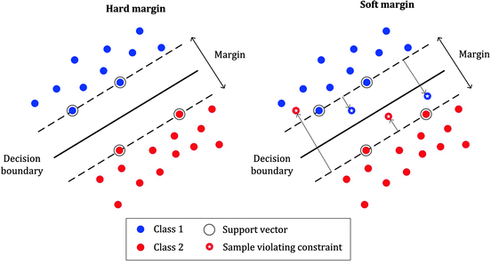

# Supervised Classification

## Logistic Regression

### Introduction

Logistic Regression is a fundamental statistical method for binary classification problems, where we need to predict whether an instance belongs to one of two classes (e.g., spam/not spam, pass/fail, malignant/benign). Despite its name containing "regression," it is primarily a classification algorithm. It aims to model the probability $\large P(y=1 | \mathbf{x}; \mathbf{\theta})$ that an input $\large \mathbf{x}$ belongs to class 1, given parameters $\large \mathbf{\theta}$.

#### Why Not Use Linear Regression for Classification?

Linear regression predicts continuous values, but classification requires probabilities bounded between 0 and 1. If we use linear regression directly:

-   Predictions can exceed 1 or fall below 0, which doesn't make sense for probabilities
-   The linear model assumes that changes in input features have constant effects on the output, which isn't realistic for probabilities
-   The relationship between features and class membership is often non-linear

#### The Logistic Approach

Logistic Regression solves these issues by:

1.  Modeling probabilities directly: Instead of predicting class labels, it predicts the probability of belonging to a class
2.  Using a link function: The sigmoid function transforms any real-valued input into a probability between 0 and 1
3.  Maintaining linearity in log-odds: While the probability relationship is non-linear, the log-odds remain linear in the features

#### Mathematical Foundation

#### The Odds and Log-Odds Concept

Before diving into the sigmoid function, let's understand **odds** and **log-odds**:

**Odds**: If the probability of an event is $\large p$, then the odds are: 

<div align="center">

$$\large 
\text{Odds} = \frac{p}{1-p}
$$

</div>

-   If $\large p = 0.5$, odds = 1:1 (equal chance)
-   If $\large p = 0.8$, odds = 4:1 (4 times more likely to occur)
-   If $\large p = 0.2$, odds = 1:4 (4 times less likely to occur)

**Log-Odds (Logit)**: The natural logarithm of the odds: 

<div align="center">

$$\large 
\text{Logit}(p) = \ln\left(\frac{p}{1-p}\right)
$$

</div>

The log-odds can range from $\large -\infty$ to $\large +\infty$, making it suitable for linear modeling.

### The Sigmoid (Logistic) Function

The sigmoid function is the inverse of the logit function: 

<div align="center">

$$\large 
\sigma(z) = \frac{1}{1 + e^{-z}} = \frac{e^z}{1 + e^z}
$$

</div>

<div align="center">

<p>Fig. Sigmoid Function</p>
</div>

**Key Properties:**

-   Range: $\large (0, 1)$ - perfect for probabilities
-   Monotonic: Always increasing, so higher $\large z$ values always correspond to higher probabilities
-   S-shaped curve: Gentle transitions at extremes, steep in the middle
-   Symmetric around 0.5: $\large \sigma(-z) = 1 - \sigma(z)$
-   Derivative: $\large \sigma'(z) = \sigma(z)(1 - \sigma(z))$ - this elegant property simplifies gradient calculations

**Interpretation of $\large z$ values:**

-   $\large z = 0 \Rightarrow \sigma(z) = 0.5$ (neutral/uncertain)
-   $\large z > 0 \Rightarrow \sigma(z) > 0.5$ (favors class 1)
-   $\large z < 0 \Rightarrow \sigma(z) < 0.5$ (favors class 0)
-   $\large z = \pm 2 \Rightarrow \sigma(z) \approx 0.88/0.12$ (fairly confident)
-   $\large z = \pm 4 \Rightarrow \sigma(z) \approx 0.98/0.02$ (very confident)

### The Logistic Regression Model

For input features $\large \mathbf{x} = [x_1, x_2, \ldots, x_n]^T$ and parameters $\large \boldsymbol{\theta} = [\theta_0, \theta_1, \ldots, \theta_n]^T$:

**Linear combination (logit)**: $$\large z = \theta_0 + \theta_1 x_1 + \theta_2 x_2 + \cdots + \theta_n x_n = \boldsymbol{\theta}^T \mathbf{x}'$$

where $\large \mathbf{x}' = [1, x_1, x_2, \ldots, x_n]^T$ includes the bias term.

**Probability prediction**: $$\large P(y = 1 | \mathbf{x}; \boldsymbol{\theta}) = h_{\boldsymbol{\theta}}(\mathbf{x}) = \sigma(z) = \frac{1}{1 + e^{-\boldsymbol{\theta}^T \mathbf{x}'}}$$

**Class prediction**: 

When $\large h_{\theta}(x)\ge0.5$ (i.e.\ $z\ge0$), 

set $$\large \hat y=1,$$

otherwise $$\large \hat y=0.$$

<div align="center">

<p>Fig. Logistic Regression in Machine Learning</p>
</div>

### Decision Boundary
### Linear Decision Boundaries

The decision boundary occurs where $\large P(y=1|\mathbf{x}) = 0.5$, which happens when $\large z = 0$: 

<div align="center">

$$\large 
\theta_0 + \theta_1 x_1 + \theta_2 x_2 + \cdots + \theta_n x_n = 0
$$

</div>

This is a **hyperplane** in $n$-dimensional space:

-   In 2D: A straight line
-   In 3D: A plane
-   In higher dimensions: A hyperplane

<div align="center">

<p>Fig. Decision Boundary in 2D</p>
</div>

**Geometric Interpretation:**

-   The normal vector to the decision boundary is $\large [\theta_1, \theta_2, \ldots, \theta_n]^T$
-   The distance from origin to the boundary is $\large |\theta_0|/||\boldsymbol{\theta}||$
-   Points are classified based on which side of the hyperplane they fall on

### Non-linear Decision Boundaries

While basic logistic regression produces linear boundaries, we can create non-linear boundaries by:

**Polynomial features**: $$\large z = \theta_0 + \theta_1 x_1 + \theta_2 x_2 + \theta_3 x_1^2 + \theta_4 x_2^2 + \theta_5 x_1 x_2$$

**Interaction terms**: $$\large z = \theta_0 + \theta_1 x_1 + \theta_2 x_2 + \theta_3 x_1 x_2$$

**Other transformations**:

-   Logarithmic: $\large \log(x_i)$
-   Trigonometric: $\large \sin(x_i), \cos(x_i)$
-   Radial basis functions: $\large e^{-||x_i - c||^2}$

### Cost Function: Binary Cross-Entropy (Log Loss)
For classification, Mean Squared Error (MSE) is generally not a good cost function because it can lead to a non-convex optimization problem when combined with the sigmoid function. Instead, **Binary Cross-Entropy (BCE) Loss**, also known as Log Loss, is used.

#### Motivation for Log-Likelihood

Logistic regression uses **Maximum Likelihood Estimation (MLE)** to find optimal parameters. Given training data, we want to find parameters that make the observed data most likely.

**Likelihood for a single sample**: 

<div align="center">

$$\large 
L(\boldsymbol{\theta}) = P(y|\mathbf{x}; \boldsymbol{\theta}) = h_{\boldsymbol{\theta}}(\mathbf{x})^y \cdot (1 - h_{\boldsymbol{\theta}}(\mathbf{x}))^{1-y}
$$

</div>

This clever formulation works because:

-   **If $\large y = 1$**: $\large L = h_{\boldsymbol{\theta}}(\mathbf{x})^1 \cdot (1 - h_{\boldsymbol{\theta}}(\mathbf{x}))^0 = h_{\boldsymbol{\theta}}(\mathbf{x})$
-   **If $\large y = 0$**: $\large L = h_{\boldsymbol{\theta}}(\mathbf{x})^0 \cdot (1 - h_{\boldsymbol{\theta}}(\mathbf{x}))^1 = 1 - h_{\boldsymbol{\theta}}(\mathbf{x})$

**Likelihood for all samples** (assuming independence): 

<div align="center">

$$\large 
L(\boldsymbol{\theta}) = \prod_{i=1}^{m} h_{\boldsymbol{\theta}}(\mathbf{x}^{(i)})^{y^{(i)}} \cdot (1 - h_{\boldsymbol{\theta}}(\mathbf{x}^{(i)}))^{1-y^{(i)}}
$$

</div>

**Log-likelihood** (easier to optimize): 

<div align="center">

$$\large 
\ell(\boldsymbol{\theta}) = \log L(\boldsymbol{\theta}) = \sum_{i=1}^{m} \left[ y^{(i)} \log h_{\boldsymbol{\theta}}(\mathbf{x}^{(i)}) + (1-y^{(i)}) \log(1 - h_{\boldsymbol{\theta}}(\mathbf{x}^{(i)})) \right]
$$

</div>

#### Binary Cross-Entropy Loss

Since we typically minimize cost functions rather than maximize likelihood, we define: 

<div align="center">

$$\large 
J(\boldsymbol{\theta}) = -\frac{1}{m} \ell(\boldsymbol{\theta}) = -\frac{1}{m} \sum_{i=1}^{m} \left[ y^{(i)} \log h_{\boldsymbol{\theta}}(\mathbf{x}^{(i)}) + (1-y^{(i)}) \log(1 - h_{\boldsymbol{\theta}}(\mathbf{x}^{(i)})) \right]
$$

</div>

**Properties of BCE Loss:**

-   Convex: Guarantees a global minimum (unlike MSE with sigmoid, which can have local minima)
-   Differentiable: Enables gradient-based optimization
-   Proper scoring rule: Encourages honest probability estimates
-   Penalizes confident wrong predictions heavily: The cost approaches infinity as predictions approach the wrong extreme

**Intuitive Understanding:**

-   When $\large y = 1$ and $h_{\boldsymbol{\theta}}(\mathbf{x}) \to 1$: Cost $\large \to 0$ (correct and confident)
-   When $\large y = 1$ and $h_{\boldsymbol{\theta}}(\mathbf{x}) \to 0$: Cost $\large \to \infty$ (wrong and confident)
-   When $\large y = 0$ and $h_{\boldsymbol{\theta}}(\mathbf{x}) \to 0$: Cost $\large \to 0$ (correct and confident)
-   When $\large y = 0$ and $h_{\boldsymbol{\theta}}(\mathbf{x}) \to 1$: Cost $\large \to \infty$ (wrong and confident)

### Optimization with Gradient Descent

#### Detailed Gradient Calculation

To derive the gradient, we need the partial derivative of $J(\boldsymbol{\theta})$ with respect to each parameter $\theta_j$.

**Step 1: Derivative of sigmoid function** 

<div align="center">

$$
\frac{d\sigma(z)}{dz} = \sigma(z)(1 - \sigma(z))
$$

</div>

**Step 2: Chain rule application** For a single sample $(x^{(i)}, y^{(i)})$: 

<div align="center">

$$\large \
frac{\partial}{\partial \theta_j} \left[-y^{(i)} \log h_{\boldsymbol{\theta}}(\mathbf{x}^{(i)}) - (1-y^{(i)}) \log(1 - h_{\boldsymbol{\theta}}(\mathbf{x}^{(i)}))\right]
$$

</div>

**Step 3: After applying chain rule and simplifying** 

<div align="center">

$$\large 
\frac{\partial J(\boldsymbol{\theta})}{\partial \theta_j} = \frac{1}{m} \sum_{i=1}^{m} (h_{\boldsymbol{\theta}}(\mathbf{x}^{(i)}) - y^{(i)}) x_j^{(i)}
$$

</div>

This looks identical to the gradient for linear regression with MSE, but remember that $\large h_{\mathbf{\theta}}(\mathbf{x}^{(i)})$ here is $\large \sigma(\mathbf{x}^{(i)} \cdot \mathbf{\theta})$

**Vectorized form:** 

<div align="center">

$$\large 
\nabla J(\boldsymbol{\theta}) = \frac{1}{m} \mathbf{X}^T (\mathbf{h} - \mathbf{y})
$$

</div>

where:

-   $\large \mathbf{X}$ is the $\large m \times (n+1)$ design matrix
-   $\large \mathbf{h} = \sigma(\mathbf{X}\boldsymbol{\theta})$ is the vector of predictions
-   $\large \mathbf{y}$ is the vector of true labels

#### Gradient Descent Algorithm

**Standard Gradient Descent:**

```
Initialize θ randomly
For epoch = 1 to max_epochs:
    h = σ(Xθ)
    gradient = (1/m) * X^T * (h - y)
    θ = θ - η * gradient
    if convergence_criteria_met:
        break

```

**Variants:**

-   **Stochastic Gradient Descent (SGD)**: Update after each sample
-   **Mini-batch GD**: Update after small batches
-   **Adaptive methods**: Adam, RMSprop, AdaGrad adjust learning rates

#### Learning Rate Considerations

**Too large**: Oscillation or divergence **Too small**: Slow convergence **Adaptive scheduling**: Start large, decrease over time

Common schedules:

-   Step decay: $\large \eta_t = \eta_0 \cdot \gamma^{t/k}$
-   Exponential decay: $\large \eta_t = \eta_0 \cdot e^{-\lambda t}$
-   Cosine annealing: $\large \eta_t = \eta_{min} + \frac{1}{2}(\eta_{max} - \eta_{min})(1 + \cos(\frac{t\pi}{T}))$


### Related Topics

#### Regularization

**L1 Regularization (Lasso)**: 

<div align="center">

$$\large 
J(\boldsymbol{\theta}) = \text{BCE}(\boldsymbol{\theta}) + \lambda \sum_{j=1}^{n} |\theta_j|
$$

</div>

-   Promotes sparsity (feature selection)
-   Some coefficients become exactly zero

**L2 Regularization (Ridge)**: 

<div align="center">

$$\large 
J(\boldsymbol{\theta}) = \text{BCE}(\boldsymbol{\theta}) + \lambda \sum_{j=1}^{n} \theta_j^2
$$

</div>

-   Prevents overfitting by penalizing large weights
-   Keeps all features but shrinks coefficients

**Elastic Net**: 

<div align="center">

$$\large 
J(\boldsymbol{\theta}) = \text{BCE}(\boldsymbol{\theta}) + \lambda_1 \sum_{j=1}^{n} |\theta_j| + \lambda_2 \sum_{j=1}^{n} \theta_j^2
$$

</div>

-   Combines L1 and L2 penalties

#### Feature Scaling and Preprocessing

**Why scaling matters:**

-   Features with larger scales can dominate the optimization
-   Gradient descent converges faster with scaled features
-   Regularization affects features proportionally to their scale

**Common scaling methods:**

-   Standardization: $\large x' = \frac{x - \mu}{\sigma}$
-   Min-Max scaling: $\large x' = \frac{x - \min(x)}{\max(x) - \min(x)}$
-   Robust scaling: Uses median and IQR instead of mean and std

#### Handling Imbalanced Datasets

**Class weight adjustment**:

-   Assign higher weights to minority class samples
-   Common approach: inverse proportion weighting

**Threshold tuning**:

-   Instead of 0.5, choose threshold based on business requirements
-   Use ROC curve or precision-recall curve to select optimal threshold

**Sampling techniques**:

-   Oversampling
-   Undersampling: Random, edited nearest neighbors
-   Hybrid methods: Combine over and undersampling

### Comprehensive Evaluation Metrics

#### Confusion Matrix Analysis

For binary classification:

```
                 Predicted
                0       1
Actual  0    TN      FP     (N)
        1    FN      TP     (P)

```

**Derived Metrics:**

**Accuracy**: Overall correctness 

<div align="center">

$$\large 
\text{Accuracy} = \frac{TP + TN}{TP + TN + FP + FN}
$$

</div>

**Precision**: Exactness of positive predictions 

<div align="center">

$$\large 
\text{Precision} = \frac{TP}{TP + FP}
$$

</div>

**Recall (Sensitivity/TPR)**: Completeness of positive detection 

<div align="center">

$$\large 
\text{Recall} = \frac{TP}{TP + FN}
$$

</div>

**Specificity (TNR)**: Correct rejection rate 

<div align="center">

$$\large 
\text{Specificity} = \frac{TN}{TN + FP}
$$

</div>

**F1-Score**: Harmonic mean of precision and recall 

<div align="center">

$$\large 
F_1 = 2 \cdot \frac{\text{Precision} \cdot \text{Recall}}{\text{Precision} + \text{Recall}}
$$

</div>

**F-Beta Score**: Weighted harmonic mean 

<div align="center">

$$\large 
F_\beta = (1 + \beta^2) \cdot \frac{\text{Precision} \cdot \text{Recall}}{\beta^2 \cdot \text{Precision} + \text{Recall}}
$$

</div>

-   $\large \beta > 1$: Emphasizes recall
-   $\large \beta < 1$: Emphasizes precision

#### ROC and AUC Analysis

**ROC Curve**: Plots TPR vs FPR at various thresholds

-   AUC (Area Under Curve): Single metric summarizing ROC
-   AUC = 0.5: Random classifier
-   AUC = 1.0: Perfect classifier
-   AUC > 0.8: Generally considered good

**Precision-Recall Curve**: Better for imbalanced datasets

-   Plots Precision vs Recall at various thresholds
-   AP (Average Precision): Area under PR curve

#### Business-Oriented Metrics

**Cost-sensitive evaluation**: 

<div align="center">

$$\large 
\text{Total Cost} = C_{FP} \cdot FP + C_{FN} \cdot FN
$$

</div>

where $\large C_{FP}$ and $\large C_{FN}$ are business costs of false positives and false negatives.

### Assumptions and Limitations

#### Key Assumptions

1.  Linear relationship: Between log-odds and features
2.  Independence: Observations are independent
3.  No multicollinearity: Features shouldn't be highly correlated
4.  Large sample size: Asymptotic properties require sufficient data
5.  No extreme outliers: Can heavily influence the model

#### Limitations

1.  Linear decision boundary: May not capture complex patterns
2.  Sensitive to outliers: Extreme values can skew results
3.  Requires feature engineering: May need polynomial or interaction terms
4.  Assumes linear log-odds: Real relationships might be more complex

#### When to Use Logistic Regression

**Good for:**

-   Binary classification problems
-   When you need probability estimates
-   When interpretability is important
-   As a baseline model
-   When you have limited data
-   When features have roughly linear relationships with log-odds

**Consider alternatives when:**

-   You have highly non-linear relationships
-   You have many irrelevant features
-   You need to capture complex interactions
-   You have very large datasets where tree-based methods might be faster

#### Hyperparameter Tuning

**Key hyperparameters:**

-   Learning rate: Use learning rate scheduling or adaptive methods
-   Regularization strength: Cross-validation to find optimal λ
-   Maximum iterations: Based on convergence criteria
-   Tolerance: For stopping criteria

**Cross-validation strategy:**

-   K-fold cross-validation for parameter selection
-   Stratified sampling to maintain class proportions
-   Time series split for temporal data

## Support Vector Machines and Kernels

### Introduction

Support Vector Machines (SVMs) were introduced by Vladimir Vapnik and his colleagues, building on statistical learning theory and the principle of structural risk minimization. SVMs represent one of the most theoretically grounded and practically successful machine learning algorithms, particularly excelling in high-dimensional spaces and scenarios with limited training data.

#### Core Philosophy

The fundamental insight behind SVMs is that **not all training examples are equally important**. The decision boundary should be determined primarily by the most "difficult" examples - those that lie closest to the boundary between classes. This leads to several key advantages:

-   Robust generalization: By focusing on the most informative examples, SVMs often generalize better than methods that treat all training points equally
-   Sparse solutions: Only support vectors influence the final model, leading to compact representations
-   Maximum margin principle: Among all possible separating hyperplanes, choose the one with maximum margin for better generalization

#### Mathematical Foundation: Statistical Learning Theory

SVMs are grounded in **Vapnik-Chervonenkis (VC) theory**, which provides theoretical guarantees about generalization. The key insight is that generalization error is bounded by:

$$\large 
R(f) \leq R_{emp}(f) + \sqrt{\frac{h(\log(2m/h) + 1) - \log(\eta/4)}{m}}
$$

Where:

-   $\large R(f)$ is the true risk (generalization error)
-   $\large R_{emp}(f)$ is the empirical risk (training error)
-   $\large h$ is the VC dimension of the function class
-   $\large m$ is the number of training examples
-   $\large \eta$ is the confidence parameter

The maximum margin principle directly minimizes the VC dimension, leading to better generalization bounds.

### Geometric Intuition and Margin Theory

#### The Margin Concept

The **margin** is the perpendicular distance from the decision boundary to the nearest data point. For a hyperplane defined by $\large \mathbf{w}^T\mathbf{x} + b = 0$:

**Functional margin** for point $\large i$: $\large \hat{\gamma}_i = y_i(\mathbf{w}^T\mathbf{x}_i + b)$

-   Always positive for correctly classified points
-   Measures "confidence" of classification

**Geometric margin** for point $\large i$: $\Large \gamma_i = \frac{y_i(\mathbf{w}^T\mathbf{x}_i + b)}{||\mathbf{w}||}$

-   Distance from point to hyperplane
-   Scale-invariant (doesn't change if we scale $\large \mathbf{w}$ and $b$)

**Total geometric margin**: $\large \gamma = \min_i \gamma_i$

<div align="center">

<p>Fig. Maximum margin classification with support vector machines</p>
</div>

#### Why Maximum Margin?

1.  Generalization: Larger margins typically lead to better generalization (supported by VC theory)
2.  Noise robustness: Points far from the boundary are less likely to be misclassified due to noise
3.  Unique solution: Among all separating hyperplanes, the maximum margin solution is unique

#### Margin Calculation

For a normalized hyperplane where the closest points satisfy $\large |\mathbf{w}^T\mathbf{x}_i + b| = 1$:

-   The margin width is $\large \frac{2}{||\mathbf{w}||}$
-   Maximizing margin ⟺ minimizing $\large ||\mathbf{w}||$ ⟺ minimizing $\large \frac{1}{2}||\mathbf{w}||^2$

### Linear SVM: Complete Mathematical Treatment

<div align="center">

<p>Fig. Hard Margin vs Soft Margin in SVM</p>
</div>

#### Hard Margin SVM (Linearly Separable Case)

**Optimization problem**: 

<div align="center">

$$\large 
\min_{\mathbf{w}, b} \frac{1}{2}||\mathbf{w}||^2
$$ 

$$\large
\text{subject to: } y_i(\mathbf{w}^T\mathbf{x}_i + b) \geq 1, \quad i = 1, \ldots, m
$$

</div>

This is a **convex quadratic programming** problem with linear constraints.

**Lagrangian formulation**: 

<div align="center">

$$\large 
L(\mathbf{w}, b, \boldsymbol{\alpha}) = \frac{1}{2}||\mathbf{w}||^2 - \sum_{i=1}^{m} \alpha_i [y_i(\mathbf{w}^T\mathbf{x}_i + b) - 1]
$$

</div>

Where $\large \alpha_i \geq 0$ are Lagrange multipliers.

**KKT conditions**:

1.  
2.  $\large \frac{\partial L}{\partial b} = -\sum_{i=1}^{m} \alpha_i y_i = 0 \Rightarrow \sum_{i=1}^{m} \alpha_i y_i = 0$
3.  $\large \alpha_i \geq 0$
4.  $\large y_i(\mathbf{w}^T\mathbf{x}_i + b) - 1 \geq 0$
5.  $\large \alpha_i [y_i(\mathbf{w}^T\mathbf{x}_i + b) - 1] = 0$ (complementary slackness)

**Dual formulation**: 

<div align="center">

$$\large 
\max_{\boldsymbol{\alpha}} W(\boldsymbol{\alpha}) = \sum_{i=1}^{m} \alpha_i - \frac{1}{2} \sum_{i=1}^{m} \sum_{j=1}^{m} \alpha_i \alpha_j y_i y_j \mathbf{x}_i^T \mathbf{x}_j
$$


</div>

#### Soft Margin SVM (Non-separable Case)

Real data is rarely perfectly separable. **Soft margin SVM** introduces slack variables $\large \xi_i \geq 0$ to allow some misclassifications:

**Primal optimization problem**: 

<div align="center">

$$\large 
\min_{\mathbf{w}, b, \boldsymbol{\xi}} \frac{1}{2}||\mathbf{w}||^2 + C \sum_{i=1}^{m} \xi_i
$$

</div>

<div align="center">

$$\large 
\text{subject to: } y_i(\mathbf{w}^T\mathbf{x}_i + b) \geq 1 - \xi_i, \quad \xi_i \geq 0
$$

</div>

**Interpretation of slack variables**:

-   $\large \xi_i = 0$: Point is correctly classified and outside margin
-   $\large 0 < \xi_i < 1$: Point is correctly classified but inside margin
-   $\large \xi_i = 1$: Point is exactly on the decision boundary
-   $\large \xi_i > 1$: Point is misclassified

**Dual formulation**: 

<div align="center">

$$\large 
\max_{\boldsymbol{\alpha}} W(\boldsymbol{\alpha}) = \sum_{i=1}^{m} \alpha_i - \frac{1}{2} \sum_{i=1}^{m} \sum_{j=1}^{m} \alpha_i \alpha_j y_i y_j \mathbf{x}_i^T \mathbf{x}_j
$$

</div>

<div align="center">
$$\large 
\text{subject to: } \sum_{i=1}^{m} \alpha_i y_i = 0, \quad 0 \leq \alpha_i \leq C
$$

</div>

#### Support Vector Classification

From the KKT conditions, we can classify training points:

1.  **$\large \alpha_i = 0$**: Non-support vectors (correctly classified, outside margin)
2.  **$\large 0 < \alpha_i < C$**: Support vectors on margin boundary ($\large \xi_i = 0$)
3.  **$\large \alpha_i = C$**: Support vectors inside margin or misclassified ($\large \xi_i > 0$)

**Decision function**: 

<div align="center">

$$\large 
f(\mathbf{x}) = \sum_{i \in SV} \alpha_i y_i \mathbf{x}_i^T \mathbf{x} + b
$$

</div>

Where $\large SV$ is the set of support vector indices.

### Hinge Loss: Detailed Analysis

#### Mathematical Definition

The **hinge loss** provides a convex surrogate for the 0-1 loss:

$$\large L_{hinge}(y, f(\mathbf{x})) = \max(0, 1 - yf(\mathbf{x}))$$

Where $\large y \in {-1, +1}$ and $\large f(\mathbf{x}) = \mathbf{w}^T\mathbf{x} + b$.

<div align="center">

<p>Fig. Hinge Loss</p>
</div>

#### Properties of Hinge Loss

1.  Convex: Enables efficient optimization
2.  Piecewise linear: Not differentiable everywhere, but has subgradients
3.  Margin-based: Penalizes points within the margin, even if correctly classified
4.  Sparse: Only support vectors contribute to the loss

#### Subgradient Analysis

The hinge loss is not differentiable at $\large yf(\mathbf{x}) = 1$. The subgradient is:

$$\large 
\partial L_{hinge} = \begin{cases} 0 & \text{if } yf(\mathbf{x}) > 1 \ [-y\mathbf{x}, 0] & \text{if } yf(\mathbf{x}) = 1 \ -y\mathbf{x} & \text{if } yf(\mathbf{x}) < 1 \end{cases}
$$

#### Regularized Hinge Loss Objective

The complete SVM objective combines hinge loss with L2 regularization:

$$\large 
J(\mathbf{w}, b) = \frac{1}{m} \sum_{i=1}^{m} \max(0, 1 - y_i(\mathbf{w}^T\mathbf{x}_i + b)) + \frac{\lambda}{2}||\mathbf{w}||^2
$$

**Equivalent formulations**:

-   $\large J(\mathbf{w}, b) = C \sum_{i=1}^{m} \max(0, 1 - y_i(\mathbf{w}^T\mathbf{x}_i + b)) + \frac{1}{2}||\mathbf{w}||^2$
-   Where $\large C = \frac{1}{\lambda m}$

### Optimization Algorithms

#### Sequential Minimal Optimization (SMO)

SMO, developed by John Platt, is the most popular algorithm for training SVMs. It breaks the large QP problem into smaller sub-problems:

**Key insight**: The smallest possible optimization problem involves two variables (due to the constraint $\large \sum \alpha_i y_i = 0$).

**Algorithm outline**:

1.  Select two variables $\large \alpha_i, \alpha_j$ to optimize
2.  Fix all other variables
3.  Solve the 2-variable QP analytically
4.  Repeat until convergence

**Variable selection heuristics**:

-   Choose variables that violate KKT conditions most
-   Use second-order information for faster convergence

#### Gradient Descent for Hinge Loss

While not as efficient as SMO for traditional SVMs, gradient descent is useful for:

-   Online learning scenarios
-   Integration with deep learning frameworks
-   Large-scale problems with approximate solutions

**Subgradient descent update**: 

<div align="center">

)

</div>

Where $\large \mathbf{g}_i$ is the subgradient of the hinge loss for sample $\large i$.

**Stochastic subgradient descent**: 

<div align="center">

)

</div>

For randomly selected sample $\large i_t$.

### Non-Linear SVMs

#### The Challenge of Non-Linear Data
Many real-world datasets are not linearly separable. A linear decision boundary will perform poorly.

<div align="center">

<p>Fig. Non-Linearly Separable Data</p>
</div>

#### Mapping to Higher Dimensions
One way to handle non-linear data is to map the original features $\large \mathbf{x}$ into a much higher-dimensional feature space $\large \phi(\mathbf{x})$ where the data might become linearly separable. An SVM could then find a linear hyperplane in this new, higher-dimensional space.

### Kernel Methods: The Mathematical Foundation

#### The Kernel Trick Explained

The **kernel trick** allows us to work in high-dimensional feature spaces without explicitly computing the feature mappings. This is based on the **representer theorem**.

**Representer Theorem**: For a wide class of regularized risk minimization problems, the optimal solution can be written as: 

<div align="center">

$$\large 
f^*(\mathbf{x}) = \sum_{i=1}^{m} \alpha_i K(\mathbf{x}_i, \mathbf{x})
$$

</div>

#### Kernel Functions: Mathematical Properties

A function $\large K: \mathcal{X} \times \mathcal{X} \rightarrow \mathbb{R}$ is a **valid kernel** (positive definite kernel) if:

1.  **Symmetry**: $\large K(\mathbf{x}, \mathbf{x}') = K(\mathbf{x}', \mathbf{x})$
2.  **Positive semi-definiteness**: For any $\large {\mathbf{x}_1, \ldots, \mathbf{x}_m}$, the Gram matrix $\large \mathbf{K}$ with ) is positive semi-definite

**Mercer's theorem**: A continuous function $\large K$ is a valid kernel if and only if it can be expressed as:

<div align="center">

$$\large 
K(\mathbf{x}, \mathbf{x}') = \sum_{i=1}^{\infty} \lambda_i \phi_i(\mathbf{x}) \phi_i(\mathbf{x}')
$$

</div>

Where $\large \lambda_i \geq 0$ and $\large {\phi_i}$ are orthonormal functions.

#### Common Kernels

#### Linear Kernel

$$\large K(\mathbf{x}, \mathbf{x}') = \mathbf{x}^T \mathbf{x}'$$

**Feature mapping**: $\large \phi(\mathbf{x}) = \mathbf{x}$ (identity) **Use cases**: Linearly separable data, high-dimensional sparse data (text) **Computational complexity**: $\large O(d)$ where $\large d$ is input dimension

#### Polynomial Kernel

$$\large K(\mathbf{x}, \mathbf{x}') = (\gamma \mathbf{x}^T \mathbf{x}' + r)^d$$

**Parameters**:

-   $\large d$: degree (typically 2-4)
-   $\large \gamma > 0$: scaling factor
-   $\large r \geq 0$: offset term

**Feature space dimension**: $\large \binom{d+n-1}{d}$ for degree $\large d$ and $\large n$ input features

**Example** (degree 2, $\large n=2$): 

<div align="center">

$$\large 
\phi(\mathbf{x}) = [x_1^2, x_2^2, \sqrt{2\gamma r}x_1, \sqrt{2\gamma r}x_2, \sqrt{2\gamma}x_1x_2, r]
$$

</div>

#### Radial Basis Function (RBF) Kernel

$$\large 
K(\mathbf{x}, \mathbf{x}') = \exp\left(-\gamma ||\mathbf{x} - \mathbf{x}'||^2\right)
$$

**Feature space**: Infinite dimensional **Parameter**: $\large \gamma > 0$ controls kernel width

-   Small $\large \gamma$: smooth, wide influence
-   Large $\large \gamma$: complex, narrow influence

**Taylor expansion**: 

<div align="center">

$$\large 
K(\mathbf{x}, \mathbf{x}') = \exp(-\gamma ||\mathbf{x}||^2) \exp(-\gamma ||\mathbf{x}'||^2) \sum_{k=0}^{\infty} \frac{(2\gamma)^k}{k!} (\mathbf{x}^T \mathbf{x}')^k
$$

</div>

This shows RBF contains polynomial features of all degrees.

#### Sigmoid Kernel

$$\large 
K(\mathbf{x}, \mathbf{x}') = \tanh(\gamma \mathbf{x}^T \mathbf{x}' + r)
$$

**Note**: Not always positive definite (depends on parameters) **Connection**: Similar to neural networks with sigmoid activation

### Key Hyperparameters
Tuning SVMs often involves selecting:
*   **`C` (Regularization Parameter):**
    *   Controls the trade-off between achieving a low training error (fitting the data points) and enforcing a large margin (simplicity/regularization).
    *   Small `C`: Wider margin, more misclassifications allowed (stronger regularization, higher bias, lower variance).
    *   Large `C`: Narrower margin, fewer misclassifications allowed (weaker regularization, lower bias, higher variance).
*   **Kernel Choice:** `linear`, `poly`, `rbf`, `sigmoid`, or custom.
*   **Kernel-Specific Parameters:**
    *   `gamma` (for `rbf`, `poly`, `sigmoid`): Defines how much influence a single training example has.
    *   `degree` (for `poly`): The degree of the polynomial.
    *   `coef0` (for `poly`, `sigmoid`): An independent term in the kernel function.

These hyperparameters are typically chosen using techniques like cross-validation.

## Naive Bayes Classifiers

This section covers Naive Bayes classifiers, a family of simple probabilistic algorithms based on Bayes' theorem with a "naive" assumption of conditional independence between features. We explore Gaussian Naive Bayes for continuous features, Multinomial Naive Bayes,and Bernoulli Naive Bayes variants, commonly used for discrete count data like text.

### Introduction to Naive Bayes
Naive Bayes classifiers are probabilistic models that use Bayes' theorem to determine the probability of a class label given a set of input features. They are "naive" because they make a strong assumption that all features are conditionally independent of each other, given the class label.

#### Bayes' Theorem Foundation
Bayes' theorem provides the mathematical foundation for all Bayesian inference:

$$\large 
P(C_k | \mathbf{x}) = \frac{P(\mathbf{x} | C_k) P(C_k)}{P(\mathbf{x})}
$$

Let's break down each component with detailed explanations:

**Posterior Probability** $\large P(C_k | \mathbf{x})$:

-   This is what we want to compute: the probability that the true class is $\large C_k$ given that we've observed features $\large \mathbf{x}$
-   Represents our updated belief about the class after seeing the evidence
-   The goal of classification is to find $\large \arg\max_{k} P(C_k | \mathbf{x})$

**Likelihood** $\large P(\mathbf{x} | C_k)$:

-   The probability of observing the feature vector $\large \mathbf{x}$ given that the true class is $\large C_k$
-   This captures how well the observed features "fit" with what we expect for class $\large C_k$
-   Different Naive Bayes variants model this likelihood differently

**Prior Probability** $\large P(C_k)$:

-   Our initial belief about the probability of class $\large C_k$ before seeing any features
-   Usually estimated from the training data as the relative frequency of each class
-   Can incorporate domain knowledge if available

**Evidence** $\large P(\mathbf{x})$:

-   The marginal probability of observing the feature vector $\large \mathbf{x}$
-   Acts as a normalization constant ensuring probabilities sum to 1
-   Can be computed as: $\large P(\mathbf{x}) = \sum_{k} P(\mathbf{x} | C_k) P(C_k)$
-   Often ignored during classification since it's the same for all classes

#### The "Naive" Independence Assumption
The computational challenge lies in estimating $\large P(\mathbf{x} | C_k) = P(x_1, x_2, \ldots, x_n | C_k)$ for high-dimensional feature vectors. Without assumptions, this would require estimating $\large 2^n$ parameters for binary features or infinite parameters for continuous features.

The **naive independence assumption** states that: 

$$\large 
P(x_1, x_2, \ldots, x_n | C_k) = \prod_{j=1}^{n} P(x_j | C_k) 
$$

**Why is this assumption "naive"?**

-   Real-world features are often correlated (e.g., in text, the words "machine" and "learning" often appear together)
-   The assumption treats each feature as if it provides independent evidence about the class
-   Despite being unrealistic, it often works well in practice due to the robustness of the classification decision

**Mathematical justification for why it works:** Even when the independence assumption is violated, Naive Bayes can still be an optimal classifier if:

1.  The decision boundaries are not significantly affected by feature dependencies
2.  The relative ordering of posterior probabilities remains correct
3.  The bias introduced by the independence assumption affects all classes equally

#### Mathematical Intuition

The classification decision becomes: 

$$\large 
\hat{y} = \arg\max_{k} P(C_k) \prod_{j=1}^{n} P(x_j | C_k)
$$

To avoid numerical underflow with many features, we work in log-space: 

$$\large 
\hat{y} = \arg\max_{k} \left[ \log P(C_k) + \sum_{j=1}^{n} \log P(x_j | C_k) \right]
$$

This transforms the product into a sum, making computation more stable and efficient.

### Gaussian Naive Bayes (GNB)
#### Theoretical Foundation

Gaussian Naive Bayes is designed for continuous features that can be modeled using normal distributions. The key insight is that many real-world continuous features, while not perfectly normal, are sufficiently bell-shaped that the Gaussian assumption provides a reasonable approximation.

#### Assumption for Continuous Features

For each class $\large C_k$ and feature $\large x_j$, we assume: 

$$\large 
x_j | C_k \sim \mathcal{N}(\mu_{kj}, \sigma_{kj}^2)
$$

<div align="center">

<p>Decision Boundary of Gaussian Naive Bayes</p>
</div>

This means:

-   Each feature follows a normal distribution within each class
-   Different classes can have different means and variances for the same feature
-   Features can have different distributions (different $\large \mu$ and $\large \sigma$) across classes

**Important considerations:**

-   The assumption is made separately for each class-feature combination
-   Features don't need to have the same variance across classes (heteroscedastic)
-   If a feature is clearly non-Gaussian, consider transformation (log, square root, etc.)

#### Likelihood Calculation

The likelihood for a continuous feature is given by the Gaussian probability density function:

$$\large 
P(x_j | C_k) = \frac{1}{\sqrt{2\pi\sigma_{kj}^2}} \exp\left(-\frac{(x_j - \mu_{kj})^2}{2\sigma_{kj}^2}\right)
$$

**Key insights:**

-   This is a density, not a probability (can be > 1)
-   The exponential term measures how far $\large x_j$ is from the class mean $\large \mu_{kj}$
-   Smaller variance $\large \sigma_{kj}^2$ makes the distribution more "peaked" around the mean
-   The normalization constant ensures the density integrates to 1

**Log-likelihood for numerical stability:** 

$$\large 
\log P(x_j | C_k) = -\frac{1}{2}\log(2\pi\sigma_{kj}^2) - \frac{(x_j - \mu_{kj})^2}{2\sigma_{kj}^2}
$$

#### Parameter Estimation

For each class $\large C_k$ and feature $\large j$, we estimate:

**Sample Mean:** 


**Sample Variance:** 

^2)

Where $\large N_k$ is the number of training samples in class $\large k$.

**Variance smoothing:** To prevent division by zero when $\large \hat{\sigma}_{kj}^2 = 0$, add a small epsilon: 


Typical values: $\large \epsilon = 10^{-9}$ to $\large 10^{-6}$

#### Training Algorithm

```
Algorithm: Gaussian Naive Bayes Training
Input: Training data (X, y) where X is n×d, y is n×1
Output: Class priors P(C_k), means μ_{kj}, variances σ²_{kj}

1. For each class k:
   a. Calculate prior: P(C_k) = (# samples in class k) / (total samples)
   b. For each feature j:
      i. Calculate μ_{kj} = mean of feature j in class k
      ii. Calculate σ²_{kj} = variance of feature j in class k
      iii. Apply variance smoothing: σ²_{kj} += ε

2. Store parameters for prediction
```

### Multinomial Naive Bayes (MNB)
#### Theoretical Foundation

Multinomial Naive Bayes models count data where each feature represents the number of times a particular event (e.g., word) occurs. It's based on the multinomial distribution, which generalizes the binomial distribution to multiple categories.

The multinomial distribution models the probability of observing a particular combination of counts when drawing $\large n$ items from $\large k$ categories with probabilities $\large p_1, p_2, \ldots, p_k$:

$$\large 
P(x_1, x_2, \ldots, x_k | n, p_1, \ldots, p_k) = \frac{n!}{x_1! x_2! \cdots x_k!} \prod_{i=1}^{k} p_i^{x_i}
$$

#### Text Classification Applications

**Bag of Words Model:**

-   Documents are represented as vectors of word counts
-   Vocabulary size determines feature dimensionality
-   Word order is ignored (hence "bag" of words)
-   Example: "the cat sat on the mat" → [the:2, cat:1, sat:1, on:1, mat:1]

**TF-IDF Representation:**

-   Term Frequency-Inverse Document Frequency
-   Weights words by their importance: common words get lower weights
-   Can be adapted for use with MNB with careful normalization

#### Feature Representation

**Document-Term Matrix:**

-   Rows: documents
-   Columns: unique words (vocabulary)
-   Entries: count of word j in document i

**Preprocessing steps:**

1.  Tokenization: split text into words
2.  Lowercasing: convert to lowercase
3.  Stop word removal: remove common words (the, is, at, etc.)
4.  Stemming/Lemmatization: reduce words to root forms
5.  N-gram extraction: consider word sequences

#### Likelihood Calculation

For MNB, the likelihood is the probability of observing a particular word count given the class:

$$\large 
P(x_j | C_k) = \frac{N_{kj}}{N_k}
$$

Where:

-   $\large N_{kj}$ = total count of feature $\large j$ in all documents of class $\large k$
-   $\large N_k$ = total count of all features in all documents of class $\large k$

**For a document with word counts $\large \mathbf{x} = (x_1, x_2, \ldots, x_V)$:** 

$$\large 
P(\mathbf{x} | C_k) = \frac{(\sum_j x_j)!}{\prod_j x_j!} \prod_{j=1}^{V} P(x_j | C_k)^{x_j}
$$

The multinomial coefficient is often ignored since it's the same across classes.

#### Laplace Smoothing Deep Dive

**The Zero-Frequency Problem:** If a word appears in a test document but never appeared in training documents of a particular class, the likelihood becomes zero, making the entire posterior zero.

**Laplace (Add-One) Smoothing:** 

$$\large 
P(x_j | C_k) = \frac{N_{kj} + \alpha}{N_k + \alpha V}
$$

Where:

-   $\large \alpha$ = smoothing parameter (typically 1)
-   $\large V$ = vocabulary size
-   Adds $\large \alpha$ to every word count (numerator)
-   Adds $\large \alpha V$ to total count (denominator) to maintain probability properties

**Effect of smoothing:**

-   $\large \alpha = 0$: No smoothing (original estimates)
-   $\large \alpha = 1$: Laplace smoothing
-   $\large \alpha < 1$: Less aggressive smoothing
-   $\large \alpha > 1$: More aggressive smoothing toward uniform distribution

#### Training Algorithm

```
Algorithm: Multinomial Naive Bayes Training
Input: Document-term matrix X, class labels y, smoothing α
Output: Class priors P(C_k), feature probabilities P(x_j | C_k)

1. Calculate class priors:
   For each class k: P(C_k) = N_k / N

2. Calculate feature likelihoods:
   For each class k:
     a. N_k = total word count in all documents of class k
     b. For each feature j:
        i. N_{kj} = count of feature j in class k
        ii. P(x_j | C_k) = (N_{kj} + α) / (N_k + α*V)
        iii. Store log(P(x_j | C_k)) for numerical stability

3. Store all parameters
```

### Bernoulli Naive Bayes (BNB)
#### Theoretical Foundation

Bernoulli Naive Bayes models binary features that indicate presence or absence of attributes. Each feature follows a Bernoulli distribution with parameter $\large p_{kj} = P(x_j = 1 | C_k)$.

The Bernoulli distribution is: 

$$\large 
P(X = x) = p^x (1-p)^{1-x} \text{ where } x \in {0, 1}
$$

#### Binary Feature Modeling

**Applications:**

-   Text classification with binary word presence/absence
-   Medical diagnosis with symptom presence/absence
-   Image classification with pixel activation patterns
-   Web page classification with link presence

**Feature Engineering:**

-   Convert continuous features to binary using thresholds
-   One-hot encoding of categorical variables
-   Discretization of numerical features

#### Likelihood Calculation

For each feature $\large j$ and class $\large k$: 

$$\large 
P(x_j | C_k) = p_{kj}^{x_j} (1 - p_{kj})^{1-x_j}
$$

**Parameter estimation with smoothing:** 

$$\large 
p_{kj} = \frac{N_{kj1} + \alpha}{N_k + 2\alpha}
$$

Where:

-   $\large N_{kj1}$ = number of documents in class $\large k$ where feature $\large j = 1$
-   $\large N_k$ = total number of documents in class $k$
-   $\large \alpha$ = smoothing parameter

**Log-likelihood:** 

$$\large 
\log P(x_j | C_k) = x_j \log(p_{kj}) + (1-x_j) \log(1-p_{kj})
$$

#### Training Algorithm

```
Algorithm: Bernoulli Naive Bayes Training
Input: Binary feature matrix X, class labels y, smoothing α
Output: Class priors P(C_k), feature probabilities p_{kj}

1. Calculate class priors:
   For each class k: P(C_k) = N_k / N

2. Calculate feature probabilities:
   For each class k:
     For each feature j:
       a. Count N_{kj1} = # of samples in class k with x_j = 1
       b. p_{kj} = (N_{kj1} + α) / (N_k + 2α)
       c. Store log(p_{kj}) and log(1 - p_{kj})

3. Store all parameters
```

### Prediction Process

### General Prediction Framework

The unified prediction process for all Naive Bayes variants:

```
Algorithm: General Naive Bayes Prediction
Input: Test sample x_new, trained parameters
Output: Predicted class and class probabilities

1. Initialize scores for each class k:
   score[k] = log(P(C_k))

2. For each feature j in x_new:
   For each class k:
     score[k] += log(P(x_new[j] | C_k))

3. Convert scores to probabilities (optional):
   For each class k:
     prob[k] = exp(score[k]) / Σ_i exp(score[i])

4. Return:
   - Predicted class: argmax_k score[k]
   - Class probabilities: prob (if computed)
```

### Advantages and Disadvantages
**Advantages:**
*   Simple to implement and computationally efficient (fast training and prediction).
*   Requires a relatively small amount of training data to estimate parameters.
*   Often performs well even if the naive independence assumption is violated in practice.
*   Handles high-dimensional data well (e.g., text classification).
*   Naturally robust to irrelevant features (their likelihoods $\large P(x_j|C_k)$ will be similar across classes and won't strongly influence the posterior).

**Disadvantages:**
*   The strong "naive" independence assumption is often unrealistic for real-world data, which can limit its accuracy if features are highly correlated.
*   **Zero-frequency problem** for discrete data if not handled by smoothing (like Laplace smoothing).
*   For continuous features, Gaussian Naive Bayes assumes a normal distribution, which might not be true for all features. If the distribution is far from Gaussian, GNB might perform poorly. (Feature transformation can sometimes help).
*   The predicted probabilities from Naive Bayes are often not well-calibrated (i.e., a predicted probability of 0.8 doesn't necessarily mean there's an 80% chance of that class). However, the rank ordering of probabilities is usually good enough for classification.