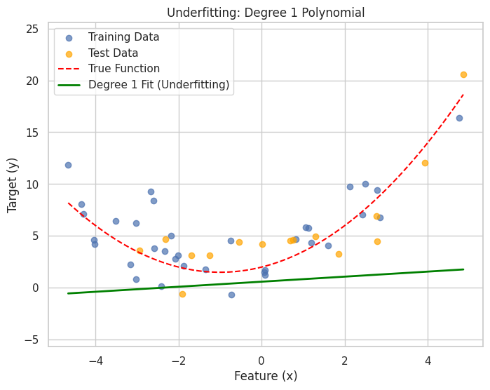
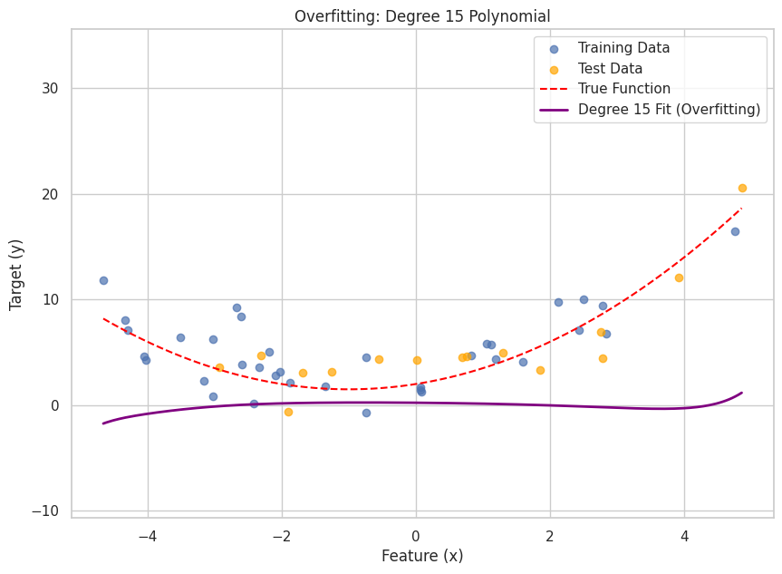
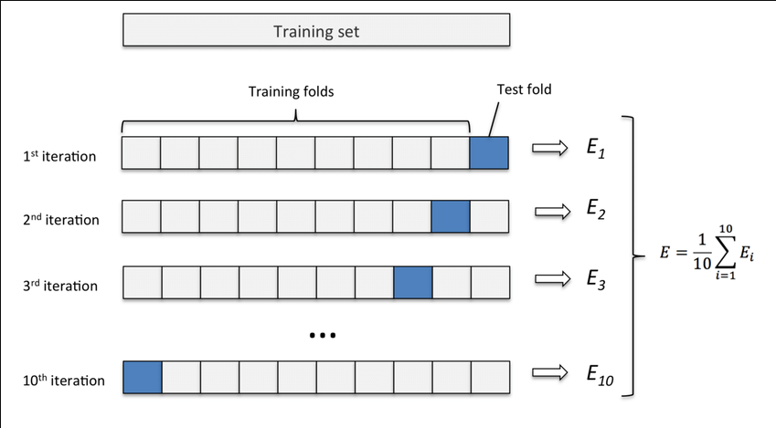

# Model Evaluation & Selection

## Bias-Variance Tradeoff

### Understanding the Core Problem

Imagine you're trying to hit a bullseye on a dartboard. In machine learning, the bullseye represents the true underlying pattern in your data that you want your model to learn. The bias-variance tradeoff describes two different ways your "aim" can be off:

-   **Bias**: Your aim is consistently off in one direction (systematic error)
-   **Variance**: Your aim varies wildly each time you throw (inconsistent predictions)

## 1. The Goal: Generalization 
The ultimate objective of a supervised machine learning model is not merely to perform well on the data it was trained on (training data), but to **generalize** effectively to new, unseen data (test data or real-world data). A model that generalizes well has successfully learned the true underlying patterns in the data, rather than memorizing the training set or fitting to its noise.

Two primary obstacles to achieving good generalization are:
*   **Underfitting (High Bias):** The model is too simple to capture the underlying structure.
*   **Overfitting (High Variance):** The model is too complex and learns the noise in the training data.

### What is Bias? (Underfitting)

**Bias is when your model is too simple to capture the real patterns in your data.**

Think of trying to draw a circle with only straight lines - no matter how hard you try, you'll never capture the true shape because your "tool" (straight lines) is fundamentally inadequate.

#### Real-World Example

Imagine predicting house prices using only the number of bedrooms. Even if you have perfect data, this model will have high bias because house prices depend on many factors (location, size, condition, etc.) that you're ignoring.

#### Signs of High Bias (Underfitting)

-   **Training error is high** - Your model can't even learn the training data well
-   **Test error is high** - And it's roughly the same as training error
-   **The gap between training and test error is small** - Both are just bad
-   **Visual check**: Your model's predictions look overly simple compared to the actual data patterns

#### Common Causes

1.  **Model too simple**: Using linear regression for clearly non-linear data
2.  **Missing important features**: Predicting without key information
3.  **Poor feature engineering**: Not transforming features appropriately
4.  **Over-regularization**: Adding too much penalty that constrains the model excessively

#### Consequences & Visualization
*   An underfit model typically exhibits **poor performance on both the training data and the test data**.
*   It fails to learn the training data well because its capacity is insufficient to represent the data's complexity.
*   **Visualization:** When plotted, an underfit model will show a poor fit to the training data points, clearly missing obvious trends or patterns. The notebook demonstrates this by fitting a low-degree polynomial (e.g., a straight line) to non-linear data.

Fig. Underfitting - Simple model on complex data

### What is Variance? (Overfitting)

**Variance is when your model is too sensitive to the specific training data it sees.**

Think of a student who memorizes textbook examples word-for-word but can't solve new problems. They've learned the training examples "too well" without understanding the underlying concepts.

#### Real-World Example

A model that perfectly memorizes that "John Smith at 123 Main St bought a $300K house" but then predicts every house on Main St costs exactly $300K because John lives there. It's learned noise and coincidences rather than real patterns.

#### Signs of High Variance (Overfitting)

-   **Training error is very low** - Model performs excellently on training data
-   **Test error is much higher** - Big performance drop on new data
-   **Large gap between training and test error** - This gap is the key indicator
-   **Visual check**: Model's predictions are overly complex, fitting every tiny wiggle in the training data

#### Common Causes

1.  **Model too complex**: Using a 15th-degree polynomial when a quadratic would suffice
2.  **Too many features**: Including irrelevant or noisy features
3.  **Too little training data**: Complex model without enough examples to learn properly
4.  **Training too long**: Continuing to train after the model has learned the patterns

#### Consequences & Visualization
*   An overfit model typically achieves **exceptionally good performance on the training data** (very low training error or high accuracy).
*   However, it performs **poorly on new, unseen test data** (high test error or low accuracy) because the "patterns" it learned from the training set's noise do not generalize.
*   **Visualization:** An overfit model will often pass very closely through most or all training data points but may exhibit wild fluctuations or make erratic predictions in regions between or beyond these training points. The notebook demonstrates this by fitting a high-degree polynomial to the data.

Fig. Overfitting - Complex model fitting noise

### The Tradeoff: Why Can't We Have Both Low Bias AND Low Variance?

This is the fundamental tension in machine learning:

#### Increasing Model Complexity

-   ✅ **Reduces Bias**: Model can capture more complex patterns
-   ❌ **Increases Variance**: Model becomes more sensitive to training data specifics

#### Decreasing Model Complexity

-   ❌ **Increases Bias**: Model may become too simple
-   ✅ **Reduces Variance**: Model becomes more stable and generalizable

#### The Mathematical View

Total Error = (Bias)² + Variance + Irreducible Error

-   **Irreducible Error**: The noise that no model can eliminate
-   Our goal: Find the sweet spot that minimizes Bias² + Variance

#### Conceptual Decomposition of Error
The expected squared error of a model's prediction for a new data point can be conceptually decomposed as:

$$\large 
E[\text{Test Error}] = (\text{Bias})^2 + \text{Variance} + \text{Irreducible Error}
$$
*   **$\large (\text{Bias})^2$**: The error stemming from the model's simplifying assumptions being incorrect relative to the true underlying function.
*   **Variance**: The error stemming from the model's sensitivity to the specific training set it was fitted on.
*   **Irreducible Error ($\large \sigma^2$)**: The inherent noise in the data generation process itself or fundamental aspects of the problem that no model, however perfect, can ever predict away.

We aim to minimize $\large (\text{Bias})^2 + \text{Variance}$.

#### Visualizing the Tradeoff
If we plot error against model complexity:
*   Bias typically decreases as model complexity increases.
*   Variance typically increases as model complexity increases.
*   The total error (sum of $\large (\text{Bias})^2$ and Variance, plus irreducible error) often exhibits a U-shaped curve. The optimal model complexity lies at the bottom of this "U," where the sum of squared bias and variance is minimized.

Fig. Bias-Variance Tradeoff U-shaped Curve

### Diagnosing Bias and Variance
Identifying whether a model primarily suffers from high bias or high variance is crucial for determining the most effective strategies for improvement.

#### Comparing Training and Test Error
A simple first diagnostic is to compare the model's error (e.g., MSE for regression, or error rate for classification) on the training set versus a separate test set:

*   **High Bias (Underfitting) Scenario:**
    *   Training Error: High
    *   Test Error: High (and often close to the training error)
    *   *Indication:* The model is too simple and cannot even learn the training data well.

*   **High Variance (Overfitting) Scenario:**
    *   Training Error: Very Low
    *   Test Error: Significantly Higher than training error (large gap)
    *   *Indication:* The model has learned the training data (including noise) too well but fails to generalize.

*   **"Good Fit" Scenario (Ideal):**
    *   Training Error: Low
    *   Test Error: Low (and reasonably close to the training error)
    *   *Indication:* The model has learned the underlying patterns and generalizes well.

## Cross-Validation

Cross-validation is like getting multiple opinions before making an important decision. Instead of relying on a single train-test split to evaluate your model, you create multiple different splits and average the results to get a more reliable assessment.

### Why Do We Need Cross-Validation?

#### The Problem with Single Train-Test Splits

Imagine you're a teacher evaluating a student's performance. Would you rely on just one test, or would you prefer multiple assessments? A single train-test split is like judging a student based on one exam - it might not represent their true ability.

**Problems with single splits:**

-   **Lucky/Unlucky splits**: Your test set might accidentally contain only easy or only hard examples
-   **Data waste**: You're only using a portion of your data for training
-   **Unreliable estimates**: Performance can vary dramatically based on which samples end up in your test set

#### Real-World Example

Consider a spam email classifier trained on 1000 emails:

-   **Single split**: Use 800 for training, 200 for testing
-   **Problem**: What if your test set happens to contain mostly obvious spam (like "URGENT!!! CLICK HERE!!!") or mostly subtle spam? Your accuracy estimate could be artificially high or low.

### K-Fold Cross-Validation

K-Fold CV is like conducting multiple experiments and averaging the results. Here's how it works:

#### The Process
In K-Fold Cross-Validation, the original training dataset is randomly partitioned into $K$ equally (or nearly equally) sized, non-overlapping subsets called "folds." The model is then trained and evaluated $K$ times:

1.  In each iteration $i$ (from $\large 1$ to $K$):
    *   **Validation Fold:** The $i$-th fold is held out as the validation set.
    *   **Training Folds:** The remaining $K-1$ folds are used as the training set.
    *   The model is trained on the training folds and evaluated on the validation fold.
2.  The performance metric (e.g., accuracy, MSE) from each of the $\large K$ validation folds is recorded.
3.  The overall cross-validation performance is typically reported as the **average** of these $\large K$ performance metrics. The standard deviation can also be reported to understand the variability of the performance.

Fig. K-Fold Cross-Validation Diagram

Common choices for $\large K$ are 5 or 10.

#### Algorithm for K-Fold Cross-Validation
1.  Shuffle the dataset randomly (optional, but recommended).
2.  Split the dataset into $\large K$ folds.
3.  Initialize a list to store performance scores from each fold.
4.  **For** $\large i = 1, 2, \dots, K$:
    1.  Select fold $\large i$ as the validation set ($\large \text{Data}_{val}^{(i)}$).
    2.  Use the remaining $\large K-1$ folds as the training set ($\large \text{Data}_{train}^{(i)}$).
    3.  Train a new model instance using $\large \text{Data}_{train}^{(i)}$.
    4.  Evaluate the trained model on $\large \text{Data}_{val}^{(i)}$ and record the performance score (e.g., accuracy $\large A_i$).
    5.  Add $\large A_i$ to the list of scores.
5.  Calculate the average performance: $\large \text{Mean Score} = \frac{1}{K} \sum_{i=1}^{K} A_i$.
6.  (Optional) Calculate the standard deviation of the scores.

#### Advantages & Disadvantages
*   **Advantages:**
    *   Provides a more robust and reliable estimate of model performance compared to a single train-test split, as it uses all data for both training and validation across different iterations.
    *   Reduces the variance of the performance estimate.
*   **Disadvantages:**
    *   Computationally more expensive, as it requires training and evaluating the model $\large K$ times.
    *   Not ideal for time-series data where the temporal order matters (specialized CV techniques exist for time series).
    *   Standard K-Fold might not preserve class proportions in classification, potentially leading to issues with imbalanced datasets (addressed by Stratified K-Fold).

### Stratified K-Fold: Handling Imbalanced Data

#### Motivation (Handling Imbalance) 
In classification tasks, especially when the dataset has imbalanced class distributions (i.e., some classes have significantly fewer samples than others), standard K-Fold CV can lead to problematic splits. It's possible that some validation folds might contain very few or even zero instances of a minority class, making the evaluation for that fold unreliable or even impossible for certain metrics.

#### The Process
**Stratified K-Fold Cross-Validation** addresses this by ensuring that each fold is created by preserving the percentage of samples for each class as observed in the original dataset.
*   For example, if class A makes up 20% of the original dataset and class B makes up 80%, then in each fold of Stratified K-Fold, class A will still make up approximately 20% of the samples in that fold, and class B approximately 80%.
*   This leads to more reliable and representative estimates of model performance for classification tasks, particularly with imbalanced data.

The overall algorithm is similar to K-Fold, but the splitting mechanism ensures stratification based on the class labels.

## Using Cross-Validation

#### For Model Performance Estimation 
The primary use of CV is to get a more stable and unbiased estimate of how well a model is likely to perform on unseen data. The average score across the folds (e.g., mean accuracy or mean F1-score) and its standard deviation give a good indication of the model's expected performance and its consistency.

#### For Hyperparameter Tuning
Cross-validation is the gold standard for hyperparameter tuning (e.g., finding the best learning rate, regularization strength $\alpha$, polynomial degree, SVM kernel parameters like `C` or `gamma`).
The process typically involves:
1.  Defining a grid or range of hyperparameter values to test.
2.  For each combination of hyperparameters:
    a.  Perform K-Fold (or Stratified K-Fold) CV on the training data.
    b.  Calculate the average validation performance for that set of hyperparameters.
3.  Select the hyperparameter combination that yielded the best average validation performance.
4.  **Retrain the model on the *entire* original training dataset** using these chosen best hyperparameters.
5.  Finally, evaluate this retrained model on a completely separate, **held-out test set** (which was not used at all during the CV and hyperparameter tuning process) to get an unbiased estimate of the final model's performance.

This ensures that the hyperparameter selection is not biased by a single, potentially lucky or unlucky, validation split.
