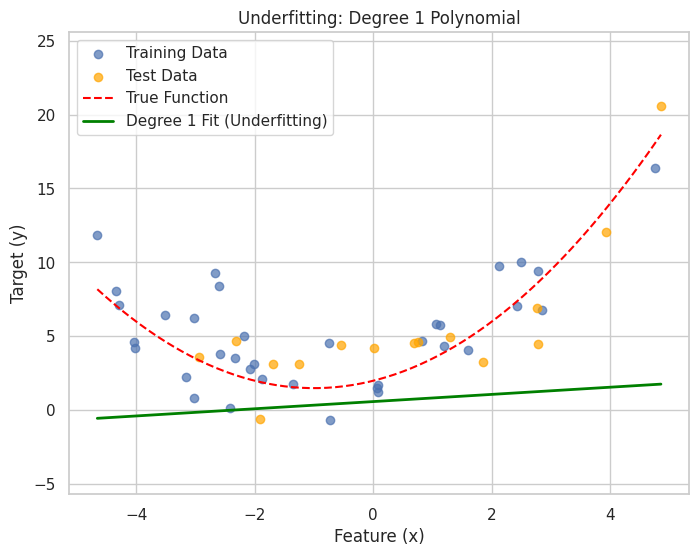
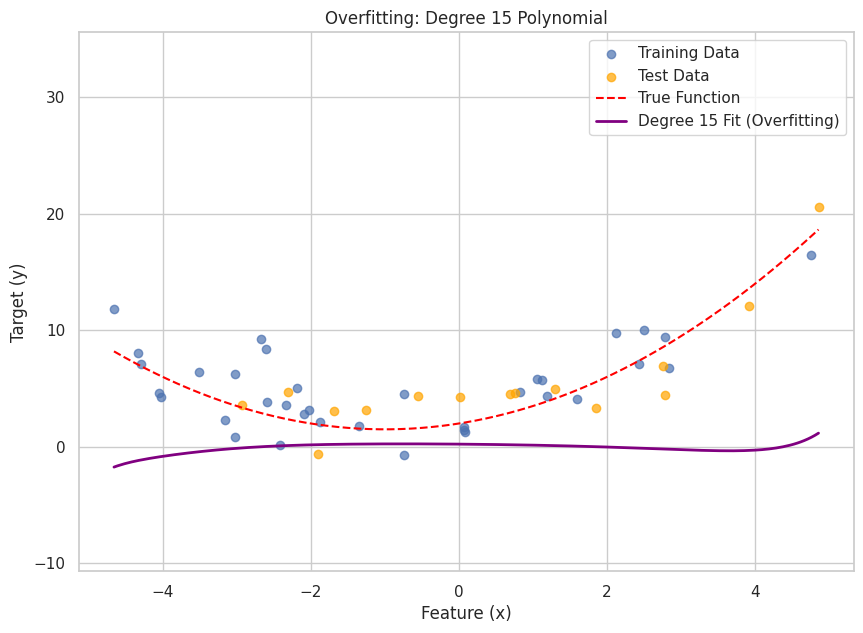
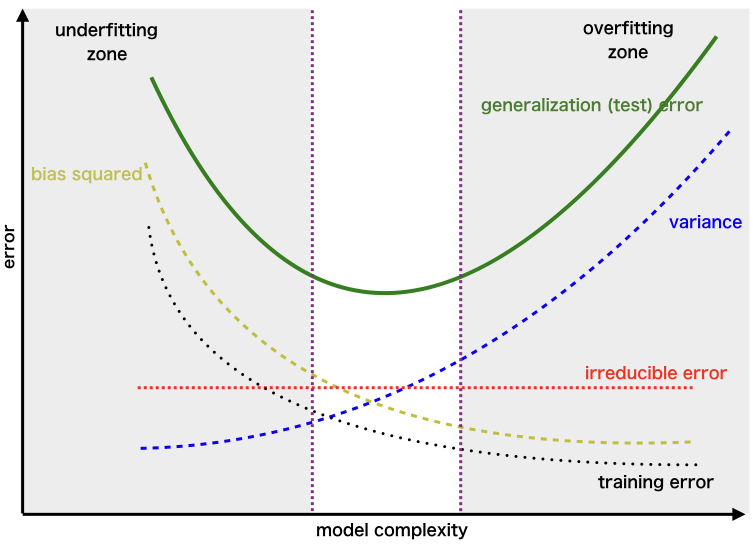
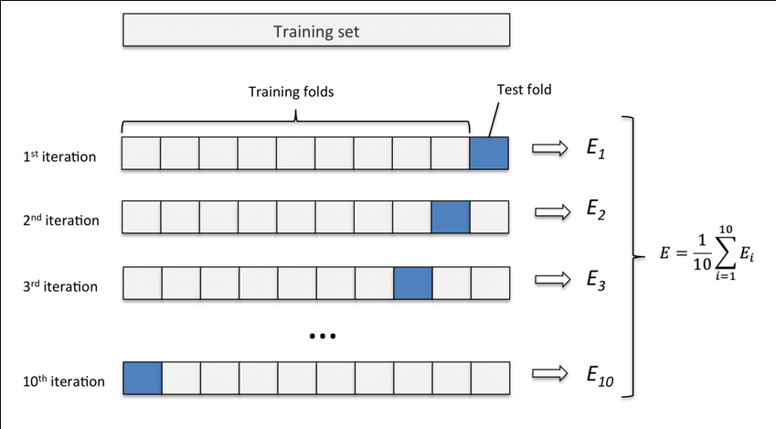

# 03 · Model Evaluation & Selection

A model is only useful if it works on data it has **never seen**. This module is about measuring that honestly: diagnosing under- and overfitting, using cross-validation, tuning hyperparameters, choosing the right metric, and preparing data without leaking information.

> **Notebooks:** [bias_variance](bias_variance.ipynb) · [cross_validation](cross_validation.ipynb) · [hyperparameter_tuning](hyperparameter_tuning.ipynb) · [classification_metrics](classification_metrics.ipynb) · [preprocessing_pipelines](preprocessing_pipelines.ipynb)
>
> **Quick revision:** [CHEATSHEET.md](CHEATSHEET.md)
>
> **Explore in your browser:** [Bias and variance](https://sandeshjung.github.io/Machine-Learning-Foundation/bias-variance.html)

## Contents

1. [Generalisation and the bias–variance trade-off](#1-generalisation-and-the-biasvariance-trade-off)
2. [Cross-validation](#2-cross-validation)
3. [Hyperparameter tuning](#3-hyperparameter-tuning)
4. [Classification metrics](#4-classification-metrics)
5. [Preprocessing, pipelines and data leakage](#5-preprocessing-pipelines-and-data-leakage)

---

## 1. Generalisation and the bias–variance trade-off

The goal is **not** to do well on the training data. The goal is to do well on **new** data, which is called *generalisation*. Two things get in the way.

### 1.1 Bias: the model is too simple (underfitting)

> Like trying to draw a circle using only straight lines: however hard you try, the tool can't represent the shape.

**Example:** predicting house prices from the number of bedrooms alone.

| Signs | Common causes |
|---|---|
| Training error is **high** | The model is too simple, such as a line through curved data |
| Test error is high **and close to** the training error | Important features are missing |
| Predictions look too simple for the data | Too much regularisation |

<p align="center">
  
  <br>
  <em>Underfitting: a simple model misses the obvious curve.</em>
</p>

### 1.2 Variance: the model is too sensitive (overfitting)

> Like a student who memorises the textbook examples word for word but can't solve a new problem.

**Example:** a model that notices one expensive sale on Main Street and decides every house there is expensive.

| Signs | Common causes |
|---|---|
| Training error is **very low** | The model is too complex, such as a degree-15 polynomial |
| Test error is **much higher**: a big gap | Too many noisy or irrelevant features |
| Predictions wiggle through every training point | Too little data, or training too long |

<p align="center">
  
  <br>
  <em>Overfitting: the curve chases the noise.</em>
</p>

### 1.3 The trade-off

```math
\mathbb{E}[\text{test error}] = \text{Bias}^2 + \text{Variance} + \underbrace{\sigma^2}_{\text{irreducible noise}}
```

- Making the model **more complex** lowers bias but raises variance.
- Making it **simpler** lowers variance but raises bias.
- The noise $\sigma^2$ can't be removed by any model.

The best model sits at the bottom of the U-shaped total-error curve.

<p align="center">
  
  <br>
  <em>Bias falls and variance rises as complexity grows; total error is lowest in between.</em>
</p>

### 1.4 Quick diagnosis

| | Training error | Test error | What to do |
|---|---|---|---|
| **High bias** | High | High, close to training | A more complex model, more features, less regularisation |
| **High variance** | Very low | Much higher | More data, a simpler model, more regularisation |
| **Good fit** | Low | Low, close to training | Nothing, ship it |

---

## 2. Cross-validation

### 2.1 Why one train/test split isn't enough

A single split is like judging a student on **one exam**. You might get lucky (an easy test set) or unlucky (a hard one).

For example, take a spam filter tested on 200 emails. If those 200 happen to be mostly obvious "URGENT!!! CLICK HERE" spam, the accuracy looks far better than it really is.

Cross-validation repeats the split several times and **averages** the results.

### 2.2 K-fold cross-validation

1. Shuffle the data and split it into $K$ equal **folds** (usually $K = 5$ or $10$).
2. For each fold $i = 1, \dots, K$:
   - train a fresh model on the other $K - 1$ folds
   - evaluate it on fold $i$
3. Report the **mean** score, and the **standard deviation** to show how stable it is.

<p align="center">
  
  <br>
  <em>Every sample is used for validation exactly once, and for training K − 1 times.</em>
</p>

| ✅ Pros | ❌ Cons |
|---|---|
| A much more reliable estimate than one split | $K$ times the training cost |
| Every sample is used for both training and validation | Plain K-fold ignores time order and class balance |

### 2.3 Stratified k-fold

With imbalanced classes, a random fold might contain **almost none** of the rare class. **Stratified** k-fold keeps the class proportions the same in every fold. If 20 % of the samples are class A, every fold is about 20 % class A.

> [!TIP]
> Use `StratifiedKFold` for classification by default. For time series, use `TimeSeriesSplit`, which always trains on the past and tests on the future. When samples come in groups (several rows per patient), use `GroupKFold`.

---

## 3. Hyperparameter tuning

**Parameters** are learned during training (the weights). **Hyperparameters** are chosen *before* training: `C`, `gamma`, the tree depth, the learning rate, $\alpha$, …

### 3.1 The workflow

1. Split off a **test set** and lock it away.
2. On the remaining training data, try many hyperparameter settings. Score each with **cross-validation**.
3. Pick the best setting and **retrain on all the training data**.
4. Evaluate **once** on the test set.

> [!WARNING]
> If you choose hyperparameters by looking at the test score, the test score is no longer an honest estimate. It's been "used up".

### 3.2 Search strategies

| Strategy | How it works | When to use |
|---|---|---|
| **Grid search** (`GridSearchCV`) | Tries every combination in a grid | Few hyperparameters, small grids |
| **Random search** (`RandomizedSearchCV`) | Samples $n$ random combinations from distributions | Many hyperparameters. Usually finds as good a result much faster |
| Successive halving (`HalvingGridSearchCV`) | Gives many candidates a small budget, then keeps the best | Expensive models |
| Bayesian optimisation (e.g. Optuna) | Uses past results to choose the next setting to try | Very expensive models |

The [hyperparameter_tuning](hyperparameter_tuning.ipynb) notebook tunes an SVM with grid search and random search, and compares their scores and run times.

> [!TIP]
> Search **scale** parameters (`C`, `gamma`, $\alpha$, the learning rate) on a **log scale**, for example `np.logspace(-3, 3, 7)`.

---

## 4. Classification metrics

### 4.1 The confusion matrix

Every threshold-based metric comes from four counts:

| | Predicted negative | Predicted positive |
|---|---|---|
| **Actually negative** | True negative (TN) | False positive (FP), a "false alarm" |
| **Actually positive** | False negative (FN), a "miss" | True positive (TP) |

| Metric | Formula | Answers the question |
|---|---|---|
| Accuracy | $\frac{TP + TN}{\text{all}}$ | How often is it right overall? |
| **Precision** | $\frac{TP}{TP + FP}$ | When it says "positive", how often is it right? |
| **Recall** (TPR, sensitivity) | $\frac{TP}{TP + FN}$ | Of all the real positives, how many did it find? |
| Specificity (TNR) | $\frac{TN}{TN + FP}$ | Of all the real negatives, how many did it clear? |
| False positive rate | $\frac{FP}{FP + TN} = 1 - \text{TNR}$ | How often does it raise a false alarm? |
| **F1** | $\frac{2 \cdot P \cdot R}{P + R}$ | The balance of precision and recall |

The general $F_\beta$ score lets you choose the balance:

```math
F_\beta = (1 + \beta^2)\,\frac{P \cdot R}{\beta^2 P + R}
```

Use $\beta > 1$ when misses are worse (medical screening), and $\beta < 1$ when false alarms are worse (spam filtering).

### 4.2 The accuracy trap

With 95 % negatives, a model that **always says "negative"** scores 95 % accuracy and is completely useless. With imbalanced data, use instead:

- **Balanced accuracy** $= \frac{1}{2}(\text{TPR} + \text{TNR})$
- **Matthews correlation coefficient** (MCC), which ranges from −1 to 1, with 0 for random guessing:

```math
\text{MCC} = \frac{TP \cdot TN - FP \cdot FN}{\sqrt{(TP + FP)(TP + FN)(TN + FP)(TN + FN)}}
```

- **Precision, recall and F1 of the minority class**, plus the confusion matrix itself.

### 4.3 ROC curve and AUC

Most classifiers output a **score**, and a threshold turns it into a yes/no decision. Sweeping the threshold from high to low traces the **ROC curve**: TPR on the y-axis against FPR on the x-axis.

The **area under it (AUC)** summarises it in one number with a neat meaning:

> **AUC = the probability that a random positive gets a higher score than a random negative.**

- 0.5 is random guessing, and 1.0 is perfect.
- It measures **ranking** only. It doesn't care about the threshold or whether the probabilities are calibrated.
- Formally it equals the normalised Mann–Whitney U statistic:

```math
\text{AUC} = \frac{\sum_{i \in \text{pos}} \text{rank}(s_i) - \frac{n_+(n_+ + 1)}{2}}{n_+ \, n_-}
```

### 4.4 Precision–recall curve and average precision

When positives are rare, the ROC curve can look **too optimistic**, because the FPR divides by the huge number of negatives. The **precision–recall curve** ignores true negatives and focuses on the positive class. It's summarised by **average precision**:

```math
\text{AP} = \sum_k (R_k - R_{k-1})\, P_k
```

> [!IMPORTANT]
> A random classifier's AP equals the **fraction of positives**, not 0.5. With 2 % positives, an AP of 0.30 is actually a big improvement.

### 4.5 Choosing the threshold

The default threshold of 0.5 is only right when both kinds of error cost the same. If a miss costs $c_{FN}$ and a false alarm costs $c_{FP}$, the expected cost is lowest when you predict positive above:

```math
t^* = \frac{c_{FP}}{c_{FP} + c_{FN}}
```

For example, if a miss is 9 times worse than a false alarm, $t^* = 0.1$. You can also pick the threshold that maximises $F_\beta$ on **validation** data, never on test data.

### 4.6 Handling class imbalance

| Technique | What it does | Side effect |
|---|---|---|
| **Move the threshold** | Keep the model, just lower the cut-off | None. AUC and AP stay the same |
| **Class weights** | Weight each class's loss by $\frac{n}{K\, n_c}$ (`class_weight="balanced"`) | Probabilities shift towards the minority class |
| **Resampling** (training set only) | Oversample the minority, undersample the majority, or use SMOTE | Same: re-calibrate afterwards |

### 4.7 Calibration

A model is **calibrated** if its probabilities can be taken literally: of all the samples it scores 0.8, about 80 % really are positive.

- **Check it** with a **reliability diagram**: bin the predictions, then plot the actual positive rate against the mean prediction in each bin. The diagonal is perfect calibration.
- **Score it** with the **Brier score** $\frac{1}{n}\sum (\hat{p}_i - y_i)^2$ or the log loss. Lower is better for both.
- **Fix it** with `CalibratedClassifierCV`, using either **Platt scaling** (fits a sigmoid) or **isotonic regression** (fits a monotone step function, which needs more data).

Logistic regression is usually well calibrated. Naive Bayes, SVMs, boosted trees and re-weighted models often aren't.

### 4.8 More than two classes

Per-class scores are combined by:

- **macro** averaging: every class counts equally
- **weighted** averaging: classes are weighted by their size
- **micro** averaging: pool all the TP, FP and FN first. For single-label problems this equals accuracy.

---

## 5. Preprocessing, pipelines and data leakage

### 5.1 Missing values

*Why* data is missing decides how to handle it:

| Type | Meaning | Example | Treatment |
|---|---|---|---|
| **MCAR**: missing completely at random | Unrelated to anything | A sensor randomly drops readings | Dropping or simple imputation is fine |
| **MAR**: missing at random | Depends on *other observed* columns | Older records lack a field | Impute using other features, add a missing indicator |
| **MNAR**: missing not at random | Depends on the *missing value itself* | High earners skip the income question | The gap is informative, so add indicators and model it |

**Imputers:**

- **mean**, which is sensitive to outliers
- **median**, which is robust
- **most frequent**, for categories
- **KNN** or **iterative** imputation, which uses the other features

Some models, such as `HistGradientBoosting`, handle `NaN` natively.

### 5.2 Encoding categories

| Encoding | Use for | Notes |
|---|---|---|
| **One-hot** | Unordered categories (colour, city) | Set `handle_unknown="ignore"` so new categories don't crash at prediction time |
| **Ordinal** | Ordered categories (small < medium < large) | Give the order **explicitly**, because alphabetical order is meaningless |
| **Target encoding** | Categories with very many levels (zip codes) | Replace each level with a smoothed mean of the target, and **cross-fit** it |

Target encoding shrinks rare levels towards the overall mean $\bar{y}$:

```math
\text{enc}(c) = \frac{n_c\,\bar{y}_c + m\,\bar{y}}{n_c + m}
```

> [!WARNING]
> Without cross-fitting, each row's own label leaks into its encoded feature, and the model learns to cheat.

### 5.3 Scaling numeric features

| Method | Formula | Use when |
|---|---|---|
| **Standardisation** | $\frac{x - \mu}{\sigma}$ | The default for k-NN, SVM, k-means, regularised linear models and neural networks |
| Min–max | $\frac{x - \min}{\max - \min}$ | You need a bounded range. Sensitive to outliers |
| Robust | $\frac{x - \text{median}}{\text{IQR}}$ | The data has outliers |
| Log / Box–Cox / Yeo–Johnson | — | Skewed features or targets |

Tree-based models don't need scaling at all.

### 5.4 Feature engineering

Good features often help more than switching to a fancier model. Some ideas:

- ratios (price per square metre) and differences (age = current year − build year)
- date parts (month, weekday, hour, holiday)
- group aggregates (a customer's average spend)
- interactions and polynomial terms

### 5.5 Data leakage and pipelines

**Data leakage** happens when information from the validation or test data, or from the future, sneaks into training. Scores look great in development and collapse in production.

**Common causes:**

- fitting a scaler, imputer, encoder or feature selector on the **whole** dataset before splitting
- target encoding without cross-fitting
- random splits of **time-series** data
- the same customer or patient appearing on both sides of a split
- features that only exist **after** the event you're predicting

**The fix is a `Pipeline`.** Bundle every preprocessing step together with the model, using a `ColumnTransformer` to send each column type to its own steps:

```python
preprocess = ColumnTransformer([
    ("num", make_pipeline(SimpleImputer(strategy="median"), StandardScaler()), numeric_cols),
    ("cat", OneHotEncoder(handle_unknown="ignore"), categorical_cols),
])
model = make_pipeline(preprocess, LogisticRegression())

cross_val_score(model, X_train, y_train, cv=5)   # preprocessing is refit inside every fold
```

Now cross-validation refits **all** the preprocessing on each training fold, so the validation fold stays truly unseen. The same object is then used for training, testing and production.
