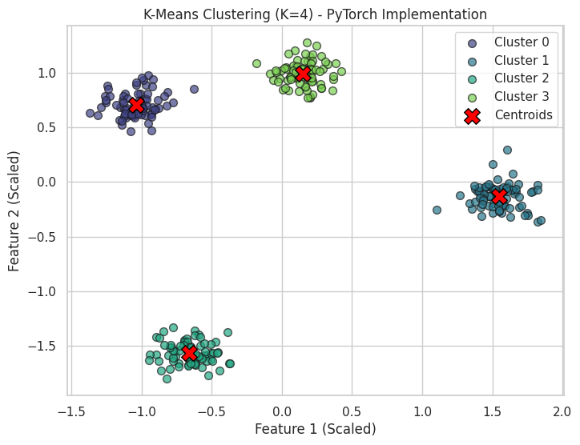
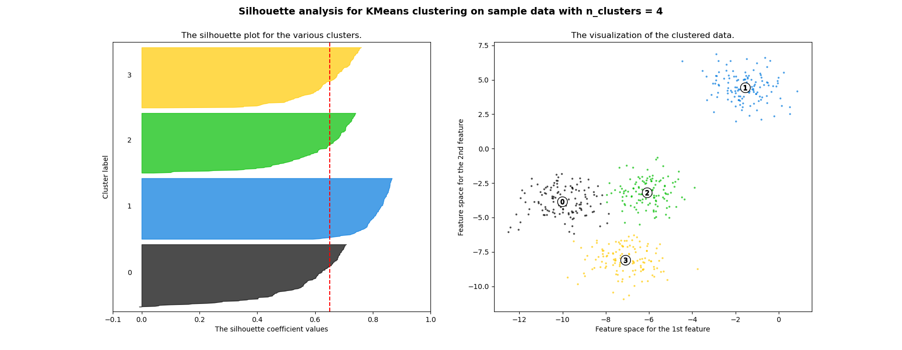
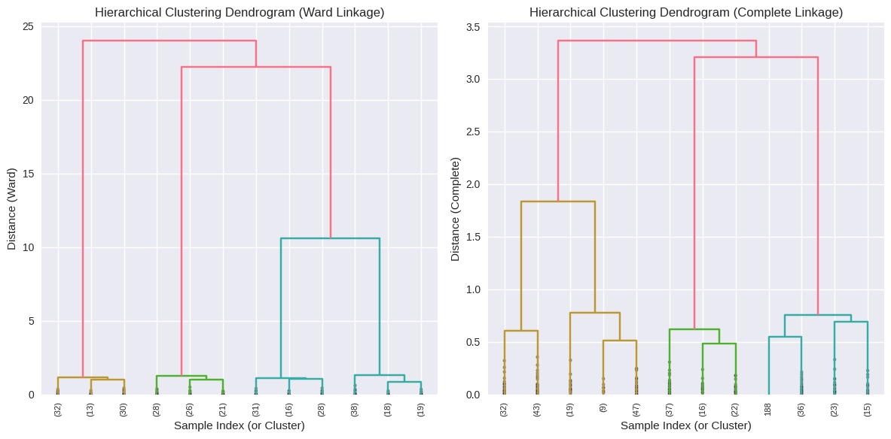
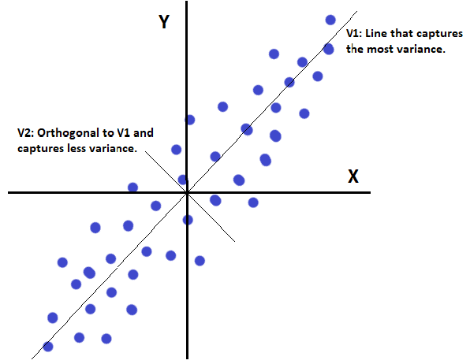
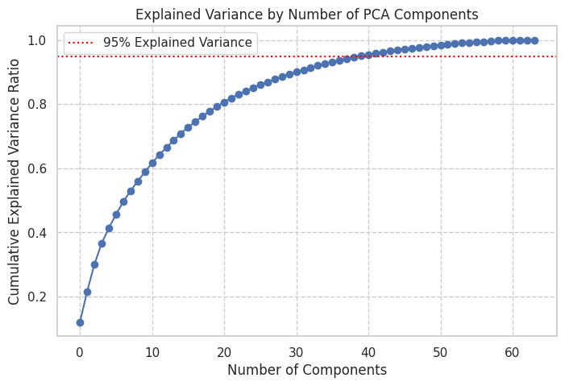

# Unsupervised Learning

**Unsupervised learning** is a branch of machine learning where algorithms learn patterns from data that has not been labeled, classified, or categorized. Unlike supervised learning, there are no explicit target outputs provided during training. The goal is to infer the natural structure present within the data.

## Clustering (K-Means & Hierarchical)

**Clustering** is a primary task in unsupervised learning. It involves partitioning a set of data points into a number of groups (clusters) such that:
*   Data points within the same cluster are highly similar to each other.
*   Data points in different clusters are dissimilar.
Similarity is typically measured using a distance metric (e.g., Euclidean distance).

### K-Means Clustering 

#### Concept and Goal

K-Means is a **partitioning clustering** algorithm. It aims to partition $N$ data points into $\large K$ distinct, non-overlapping clusters, where $\large K$ is a user-specified parameter. Each cluster is characterized by its **centroid** (mean of the points in that cluster). The goal is to minimize the **within-cluster sum of squares (WCSS)**, also known as inertia:

$$\large 
\text{WCSS} = \sum_{k=1}^{K} \sum_{\mathbf{x}_i \in C_k} \|\mathbf{x}_i - \mathbf{\mu}_k\|^2
$$

Where $\large C_k$ is the $\large k$-th cluster and $\large \mathbf{\mu}_k$ is its centroid.

#### Algorithm Steps
K-Means is an iterative algorithm:
1.  **Initialization:** Choose $\large K$ initial cluster centroids. This can be done by:
    *   Randomly selecting $\large K$ data points from the dataset.
    *   Using a more sophisticated method like K-Means++ (aims for better initial placement).
2.  **Assignment Step:** Assign each data point $\large \mathbf{x}_i$ to the cluster whose centroid $\large \mathbf{\mu}_k$ is closest (e.g., using Euclidean distance).

    

    
    %20=%20\frac{1}{2m}%20\sum_{i=1}^{m}%20(h_{\mathbf{\theta}}(\mathbf{x}%27^{(i)})%20-%20y^{(i)})^2%20+%20\alpha%20\sum_{j=1}^{n}%20\theta_j^2)

    

3.  **Update Step:** Recalculate the centroid of each cluster as the mean of all data points assigned to it in the previous step.
    
    

    

    

    Where $\large |C_k|$ is the number of points in cluster $\large C_k$.
4.  **Convergence:** Repeat steps 2 and 3 until the cluster assignments no longer change, the centroids no longer change significantly (below a tolerance), or a maximum number of iterations is reached.

Fig.  K-Means Iteration - Showing points re-assigning and centroids moving

#### Initialization of Centroids
*   **Random Initialization:** Simple but can sometimes lead to poor convergence or suboptimal clusters if initial centroids are poorly placed. Running K-Means multiple times with different random initializations and choosing the best result (lowest WCSS) is common.
*   **K-Means++:** A smarter initialization technique that aims to spread out the initial centroids, often leading to better and more consistent results.

#### Choosing the Number of Clusters (K)
Choosing the optimal $\large K$ is a common challenge. Two popular heuristic methods are:
*   **Elbow Method:**
    1.  Run K-Means for a range of $K$ values (e.g., $\large K=1$ to $\large 10$).
    2.  For each $\large K$, calculate the WCSS.
    3.  Plot WCSS against $\large K$.
    4.  Look for an "elbow" point in the plot: the point where adding another cluster does not significantly decrease WCSS. This point is often considered a good indication of $\large K$.
    
    

    
    
Fig. K-Means Elbow Method Plot - WCSS vs K

    

*   **Silhouette Analysis:**
    1.  For each data point, the silhouette coefficient measures how similar it is to its own cluster compared to other, neighboring clusters.
    2.  It ranges from -1 (poorly clustered) to +1 (densely clustered), with 0 indicating overlapping clusters.
    3.  Calculate the average silhouette score for different values of $K$. The $K$ that maximizes the average silhouette score is often chosen.

    

    
    
Fig. Silhouette Plot for K-Means

    

#### Advantages & Disadvantages
*   **Advantages:**
    *   Relatively simple to understand and implement.
    *   Computationally efficient for large datasets (scales well with the number of samples, often linear in $\large N$).
    *   Often converges quickly.
*   **Disadvantages:**
    *   Requires the number of clusters $\large K$ to be specified beforehand.
    *   Sensitive to the initial placement of centroids; can converge to local optima. (Run multiple times with different initializations).
    *   Assumes clusters are spherical, equally sized, and have similar densities, which may not hold for all datasets. Struggles with clusters of arbitrary shapes or varying densities.
    *   Sensitive to outliers, as they can pull centroids.

### Hierarchical Clustering

#### Concept (Agglomerative vs. Divisive)
Hierarchical clustering creates a hierarchy of clusters, often represented as a tree-like diagram called a **dendrogram**. There are two main approaches:
*   **Agglomerative (Bottom-Up):** Starts with each data point as its own individual cluster. In each step, the two closest clusters are merged until all points belong to a single cluster or a stopping criterion is met. This is the more common approach.
*   **Divisive (Top-Down):** Starts with all data points in a single cluster. In each step, a cluster is split into smaller clusters until each point is in its own cluster or a stopping criterion is met.

#### Agglomerative Algorithm Steps
1.  **Initialization:** Treat each data point as a singleton cluster.
2.  **Compute Proximity Matrix:** Calculate the pairwise distances (or similarities) between all initial clusters (points).
3.  **Merge Closest Clusters:** Find the two closest (most similar) clusters based on a chosen **linkage criterion** and merge them to form a new, larger cluster.
4.  **Update Proximity Matrix:** Update the distances between the new cluster and all other existing clusters.
5.  **Repeat:** Repeat steps 3 and 4 until all data points are merged into a single cluster or a desired number of clusters is achieved.

#### Linkage Criteria
The linkage criterion defines how the distance between two clusters (each potentially containing multiple points) is measured:
*   **Single Linkage:** The distance between two clusters is the minimum distance between any two points, one from each cluster. Can lead to "chaining" effect where clusters are elongated.
*   **Complete Linkage:** The distance between two clusters is the maximum distance between any two points, one from each cluster. Tends to produce more compact, spherical clusters.
*   **Average Linkage:** The distance between two clusters is the average distance between all pairs of points (one from each cluster). A compromise between single and complete linkage.
*   **Ward's Method:** Merges clusters such that the increase in the total within-cluster sum of squares (WCSS) is minimized. Tends to produce compact, roughly equal-sized clusters. Often a good default choice.

#### Dendrograms
A **dendrogram** is a tree diagram that visualizes the hierarchical clustering process.
*   The leaves of the tree are the individual data points.
*   Internal nodes represent merged clusters.
*   The height of the branches (or the y-axis) typically represents the distance (or dissimilarity) at which clusters were merged.
*   By "cutting" the dendrogram horizontally at a certain height (distance threshold), we can obtain a specific number of flat clusters.

Fig. Example Dendrogram - Showing cluster merges and cutting

#### Advantages & Disadvantages 
*   **Advantages:**
    *   Does not require the number of clusters $\large K$ to be specified beforehand; the dendrogram provides a view of clusterings at all levels of granularity.
    *   Can capture nested cluster structures.
    *   The dendrogram is a useful visualization of the data's structure.
*   **Disadvantages:**
    *   Computationally expensive, especially for large datasets (typically $\large O(N^2 \log N)$ or $\large O(N^3)$ for $\large N$ samples, depending on the implementation and linkage).
    *   The choice of linkage criterion and distance metric can significantly impact the results.
    *   Merges are irreversible; once a merge is made, it cannot be undone, which can lead to suboptimal clusterings if an early merge was poor.
    *   Can be sensitive to noise and outliers.

## Dimensionality Reduction (PCA & t-SNE)

Dimensionality reduction is the process of transforming data from a high-dimensional space into a lower-dimensional space such that some meaningful properties of the original data are ideally preserved.

### Why Reduce Dimensions?
*   **Visualization:** Humans can typically only visualize data in 2D or 3D. Reducing high-dimensional data to these dimensions allows for visual exploration and pattern discovery.
*   **Computational Efficiency:** Fewer dimensions mean less computation for subsequent algorithms (e.g., faster model training, less memory).
*   **Noise Reduction:** Removing less informative or noisy dimensions can sometimes improve the performance of learning algorithms.
*   **Overcoming the "Curse of Dimensionality":** In very high-dimensional spaces, data points tend to become sparse, and distances between points can become less meaningful. This can make it harder for algorithms to learn effectively. Dimensionality reduction can help mitigate this.
*   **Feature Compression/Storage:** Reduced dimensions require less storage space.

### Principal Component Analysis (PCA)

#$## Goal and Concept
PCA is a **linear dimensionality reduction** technique that aims to transform the original set of (possibly correlated) features into a new set of uncorrelated features called **principal components**. These principal components are ordered such that the first few components capture the maximum possible variance (spread) in the original data.
The idea is to find the directions (principal axes) in the feature space along which the data varies the most. By projecting the data onto a lower-dimensional subspace formed by the top principal components, we can reduce dimensionality while retaining most of the original data's variance.

Fig.  PCA Illustration - Data points with principal component axes

#### Mathematical Intuition (Covariance, Eigenvectors, SVD) 
1.  **Covariance Matrix:** PCA is closely related to the covariance matrix of the data. The covariance matrix describes the relationships and variances between pairs of features.
2.  **Eigen-decomposition of Covariance Matrix:** The principal components are the eigenvectors of the data's covariance matrix. The corresponding eigenvalues indicate the amount of variance captured by each principal component (eigenvector). Larger eigenvalues correspond to directions of greater variance.
3.  **Singular Value Decomposition (SVD):** PCA can also be efficiently performed using SVD on the (centered) data matrix $\large \mathbf{X}$. If $\large \mathbf{X} = \mathbf{U}\mathbf{S}\mathbf{V}^T$:
    *   The columns of $\large \mathbf{V}$ are the principal components (eigenvectors of $\large \mathbf{X}^T\mathbf{X}$, related to eigenvectors of covariance matrix).
    *   The singular values in $\large \mathbf{S}$ are related to the eigenvalues; specifically, $\large \text{eigenvalue}_i = \frac{s_i^2}{N-1}$ (for sample covariance), where $\large s_i$ is the $\large i$-th singular value and $\large N$ is the number of samples.

#### Algorithm Steps (via SVD)
1.  **Center the Data:** For each feature, subtract its mean from all its values. This ensures that the first principal component describes the direction of maximum variance around the origin. (Often, data is also scaled to unit variance before PCA, e.g., using `StandardScaler`).
2.  **Compute SVD:** Perform Singular Value Decomposition on the centered data matrix $\large \mathbf{X}_{centered}$:

$$\large
\mathbf{X}_{centered} = \mathbf{U} \mathbf{\Sigma} \mathbf{V}^T
$$

3.  **Select Principal Components:** The columns of $\large \mathbf{V}$ (or rows of $\large \mathbf{V}^T$) are the principal components (directions). Select the first $\large k$ columns of $\large \mathbf{V}$ (denoted $\large \mathbf{V}_k$) corresponding to the $\large k$ largest singular values.
4.  **Project Data:** Transform the centered data onto the new $\large k$-dimensional subspace:

The resulting $\large \mathbf{X}_{pca}$ is the data reduced to $\large k$ dimensions.

#### Choosing the Number of Components (Explained Variance)
A key decision in PCA is how many principal components ($\large k$) to keep. This is often determined by looking at the **cumulative explained variance ratio**.
*   The explained variance ratio for each component tells us the proportion of the dataset's variance that lies along that component.
*   By plotting the cumulative sum of these ratios, we can see how much total variance is captured as we add more components.
*   A common heuristic is to choose $\large k$ such that, for example, 95% or 99% of the total variance is retained.

Fig.  PCA Explained Variance Plot - Cumulative variance vs. number of components

#### Advantages & Disadvantages
*   **Advantages:**
    *   Simple, fast, and deterministic.
    *   Reduces dimensionality while preserving as much variance as possible.
    *   Resulting components are orthogonal (uncorrelated), which can be beneficial for some downstream algorithms.
    *   Useful for noise reduction and data compression.
*   **Disadvantages:**
    *   Assumes linear relationships and focuses on directions of high variance. May miss important non-linear structures.
    *   Sensitive to feature scaling; features with larger scales can dominate the principal components if not scaled.
    *   Principal components can be less interpretable than original features, as they are linear combinations of them.
    *   Being variance-focused, it might discard components with low variance that could still be important for classification tasks (if class separability lies in low-variance directions).

### t-distributed Stochastic Neighbor Embedding (t-SNE)

#### Goal and Concept (Visualization)
t-SNE is a non-linear dimensionality reduction technique primarily used for **visualizing high-dimensional datasets in low-dimensional space (typically 2D or 3D)**. Its main goal is to preserve the **local structure** of the data, meaning that points that are close to each other in the high-dimensional space should also be close to each other in the low-dimensional embedding.

#### High-Level Intuition
1.  **High-Dimensional Similarities:** t-SNE models pairwise similarities between high-dimensional data points as conditional probabilities. Specifically, it calculates the probability $\large p_{j|i}$ that point $\large \mathbf{x}_i$ would pick point $\large \mathbf{x}_j$ as its neighbor if neighbors were chosen in proportion to their probability density under a Gaussian centered at $\large \mathbf{x}_i$. The variance of this Gaussian is determined based on a user-defined parameter called **perplexity**.
2.  **Low-Dimensional Similarities:** It then models pairwise similarities between the corresponding low-dimensional embedding points $\large \mathbf{y}_i$ and $\large \mathbf{y}_j$ using a Student's t-distribution (with one degree of freedom, which is a Cauchy distribution). The t-distribution has heavier tails than a Gaussian, which helps to alleviate the "crowding problem" (where points tend to clump together in the center of the low-D map) and allows dissimilar points to be placed further apart.
3.  **Minimizing Divergence:** t-SNE then optimizes the positions of the low-dimensional points  by minimizing the Kullback-Leibler (KL) divergence between the joint probability distribution derived from high-D similarities (%20/%202N)) and the joint probability distribution derived from low-D similarities ($\large Q_{ij}$).

#### Key Characteristics and Interpretation
*   **Preserves Local Structure Well:** Excellent at revealing clusters and local groupings present in the high-dimensional data.
*   **Global Structure Not Always Preserved:** The relative sizes of clusters, the distances *between* distinct clusters, and the overall global geometry of the data in the t-SNE plot are often **not meaningful**. Do not interpret these aspects too literally.
*   **Visualization Tool:** Primarily for visual exploration, not for dimensionality reduction as a pre-processing step for other ML algorithms (PCA is usually better for that).
*   **Stochastic:** It's an iterative optimization process, and different runs (even with the same hyperparameters) can produce slightly different embeddings. It's good practice to run it multiple times.
*   **Computationally Intensive:** Can be slow for very large datasets.

#### Important Hyperparameters (`perplexity`, `n_iter`, etc.)
*   **`perplexity`:** Loosely related to the number of nearest neighbors that are considered for each point. Typical values are between 5 and 50. It influences the balance between local and global aspects of the data. Different perplexity values can reveal different structures.
*   **`n_iter`:** Number of optimization iterations. t-SNE needs to run for enough iterations to converge to a good solution (e.g., at least 250, often 1000 or more).
*   **`learning_rate`:** Controls the step size in the optimization. (In `sklearn.manifold.TSNE`, `learning_rate='auto'` is available from version 1.1).
*   **`init`:** Initialization method for the low-dimensional embedding (e.g., `'random'` or `'pca'`). PCA initialization can sometimes lead to more stable and globally consistent results.

#### PCA vs. t-SNE
| Feature            | PCA                                          | t-SNE                                                |
|--------------------|----------------------------------------------|------------------------------------------------------|
| **Type**           | Linear                                       | Non-linear                                           |
| **Goal**           | Maximize variance, preserve global structure | Preserve local structure, visualization            |
| **Determinism**    | Deterministic                                | Stochastic (results can vary slightly)             |
| **Computation**    | Fast (SVD)                                   | Slow, especially for large N                         |
| **Parameters**     | Number of components                         | Perplexity, iterations, learning rate, etc.          |
| **Output Use**     | Pre-processing, noise reduction, compression | Primarily visualization, exploring cluster structure |
| **Interpretability** | Components can be analyzed (linear combos)   | Axes in plot have no direct global meaning       |

It's often beneficial to use PCA to reduce dimensions to an intermediate level (e.g., 30-50) before applying t-SNE, especially for very high-dimensional datasets. This can speed up t-SNE and sometimes improve the quality of the visualization by pre-filtering some noise.
