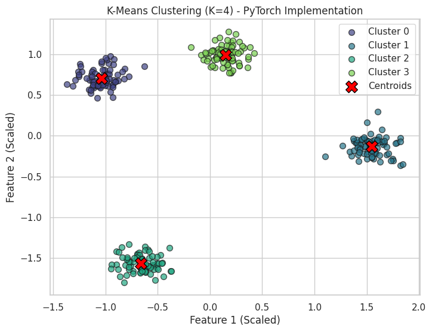
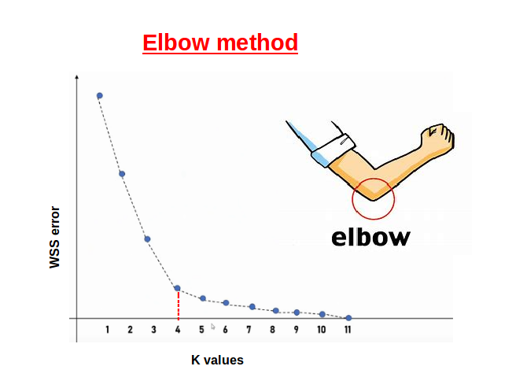
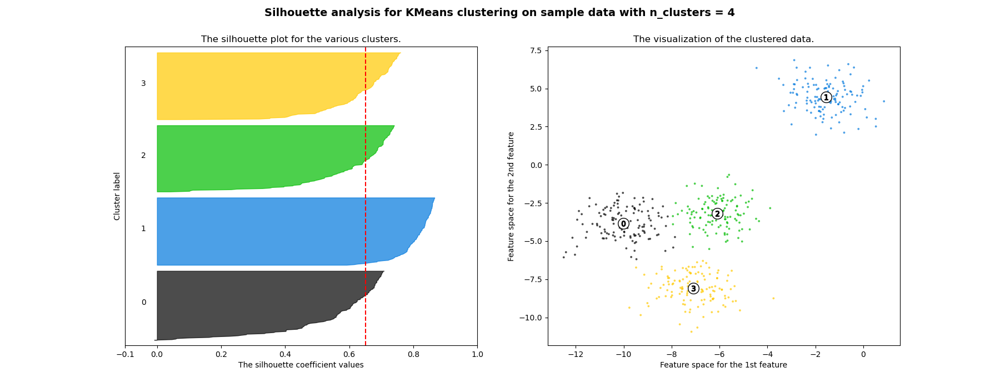
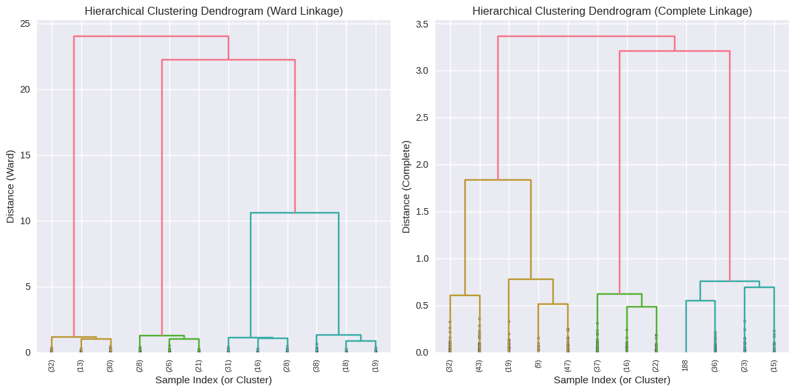
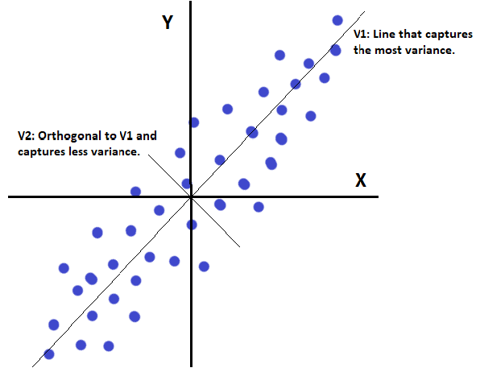
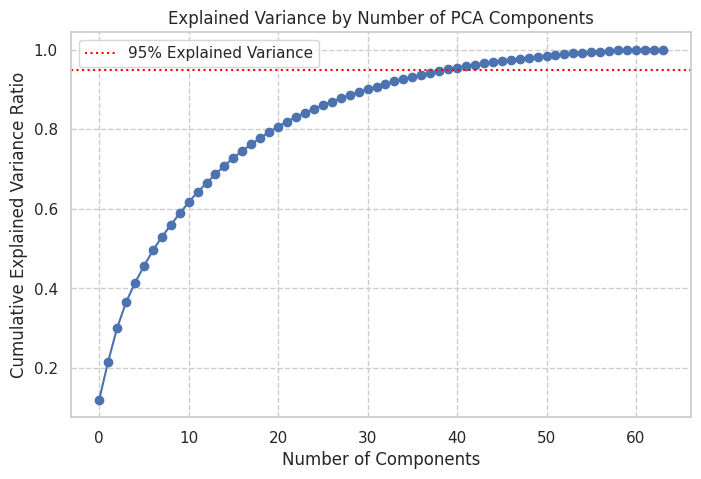

# 04 · Unsupervised Learning

In unsupervised learning there are **no labels**. The algorithm has to find structure in the data on its own. This module covers the two most common tasks:

- **clustering**: which points belong together?
- **dimensionality reduction**: can the data be described with fewer numbers?

> **Notebooks:** [kmeans_hierarchical](kmeans_hierarchical.ipynb) · [pca_tsne](pca_tsne.ipynb)
>
> **Quick revision:** [CHEATSHEET.md](CHEATSHEET.md)

## Contents

1. [K-means clustering](#1-k-means-clustering)
2. [Hierarchical clustering](#2-hierarchical-clustering)
3. [Principal component analysis (PCA)](#3-principal-component-analysis-pca)
4. [t-SNE](#4-t-sne)
5. [PCA vs t-SNE](#5-pca-vs-t-sne)

---

## 1. K-means clustering

**Clustering** splits the data into groups, so that points in the same group are similar and points in different groups are not. "Similar" usually means close together in Euclidean distance.

### 1.1 The goal

K-means splits $N$ points into $K$ clusters. Each cluster is represented by its **centroid**, the mean of its points. It tries to make the clusters as tight as possible, which means minimising the **within-cluster sum of squares** (WCSS, also called *inertia*):

```math
\text{WCSS} = \sum_{k=1}^{K} \sum_{\mathbf{x}_i \in C_k} \lVert \mathbf{x}_i - \boldsymbol{\mu}_k \rVert^2
```

### 1.2 The algorithm

1. **Initialise** $K$ centroids, either as random data points or with **k-means++**.
2. **Assign** each point to its nearest centroid:

```math
c_i = \arg\min_k \lVert \mathbf{x}_i - \boldsymbol{\mu}_k \rVert^2
```

3. **Update** each centroid to the mean of its assigned points:

```math
\boldsymbol{\mu}_k = \frac{1}{|C_k|} \sum_{\mathbf{x}_i \in C_k} \mathbf{x}_i
```

4. **Repeat** steps 2–3 until the assignments stop changing.

Both steps can only lower the WCSS, so the algorithm always converges. It may converge to a **local** optimum, though.

<p align="center">
  
  <br>
  <em>The four clusters and centroids (red crosses) found by the from-scratch PyTorch implementation.</em>
</p>

### 1.3 Initialisation

- **Random:** simple, but a bad start can give poor clusters. Run it several times (`n_init`) and keep the result with the lowest WCSS.
- **k-means++:** picks starting centroids that are far apart. It's more reliable, and it's the scikit-learn default.

### 1.4 Choosing K

**Elbow method.** Plot the WCSS for $K = 1, 2, \dots, 10$. The WCSS always falls as $K$ grows. Look for the "elbow", where adding another cluster stops helping much.

<p align="center">
  
  <br>
  <em>The curve bends at K = 4: beyond that, extra clusters give little improvement.</em>
</p>

**Silhouette score.** For each point, compare $a$, its mean distance to its **own** cluster, with $b$, its mean distance to the **nearest other** cluster:

```math
s = \frac{b - a}{\max(a, b)} \in [-1, 1]
```

- Close to **+1**: the point sits well inside its cluster.
- Close to **0**: it's on the border between two clusters.
- **Negative**: it's probably in the wrong cluster.

Choose the $K$ with the highest **average** silhouette.

<p align="center">
  
  <br>
  <em>Silhouette plot for K = 4. Each band is a cluster; the red line is the average score.</em>
</p>

### 1.5 Strengths and weaknesses

| ✅ Strengths | ❌ Weaknesses |
|---|---|
| Simple and fast, roughly linear in $N$ | You must choose $K$ in advance |
| Scales to large datasets | Results depend on the initialisation (local optima) |
| Easy to interpret (centroids) | Assumes round clusters of similar size and density |
| | Outliers pull the centroids |

> [!TIP]
> **Scale the features** before running k-means, because it's based on distances. For non-round clusters, try DBSCAN or Gaussian mixture models.

---

## 2. Hierarchical clustering

### 2.1 The idea

Instead of one flat set of clusters, hierarchical clustering builds a **whole tree** of clusters, from single points up to one big cluster.

- **Agglomerative** (bottom-up, the usual choice): start with every point on its own, then keep **merging the two closest clusters**.
- **Divisive** (top-down): start with one cluster and keep **splitting**.

### 2.2 The agglomerative algorithm

1. Make every point its own cluster.
2. Compute the distances between all pairs of clusters.
3. Merge the closest pair.
4. Update the distances, and repeat until a single cluster remains.

### 2.3 Linkage: what "distance between clusters" means

| Linkage | Distance between clusters A and B | Tends to produce |
|---|---|---|
| Single | The **closest** pair of points | Long, chained clusters |
| Complete | The **farthest** pair of points | Compact, round clusters |
| Average | The **average** over all pairs | A compromise |
| **Ward** | The increase in WCSS if A and B merge | Compact, similar-sized clusters. A good default |

### 2.4 Dendrograms

A **dendrogram** draws the merge history as a tree:

- the leaves are the data points
- the height of each join is the distance at which the two clusters merged
- **cutting** the tree with a horizontal line gives flat clusters. A higher cut gives fewer clusters.

<p align="center">
  
  <br>
  <em>A dendrogram. Long vertical lines before a merge suggest well-separated clusters.</em>
</p>

### 2.5 Strengths and weaknesses

| ✅ Strengths | ❌ Weaknesses |
|---|---|
| No need to fix $K$ in advance | Slow: $O(N^2)$ memory and $O(N^2 \log N)$ to $O(N^3)$ time |
| Shows structure at every level of detail | The results depend on the linkage and distance chosen |
| The dendrogram is a useful picture of the data | A merge can never be undone |

---

## 3. Principal component analysis (PCA)

### 3.1 Why reduce dimensions?

- **Visualisation:** we can only look at 2-D or 3-D data.
- **Speed and memory:** fewer features make every later step cheaper.
- **Noise reduction:** small, noisy directions get dropped.
- **The curse of dimensionality:** in many dimensions, data is sparse and distances lose meaning.

### 3.2 The idea

PCA finds new axes, the **principal components**, that point in the directions where the data **varies the most**:

- the 1st component is the direction of greatest variance
- the 2nd is perpendicular to the 1st and captures the next most variance, and so on

Keeping only the first $k$ components gives a $k$-dimensional summary that loses as little variance as possible.

<p align="center">
  
  <br>
  <em>V1 follows the long direction of the data; V2 is perpendicular and captures much less variance.</em>
</p>

### 3.3 The maths

The principal components are the **eigenvectors of the covariance matrix**. Each eigenvalue is the variance along its component.

In practice PCA is computed with the **SVD** of the centred data matrix, which is faster and more stable:

```math
X_{\text{centred}} = U \Sigma V^\top
```

- The **rows of $V^\top$** (equivalently, the columns of $V$) are the principal components.
- The variance along component $i$ is $\lambda_i = \frac{s_i^2}{N - 1}$, where $s_i$ is the $i$-th singular value.

### 3.4 The algorithm

1. **Centre** the data by subtracting each feature's mean. Usually also **standardise** it, otherwise large-scale features dominate.
2. Compute the **SVD**: $X_{\text{centred}} = U\Sigma V^\top$.
3. Keep the first $k$ components, $V_k$.
4. **Project** the data:

```math
X_{\text{PCA}} = X_{\text{centred}}\, V_k
```

The notebook implements this in PyTorch and checks it against `sklearn.decomposition.PCA`.

### 3.5 How many components?

Look at the **cumulative explained variance**: the fraction of the total variance captured by the first $k$ components. A common rule is to keep enough components for **95 %** of the variance.

<p align="center">
  
  <br>
  <em>Cumulative explained variance. Pick k where the curve crosses your target (e.g. 95 %).</em>
</p>

### 3.6 Strengths and weaknesses

| ✅ Strengths | ❌ Weaknesses |
|---|---|
| Fast, simple, and gives the same answer every time | Only finds **linear** structure |
| The components are uncorrelated | Sensitive to feature scaling |
| Good for compression and denoising | The components are mixes of features, so they're harder to interpret |
| Can transform new data, so it works as a preprocessing step | High variance isn't always what matters: a useful signal may sit in a low-variance direction |

---

## 4. t-SNE

### 4.1 The goal

t-SNE (t-distributed Stochastic Neighbour Embedding) is a **non-linear** method built for **visualising** high-dimensional data in 2-D or 3-D. It tries to keep **neighbours together**: points close in the original space should stay close in the plot.

### 4.2 How it works

1. **Similarities in the original space.** Around each point $\mathbf{x}_i$, place a Gaussian. The probability $p_{j \mid i}$ that $\mathbf{x}_i$ "picks" $\mathbf{x}_j$ as a neighbour is proportional to that Gaussian. The Gaussian's width is set by the **perplexity**. These are symmetrised into $p_{ij} = \frac{p_{j \mid i} + p_{i \mid j}}{2N}$.
2. **Similarities in the plot.** Measure similarities $q_{ij}$ between the 2-D points with a **Student-t** distribution, which has heavier tails than a Gaussian. The heavy tails let dissimilar points spread out, which avoids the "crowding problem".
3. **Match the two.** Move the 2-D points to minimise the KL divergence $\text{KL}(P \parallel Q)$ by gradient descent.

### 4.3 Reading a t-SNE plot

> [!WARNING]
> t-SNE keeps **local** structure but not **global** structure. **Cluster sizes** and **distances between clusters** in the plot mean very little. Don't read them literally.

- It's great for **spotting clusters**.
- It's **random**: different runs give different pictures, so run it a few times.
- It's **slow** for large $N$.
- It's for **looking**, not for preprocessing. It can't transform new points; use PCA for that.

### 4.4 Hyperparameters

| Parameter | What it does | Typical values |
|---|---|---|
| `perplexity` | Roughly the number of neighbours each point considers | 5–50. Try a few, because different values reveal different structure |
| `max_iter` | Number of optimisation steps (called `n_iter` before scikit-learn 1.5) | ≥ 1000 |
| `learning_rate` | Step size | `"auto"` |
| `init` | Starting layout | `"pca"`, which is more stable than `"random"` |

The notebook has a slider for the perplexity.

---

## 5. PCA vs t-SNE

| | PCA | t-SNE |
|---|---|---|
| Type | Linear | Non-linear |
| Preserves | Global structure (variance) | Local structure (neighbours) |
| Deterministic | ✅ Yes | ❌ No, results vary between runs |
| Speed | Fast | Slow |
| Can transform new data | ✅ Yes | ❌ No |
| Main use | Preprocessing, compression, denoising | Visualisation, exploring clusters |
| Plot axes mean something | ✅ Yes: linear combinations of features | ❌ No |

> [!TIP]
> For very high-dimensional data (images, embeddings), first reduce to about 50 dimensions with **PCA**, then run **t-SNE**. It's much faster and often cleaner.
