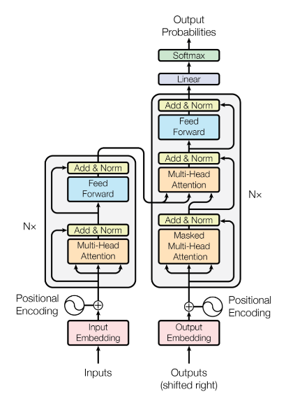
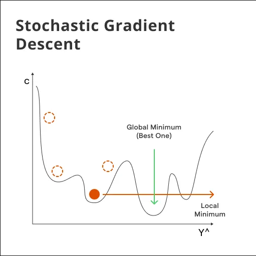
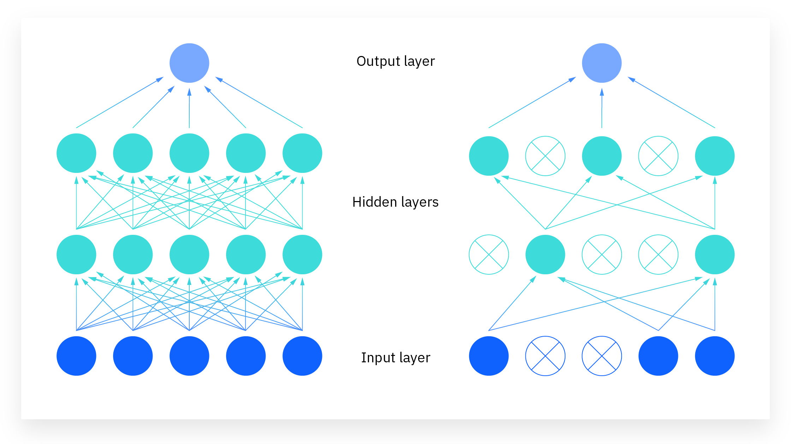

# Neural Networks & Deep Learning

## Multi-Layer Perceptrons (MLPs)
A Multi-Layer Perceptron (MLP) is a fundamental type of **feedforward artificial neural network**. It is characterized by having one or more **hidden layers** of neurons between its input and output layers, allowing it to learn non-linear relationships in data.

#### Basic Structure
An MLP typically consists of:
*   **Input Layer:** Receives the raw input features.
*   **One or More Hidden Layers:** These layers perform intermediate computations. Each neuron in a hidden layer typically applies a linear transformation to the outputs of the previous layer, followed by a non-linear **activation function**.
*   **Output Layer:** Produces the final output of the network (e.g., class probabilities for classification, a continuous value for regression). It also usually involves a linear transformation and an optional activation function suitable for the task.

<div align="center">

<p>Fig. Basic MLP Structure Diagram - Input, Hidden, Output Layers</p>
</div>

**3-Layer MLP Architecture:**

-   **Input Layer:** $\large \mathbf{x} \in \mathbb{R}^{n_{input}}$
-   **Hidden Layer 1:** $\large n_1$ neurons with tanh activation
-   **Hidden Layer 2:** $\large n_2$ neurons with tanh activation
-   **Output Layer:** $\large n_{classes}$ neurons with softmax activation

**Mathematical Representation:** 

$$\large 
\mathbf{z}^{(1)} = \mathbf{x} \mathbf{W}^{(1)} + \mathbf{b}^{(1)}, \quad \mathbf{a}^{(1)} = \tanh(\mathbf{z}^{(1)})$$ $$\mathbf{z}^{(2)} = \mathbf{a}^{(1)} \mathbf{W}^{(2)} + \mathbf{b}^{(2)}, \quad \mathbf{a}^{(2)} = \tanh(\mathbf{z}^{(2)})$$ $$\mathbf{z}^{(3)} = \mathbf{a}^{(2)} \mathbf{W}^{(3)} + \mathbf{b}^{(3)}, \quad \mathbf{p} = \text{softmax}(\mathbf{z}^{(3)})
$$

#### Feedforward Operation
During the forward pass, data flows from the input layer, through the hidden layers, to the output layer. At each neuron in a hidden or output layer:
1.  A weighted sum of its inputs (outputs from the previous layer) plus a bias term is calculated. This is the **linear transformation** or **pre-activation** ($z$).
    For a neuron $\large j$ in layer $\large l$, receiving inputs $\large a_i^{(l-1)}$ from layer $\large l-1$:

$$\large 
z_j^{(l)} = \sum_i w_{ji}^{(l)} a_i^{(l-1)} + b_j^{(l)}
$$

In matrix form for all neurons in layer $\large l$: $\large \mathbf{z}^{(l)} = \mathbf{W}^{(l)} \mathbf{a}^{(l-1)} + \mathbf{b}^{(l)}$
2.  This sum $\large z_j^{(l)}$ is then passed through a non-linear **activation function** $\large g(\cdot)$ to produce the neuron's output $\large a_j^{(l)}$:

$$\large 
a_j^{(l)} = g(z_j^{(l)})
$$

### Key Components for a "Scratch" MLP
To build an MLP from scratch, we need to define:

#### Parameters (Weights and Biases)
*   **Weights ($\large W$):** Represent the strength of connections between neurons in successive layers. $\large W^{(l)}$ is the weight matrix connecting layer $\large l-1$ to layer $\large l$.
*   **Biases ($\large b$):** An additional parameter for each neuron (except input neurons) that allows the activation function to be shifted. $\large b^{(l)}$ is the bias vector for layer $\large l$.
These are the parameters the network learns during training.

#### Activation Functions (e.g., Hyperbolic Tangent) & Their Derivatives
Activation functions introduce non-linearity, enabling MLPs to learn complex patterns.
**Function:** 

$$\large 
\tanh(z) = \frac{e^z - e^{-z}}{e^z + e^{-z}} = \frac{e^{2z} - 1}{e^{2z} + 1}
$$

**Properties:**

-   Range: $\large (-1, 1)$
-   Zero-centered (unlike sigmoid)
-   Symmetric around origin

**Derivative:** 

$$\large 
\frac{d}{dz}\tanh(z) = 1 - \tanh^2(z)
$$

**Proof:** 

$$\large 
\frac{d}{dz}\tanh(z) = \frac{d}{dz}\left(\frac{e^z - e^{-z}}{e^z + e^{-z}}\right) = \frac{(e^z + e^{-z})^2 - (e^z - e^{-z})^2}{(e^z + e^{-z})^2} = 1 - \tanh^2(z)
$$

The derivative of the activation function is crucial for backpropagation.

#### Loss Function (e.g., Binary Cross-Entropy) & Its Derivative
The loss function measures the discrepancy between the network's predictions and the true target values.
*   **Binary Cross-Entropy (BCE) Loss (for binary classification):**

$$\large 
L = -\frac{1}{m} \sum_{i=1}^{m} [y^{(i)} \log(a_{out}^{(i)}) + (1-y^{(i)}) \log(1 - a_{out}^{(i)})]
$$

where $\large a_{out}$ is the output activation (predicted probability from the final sigmoid).
*   **Derivative of BCE Loss w.r.t. $a_{out}$:** Needed for backpropagation.

$$\large 
\frac{\partial L}{\partial a_{out}} = \frac{a_{out} - y}{a_{out}(1 - a_{out})}
$$ 

(for a single sample)


### The Forward Pass
This involves propagating the input data through the network, layer by layer, applying linear transformations and activation functions, until the final output is produced.


### Algorithm for Forward Pass 
Given input batch $\large \mathbf{X}$, weights $\large \mathbf{W}^{(1)}, \mathbf{W}^{(2)}$, biases $\large \mathbf{b}^{(1)}, \mathbf{b}^{(2)}$, and activation function $\large \tanh(\cdot)$:
**Layer 1:** 

$$\large 
\mathbf{Z}^{(1)} = \mathbf{X} \mathbf{W}^{(1)} + \mathbf{b}^{(1)} \in \mathbb{R}^{m \times n_1}
$$

$$\large 
\mathbf{A}^{(1)} = \tanh(\mathbf{Z}^{(1)}) \in \mathbb{R}^{m \times n_1}
$$

**Layer 2:** 

$$\large 
\mathbf{Z}^{(2)} = \mathbf{A}^{(1)} \mathbf{W}^{(2)} + \mathbf{b}^{(2)} \in \mathbb{R}^{m \times n_2}
$$

$$\large 
\mathbf{A}^{(2)} = \tanh(\mathbf{Z}^{(2)}) \in \mathbb{R}^{m \times n_2}
$$

**Output Layer:** 

$$\large 
\mathbf{Z}^{(3)} = \mathbf{A}^{(2)} \mathbf{W}^{(3)} + \mathbf{b}^{(3)} \in \mathbb{R}^{m \times n_{classes}}
$$

$$\large 
\mathbf{P} = \text{softmax}(\mathbf{Z}^{(3)}) \in \mathbb{R}^{m \times n_{classes}}
$$

Where $\large m$ is the batch size.

### Backpropagation
Backpropagation is an algorithm for efficiently computing the gradients of the loss function with respect to all the weights and biases in the network. It relies on the **chain rule** from calculus.

#### The Chain Rule
If $\large L$ is a function of $\large a$, $\large a$ is a function of $\large z$, and $\large z$ is a function of $\large w$, then $\large \frac{\partial L}{\partial w} = \frac{\partial L}{\partial a} \cdot \frac{\partial a}{\partial z} \cdot \frac{\partial z}{\partial w}$. Backpropagation systematically applies this rule layer by layer, starting from the output layer and moving backward.

### Algorithm (Conceptual Steps for a 3-Layer MLP) 
Let $\large L$ be the loss, $\large a^{(2)}$ the output activation, $\large z^{(2)}$ the output pre-activation, $\large a^{(1)}$ the hidden activation, $\large z^{(1)}$ the hidden pre-activation, and $\large \mathbf{X}$ the input.
Let $\large g'(\cdot)$ be the derivative of the activation function.

#### Output Layer Gradients

**Softmax + Cross-Entropy Gradient (Elegant Result):** For the gradient w.r.t. output logits: 

$$\large 
\frac{\partial \mathcal{L}}{\partial z_j^{(3)}} = p_j - \mathbf{1}_{j=y}
$$

Where $\large \mathbf{1}_{j=y}$ is 1 if $\large j$ is the true class, 0 otherwise.

**In matrix form for the batch:** 

$$\large 
\frac{\partial J}{\partial \mathbf{Z}^{(3)}} = \frac{1}{m}(\mathbf{P} - \mathbf{Y}_{one_hot})
$$


**Weight and Bias Gradients:** 

$$\large 
\frac{\partial J}{\partial \mathbf{W}^{(3)}} = (\mathbf{A}^{(2)})^T \frac{\partial J}{\partial \mathbf{Z}^{(3)}}
$$

$$\large 
\frac{\partial J}{\partial \mathbf{b}^{(3)}} = \sum_{i=1}^{m} \frac{\partial J}{\partial \mathbf{Z}^{(3)}}
$$

#### Hidden Layer 2 Gradients

**Error Propagation:** 

$$\large 
\frac{\partial J}{\partial \mathbf{A}^{(2)}} = \frac{\partial J}{\partial \mathbf{Z}^{(3)}} (\mathbf{W}^{(3)})^T
$$

**Tanh Derivative Application:** 

$$\large 
\frac{\partial J}{\partial \mathbf{Z}^{(2)}} = \frac{\partial J}{\partial \mathbf{A}^{(2)}} \odot (1 - (\mathbf{A}^{(2)})^2)
$$

**In your code:** `dL_dZ2 = dL_dA2 * (1 - A2**2)`

**Weight and Bias Gradients:** 

$$\large 
\frac{\partial J}{\partial \mathbf{W}^{(2)}} = (\mathbf{A}^{(1)})^T \frac{\partial J}{\partial \mathbf{Z}^{(2)}}
$$

$$\large 
\frac{\partial J}{\partial \mathbf{b}^{(2)}} = \sum_{i=1}^{m} \frac{\partial J}{\partial \mathbf{Z}^{(2)}}
$$

#### Hidden Layer 1 Gradients

**Error Propagation:** 

$$\large 
\frac{\partial J}{\partial \mathbf{A}^{(1)}} = \frac{\partial J}{\partial \mathbf{Z}^{(2)}} (\mathbf{W}^{(2)})^T
$$

**Tanh Derivative Application:** 

$$\large 
\frac{\partial J}{\partial \mathbf{Z}^{(1)}} = \frac{\partial J}{\partial \mathbf{A}^{(1)}} \odot (1 - (\mathbf{A}^{(1)})^2)
$$

**Weight and Bias Gradients:** 

$$\large 
\frac{\partial J}{\partial \mathbf{W}^{(1)}} = \mathbf{X}^T \frac{\partial J}{\partial \mathbf{Z}^{(1)}}
$$ 

$$\large 
\frac{\partial J}{\partial \mathbf{b}^{(1)}} = \sum_{i=1}^{m} \frac{\partial J}{\partial \mathbf{Z}^{(1)}}
$$

<div align="center">

<p>Fig. Backpropagation Flow Diagram - Showing error signals flowing backward</p>
</div>

### Gradient Descent for Parameter Updates
Once the gradients are computed via backpropagation, parameters are updated using Gradient Descent (or its variants):
**Learning Rate:** $\large \alpha = 0.1$

$$\large 
\mathbf{W}^{(l)} \leftarrow \mathbf{W}^{(l)} - \eta \frac{\partial L}{\partial \mathbf{W}^{(l)}}
$$

$$\large 
\mathbf{b}^{(l)} \leftarrow \mathbf{b}^{(l)} - \eta \frac{\partial L}{\partial \mathbf{b}^{(l)}}
$$

Where $\large \eta$ is the learning rate.

### Why Backpropagation Works?

#### Theoretical Foundation

1.  **Universal Approximation Theorem:** MLPs with sufficient hidden units can approximate any continuous function on a compact set.
    
2.  **Gradient-Based Optimization:** Backpropagation provides exact gradients, enabling efficient optimization via gradient descent.
    
3.  **Error Signal Propagation:** The algorithm efficiently distributes the error signal from the output back through all parameters.
    

#### Intuitive Understanding

-   **Forward pass:** Information flows forward to make predictions
-   **Backward pass:** Error information flows backward to update parameters
-   **Learning:** Parameters adjust to minimize the difference between predictions and targets

### Key Mathematical Properties

#### Vanishing Gradient Problem

For deep networks with sigmoid activations: 

$$\large 
|\sigma'(z)| \leq 0.25
$$

This can cause gradients to vanish exponentially in deep networks: 

$$\large 
\left|\frac{\partial J}{\partial \mathbf{W}^{(1)}}\right| \propto \prod_{l=2}^{L} |\mathbf{W}^{(l)}| \cdot |\sigma'(\mathbf{z}^{(l)})|
$$

#### Weight Initialization

Proper initialization is crucial. For sigmoid networks, Xavier initialization: 

$$\large 
W_{ij} \sim \mathcal{N}\left(0, \frac{1}{n_{in}}\right)
$$

Where $\large n_{in}$ is the number of input connections to the neuron.

This mathematical framework provides the complete foundation for understanding and implementing MLPs with backpropagation from first principles.

## Convolutional Neural Networks (CNNs)

### Introduction to CNNs

#### Why CNNs for Images?

Traditional Multi-Layer Perceptrons (MLPs) face significant challenges when processing images:

**High Dimensionality Problem:**

-   A small 32×32 RGB image has 32 × 32 × 3 = 3,072 pixels
-   Flattening this creates a vector of length 3,072
-   The first hidden layer with 100 neurons would require 3,072 × 100 = 307,200 parameters
-   For realistic images (224×224×3), this becomes 224 × 224 × 3 × 100 = 15,052,800 parameters in just the first layer!

**Spatial Structure Loss:**

-   MLPs treat each pixel independently
-   They ignore the crucial spatial relationships between neighboring pixels
-   A vertical edge at position (i,j) is fundamentally the same feature as a vertical edge at position (i+10,j+10)

CNNs solve these problems through three key principles:

1.  **Local Connectivity** (Sparse Interactions)
2.  **Parameter Sharing** (Weight Sharing)
3.  **Translation Equivariance**

### Mathematical Foundations

#### Convolution Operation

The discrete 2D convolution operation between an input image $\large \mathbf{I}$ and a kernel $\large \mathbf{K}$ is defined as:

$$\large 
(\mathbf{I} * \mathbf{K})[i,j] = \sum_m \sum_n \mathbf{I}[m,n] \times \mathbf{K}[i-m, j-n]
$$

More commonly implemented as cross-correlation (which is what most deep learning frameworks use):

$$\large 
(\mathbf{I} * \mathbf{K})[i,j] = \sum_m \sum_n \mathbf{I}[i+m, j+n] \times \mathbf{K}[m,n]
$$

<div align="center">

<p>Fig. Convolution Operation in CNN</p>
</div>

#### Output Size Calculation

For a convolution operation, the output size is calculated as:

$$\large 
H_{out} = \left\lfloor \frac{H_{in} + 2P - K_h}{S} \right\rfloor + 1
$$

$$\large 
W_{out} = \left\lfloor \frac{W_{in} + 2P - K_w}{S} \right\rfloor + 1
$$

Where:

-   $\large H_{in}, W_{in}$ = input height and width
-   $\large P$ = padding
-   $\large K_h, K_w$ = kernel height and width
-   $\large S$ = stride
-   $\large \lfloor \cdot \rfloor$ = floor function

#### Parameter Count

For a convolutional layer:

$$\large 
\text{Parameters} = (K_h \times K_w \times C_{in} \times C_{out}) + C_{out}
$$

The $\large +C_{out}$ term accounts for bias parameters (one per output channel).

### Core CNN Components

#### Convolutional Layer

**Mathematical Definition:** For input tensor $\large \mathbf{X} \in \mathbb{R}^{N \times C_{in} \times H_{in} \times W_{in}}$ and learnable weights $\large \mathbf{W} \in \mathbb{R}^{C_{out} \times C_{in} \times K_h \times K_w}$:

$$\large 
\mathbf{Y}[n,c_{out},h,w] = b[c_{out}] + \sum_{c_{in}} \sum_{k_h} \sum_{k_w} \mathbf{X}[n, c_{in}, h \cdot s + k_h, w \cdot s + k_w] \times \mathbf{W}[c_{out}, c_{in}, k_h, k_w]
$$

Where:

-   $\large N$ = batch size
-   $\large C_{in}, C_{out}$ = input/output channels
-   $\large H_{in}, W_{in}$ = input height/width
-   $\large K_h, K_w$ = kernel height/width
-   $\large s$ = stride
-   $\large b$ = bias vector

**Key Properties:**

-   **Local Connectivity:** Each output neuron connects only to a local region of the input (typically $\large 3 \times 3$ or $\large 5 \times 5$ pixels)
-   **Parameter Sharing:** The same kernel weights are used across all spatial locations, dramatically reducing parameters
-   **Translation Equivariance:** If the input is shifted, the output is shifted by the same amount: $\large f(T(\mathbf{x})) = T(f(\mathbf{x}))$

<div align="center">

<p>Fig. Convolutional Neural Networks (CNNs) and Layer Types</p>
</div>

#### Activation Functions

<div align="center">

<p>Fig. Activation Functions</p>
</div>

**ReLU (Rectified Linear Unit):**

$$\large 
\text{ReLU}(x) = \max(0, x) = \begin{cases} x & \text{if } x > 0 \ 0 & \text{if } x \leq 0 \end{cases}
$$

**Mathematical Properties:**

-   Introduces non-linearity: $\large f(\alpha \mathbf{x} + \beta \mathbf{y}) \neq \alpha f(\mathbf{x}) + \beta f(\mathbf{y})$
-   Derivative: $\large \frac{d}{dx}\text{ReLU}(x) = \begin{cases} 1 & \text{if } x > 0 \ 0 & \text{if } x \leq 0 \end{cases}$
-   Computationally efficient and helps mitigate vanishing gradients

#### Pooling Layers

**Max Pooling:** For a $\large 2 \times 2$ max pooling with stride 2:

$$\large 
\text{MaxPool}(\mathbf{X})[i,j] = \max{\mathbf{X}[2i, 2j], \mathbf{X}[2i, 2j+1], \mathbf{X}[2i+1, 2j], \mathbf{X}[2i+1, 2j+1]}
$$

**Average Pooling:**

$$\large 
\text{AvgPool}(\mathbf{X})[i,j] = \frac{1}{4}\sum_{p=0}^{1}\sum_{q=0}^{1} \mathbf{X}[2i+p, 2j+q]
$$

**General Pooling Formula:** For kernel size $\large k \times k$:

$$\large 
\text{Pool}(\mathbf{X})[i,j] = \text{PoolOp}{\mathbf{X}[si+p, sj+q] : 0 \leq p,q < k}
$$

Where $\large s$ is the stride and $\large \text{PoolOp}$ is either $\large \max$ or average.

### CNN Architecture Principles

#### Typical CNN Architecture Pattern

A standard CNN follows this pattern:

$$\large 
\text{INPUT} \rightarrow [\text{CONV} \rightarrow \text{ACTIVATION} \rightarrow \text{POOL}]^N \rightarrow [\text{FC} \rightarrow \text{ACTIVATION}]^M \rightarrow \text{OUTPUT}
$$

#### Receptive Field Analysis

The **receptive field** is the region in the input image that influences a particular neuron's output.

**Recursive Formula:**

$$\large 
RF_{l+1} = RF_l + (k_l - 1) \times \prod_{i=1}^{l} s_i
$$

$$\large 
J_{l+1} = J_l \times s_{l+1}
$$

Where:

-   $\large RF_l$ = receptive field size at layer $\large l$
-   $\large k_l$ = kernel size at layer $\large l$
-   $\large s_i$ = stride at layer $\large i$
-   $\large J_l$ = jump (distance between receptive field centers) at layer $\large l$

### Mathematical Analysis of Information Flow

#### Tensor Transformations

Consider an input image of size $\large 32 \times 32 \times 3$ (CIFAR-10 format):

**Convolutional Block 1:** 

$$\large 
\mathbf{X}_0 \in \mathbb{R}^{N \times 3 \times 32 \times 32}
$$ 

<div align="center">

%20\in%20\mathbb{R}^{N%20\times%2016%20\times%2032%20\times%2032})

</div>

$$\large 
\mathbf{X}_2 = \text{ReLU}(\mathbf{X}_1) \in \mathbb{R}^{N \times 16 \times 32 \times 32}
$$

<div align="center">

%20\in%20\mathbb{R}^{N%20\times%2016%20\times%2016%20\times%2016})

</div>

**Convolutional Block 2:** 

<div align="center">

%20\in%20\mathbb{R}^{N%20\times%2032%20\times%2016%20\times%2016})

</div>

$$\large 
\mathbf{X}_5 = \text{ReLU}(\mathbf{X}_4) \in \mathbb{R}^{N \times 32 \times 16 \times 16}
$$ 

<div align="center">

%20\in%20\mathbb{R}^{N%20\times%2032%20\times%208%20\times%208})

</div>

**Classification Head:** 

$$\large 
\mathbf{X}_7 = \text{Flatten}(\mathbf{X}_6) \in \mathbb{R}^{N \times 2048}
$$ 

<div align="center">

%20\in%20\mathbb{R}^{N%20\times%20128})

</div>

$$\large 
\mathbf{X}_9 = \text{ReLU}(\mathbf{X}_8) \in \mathbb{R}^{N \times 128}
$$ 

$$\large 
\mathbf{Y} = \text{Linear}_{128 \rightarrow 10}(\mathbf{X}_9) \in \mathbb{R}^{N \times 10}
$$

#### Parameter Efficiency Analysis

**CNN Parameter Count:** 

$$\large \begin{align}  
\text{Conv1:} &\quad (3 \times 3 \times 3 \times 16) + 16 = 448
\end{align}
$$ 

$$\large \begin{align}  
\text{Conv2:} &\quad (3 \times 3 \times 16 \times 32) + 32 = 4,640
\end{align}
$$ 

$$\large \begin{align}  
\text{FC1:} &\quad (2048 \times 128) + 128 = 262,272
\end{align}
$$ 

$$\large \begin{align}  
\text{FC2:} &\quad (128 \times 10) + 10 = 1,290
\end{align}
$$

$$\large \begin{align}  
\text{Total:} &\quad 268,650 \text{ parameters}
\end{align}
$$

**Equivalent MLP Parameter Count:** 

$$\large \begin{align}  
\text{Input:} &\quad (3072 \times 128) + 128 = 393,344
\end{align}
$$ 

$$\large \begin{align}  
\text{Hidden:} &\quad (128 \times 128) + 128 = 16,512
\end{align}
$$ 

$$\large \begin{align}  
\text{Output:} &\quad (128 \times 10) + 10 = 1,290
\end{align}
$$ 

$$ \large \begin{align}  
\text{Total:} &\quad 411,146 \text{ parameters}
\end{align}
$$

**Parameter Reduction:** 

$$\large \begin{align}  
\text{Reduction} = \frac{411,146 - 268,650}{411,146} \times 100% = 53%
\end{align}
$$

### Loss Functions and Optimization

#### Cross-Entropy Loss

For classification with $\large C$ classes, given true label $\large y$ and predicted probabilities $\large \hat{\mathbf{p}}$:

<div align="center">

%20=%20-\log(\hat{p}_y))

</div>

Where $\large y_i = 1$ if $\large i$ is the true class, 0 otherwise.

**Softmax Activation:** 

<div align="center">

}{\sum{j=1}^{C}%20\exp(z_j)})

</div>

#### Backpropagation in CNNs

**Gradient w.r.t. Kernel Weights:** 

$$\large 
\frac{\partial \mathcal{L}}{\partial \mathbf{W}[c_{out}, c_{in}, u, v]} = \sum_{i,j} \frac{\partial \mathcal{L}}{\partial \mathbf{Y}[c_{out}, i, j]} \cdot \mathbf{X}[c_{in}, i+u, j+v]
$$

**Gradient w.r.t. Input:** 

$$\large 
\frac{\partial \mathcal{L}}{\partial \mathbf{X}[c_{in}, i, j]} = \sum_{c_{out}} \sum_{u,v} \frac{\partial \mathcal{L}}{\partial \mathbf{Y}[c_{out}, i-u, j-v]} \cdot \mathbf{W}[c_{out}, c_{in}, u, v]
$$

### Normalization Techniques

#### Batch Normalization

For mini-batch $\large \mathcal{B} = {x_1, x_2, ..., x_m}$:

$$\large 
\mu_{\mathcal{B}} = \frac{1}{m} \sum_{i=1}^{m} x_i
$$

$$\large 
\sigma^2_{\mathcal{B}} = \frac{1}{m} \sum_{i=1}^{m} (x_i - \mu_{\mathcal{B}})^2
$$

<div align="center">


</div>

$$\large 
BN(x_i) = \gamma \hat{x}_i + \beta
$$

Where $\large \gamma$ and $\large \beta$ are learnable scale and shift parameters.

## Recurrent Neural Networks (RNN)

Recurrent Neural Networks (RNNs) are a class of neural networks designed to work with sequential data. Unlike traditional feedforward networks, RNNs have connections that create loops, allowing information to persist and be passed from one step of the sequence to the next.

**Key Applications:**
- Natural Language Processing (text generation, translation)
- Time Series Forecasting (stock prices, weather)
- Speech Recognition and Generation
- Music Composition
- Video Analysis

### What are RNNs?

#### The Core Concept

Traditional neural networks process fixed-size inputs and produce fixed-size outputs. RNNs can handle variable-length sequences by maintaining an internal "memory" state that gets updated at each time step.

```
Traditional NN: Input → Hidden → Output
RNN:           Input₁ → Hidden₁ → Output₁
                  ↓        ↓
               Input₂ → Hidden₂ → Output₂
                  ↓        ↓
               Input₃ → Hidden₃ → Output₃
```

<div align="center">

<p>Fig. Recurrent Neural Networks (RNN) Architecture</p>
</div>

#### Key Features

1. **Memory**: RNNs maintain hidden states that carry information across time steps
2. **Parameter Sharing**: Same weights are used at each time step
3. **Variable Length**: Can handle sequences of different lengths
4. **Temporal Dependencies**: Can capture relationships between distant elements

### RNN Mathematics

#### Basic RNN Equations

For a simple RNN at time step $t$:

##### Hidden State Update:

$$\large 
h_t = \tanh(W_{hh} h_{t-1} + W_{xh} x_t + b_h)
$$

##### Output Calculation:
$$\large 
y_t = W_{hy} h_t + b_y
$$

**Where:**
- $\large h_t$: Hidden state at time $\large t$
- $\large x_t$: Input at time $\large t$
- $\large y_t$: Output at time $\large t$
- $\large W_{hh}$: Hidden-to-hidden weight matrix
- $\large W_{xh}$: Input-to-hidden weight matrix
- $\large W_{hy}$: Hidden-to-output weight matrix
- $\large b_h, b_y$: Bias vectors
- $\large \tanh$: Activation function (hyperbolic tangent)

#### Matrix Dimensions

For a batch of sequences:
- Input: $\large x_t \in \mathbb{R}^{\text{batch\_size} \times \text{input\_size}}$
- Hidden: $\large h_t \in \mathbb{R}^{\text{batch\_size} \times \text{hidden\_size}}$
- Output: $\large y_t \in \mathbb{R}^{\text{batch\_size} \times \text{output\_size}}$

Weight matrices:
- $\large W_{xh} \in \mathbb{R}^{\text{input\_size} \times \text{hidden\_size}}$
- $\large W_{hh} \in \mathbb{R}^{\text{hidden\_size} \times \text{hidden\_size}}$
- $\large W_{hy} \in \mathbb{R}^{\text{hidden\_size} \times \text{output\_size}}$

#### Unrolled RNN Computation

For a sequence of length $\large T$, the RNN can be "unrolled" in time:

$$\large 
h_0 = 0 \text{ (or learned initial state)}
$$

$$\large 
\begin{align}
h_1 &= \tanh(W_{hh} h_0 + W_{xh} x_1 + b_h) \\
h_2 &= \tanh(W_{hh} h_1 + W_{xh} x_2 + b_h) \\
h_3 &= \tanh(W_{hh} h_2 + W_{xh} x_3 + b_h) \\
&\vdots \\
h_T &= \tanh(W_{hh} h_{T-1} + W_{xh} x_T + b_h)
\end{align}
$$

$$\large 
\begin{align}
y_1 &= W_{hy} h_1 + b_y \\
y_2 &= W_{hy} h_2 + b_y \\
&\vdots \\
y_T &= W_{hy} h_T + b_y
\end{align}
$$

### Types of RNN Architectures

#### 1. Vanilla RNN (Simple RNN)

**Equation:**

$$\large 
h_t = \tanh(W_{hh} h_{t-1} + W_{xh} x_t + b_h)
$$

**Pros:**
- Simple to understand and implement
- Computationally efficient

**Cons:**
- Vanishing gradient problem
- Cannot capture long-term dependencies
- Limited memory capacity

#### 2. Long Short-Term Memory (LSTM)

LSTMs solve the vanishing gradient problem using gates that control information flow.

<div align="center">

<p>Fig. Long Short-Term Memory (LSTM) Architecture</p>
</div>

##### LSTM Equations:

**Forget Gate:**

$$\large 
f_t = \sigma(W_f \cdot [h_{t-1}, x_t] + b_f)
$$

**Input Gate:**

$$\large 
i_t = \sigma(W_i \cdot [h_{t-1}, x_t] + b_i)
$$

$$\large 
\tilde{C}_t = \tanh(W_C \cdot [h_{t-1}, x_t] + b_C)
$$

**Cell State Update:**

$$\large 
C_t = f_t \odot C_{t-1} + i_t \odot \tilde{C}_t
$$

**Output Gate:**

$$\large 
o_t = \sigma(W_o \cdot [h_{t-1}, x_t] + b_o)
$$

$$\large 
h_t = o_t \odot \tanh(C_t)
$$

**Where:**
- $\large \sigma$: Sigmoid function
- $\large \odot$: Element-wise multiplication (Hadamard product)
- $\large C_t$: Cell state at time $\large t$
- $\large f_t, i_t, o_t$: Forget, input, and output gates

#### 3. Gated Recurrent Unit (GRU)

GRU is a simplified version of LSTM with fewer gates.

<div align="center">

<p>Fig. Gated Recurrent Unit (GRU) Architecture</p>
</div>

##### GRU Equations:

**Reset Gate:**

$$\large 
r_t = \sigma(W_r \cdot [h_{t-1}, x_t] + b_r)
$$

**Update Gate:**

$$\large 
z_t = \sigma(W_z \cdot [h_{t-1}, x_t] + b_z)
$$

**Candidate Hidden State:**

$$\large 
\tilde{h}_t = \tanh(W_h \cdot [r_t \odot h_{t-1}, x_t] + b_h)
$$

**Final Hidden State:**

$$\large 
h_t = (1 - z_t) \odot h_{t-1} + z_t \odot \tilde{h}_t
$$

### Training RNNs

#### Backpropagation Through Time (BPTT)

RNNs are trained using BPTT, which is backpropagation applied to the unrolled network.

##### Forward Pass:
1. Process sequence from $\large t=1$ to $\large t=T$
2. Compute hidden states and outputs
3. Calculate total loss over all time steps

##### Backward Pass:
1. Compute gradients from $\large t=T$ back to $\large t=1$
2. Accumulate gradients for shared parameters
3. Update weights using gradient descent

#### Loss Function

For regression (time series prediction):

$$\large 
\mathcal{L} = \frac{1}{T} \sum_{t=1}^{T} \|y_t - \hat{y}_t\|^2
$$

For classification:

$$\large 
\mathcal{L} = -\frac{1}{T} \sum_{t=1}^{T} \sum_{c} y_{t,c} \log(\hat{y}_{t,c})
$$

#### Gradient Calculation

The gradient of the loss with respect to hidden state $\large h_t$:

$$\large 
\frac{\partial \mathcal{L}}{\partial h_t} = \frac{\partial \mathcal{L}}{\partial y_t} \frac{\partial y_t}{\partial h_t} + \frac{\partial \mathcal{L}}{\partial h_{t+1}} \frac{\partial h_{t+1}}{\partial h_t}
$$

This creates a chain of dependencies that can lead to vanishing gradients.

### Common Problems and Solutions

#### 1. Vanishing Gradient Problem

**Problem:** Gradients become exponentially small as they propagate back through time.

**Mathematical Explanation:**
The gradient involves products of weight matrices:

$$\large 
\frac{\partial h_t}{\partial h_{t-k}} = \prod_{i=1}^{k} \frac{\partial h_{t-i+1}}{\partial h_{t-i}}
$$

If the largest eigenvalue of the weight matrix is $\large < 1$, gradients vanish.

**Solutions:**
- Use LSTM or GRU architectures
- Gradient clipping
- Better weight initialization
- Skip connections

#### 2. Exploding Gradient Problem

**Problem:** Gradients become exponentially large.

**Solution:**
```python
# Gradient clipping
torch.nn.utils.clip_grad_norm_(model.parameters(), max_norm=1.0)
```

#### 3. Long-Term Dependencies

**Problem:** Simple RNNs cannot remember information from distant past.

**Solutions:**
- LSTM/GRU architectures
- Attention mechanisms
- Transformer architectures

### Comparison: RNN vs LSTM vs GRU

| Feature | RNN | LSTM | GRU |
|---------|-----|------|-----|
| **Parameters** | Fewest | Most | Medium |
| **Training Speed** | Fastest | Slowest | Medium |
| **Memory Usage** | Lowest | Highest | Medium |
| **Long-term Memory** | Poor | Excellent | Good |
| **Vanishing Gradients** | Severe | Minimal | Minimal |
| **Complexity** | Simple | Complex | Moderate |

#### When to Use Each:

- **Simple RNN:** Short sequences, computational constraints, educational purposes
- **LSTM:** Long sequences, complex patterns, maximum performance needed
- **GRU:** Balance between performance and efficiency, good default choice

### Evaluation Metrics

#### Regression Tasks:
- **MSE (Mean Squared Error):** $\large \mathcal{L} = \frac{1}{n} \sum_{i=1}^{n} (y_{\text{true}} - y_{\text{pred}})^2$
- **MAE (Mean Absolute Error):** $\large \mathcal{L} = \frac{1}{n} \sum_{i=1}^{n} |y_{\text{true}} - y_{\text{pred}}|$
- **RMSE (Root MSE):** $\large \mathcal{L} = \sqrt{\text{MSE}}$

#### Classification Tasks:
- **Accuracy:** $\large \frac{TP + TN}{TP + TN + FP + FN}$
- **F1-Score:** $\large \frac{2 \times \text{Precision} \times \text{Recall}}{\text{Precision} + \text{Recall}}$
- **Cross-Entropy Loss:** $\large -\sum_{i} y_{\text{true}} \log(y_{\text{pred}})$

## Attention Is All You Need

This guide provides an in-depth explanation of the Transformer architecture introduced in "Attention Is All You Need" by Vaswani et al. (2017). This groundbreaking paper revolutionized natural language processing by demonstrating that attention mechanisms alone, without recurrence or convolution, could achieve state-of-the-art results in sequence-to-sequence tasks.

<div align="center">

<p>Fig. Attention Is All You Need</p>
</div>

### The Revolutionary Insight

#### Historical Context and Motivation

Prior to Transformers, sequence modeling was dominated by sequential architectures:

**Recurrent Neural Networks (RNNs/LSTMs):**
- **Sequential Processing**: $\large h_t = f(h_{t-1}, x_t)$ - must process tokens one by one
- **Vanishing Gradients**: Information degrades over long sequences
- **Computational Bottleneck**: Cannot parallelize training across sequence length
- **Limited Context**: Struggle with very long-range dependencies

**Convolutional Neural Networks:**
- **Local Receptive Fields**: Need $\large O(\log_k n)$ layers to connect distant positions
- **Fixed Context Windows**: Limited ability to model variable-length dependencies
- **Translation Invariance**: Not ideal for position-dependent sequence tasks

#### The Transformer Solution

The key insight: **attention mechanisms can replace recurrence entirely** by allowing direct modeling of dependencies between all pairs of positions in a sequence.

**Core Innovation**: Self-attention computes representations by attending to all positions simultaneously:

$$\large 
\text{Attention}(Q, K, V) = \text{softmax}\left(\frac{QK^T}{\sqrt{d_k}}\right)V
$$

This enables:
- **Constant Path Length**: Direct connections between any two positions
- **Parallel Computation**: All positions processed simultaneously  
- **Dynamic Attention**: Context-dependent weighting of information
- **Interpretability**: Attention weights reveal learned dependencies

### Mathematical Foundation

#### Scaled Dot-Product Attention

The fundamental building block is scaled dot-product attention:

$$\large 
\text{Attention}(Q, K, V) = \text{softmax}\left(\frac{QK^T}{\sqrt{d_k}}\right)V
$$

Where:
- $\large Q \in \mathbb{R}^{n \times d_k}$: Query matrix (what we're looking for)
- $\large K \in \mathbb{R}^{n \times d_k}$: Key matrix (what we're looking at)  
- $\large V \in \mathbb{R}^{n \times d_v}$: Value matrix (what information we extract)
- $\large n$: sequence length, $\large d_k$: key/query dimension, $\large d_v$: value dimension

**Step-by-step computation:**

1. **Compatibility Function**: Compute attention scores
   
$$\large 
e_{ij} = \frac{q_i \cdot k_j}{\sqrt{d_k}}
$$

2. **Normalization**: Apply softmax to get attention weights

$$\large 
\alpha_{ij} = \frac{\exp(e_{ij})}{\sum_{k=1}^n \exp(e_{ik})}
$$

3. **Weighted Aggregation**: Compute output as weighted sum of values

$$\large 
o_i = \sum_{j=1}^n \alpha_{ij} v_j
$$

**Why scaling by $\large \sqrt{d_k}$?**
Without scaling, dot products grow large for high dimensions, pushing softmax into saturation regions with vanishingly small gradients. The scaling factor keeps variance approximately 1.

#### Multi-Head Attention

Instead of performing single attention, the model uses multiple "attention heads":

$$\large 
\text{MultiHead}(Q, K, V) = \text{Concat}(\text{head}_1, \ldots, \text{head}_h)W^O
$$

where each head is:

$$\large 
\text{head}_i = \text{Attention}(QW_i^Q, KW_i^K, VW_i^V)
$$

**Parameter matrices:**
- $\large W_i^Q \in \mathbb{R}^{d_{\text{model}} \times d_k}$: Query projection for head $\large i$
- $\large W_i^K \in \mathbb{R}^{d_{\text{model}} \times d_k}$: Key projection for head $\large i$  
- $\large W_i^V \in \mathbb{R}^{d_{\text{model}} \times d_v}$: Value projection for head $\large i$
- $\large W^O \in \mathbb{R}^{hd_v \times d_{\text{model}}}$: Output projection

**Intuition**: Different heads can specialize in different types of relationships:
- **Syntactic head**: Focuses on grammatical dependencies (subject-verb, modifier-noun)
- **Semantic head**: Captures meaning-based relationships (synonyms, antonyms)
- **Positional head**: Models distance-based patterns (local vs. long-range)
- **Coreference head**: Links pronouns to their referents

#### Positional Encoding

Since attention is permutation-invariant, we must inject positional information. The paper uses sinusoidal encodings:

$$\large 
PE_{(pos, 2i)} = \sin\left(\frac{pos}{10000^{2i/d_{\text{model}}}}\right)
$$

$$\large 
PE_{(pos, 2i+1)} = \cos\left(\frac{pos}{10000^{2i/d_{\text{model}}}}\right)
$$

**Key properties:**
- **Uniqueness**: Each position gets a unique encoding
- **Relative Position**: $\large PE_{pos+k}$ can be represented as a linear function of $\large PE_{pos}$
- **Extrapolation**: Can handle sequences longer than those seen during training
- **Smooth Interpolation**: Similar positions have similar encodings

**Alternative formulation using complex exponentials:**

$$\large 
PE_{pos} = \text{Re}\left[e^{i \cdot pos \cdot \omega_k}\right] \text{ where } \omega_k = \frac{1}{10000^{2k/d_{\text{model}}}}
$$

### Architecture Deep Dive

#### Encoder Architecture

The encoder consists of $\large N = 6$ identical layers, each containing:

$$\large 
\text{EncoderLayer}(x) = \text{LayerNorm}(x + \text{FFN}(\text{LayerNorm}(x + \text{MultiHead}(x, x, x))))
$$

**Components:**

1. **Multi-Head Self-Attention**:
$$\large 
\text{SelfAttn}(X) = \text{MultiHead}(X, X, X)
$$
   - Queries, keys, and values all come from the same input
   - Allows each position to attend to all positions in the input

2. **Position-wise Feed-Forward Network**:
$$\large 
\text{FFN}(x) = \max(0, xW_1 + b_1)W_2 + b_2
$$

   - Applied identically to each position
   - $\large W_1 \in \mathbb{R}^{d_{\text{model}} \times d_{ff}}$, $\large W_2 \in \mathbb{R}^{d_{ff} \times d_{\text{model}}}$
   - Typically $\large d_{ff} = 4 \cdot d_{\text{model}} = 2048$

3. **Residual Connections and Layer Normalization**:

$$\large 
\text{output} = \text{LayerNorm}(x + \text{Sublayer}(x))
$$

   - Pre-normalization variant shown above
   - Enables training of very deep networks
   - Layer norm: $\large \text{LN}(x) = \gamma \frac{x - \mu}{\sigma} + \beta$

#### Decoder Architecture

The decoder also has $\large N = 6$ layers, but with three sub-layers:

1. **Masked Multi-Head Self-Attention**: Prevents positions from attending to subsequent positions
2. **Multi-Head Cross-Attention**: Attends to encoder output
3. **Position-wise Feed-Forward Network**

**Masked Self-Attention**:

$$\large 
\text{MaskedAttn}(Q, K, V) = \text{softmax}\left(\frac{QK^T + M}{\sqrt{d_k}}\right)V
$$

where the mask matrix $M$ is:

$$\large 
M_{ij} = \begin{cases} 
0 & \text{if } i \leq j \\
-\infty & \text{if } i > j 
\end{cases}
$$

This ensures causality: position $i$ can only attend to positions $\large j \leq i$.

### Training Methodology

#### Loss Function

**Label Smoothing Cross-Entropy**:

$$\large 
\mathcal{L} = -\sum_{i=1}^{|V|} q_i \log p_i
$$

where the smoothed target distribution is:

$$\large 
q_i = \begin{cases}
1 - \epsilon + \frac{\epsilon}{|V|} & \text{if } i = y \\
\frac{\epsilon}{|V|} & \text{otherwise}
\end{cases}
$$

Label smoothing with $\large \epsilon = 0.1$ prevents overconfident predictions and improves generalization.

#### Learning Rate Schedule

**Warmup and Decay**:

$$\large 
lr = d_{\text{model}}^{-0.5} \cdot \min(\text{step}^{-0.5}, \text{step} \cdot \text{warmup}^{-1.5})
$$

- **Warmup Phase**: Linear increase for first 4000 steps
- **Decay Phase**: Inverse square root decay
- Prevents early training instability in deep networks

#### Regularization Techniques

1. **Dropout**: Applied to attention weights and feed-forward outputs

$$\large 
\text{Dropout}(x) = \frac{x \odot \text{Bernoulli}(1-p)}{1-p}
$$

2. **Label Smoothing**: Regularizes the output distribution

3. **Weight Decay**: L2 regularization on parameters

### Key Theoretical Insights

#### Universal Approximation

Transformer layers are universal approximators for sequence-to-sequence functions under mild assumptions, providing theoretical justification for their empirical success.

#### Inductive Biases

Unlike CNNs (translation equivariance) or RNNs (sequential processing), Transformers have minimal inductive biases:
- **Advantage**: More flexible, can learn diverse patterns
- **Challenge**: Requires more data to learn basic structures

#### Scaling Laws

Transformers exhibit predictable scaling behavior:

$$\large 
\text{Loss} \propto (\text{Parameters})^{-\alpha} \times (\text{Data})^{-\beta} \times (\text{Compute})^{-\gamma}
$$

This predictability enables systematic scaling to larger models.

### Conclusion

"Attention Is All You Need" introduced a paradigm shift from sequential to parallel processing in deep learning. By demonstrating that attention mechanisms alone could achieve state-of-the-art results, it laid the foundation for the current era of large language models and transformed not just NLP, but artificial intelligence as a whole.

The elegance of the Transformer lies in its simplicity: a few mathematical operations (matrix multiplication, softmax, layer normalization) combined in a principled way to create a powerful and general architecture. This simplicity, combined with excellent scaling properties and parallelizability, made it the ideal foundation for the large-scale models that define modern AI.

The transformer architecture's success demonstrates the power of attention as a general mechanism for modeling relationships in structured data, with applications extending far beyond natural language to vision, multimodal learning, and scientific computing. As we continue to scale these models and explore their capabilities, the fundamental insights from "Attention Is All You Need" remain as relevant as ever.

## Optimizers, Schedulers, & Regularization 

#### Why These Techniques Matter

**Conceptual Framework:** Training neural networks involves three fundamental challenges:
1. **Optimization Strategy** (Optimizers) - How to navigate the loss landscape efficiently
2. **Learning Rate Management** (Schedulers) - How to balance exploration and exploitation over time
3. **Generalization Control** (Regularization) - How to prevent overfitting and improve test performance

**Technical Context:** Neural network training is fundamentally an optimization problem where we seek to minimize a loss function $\large \mathcal{L}(\boldsymbol{\theta})$ over high-dimensional parameter space $\large \boldsymbol{\theta}$. The challenges arise from the non-convex nature of this landscape, the stochastic nature of mini-batch training, and the bias-variance tradeoff in model complexity.

### Optimization Algorithms

#### Stochastic Gradient Descent (SGD)

**Conceptual Analogy:** Like a ball rolling down a hill to find the bottom.

<div align="center">

<p>Fig. Stochastic Gradient Descent: Understanding the Basics</p>
</div>

**Technical Foundation:**
SGD approximates the true gradient using mini-batches, leading to the update rule:

$$\large 
\boldsymbol{\theta}_{t+1} = \boldsymbol{\theta}_t - \eta \nabla_{\boldsymbol{\theta}} \mathcal{L}(\boldsymbol{\theta}_t)
$$

Where:
- $\large \boldsymbol{\theta}$ represents the model parameters (weights and biases)
- $\large \eta$ is the learning rate (step size)
- $\large \nabla \mathcal{L}(\boldsymbol{\theta})$ is the gradient of the loss function with respect to parameters

**Mathematical Properties:**
- **Convergence:** Under convex assumptions and decreasing learning rate $\large \left(\sum_{t=1}^{\infty} \eta_t = \infty, \sum_{t=1}^{\infty} \eta_t^2 < \infty\right)$, SGD converges to global minimum
- **Noise:** Mini-batch gradients are unbiased estimators of true gradient: 
- **Variance:** $\large \text{Var}(\nabla \mathcal{L}_{\text{batch}}) = \frac{\sigma^2}{B}$ where $\large \sigma^2$ is gradient variance and $\large B$ is batch size

**Technical Challenges:**
1. **High Variance:** Mini-batch gradients have noise proportional to $\large \frac{1}{\sqrt{B}}$
2. **Poor Conditioning:** In ill-conditioned problems (large condition number $\large \kappa = \frac{\lambda_{\max}}{\lambda_{\min}}$), convergence rate degrades to $\large \mathcal{O}(\kappa)$
3. **Saddle Points:** In high dimensions, SGD can get stuck near saddle points due to gradient noise

**Implementation Considerations:**
- Learning rate typically chosen via grid search or learning rate finder
- Batch size affects both computational efficiency and gradient quality
- Momentum helps with both convergence speed and noise reduction

#### SGD with Momentum

**Conceptual Analogy:** A heavy boulder rolling down the hill that builds momentum and doesn't get thrown off course by small bumps.

**Technical Formulation:**

<div align="center">
)
</div>

$$\large 
\boldsymbol{\theta}_{t+1} = \boldsymbol{\theta}_t - \mathbf{v}_t
$$

**Mathematical Analysis:**
- **Exponential Moving Average:** Velocity $\large \mathbf{v}_t$ is an exponentially weighted average of past gradients
- **Effective Learning Rate:** In consistent gradient directions, effective step size becomes $\large \frac{\eta}{1-\gamma}$
- **Oscillation Damping:** Reduces oscillations by factor of $\large (1-\gamma)$ in directions with sign-alternating gradients

**Technical Benefits:**
1. **Acceleration:** In convex quadratic functions, optimal momentum $\large \gamma = \frac{\sqrt{\kappa} - 1}{\sqrt{\kappa} + 1}$ gives convergence rate $\large \mathcal{O}(\sqrt{\kappa})$ vs $\large \mathcal{O}(\kappa)$ for SGD
2. **Noise Filtering:** Acts as low-pass filter on gradient noise, smoothing the optimization path
3. **Saddle Point Escape:** Momentum helps escape saddle points by maintaining velocity through zero-gradient regions

**Nesterov Accelerated Gradient (NAG):**
More sophisticated momentum variant that "looks ahead":

<div align="center">
)
</div>

#### Adaptive Learning Rate Methods

**Technical Motivation:** Fixed learning rates are suboptimal because:
- Different parameters may require different learning rates
- Optimal learning rate changes during training
- Sparse features need different treatment than dense features

#### AdaGrad

**Technical Formulation:**

<div align="center">

</div>

$$\large 
\boldsymbol{\theta}_{t+1} = \boldsymbol{\theta}_t - \frac{\eta}{\sqrt{\mathbf{G}_t + \epsilon}} \odot \mathbf{g}_t
$$

Where $\large \mathbf{G}_t$ accumulates squared gradients element-wise, and $\large \odot$ denotes element-wise operations.

**Mathematical Properties:**
- **Per-parameter Learning Rates:** Each parameter gets learning rate $\large \frac{\eta}{\sqrt{\sum g_i^2 + \epsilon}}$
- **Theoretical Guarantees:** Regret bound $\large \mathcal{O}(\sqrt{T})$ for convex functions
- **Sparse Optimization:** Performs well on sparse data by giving larger updates to infrequent features

**Technical Limitations:**
- **Gradient Accumulation:** $\large \mathbf{G}_t$ grows monotonically, causing learning rates to approach zero
- **Premature Stopping:** In non-convex settings, can stop learning before reaching good solutions

#### RMSProp

**Technical Innovation:** Solves AdaGrad's diminishing learning rate problem using exponential moving average:

<div align="center">
%20\mathbf{g}_t^2)
</div>

$$\large 
\boldsymbol{\theta}_{t+1} = \boldsymbol{\theta}_t - \frac{\eta}{\sqrt{\mathbf{v}_t + \epsilon}} \mathbf{g}_t
$$

**Technical Advantages:**
- **Decay Factor:** $\rho$ (typically 0.9) prevents indefinite accumulation
- **Stationary Adaptation:** Adapts to non-stationary objectives by "forgetting" old gradients
- **Scale Invariance:** Updates are invariant to diagonal rescaling of parameters

#### Adam Optimizer

**Conceptual Analogy:** A smart hiker who remembers both direction traveled (momentum) and terrain steepness (adaptive rates).

**Technical Formulation:**
Adam combines momentum with adaptive learning rates using bias-corrected exponential moving averages:

<div align="center">
%20\mathbf{g}_t%20\quad%20\text{(momentum%20estimate)})
</div>

<div align="center">
%20\mathbf{g}_t^2%20\quad%20\text{(second%20moment%20estimate)})
</div>

**Bias Correction:**

$$\large 
\hat{\mathbf{m}}_t = \frac{\mathbf{m}_t}{1-\beta_1^t}, \quad \hat{\mathbf{v}}_t = \frac{\mathbf{v}_t}{1-\beta_2^t}
$$

**Parameter Update:**

$$\large 
\boldsymbol{\theta}_{t+1} = \boldsymbol{\theta}_t - \frac{\eta}{\sqrt{\hat{\mathbf{v}}_t} + \epsilon} \hat{\mathbf{m}}_t
$$

**Mathematical Properties:**
- **Bias Correction:** Essential for early training steps when estimates are biased toward zero
- **Effective Learning Rate:** Per-parameter learning rate is $\large \frac{\eta}{\sqrt{\hat{\mathbf{v}}_t}}$, adapted based on gradient history
- **Convergence:** Under certain assumptions, converges to stationary points in non-convex settings

**Technical Parameters:**
- $\large \beta_1 = 0.9$: Controls momentum decay (first moment)
- $\large \beta_2 = 0.999$: Controls variance decay (second moment)
- $\large \epsilon = 10^{-8}$: Numerical stability constant
- $\large \eta = 0.001$: Base learning rate (often needs tuning)

**Advanced Variants:**
- **AdamW:** Decouples weight decay from gradient-based updates
- **RAdam:** Adds warm-up period to improve early training stability
- **AdaBound:** Smoothly transitions from Adam to SGD during training

### Learning Rate Scheduling

#### Theoretical Foundation

**Learning Rate Tradeoffs:**
- **High LR:** Fast initial progress but poor convergence (large final oscillations)
- **Low LR:** Stable convergence but slow progress (may not reach optimum in finite time)
- **Optimal Strategy:** Start high for exploration, decrease for exploitation

**Mathematical Insight:** For SGD, learning rate schedule $\large \eta_t$ should satisfy:
- $\large \sum_{t=1}^{\infty} \eta_t = \infty$ (progress condition)
- $\large \sum_{t=1}^{\infty} \eta_t^2 < \infty$ (convergence condition)

#### Scheduling Strategies

#### 1. Step Decay (StepLR)

**Technical Implementation:**

$$\large 
\eta_t = \eta_0 \cdot \gamma^{\lfloor t/s \rfloor}
$$

Where $\large s$ is step size and $\large \gamma$ is decay factor.

**Mathematical Properties:**
- **Piecewise Constant:** Learning rate remains constant within each "step"
- **Geometric Progression:** Learning rates form geometric sequence: $\large \eta_0, \eta_0\gamma, \eta_0\gamma^2, \ldots$
- **Hyperparameter Sensitivity:** Requires careful tuning of step size and decay factor

**Implementation:**
```python
scheduler = lr_scheduler.StepLR(optimizer, step_size=10, gamma=0.1)
# Reduces LR by 10x every 10 epochs
```

#### 2. Reduce on Plateau (ReduceLROnPlateau)

**Technical Approach:** Adaptive scheduling based on validation metrics:

```
if no_improvement_for >= patience:
    η_new = η_current × factor
```

**Mathematical Justification:**
- **Loss Plateaus:** Indicate approaching local minimum or saddle point
- **Adaptive Reduction:** Automatically adjusts to training dynamics
- **Metric-Driven:** Uses validation loss/accuracy rather than fixed schedule

**Technical Parameters:**
- **Mode:** 'min' for loss, 'max' for accuracy
- **Factor:** Reduction ratio (typically 0.1-0.5)
- **Patience:** Number of epochs to wait before reduction
- **Cooldown:** Minimum epochs between reductions

#### 3. Exponential Decay (ExponentialLR)

**Mathematical Form:**

$$\large 
\eta_t = \eta_0 \cdot \gamma^t
$$

**Properties:**
- **Smooth Decay:** Continuous reduction each epoch
- **Exponential Nature:** Rapid initial decay, slower later
- **Single Hyperparameter:** Only $\gamma$ needs tuning

#### 4. Cosine Annealing (CosineAnnealingLR)

**Mathematical Formulation:**

$$\large 
\eta_t = \eta_{\min} + \frac{1}{2}(\eta_{\max} - \eta_{\min})\left(1 + \cos\left(\frac{t\pi}{T}\right)\right)
$$

**Technical Advantages:**
- **Smooth Transition:** Gradual cosine-shaped decay
- **Natural Schedule:** Mimics cooling processes in physics
- **Restart Capability:** Can be combined with warm restarts (SGDR)

**Advanced: Cosine Annealing with Warm Restarts (SGDR):**
Periodically resets learning rate to help escape local minima:

$$\large 
\eta_t = \eta_{\min} + \frac{1}{2}(\eta_{\max} - \eta_{\min})\left(1 + \cos\left(\frac{T_{\text{cur}}}{T_i}\pi\right)\right)
$$

### Regularization

#### Theoretical Foundation of Overfitting

**Bias-Variance Decomposition:**
For prediction error $\large E$, we have:

$$\large 
E = \text{Bias}^2 + \text{Variance} + \text{Noise}
$$

**Overfitting occurs when:**
- Model complexity exceeds optimal level
- Variance term dominates bias term
- Training error $\ll$ validation error

<div align="center">

<p>Fig. Regularization</p>
</div>

**Mathematical Perspective:** Overfitting represents poor generalization from empirical risk :

<div align="center">
%20=%20\mathbb{E}_{(x,y)\sim%20P}[\mathcal{L}(f_{\boldsymbol{\theta}}(x),%20y)])
</div>

<div align="center">
%20=%20\frac{1}{n}\sum_{i=1}^n%20\mathcal{L}(f_{\boldsymbol{\theta}}(x_i),%20y_i))
</div>

#### L2 Regularization (Weight Decay)

**Technical Formulation:**

<div align="center">

</div>

**Mathematical Analysis:**

**Gradient Update with L2:**

<div align="center">

</div>

**Weight Decay Interpretation:**

$$\large 
\boldsymbol{\theta}_{t+1} = \boldsymbol{\theta}_t - \eta(\nabla \mathcal{L} + \lambda \boldsymbol{\theta}_t) = (1 - \eta\lambda)\boldsymbol{\theta}_t - \eta \nabla \mathcal{L}
$$

The factor $\large (1 - \eta\lambda)$ causes weights to "decay" toward zero.

**Theoretical Justification:**
1. **Bayesian Perspective:** L2 regularization corresponds to Gaussian prior on weights: $\large P(\boldsymbol{\theta}) \propto \exp\left(-\frac{\lambda}{2}\|\boldsymbol{\theta}\|_2^2\right)$
2. **Capacity Control:** Limits effective model capacity by constraining weight magnitudes
3. **Smoothness:** Encourages smoother functions (smaller derivatives)

**Technical Considerations:**
- **$\large \lambda$ Selection:** Cross-validation or validation-based tuning
- **Scale Dependence:** Should adjust $\lambda$ with batch size and learning rate
- **Layer-Specific:** Can apply different $\lambda$ to different layers

#### Dropout

**Technical Mechanism:**
During training, each neuron is retained with probability $\large p$:

$$\large 
h_i^{(l)} = \begin{cases} 
\frac{a_i^{(l)}}{p} & \text{with probability } p \\
0 & \text{with probability } 1-p
\end{cases}
$$

**Mathematical Foundation:**

**Ensemble Interpretation:** Dropout trains $\large 2^n$ different networks (where $\large n$ is number of neurons) and averages their predictions.

**Regularization Effect:** Dropout adds noise to hidden units, equivalent to adding penalty term:

$$\large 
\lambda \sum_i \mathbb{E}[(h_i - \mathbb{E}[h_i])^2]
$$

**Theoretical Analysis:**
1. **Co-adaptation Prevention:** Forces neurons to be useful independently
2. **Feature Bagging:** Each forward pass uses different feature subset
3. **Noise Injection:** Acts as data-dependent noise regularization

**Technical Implementation Details:**
- **Inverted Dropout:** Scale remaining activations by $\frac{1}{p}$ during training
- **Inference:** Use all neurons but don't scale (since expectation is preserved)
- **Placement:** Typically applied to fully connected layers, not convolutional layers

**Advanced Variants:**
- **DropConnect:** Randomly zeros weights instead of activations
- **Spatial Dropout:** Drops entire feature maps in CNNs
- **Stochastic Depth:** Randomly skips entire layers

#### Additional Regularization Techniques

#### Batch Normalization

**Technical Formulation:**
For mini-batch $\large \mathcal{B} = \{x_1, x_2, \ldots, x_m\}$:

$$\large 
\mu_{\mathcal{B}} = \frac{1}{m}\sum_{i=1}^m x_i
$$

$$\large 
\sigma_{\mathcal{B}}^2 = \frac{1}{m}\sum_{i=1}^m (x_i - \mu_{\mathcal{B}})^2
$$

<div align="center">

</div>

$$\large 
y_i = \gamma \hat{x}_i + \beta
$$

**Regularization Effects:**
- **Internal Covariate Shift:** Reduces internal covariate shift
- **Smoothing Effect:** Makes loss landscape smoother
- **Implicit Regularization:** Noise from batch statistics acts as regularizer

#### Early Stopping

**Technical Implementation:**
1. Monitor validation loss during training
2. Save model at best validation performance
3. Stop when validation loss stops improving for patience epochs
4. Restore best model

**Mathematical Justification:**
- **Implicit Regularization:** Training time acts as regularization parameter
- **Optimal Stopping:** Balances underfitting vs overfitting
- **Cross-validation:** Uses validation set to estimate generalization

#### Data Augmentation

**Technical Approach:** Artificially expand training set through transformations:
- **Image:** Rotation, scaling, cropping, color jittering
- **Text:** Synonym replacement, back-translation
- **Audio:** Time stretching, pitch shifting, noise addition

**Mathematical Effect:**
- **Sample Complexity:** Reduces required training data
- **Invariance:** Encourages model invariance to transformations
- **Regularization:** Acts as data-dependent noise injection

**Advanced Techniques:**
- **Mixup:** Convex combinations of training examples: $\large \tilde{x} = \lambda x_i + (1-\lambda) x_j$, $\tilde{y} = \lambda y_i + (1-\lambda) y_j$
- **CutMix:** Regional combination of image patches
- **AutoAugment:** Learning optimal augmentation policies

### Practical Implementation Guidelines

#### Optimizer Selection
- **Start with Adam** for most problems (good default)
- **Use SGD + Momentum** for fine-tuning or when computational budget allows extensive hyperparameter search
- **Consider AdamW** for transformer models or when weight decay is important

#### Learning Rate Scheduling
- **ReduceLROnPlateau** when you can monitor validation metrics
- **CosineAnnealingLR** for fixed training duration
- **StepLR** when you have domain knowledge about training phases

#### Regularization Strategy
- **Always use early stopping** as baseline regularization
- **Add L2 regularization** ($\large \lambda \in [10^{-5}, 10^{-3}]$) for dense layers
- **Apply dropout** ($\large p \in [0.1, 0.5]$) to fully connected layers
- **Use data augmentation** appropriate to your domain

### Hyperparameter Tuning Order
1. **Learning rate** (most important)
2. **Batch size** (affects gradient quality and memory)
3. **Architecture** (model capacity)  
4. **Regularization strength** ($\large \lambda$, dropout rate)
5. **Scheduler parameters** (step size, decay factors)

### Common Hyperparameter Ranges
- **Learning Rate:** $\large \eta \in [10^{-4}, 10^{-1}]$
- **Momentum:** $\large \gamma \in [0.9, 0.99]$
- **Adam Parameters:** $\large \beta_1 \in [0.9, 0.95]$, $\large \beta_2 \in [0.99, 0.999]$
- **Weight Decay:** $\large \lambda \in [10^{-6}, 10^{-2}]$
- **Dropout:** $\large p \in [0.1, 0.7]$