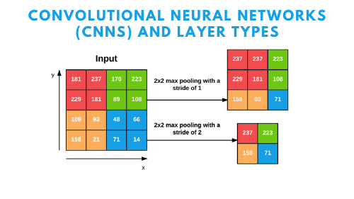
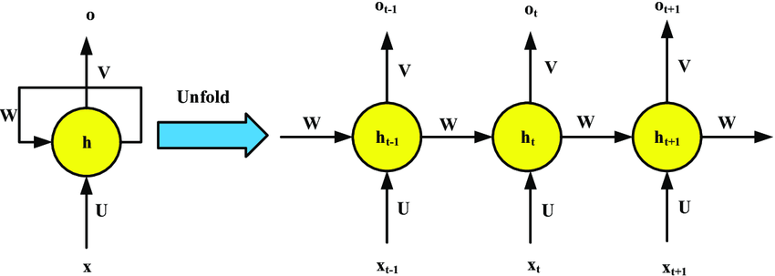
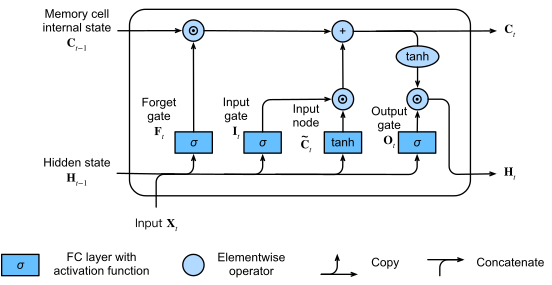
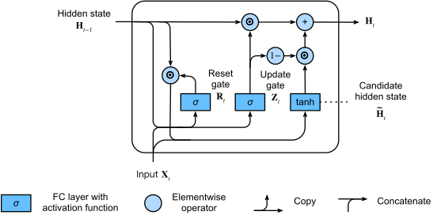

# Neural Networks & Deep Learning

## Multi-Layer Perceptrons (MLPs)
A Multi-Layer Perceptron (MLP) is a fundamental type of **feedforward artificial neural network**. It is characterized by having one or more **hidden layers** of neurons between its input and output layers, allowing it to learn non-linear relationships in data.

#### Basic Structure
An MLP typically consists of:
*   **Input Layer:** Receives the raw input features.
*   **One or More Hidden Layers:** These layers perform intermediate computations. Each neuron in a hidden layer typically applies a linear transformation to the outputs of the previous layer, followed by a non-linear **activation function**.
*   **Output Layer:** Produces the final output of the network (e.g., class probabilities for classification, a continuous value for regression). It also usually involves a linear transformation and an optional activation function suitable for the task.

<div align="center">

<p>Fig. Basic MLP Structure Diagram - Input, Hidden, Output Layers</p>
</div>

**3-Layer MLP Architecture:**

-   **Input Layer:** $\large \mathbf{x} \in \mathbb{R}^{n_{input}}$
-   **Hidden Layer 1:** $\large n_1$ neurons with tanh activation
-   **Hidden Layer 2:** $\large n_2$ neurons with tanh activation
-   **Output Layer:** $\large n_{classes}$ neurons with softmax activation

**Mathematical Representation:** 

$$\large 
\mathbf{z}^{(1)} = \mathbf{x} \mathbf{W}^{(1)} + \mathbf{b}^{(1)}, \quad \mathbf{a}^{(1)} = \tanh(\mathbf{z}^{(1)})$$ $$\mathbf{z}^{(2)} = \mathbf{a}^{(1)} \mathbf{W}^{(2)} + \mathbf{b}^{(2)}, \quad \mathbf{a}^{(2)} = \tanh(\mathbf{z}^{(2)})$$ $$\mathbf{z}^{(3)} = \mathbf{a}^{(2)} \mathbf{W}^{(3)} + \mathbf{b}^{(3)}, \quad \mathbf{p} = \text{softmax}(\mathbf{z}^{(3)})
$$

#### Feedforward Operation
During the forward pass, data flows from the input layer, through the hidden layers, to the output layer. At each neuron in a hidden or output layer:
1.  A weighted sum of its inputs (outputs from the previous layer) plus a bias term is calculated. This is the **linear transformation** or **pre-activation** ($z$).
    For a neuron $\large j$ in layer $\large l$, receiving inputs $\large a_i^{(l-1)}$ from layer $\large l-1$:

$$\large 
z_j^{(l)} = \sum_i w_{ji}^{(l)} a_i^{(l-1)} + b_j^{(l)}
$$

In matrix form for all neurons in layer $\large l$: $\large \mathbf{z}^{(l)} = \mathbf{W}^{(l)} \mathbf{a}^{(l-1)} + \mathbf{b}^{(l)}$
2.  This sum $\large z_j^{(l)}$ is then passed through a non-linear **activation function** $\large g(\cdot)$ to produce the neuron's output $\large a_j^{(l)}$:

$$\large 
a_j^{(l)} = g(z_j^{(l)})
$$

### Key Components for a "Scratch" MLP
To build an MLP from scratch, we need to define:

#### Parameters (Weights and Biases)
*   **Weights ($\large W$):** Represent the strength of connections between neurons in successive layers. $\large W^{(l)}$ is the weight matrix connecting layer $\large l-1$ to layer $\large l$.
*   **Biases ($\large b$):** An additional parameter for each neuron (except input neurons) that allows the activation function to be shifted. $\large b^{(l)}$ is the bias vector for layer $\large l$.
These are the parameters the network learns during training.

#### Activation Functions (e.g., Hyperbolic Tangent) & Their Derivatives
Activation functions introduce non-linearity, enabling MLPs to learn complex patterns.
**Function:** 

$$\large 
\tanh(z) = \frac{e^z - e^{-z}}{e^z + e^{-z}} = \frac{e^{2z} - 1}{e^{2z} + 1}
$$

**Properties:**

-   Range: $\large (-1, 1)$
-   Zero-centered (unlike sigmoid)
-   Symmetric around origin

**Derivative:** 

$$\large 
\frac{d}{dz}\tanh(z) = 1 - \tanh^2(z)
$$

**Proof:** 

$$\large 
\frac{d}{dz}\tanh(z) = \frac{d}{dz}\left(\frac{e^z - e^{-z}}{e^z + e^{-z}}\right) = \frac{(e^z + e^{-z})^2 - (e^z - e^{-z})^2}{(e^z + e^{-z})^2} = 1 - \tanh^2(z)
$$

The derivative of the activation function is crucial for backpropagation.

#### Loss Function (e.g., Binary Cross-Entropy) & Its Derivative
The loss function measures the discrepancy between the network's predictions and the true target values.
*   **Binary Cross-Entropy (BCE) Loss (for binary classification):**

$$\large 
L = -\frac{1}{m} \sum_{i=1}^{m} [y^{(i)} \log(a_{out}^{(i)}) + (1-y^{(i)}) \log(1 - a_{out}^{(i)})]
$$

where $\large a_{out}$ is the output activation (predicted probability from the final sigmoid).
*   **Derivative of BCE Loss w.r.t. $a_{out}$:** Needed for backpropagation.

$$\large 
\frac{\partial L}{\partial a_{out}} = \frac{a_{out} - y}{a_{out}(1 - a_{out})}
$$ 

(for a single sample)


### The Forward Pass
This involves propagating the input data through the network, layer by layer, applying linear transformations and activation functions, until the final output is produced.


### Algorithm for Forward Pass 
Given input batch $\large \mathbf{X}$, weights $\large \mathbf{W}^{(1)}, \mathbf{W}^{(2)}$, biases $\large \mathbf{b}^{(1)}, \mathbf{b}^{(2)}$, and activation function $\large \tanh(\cdot)$:
**Layer 1:** 

$$\large 
\mathbf{Z}^{(1)} = \mathbf{X} \mathbf{W}^{(1)} + \mathbf{b}^{(1)} \in \mathbb{R}^{m \times n_1}
$$

$$\large 
\mathbf{A}^{(1)} = \tanh(\mathbf{Z}^{(1)}) \in \mathbb{R}^{m \times n_1}
$$

**Layer 2:** 

$$\large 
\mathbf{Z}^{(2)} = \mathbf{A}^{(1)} \mathbf{W}^{(2)} + \mathbf{b}^{(2)} \in \mathbb{R}^{m \times n_2}
$$

$$\large 
\mathbf{A}^{(2)} = \tanh(\mathbf{Z}^{(2)}) \in \mathbb{R}^{m \times n_2}
$$

**Output Layer:** 

$$\large 
\mathbf{Z}^{(3)} = \mathbf{A}^{(2)} \mathbf{W}^{(3)} + \mathbf{b}^{(3)} \in \mathbb{R}^{m \times n_{classes}}
$$

$$\large 
\mathbf{P} = \text{softmax}(\mathbf{Z}^{(3)}) \in \mathbb{R}^{m \times n_{classes}}
$$

Where $\large m$ is the batch size.

### Backpropagation
Backpropagation is an algorithm for efficiently computing the gradients of the loss function with respect to all the weights and biases in the network. It relies on the **chain rule** from calculus.

#### The Chain Rule
If $\large L$ is a function of $\large a$, $\large a$ is a function of $\large z$, and $\large z$ is a function of $\large w$, then $\large \frac{\partial L}{\partial w} = \frac{\partial L}{\partial a} \cdot \frac{\partial a}{\partial z} \cdot \frac{\partial z}{\partial w}$. Backpropagation systematically applies this rule layer by layer, starting from the output layer and moving backward.

### Algorithm (Conceptual Steps for a 3-Layer MLP) 
Let $\large L$ be the loss, $\large a^{(2)}$ the output activation, $\large z^{(2)}$ the output pre-activation, $\large a^{(1)}$ the hidden activation, $\large z^{(1)}$ the hidden pre-activation, and $\large \mathbf{X}$ the input.
Let $\large g'(\cdot)$ be the derivative of the activation function.

#### Output Layer Gradients

**Softmax + Cross-Entropy Gradient (Elegant Result):** For the gradient w.r.t. output logits: 

$$\large 
\frac{\partial \mathcal{L}}{\partial z_j^{(3)}} = p_j - \mathbf{1}_{j=y}
$$

Where $\large \mathbf{1}_{j=y}$ is 1 if $\large j$ is the true class, 0 otherwise.

**In matrix form for the batch:** 

$$\large 
\frac{\partial J}{\partial \mathbf{Z}^{(3)}} = \frac{1}{m}(\mathbf{P} - \mathbf{Y}_{one_hot})
$$


**Weight and Bias Gradients:** 

$$\large 
\frac{\partial J}{\partial \mathbf{W}^{(3)}} = (\mathbf{A}^{(2)})^T \frac{\partial J}{\partial \mathbf{Z}^{(3)}}
$$

$$\large 
\frac{\partial J}{\partial \mathbf{b}^{(3)}} = \sum_{i=1}^{m} \frac{\partial J}{\partial \mathbf{Z}^{(3)}}
$$

#### Hidden Layer 2 Gradients

**Error Propagation:** 

$$\large 
\frac{\partial J}{\partial \mathbf{A}^{(2)}} = \frac{\partial J}{\partial \mathbf{Z}^{(3)}} (\mathbf{W}^{(3)})^T
$$

**Tanh Derivative Application:** 

$$\large 
\frac{\partial J}{\partial \mathbf{Z}^{(2)}} = \frac{\partial J}{\partial \mathbf{A}^{(2)}} \odot (1 - (\mathbf{A}^{(2)})^2)
$$

**In your code:** `dL_dZ2 = dL_dA2 * (1 - A2**2)`

**Weight and Bias Gradients:** 

$$\large 
\frac{\partial J}{\partial \mathbf{W}^{(2)}} = (\mathbf{A}^{(1)})^T \frac{\partial J}{\partial \mathbf{Z}^{(2)}}
$$

$$\large 
\frac{\partial J}{\partial \mathbf{b}^{(2)}} = \sum_{i=1}^{m} \frac{\partial J}{\partial \mathbf{Z}^{(2)}}
$$

#### Hidden Layer 1 Gradients

**Error Propagation:** 

$$\large 
\frac{\partial J}{\partial \mathbf{A}^{(1)}} = \frac{\partial J}{\partial \mathbf{Z}^{(2)}} (\mathbf{W}^{(2)})^T
$$

**Tanh Derivative Application:** 

$$\large 
\frac{\partial J}{\partial \mathbf{Z}^{(1)}} = \frac{\partial J}{\partial \mathbf{A}^{(1)}} \odot (1 - (\mathbf{A}^{(1)})^2)
$$

**Weight and Bias Gradients:** 

$$\large 
\frac{\partial J}{\partial \mathbf{W}^{(1)}} = \mathbf{X}^T \frac{\partial J}{\partial \mathbf{Z}^{(1)}}
$$ 

$$\large 
\frac{\partial J}{\partial \mathbf{b}^{(1)}} = \sum_{i=1}^{m} \frac{\partial J}{\partial \mathbf{Z}^{(1)}}
$$

<div align="center">

<p>Fig. Backpropagation Flow Diagram - Showing error signals flowing backward</p>
</div>

### Gradient Descent for Parameter Updates
Once the gradients are computed via backpropagation, parameters are updated using Gradient Descent (or its variants):
**Learning Rate:** $\large \alpha = 0.1$

$$\large 
\mathbf{W}^{(l)} \leftarrow \mathbf{W}^{(l)} - \eta \frac{\partial L}{\partial \mathbf{W}^{(l)}}
$$

$$\large 
\mathbf{b}^{(l)} \leftarrow \mathbf{b}^{(l)} - \eta \frac{\partial L}{\partial \mathbf{b}^{(l)}}
$$

Where $\large \eta$ is the learning rate.

### Why Backpropagation Works?

#### Theoretical Foundation

1.  **Universal Approximation Theorem:** MLPs with sufficient hidden units can approximate any continuous function on a compact set.
    
2.  **Gradient-Based Optimization:** Backpropagation provides exact gradients, enabling efficient optimization via gradient descent.
    
3.  **Error Signal Propagation:** The algorithm efficiently distributes the error signal from the output back through all parameters.
    

#### Intuitive Understanding

-   **Forward pass:** Information flows forward to make predictions
-   **Backward pass:** Error information flows backward to update parameters
-   **Learning:** Parameters adjust to minimize the difference between predictions and targets

### Key Mathematical Properties

#### Vanishing Gradient Problem

For deep networks with sigmoid activations: 

$$\large 
|\sigma'(z)| \leq 0.25
$$

This can cause gradients to vanish exponentially in deep networks: 

$$\large 
\left|\frac{\partial J}{\partial \mathbf{W}^{(1)}}\right| \propto \prod_{l=2}^{L} |\mathbf{W}^{(l)}| \cdot |\sigma'(\mathbf{z}^{(l)})|
$$

#### Weight Initialization

Proper initialization is crucial. For sigmoid networks, Xavier initialization: 

$$\large 
W_{ij} \sim \mathcal{N}\left(0, \frac{1}{n_{in}}\right)
$$

Where $\large n_{in}$ is the number of input connections to the neuron.

This mathematical framework provides the complete foundation for understanding and implementing MLPs with backpropagation from first principles.

## Convolutional Neural Networks (CNNs)

### Introduction to CNNs

#### Why CNNs for Images?

Traditional Multi-Layer Perceptrons (MLPs) face significant challenges when processing images:

**High Dimensionality Problem:**

-   A small 32×32 RGB image has 32 × 32 × 3 = 3,072 pixels
-   Flattening this creates a vector of length 3,072
-   The first hidden layer with 100 neurons would require 3,072 × 100 = 307,200 parameters
-   For realistic images (224×224×3), this becomes 224 × 224 × 3 × 100 = 15,052,800 parameters in just the first layer!

**Spatial Structure Loss:**

-   MLPs treat each pixel independently
-   They ignore the crucial spatial relationships between neighboring pixels
-   A vertical edge at position (i,j) is fundamentally the same feature as a vertical edge at position (i+10,j+10)

CNNs solve these problems through three key principles:

1.  **Local Connectivity** (Sparse Interactions)
2.  **Parameter Sharing** (Weight Sharing)
3.  **Translation Equivariance**

### Mathematical Foundations

#### Convolution Operation

The discrete 2D convolution operation between an input image $\large \mathbf{I}$ and a kernel $\large \mathbf{K}$ is defined as:

$$\large 
(\mathbf{I} * \mathbf{K})[i,j] = \sum_m \sum_n \mathbf{I}[m,n] \times \mathbf{K}[i-m, j-n]
$$

More commonly implemented as cross-correlation (which is what most deep learning frameworks use):

$$\large 
(\mathbf{I} * \mathbf{K})[i,j] = \sum_m \sum_n \mathbf{I}[i+m, j+n] \times \mathbf{K}[m,n]
$$

<div align="center">

<p>Fig. Convolution Operation in CNN</p>
</div>

#### Output Size Calculation

For a convolution operation, the output size is calculated as:

$$\large 
H_{out} = \left\lfloor \frac{H_{in} + 2P - K_h}{S} \right\rfloor + 1
$$

$$\large 
W_{out} = \left\lfloor \frac{W_{in} + 2P - K_w}{S} \right\rfloor + 1
$$

Where:

-   $\large H_{in}, W_{in}$ = input height and width
-   $\large P$ = padding
-   $\large K_h, K_w$ = kernel height and width
-   $\large S$ = stride
-   $\large \lfloor \cdot \rfloor$ = floor function

#### Parameter Count

For a convolutional layer:

$$\large 
\text{Parameters} = (K_h \times K_w \times C_{in} \times C_{out}) + C_{out}
$$

The $\large +C_{out}$ term accounts for bias parameters (one per output channel).

### Core CNN Components

#### Convolutional Layer

**Mathematical Definition:** For input tensor $\large \mathbf{X} \in \mathbb{R}^{N \times C_{in} \times H_{in} \times W_{in}}$ and learnable weights $\large \mathbf{W} \in \mathbb{R}^{C_{out} \times C_{in} \times K_h \times K_w}$:

$$\large 
\mathbf{Y}[n,c_{out},h,w] = b[c_{out}] + \sum_{c_{in}} \sum_{k_h} \sum_{k_w} \mathbf{X}[n, c_{in}, h \cdot s + k_h, w \cdot s + k_w] \times \mathbf{W}[c_{out}, c_{in}, k_h, k_w]
$$

Where:

-   $\large N$ = batch size
-   $\large C_{in}, C_{out}$ = input/output channels
-   $\large H_{in}, W_{in}$ = input height/width
-   $\large K_h, K_w$ = kernel height/width
-   $\large s$ = stride
-   $\large b$ = bias vector

**Key Properties:**

-   **Local Connectivity:** Each output neuron connects only to a local region of the input (typically $\large 3 \times 3$ or $\large 5 \times 5$ pixels)
-   **Parameter Sharing:** The same kernel weights are used across all spatial locations, dramatically reducing parameters
-   **Translation Equivariance:** If the input is shifted, the output is shifted by the same amount: $\large f(T(\mathbf{x})) = T(f(\mathbf{x}))$

<div align="center">

<p>Fig. Convolutional Neural Networks (CNNs) and Layer Types</p>
</div>

#### Activation Functions

<div align="center">

<p>Fig. Activation Functions</p>
</div>

**ReLU (Rectified Linear Unit):**

$$\large 
\text{ReLU}(x) = \max(0, x) = \begin{cases} x & \text{if } x > 0 \ 0 & \text{if } x \leq 0 \end{cases}
$$

**Mathematical Properties:**

-   Introduces non-linearity: $\large f(\alpha \mathbf{x} + \beta \mathbf{y}) \neq \alpha f(\mathbf{x}) + \beta f(\mathbf{y})$
-   Derivative: $\large \frac{d}{dx}\text{ReLU}(x) = \begin{cases} 1 & \text{if } x > 0 \ 0 & \text{if } x \leq 0 \end{cases}$
-   Computationally efficient and helps mitigate vanishing gradients

#### Pooling Layers

**Max Pooling:** For a $\large 2 \times 2$ max pooling with stride 2:

$$\large 
\text{MaxPool}(\mathbf{X})[i,j] = \max{\mathbf{X}[2i, 2j], \mathbf{X}[2i, 2j+1], \mathbf{X}[2i+1, 2j], \mathbf{X}[2i+1, 2j+1]}
$$

**Average Pooling:**

$$\large 
\text{AvgPool}(\mathbf{X})[i,j] = \frac{1}{4}\sum_{p=0}^{1}\sum_{q=0}^{1} \mathbf{X}[2i+p, 2j+q]
$$

**General Pooling Formula:** For kernel size $\large k \times k$:

$$\large 
\text{Pool}(\mathbf{X})[i,j] = \text{PoolOp}{\mathbf{X}[si+p, sj+q] : 0 \leq p,q < k}
$$

Where $\large s$ is the stride and $\large \text{PoolOp}$ is either $\large \max$ or average.

### CNN Architecture Principles

#### Typical CNN Architecture Pattern

A standard CNN follows this pattern:

$$\large 
\text{INPUT} \rightarrow [\text{CONV} \rightarrow \text{ACTIVATION} \rightarrow \text{POOL}]^N \rightarrow [\text{FC} \rightarrow \text{ACTIVATION}]^M \rightarrow \text{OUTPUT}
$$

#### Receptive Field Analysis

The **receptive field** is the region in the input image that influences a particular neuron's output.

**Recursive Formula:**

$$\large 
RF_{l+1} = RF_l + (k_l - 1) \times \prod_{i=1}^{l} s_i
$$

$$\large 
J_{l+1} = J_l \times s_{l+1}
$$

Where:

-   $\large RF_l$ = receptive field size at layer $\large l$
-   $\large k_l$ = kernel size at layer $\large l$
-   $\large s_i$ = stride at layer $\large i$
-   $\large J_l$ = jump (distance between receptive field centers) at layer $\large l$

### Mathematical Analysis of Information Flow

#### Tensor Transformations

Consider an input image of size $\large 32 \times 32 \times 3$ (CIFAR-10 format):

**Convolutional Block 1:** 

$$\large 
\mathbf{X}_0 \in \mathbb{R}^{N \times 3 \times 32 \times 32}
$$ 

<div align="center">

%20\in%20\mathbb{R}^{N%20\times%2016%20\times%2032%20\times%2032})

</div>

$$\large 
\mathbf{X}_2 = \text{ReLU}(\mathbf{X}_1) \in \mathbb{R}^{N \times 16 \times 32 \times 32}
$$

<div align="center">

%20\in%20\mathbb{R}^{N%20\times%2016%20\times%2016%20\times%2016})

</div>

**Convolutional Block 2:** 

<div align="center">

%20\in%20\mathbb{R}^{N%20\times%2032%20\times%2016%20\times%2016})

</div>

$$\large 
\mathbf{X}_5 = \text{ReLU}(\mathbf{X}_4) \in \mathbb{R}^{N \times 32 \times 16 \times 16}
$$ 

<div align="center">

%20\in%20\mathbb{R}^{N%20\times%2032%20\times%208%20\times%208})

</div>

**Classification Head:** 

$$\large 
\mathbf{X}_7 = \text{Flatten}(\mathbf{X}_6) \in \mathbb{R}^{N \times 2048}
$$ 

<div align="center">

%20\in%20\mathbb{R}^{N%20\times%20128})

</div>

$$\large 
\mathbf{X}_9 = \text{ReLU}(\mathbf{X}_8) \in \mathbb{R}^{N \times 128}
$$ 

$$\large 
\mathbf{Y} = \text{Linear}_{128 \rightarrow 10}(\mathbf{X}_9) \in \mathbb{R}^{N \times 10}
$$

#### Parameter Efficiency Analysis

**CNN Parameter Count:** 

$$\large \begin{align}  
\text{Conv1:} &\quad (3 \times 3 \times 3 \times 16) + 16 = 448
\end{align}
$$ 

$$\large \begin{align}  
\text{Conv2:} &\quad (3 \times 3 \times 16 \times 32) + 32 = 4,640
\end{align}
$$ 

$$\large \begin{align}  
\text{FC1:} &\quad (2048 \times 128) + 128 = 262,272
\end{align}
$$ 

$$\large \begin{align}  
\text{FC2:} &\quad (128 \times 10) + 10 = 1,290
\end{align}
$$

$$\large \begin{align}  
\text{Total:} &\quad 268,650 \text{ parameters}
\end{align}
$$

**Equivalent MLP Parameter Count:** 

$$\large \begin{align}  
\text{Input:} &\quad (3072 \times 128) + 128 = 393,344
\end{align}
$$ 

$$\large \begin{align}  
\text{Hidden:} &\quad (128 \times 128) + 128 = 16,512
\end{align}
$$ 

$$\large \begin{align}  
\text{Output:} &\quad (128 \times 10) + 10 = 1,290
\end{align}
$$ 

$$ \large \begin{align}  
\text{Total:} &\quad 411,146 \text{ parameters}
\end{align}
$$

**Parameter Reduction:** 

$$\large \begin{align}  
\text{Reduction} = \frac{411,146 - 268,650}{411,146} \times 100% = 53%
\end{align}
$$

### Loss Functions and Optimization

#### Cross-Entropy Loss

For classification with $\large C$ classes, given true label $\large y$ and predicted probabilities $\large \hat{\mathbf{p}}$:

<div align="center">

%20=%20-\log(\hat{p}_y))

</div>

Where $\large y_i = 1$ if $\large i$ is the true class, 0 otherwise.

**Softmax Activation:** 

<div align="center">

}{\sum{j=1}^{C}%20\exp(z_j)})

</div>

#### Backpropagation in CNNs

**Gradient w.r.t. Kernel Weights:** 

$$\large 
\frac{\partial \mathcal{L}}{\partial \mathbf{W}[c_{out}, c_{in}, u, v]} = \sum_{i,j} \frac{\partial \mathcal{L}}{\partial \mathbf{Y}[c_{out}, i, j]} \cdot \mathbf{X}[c_{in}, i+u, j+v]
$$

**Gradient w.r.t. Input:** 

$$\large 
\frac{\partial \mathcal{L}}{\partial \mathbf{X}[c_{in}, i, j]} = \sum_{c_{out}} \sum_{u,v} \frac{\partial \mathcal{L}}{\partial \mathbf{Y}[c_{out}, i-u, j-v]} \cdot \mathbf{W}[c_{out}, c_{in}, u, v]
$$

### Normalization Techniques

#### Batch Normalization

For mini-batch $\large \mathcal{B} = {x_1, x_2, ..., x_m}$:

$$\large 
\mu_{\mathcal{B}} = \frac{1}{m} \sum_{i=1}^{m} x_i
$$

$$\large 
\sigma^2_{\mathcal{B}} = \frac{1}{m} \sum_{i=1}^{m} (x_i - \mu_{\mathcal{B}})^2
$$

<div align="center">


</div>

$$\large 
BN(x_i) = \gamma \hat{x}_i + \beta
$$

Where $\large \gamma$ and $\large \beta$ are learnable scale and shift parameters.

## Recurrent Neural Networks (RNN)

Recurrent Neural Networks (RNNs) are a class of neural networks designed to work with sequential data. Unlike traditional feedforward networks, RNNs have connections that create loops, allowing information to persist and be passed from one step of the sequence to the next.

**Key Applications:**
- Natural Language Processing (text generation, translation)
- Time Series Forecasting (stock prices, weather)
- Speech Recognition and Generation
- Music Composition
- Video Analysis

### What are RNNs?

#### The Core Concept

Traditional neural networks process fixed-size inputs and produce fixed-size outputs. RNNs can handle variable-length sequences by maintaining an internal "memory" state that gets updated at each time step.

```
Traditional NN: Input → Hidden → Output
RNN:           Input₁ → Hidden₁ → Output₁
                  ↓        ↓
               Input₂ → Hidden₂ → Output₂
                  ↓        ↓
               Input₃ → Hidden₃ → Output₃
```

<div align="center">

<p>Fig. Recurrent Neural Networks (RNN) Architecture</p>
</div>

#### Key Features

1. **Memory**: RNNs maintain hidden states that carry information across time steps
2. **Parameter Sharing**: Same weights are used at each time step
3. **Variable Length**: Can handle sequences of different lengths
4. **Temporal Dependencies**: Can capture relationships between distant elements

### RNN Mathematics

#### Basic RNN Equations

For a simple RNN at time step $t$:

##### Hidden State Update:

$$\large 
h_t = \tanh(W_{hh} h_{t-1} + W_{xh} x_t + b_h)
$$

##### Output Calculation:
$$\large 
y_t = W_{hy} h_t + b_y
$$

**Where:**
- $\large h_t$: Hidden state at time $\large t$
- $\large x_t$: Input at time $\large t$
- $\large y_t$: Output at time $\large t$
- $\large W_{hh}$: Hidden-to-hidden weight matrix
- $\large W_{xh}$: Input-to-hidden weight matrix
- $\large W_{hy}$: Hidden-to-output weight matrix
- $\large b_h, b_y$: Bias vectors
- $\large \tanh$: Activation function (hyperbolic tangent)

#### Matrix Dimensions

For a batch of sequences:
- Input: $\large x_t \in \mathbb{R}^{\text{batch\_size} \times \text{input\_size}}$
- Hidden: $\large h_t \in \mathbb{R}^{\text{batch\_size} \times \text{hidden\_size}}$
- Output: $\large y_t \in \mathbb{R}^{\text{batch\_size} \times \text{output\_size}}$

Weight matrices:
- $\large W_{xh} \in \mathbb{R}^{\text{input\_size} \times \text{hidden\_size}}$
- $\large W_{hh} \in \mathbb{R}^{\text{hidden\_size} \times \text{hidden\_size}}$
- $\large W_{hy} \in \mathbb{R}^{\text{hidden\_size} \times \text{output\_size}}$

#### Unrolled RNN Computation

For a sequence of length $\large T$, the RNN can be "unrolled" in time:

$$\large 
h_0 = 0 \text{ (or learned initial state)}
$$

$$\large 
\begin{align}
h_1 &= \tanh(W_{hh} h_0 + W_{xh} x_1 + b_h) \\
h_2 &= \tanh(W_{hh} h_1 + W_{xh} x_2 + b_h) \\
h_3 &= \tanh(W_{hh} h_2 + W_{xh} x_3 + b_h) \\
&\vdots \\
h_T &= \tanh(W_{hh} h_{T-1} + W_{xh} x_T + b_h)
\end{align}
$$

$$\large 
\begin{align}
y_1 &= W_{hy} h_1 + b_y \\
y_2 &= W_{hy} h_2 + b_y \\
&\vdots \\
y_T &= W_{hy} h_T + b_y
\end{align}
$$

### Types of RNN Architectures

#### 1. Vanilla RNN (Simple RNN)

**Equation:**

$$\large 
h_t = \tanh(W_{hh} h_{t-1} + W_{xh} x_t + b_h)
$$

**Pros:**
- Simple to understand and implement
- Computationally efficient

**Cons:**
- Vanishing gradient problem
- Cannot capture long-term dependencies
- Limited memory capacity

#### 2. Long Short-Term Memory (LSTM)

LSTMs solve the vanishing gradient problem using gates that control information flow.

<div align="center">

<p>Fig. Long Short-Term Memory (LSTM) Architecture</p>
</div>

##### LSTM Equations:

**Forget Gate:**

$$\large 
f_t = \sigma(W_f \cdot [h_{t-1}, x_t] + b_f)
$$

**Input Gate:**

$$\large 
i_t = \sigma(W_i \cdot [h_{t-1}, x_t] + b_i)
$$

$$\large 
\tilde{C}_t = \tanh(W_C \cdot [h_{t-1}, x_t] + b_C)
$$

**Cell State Update:**

$$\large 
C_t = f_t \odot C_{t-1} + i_t \odot \tilde{C}_t
$$

**Output Gate:**

$$\large 
o_t = \sigma(W_o \cdot [h_{t-1}, x_t] + b_o)
$$

$$\large 
h_t = o_t \odot \tanh(C_t)
$$

**Where:**
- $\large \sigma$: Sigmoid function
- $\large \odot$: Element-wise multiplication (Hadamard product)
- $\large C_t$: Cell state at time $\large t$
- $\large f_t, i_t, o_t$: Forget, input, and output gates

#### 3. Gated Recurrent Unit (GRU)

GRU is a simplified version of LSTM with fewer gates.

<div align="center">

<p>Fig. Gated Recurrent Unit (GRU) Architecture</p>
</div>

##### GRU Equations:

**Reset Gate:**

$$\large 
r_t = \sigma(W_r \cdot [h_{t-1}, x_t] + b_r)
$$

**Update Gate:**

$$\large 
z_t = \sigma(W_z \cdot [h_{t-1}, x_t] + b_z)
$$

**Candidate Hidden State:**

$$\large 
\tilde{h}_t = \tanh(W_h \cdot [r_t \odot h_{t-1}, x_t] + b_h)
$$

**Final Hidden State:**

$$\large 
h_t = (1 - z_t) \odot h_{t-1} + z_t \odot \tilde{h}_t
$$

### Training RNNs

#### Backpropagation Through Time (BPTT)

RNNs are trained using BPTT, which is backpropagation applied to the unrolled network.

##### Forward Pass:
1. Process sequence from $\large t=1$ to $\large t=T$
2. Compute hidden states and outputs
3. Calculate total loss over all time steps

##### Backward Pass:
1. Compute gradients from $\large t=T$ back to $\large t=1$
2. Accumulate gradients for shared parameters
3. Update weights using gradient descent

#### Loss Function

For regression (time series prediction):

$$\large 
\mathcal{L} = \frac{1}{T} \sum_{t=1}^{T} \|y_t - \hat{y}_t\|^2
$$

For classification:

$$\large 
\mathcal{L} = -\frac{1}{T} \sum_{t=1}^{T} \sum_{c} y_{t,c} \log(\hat{y}_{t,c})
$$

#### Gradient Calculation

The gradient of the loss with respect to hidden state $\large h_t$:

$$\large 
\frac{\partial \mathcal{L}}{\partial h_t} = \frac{\partial \mathcal{L}}{\partial y_t} \frac{\partial y_t}{\partial h_t} + \frac{\partial \mathcal{L}}{\partial h_{t+1}} \frac{\partial h_{t+1}}{\partial h_t}
$$

This creates a chain of dependencies that can lead to vanishing gradients.

### Common Problems and Solutions

#### 1. Vanishing Gradient Problem

**Problem:** Gradients become exponentially small as they propagate back through time.

**Mathematical Explanation:**
The gradient involves products of weight matrices:

$$\large 
\frac{\partial h_t}{\partial h_{t-k}} = \prod_{i=1}^{k} \frac{\partial h_{t-i+1}}{\partial h_{t-i}}
$$

If the largest eigenvalue of the weight matrix is $\large < 1$, gradients vanish.

**Solutions:**
- Use LSTM or GRU architectures
- Gradient clipping
- Better weight initialization
- Skip connections

#### 2. Exploding Gradient Problem

**Problem:** Gradients become exponentially large.

**Solution:**
```python
# Gradient clipping
torch.nn.utils.clip_grad_norm_(model.parameters(), max_norm=1.0)
```

#### 3. Long-Term Dependencies

**Problem:** Simple RNNs cannot remember information from distant past.

**Solutions:**
- LSTM/GRU architectures
- Attention mechanisms
- Transformer architectures

### Comparison: RNN vs LSTM vs GRU

| Feature | RNN | LSTM | GRU |
|---------|-----|------|-----|
| **Parameters** | Fewest | Most | Medium |
| **Training Speed** | Fastest | Slowest | Medium |
| **Memory Usage** | Lowest | Highest | Medium |
| **Long-term Memory** | Poor | Excellent | Good |
| **Vanishing Gradients** | Severe | Minimal | Minimal |
| **Complexity** | Simple | Complex | Moderate |

#### When to Use Each:

- **Simple RNN:** Short sequences, computational constraints, educational purposes
- **LSTM:** Long sequences, complex patterns, maximum performance needed
- **GRU:** Balance between performance and efficiency, good default choice

### Evaluation Metrics

#### Regression Tasks:
- **MSE (Mean Squared Error):** $\large \mathcal{L} = \frac{1}{n} \sum_{i=1}^{n} (y_{\text{true}} - y_{\text{pred}})^2$
- **MAE (Mean Absolute Error):** $\large \mathcal{L} = \frac{1}{n} \sum_{i=1}^{n} |y_{\text{true}} - y_{\text{pred}}|$
- **RMSE (Root MSE):** $\large \mathcal{L} = \sqrt{\text{MSE}}$

#### Classification Tasks:
- **Accuracy:** $\large \frac{TP + TN}{TP + TN + FP + FN}$
- **F1-Score:** $\large \frac{2 \times \text{Precision} \times \text{Recall}}{\text{Precision} + \text{Recall}}$
- **Cross-Entropy Loss:** $\large -\sum_{i} y_{\text{true}} \log(y_{\text{pred}})$
