# 05 · Neural Networks & Deep Learning

Neural networks stack many simple layers to learn very complex functions. This module builds an MLP and its backpropagation by hand, then covers the three architectures behind most of modern deep learning: **CNNs** for images, **RNNs** for sequences and **Transformers** for almost everything. It finishes with the tools that make training work: optimisers, learning-rate schedules and regularisation.

> **Notebooks:** [mlp_backprop](mlp_backprop.ipynb) · [cnn](cnn.ipynb) · [rnn](rnn.ipynb) · [transformer](transformer.ipynb) · [optimizers_regularization](optimizers_regularization.ipynb)
>
> **Quick revision:** [CHEATSHEET.md](CHEATSHEET.md)
>
> **Explore in your browser:** [Optimiser race](https://sandeshjung.github.io/Machine-Learning-Foundation/gradient-descent.html)

## Contents

1. [Multi-layer perceptrons and backpropagation](#1-multi-layer-perceptrons-and-backpropagation)
2. [Convolutional neural networks (CNNs)](#2-convolutional-neural-networks-cnns)
3. [Recurrent neural networks (RNN, LSTM, GRU)](#3-recurrent-neural-networks-rnn-lstm-gru)
4. [Transformers: attention is all you need](#4-transformers-attention-is-all-you-need)
5. [Optimisers, schedules and regularisation](#5-optimisers-schedules-and-regularisation)

---

## 1. Multi-layer perceptrons and backpropagation

### 1.1 Structure

A **multi-layer perceptron (MLP)** is a stack of fully connected layers:

- an **input layer**, which receives the features
- one or more **hidden layers**, each a linear transformation followed by a non-linear **activation**
- an **output layer**, which produces the prediction (for example, class probabilities via softmax)

<p align="center">
  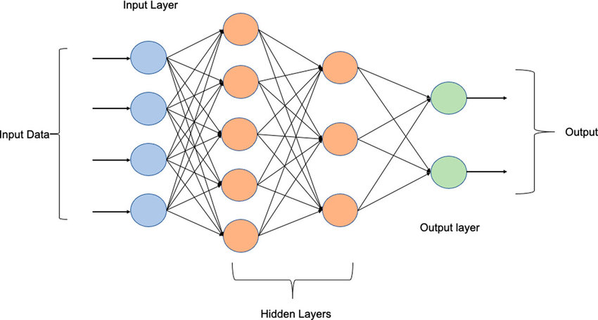
  <br>
  <em>Every neuron in one layer connects to every neuron in the next.</em>
</p>

Without the activations, any stack of linear layers would collapse into a single linear layer. The **non-linearity** is what lets an MLP learn curved boundaries. With enough hidden units, an MLP can approximate any continuous function (the *universal approximation theorem*).

### 1.2 The forward pass

The notebook classifies **EMNIST letters** (28 × 28 images, flattened to 784 features, 26 classes) with two tanh hidden layers of 256 units each.

Each layer computes:

```math
Z^{(l)} = A^{(l-1)} W^{(l)} + \mathbf{b}^{(l)}, \qquad A^{(l)} = g\big(Z^{(l)}\big)
```

- $A^{(0)} = X$ is the input batch ($m$ samples × 784).
- $g$ is the activation: tanh in the hidden layers, softmax at the output.

For this network:

| Layer | Computation | Output shape |
|---|---|---|
| Hidden 1 | $A^{(1)} = \tanh(X W^{(1)} + \mathbf{b}^{(1)})$ | $m \times 256$ |
| Hidden 2 | $A^{(2)} = \tanh(A^{(1)} W^{(2)} + \mathbf{b}^{(2)})$ | $m \times 256$ |
| Output | $P = \text{softmax}(A^{(2)} W^{(3)} + \mathbf{b}^{(3)})$ | $m \times 26$ |

The loss is the **cross-entropy**: the average of $-\log$ (the probability assigned to the true class).

### 1.3 Activation functions

| Activation | $g(z)$ | $g'(z)$ | Notes |
|---|---|---|---|
| Sigmoid | $\frac{1}{1 + e^{-z}}$ | $g(1 - g)$ | Output in (0, 1). Saturates, and $g' \le 0.25$ |
| **Tanh** | $\frac{e^z - e^{-z}}{e^z + e^{-z}}$ | $1 - g^2$ | Output in (−1, 1), zero-centred. Used in the notebook |
| **ReLU** | $\max(0, z)$ | 1 if $z > 0$, else 0 | Cheap, doesn't saturate for $z > 0$. The default for CNNs |
| GELU / SiLU | Smooth versions of ReLU | | Common in Transformers |

<p align="center">
  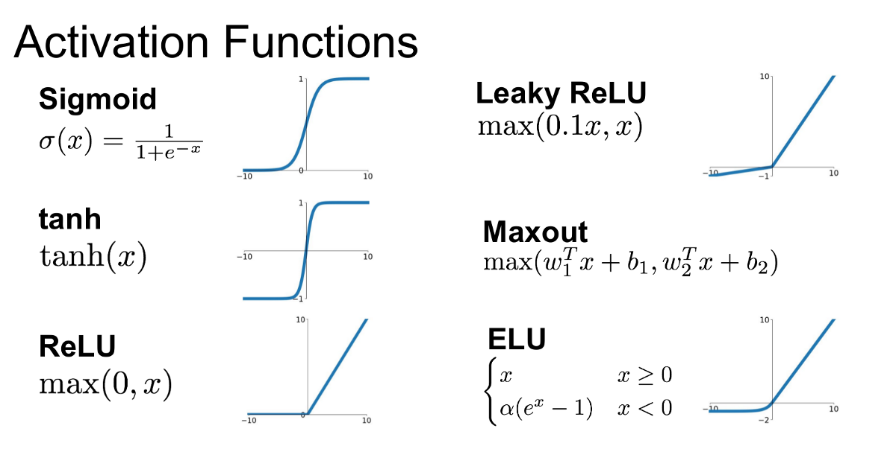
  <br>
  <em>Common activation functions.</em>
</p>

### 1.4 Backpropagation

Backpropagation computes the gradient of the loss with respect to **every** weight by applying the **chain rule** layer by layer, from the output back to the input.

<p align="center">
  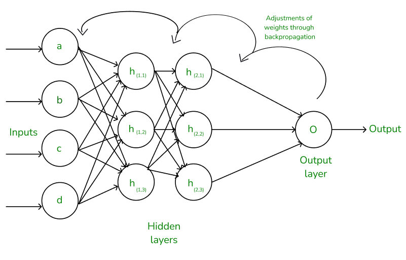
  <br>
  <em>The forward pass makes a prediction; the backward pass sends the error back to adjust every weight.</em>
</p>

**Step 1: the output layer.** Softmax and cross-entropy combine into a remarkably simple gradient:

```math
\delta^{(3)} = \frac{\partial J}{\partial Z^{(3)}} = \frac{1}{m}\big(P - Y_{\text{one-hot}}\big)
```

That is the predicted probabilities minus the true labels.

**Step 2: any layer's weights and biases**, given its error $\delta^{(l)}$:

```math
\frac{\partial J}{\partial W^{(l)}} = A^{(l-1)\top} \delta^{(l)}, \qquad \frac{\partial J}{\partial \mathbf{b}^{(l)}} = \sum_{\text{rows}} \delta^{(l)}
```

**Step 3: pass the error back one layer**, through the weights and then the activation's derivative:

```math
\delta^{(l-1)} = \underbrace{\delta^{(l)} W^{(l)\top}}_{\partial J / \partial A^{(l-1)}} \odot \underbrace{\big(1 - (A^{(l-1)})^2\big)}_{\tanh'}
```

In code this is one line: `dZ2 = dA2 * (1 - A2**2)`.

Repeat steps 2 and 3 down to the first layer, then update every parameter with gradient descent:

```math
W^{(l)} \leftarrow W^{(l)} - \eta \frac{\partial J}{\partial W^{(l)}}, \qquad \mathbf{b}^{(l)} \leftarrow \mathbf{b}^{(l)} - \eta \frac{\partial J}{\partial \mathbf{b}^{(l)}}
```

The notebook checks its hand-written gradients against `torch.autograd`.

### 1.5 Vanishing gradients

The backward pass **multiplies** one derivative per layer. With sigmoid, each factor is at most 0.25, so after 10 layers the gradient can shrink by about $0.25^{10} \approx 10^{-6}$. The early layers then barely learn.

The fixes are ReLU-type activations, careful initialisation, normalisation layers and residual connections.

### 1.6 Weight initialisation

Weights that are too small make the signal fade layer by layer. Weights that are too large make it explode. Good initialisation keeps the variance of the activations roughly constant from layer to layer:

| Scheme | Variance of $W$ | Use with |
|---|---|---|
| **Xavier / Glorot** | $\frac{2}{n_{\text{in}} + n_{\text{out}}}$ | Tanh, sigmoid. Used in the notebook |
| **He / Kaiming** | $\frac{2}{n_{\text{in}}}$ | ReLU |

---

## 2. Convolutional neural networks (CNNs)

### 2.1 Why not just use an MLP on images?

- **Too many parameters.** A 224 × 224 colour image has 150,528 values. One dense layer of 100 units already needs **15 million** weights.
- **No sense of space.** An MLP treats each pixel as an unrelated input. It doesn't know that neighbouring pixels belong together, or that a cat in the corner is still a cat.

CNNs fix both with three ideas:

| Idea | Meaning | Benefit |
|---|---|---|
| **Local connectivity** | Each output looks at a small patch (for example 3 × 3) | Captures local patterns such as edges |
| **Weight sharing** | The same filter slides over the whole image | Far fewer parameters |
| **Translation equivariance** | Shift the input and the output shifts too | The same feature is detected anywhere |

### 2.2 The convolution operation

A small **filter** (kernel) slides across the image. At each position it computes a weighted sum of the patch underneath:

```math
Y[i, j] = \sum_{m} \sum_{n} X[i + m,\; j + n] \cdot K[m, n] + b
```

Strictly speaking this is *cross-correlation*: true convolution flips the kernel. Deep learning libraries implement this version and still call it convolution.

<p align="center">
  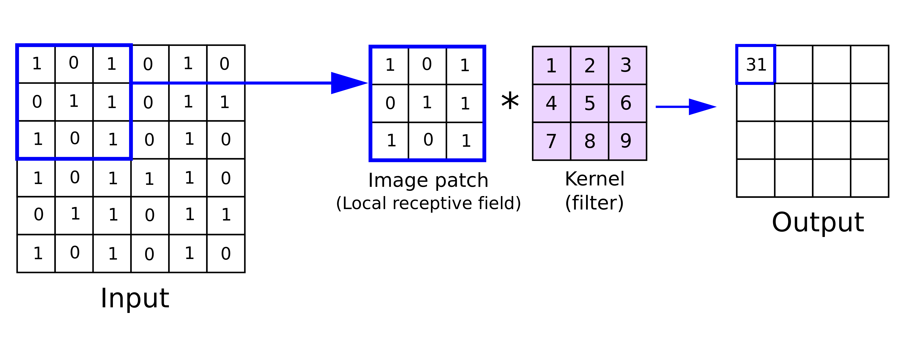
  <br>
  <em>Each output value is the dot product of the filter with one patch of the input.</em>
</p>

With several input channels (RGB) and several filters, a layer maps $C_{\text{in}}$ channels to $C_{\text{out}}$ **feature maps**, one per filter.

### 2.3 Output size and parameter count

For input size $n$, kernel $k$, padding $p$ and stride $s$:

```math
n_{\text{out}} = \left\lfloor \frac{n + 2p - k}{s} \right\rfloor + 1
```

- "Same" padding with stride 1 means $p = \frac{k - 1}{2}$, so a 3 × 3 kernel takes $p = 1$.
- A convolution layer has $(k \cdot k \cdot C_{\text{in}} + 1) \cdot C_{\text{out}}$ parameters. The **+1** is the bias, one per filter.

The notebook checks this formula layer by layer using forward hooks.

### 2.4 Pooling

Pooling **shrinks** the feature maps, which keeps the strongest signals and cuts computation. A 2 × 2 **max pool** with stride 2 keeps the largest value in each 2 × 2 block and halves the height and width. **Average pooling** takes the mean instead.

<p align="center">
  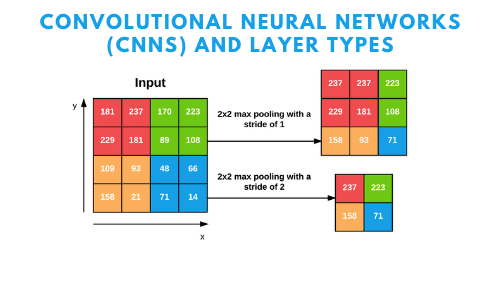
  <br>
  <em>2 × 2 max pooling: stride 1 keeps most of the size, stride 2 halves it.</em>
</p>

### 2.5 A typical architecture

```text
INPUT → [CONV → ReLU → POOL] × N → FLATTEN → [FC → ReLU] × M → FC (logits)
```

As you go deeper, the **spatial size shrinks** and the **number of channels grows**. Early layers detect edges, middle layers textures and parts, and late layers whole objects.

The network in the notebook classifies **CIFAR-10** (32 × 32 colour images, 10 classes):

| Layer | Output shape | Parameters |
|---|---|---|
| Input | 3 × 32 × 32 | — |
| Conv 3→16, 3 × 3, padding 1 + ReLU | 16 × 32 × 32 | 448 |
| MaxPool 2 × 2 | 16 × 16 × 16 | 0 |
| Conv 16→32, 3 × 3, padding 1 + ReLU | 32 × 16 × 16 | 4,640 |
| MaxPool 2 × 2 | 32 × 8 × 8 | 0 |
| Flatten | 2,048 | 0 |
| Linear 2048→128 + ReLU | 128 | 262,272 |
| Linear 128→10 | 10 | 1,290 |
| **Total** | | **268,650** |

> [!NOTE]
> The two convolution layers extract all the visual features with only **5,088** parameters. Almost all of the parameters sit in the first fully connected layer. An MLP of similar width on the raw pixels (3072 → 128 → 128 → 10) needs 411,146 parameters, which is 53 % more, and it has no built-in notion of space.

### 2.6 The receptive field

The **receptive field** of a neuron is the patch of the input image that can influence it. It grows with every layer:

```math
RF_{l} = RF_{l-1} + (k_l - 1) \cdot \prod_{i=1}^{l-1} s_i
```

Two stacked 3 × 3 convolutions see a 5 × 5 patch. Pooling (stride > 1) makes the receptive field grow much faster.

### 2.7 Batch normalisation

BatchNorm normalises each channel over the mini-batch, then rescales it with learnable parameters $\gamma$ and $\beta$:

```math
\hat{x} = \frac{x - \mu_{\mathcal{B}}}{\sqrt{\sigma^2_{\mathcal{B}} + \epsilon}}, \qquad y = \gamma \hat{x} + \beta
```

It allows higher learning rates and makes training more stable. It behaves differently in training (batch statistics) and evaluation (running averages), so remember `model.train()` and `model.eval()`.

---

## 3. Recurrent neural networks (RNN, LSTM, GRU)

### 3.1 The idea

Some data comes as a **sequence**: text, speech, prices, sensor readings. An RNN reads it **one step at a time** and keeps a **hidden state** $h_t$, a running memory of everything it has seen so far.

<p align="center">
  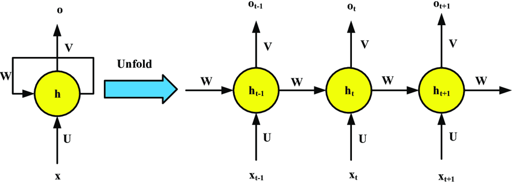
  <br>
  <em>The same cell (same weights) is applied at every time step, passing its hidden state forward.</em>
</p>

- **Memory:** $h_t$ carries information forward.
- **Weight sharing:** the same weights are used at every step.
- **Variable length:** it works for sequences of any length.

### 3.2 The vanilla RNN

```math
h_t = \tanh\big(W_{xh}\, x_t + W_{hh}\, h_{t-1} + b_h\big), \qquad y_t = W_{hy}\, h_t + b_y
```

- $x_t$ is the input at step $t$, and $h_{t-1}$ the previous hidden state ($h_0 = 0$).
- $W_{xh}$ (input → hidden), $W_{hh}$ (hidden → hidden) and $W_{hy}$ (hidden → output) are shared across all time steps.

The notebook forecasts a **synthetic time series** with sliding windows. It also unrolls the trained `nn.RNN` by hand, step by step, to show that the formula above reproduces PyTorch exactly.

### 3.3 Training: backpropagation through time (BPTT)

1. **Unroll** the RNN over the sequence, so it looks like a deep feed-forward network with one layer per time step.
2. Run ordinary backpropagation from the last step back to the first.
3. **Add up** the gradients of the shared weights over all the time steps.

### 3.4 Vanishing and exploding gradients

The gradient from step $t$ back to step $t - k$ is a **product of $k$ Jacobians**:

```math
\frac{\partial h_t}{\partial h_{t-k}} = \prod_{i=1}^{k} \frac{\partial h_{t-i+1}}{\partial h_{t-i}}
```

- If these factors are mostly **< 1**, the gradient **vanishes** and the RNN forgets the distant past.
- If they are mostly **> 1**, the gradient **explodes**. Fix this with gradient clipping:

```python
torch.nn.utils.clip_grad_norm_(model.parameters(), max_norm=1.0)
```

For vanishing gradients, the real fix is a **gated** cell: an LSTM or GRU.

### 3.5 LSTM: long short-term memory

An LSTM adds a separate **cell state** $C_t$, a "conveyor belt" that carries information across many steps. Three **gates** (sigmoids between 0 and 1) control it:

<p align="center">
  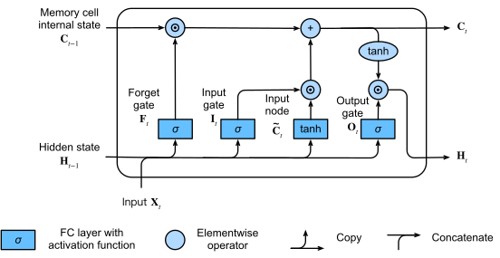
  <br>
  <em>The LSTM cell: the forget, input and output gates control the cell state.</em>
</p>

| Gate | Formula | Decides |
|---|---|---|
| Forget | $f_t = \sigma(W_f [h_{t-1}, x_t] + b_f)$ | What to erase from memory |
| Input | $i_t = \sigma(W_i [h_{t-1}, x_t] + b_i)$ | What new information to write |
| Candidate | $\tilde{C}_t = \tanh(W_C [h_{t-1}, x_t] + b_C)$ | The new information itself |
| Output | $o_t = \sigma(W_o [h_{t-1}, x_t] + b_o)$ | What to reveal as the hidden state |

```math
C_t = f_t \odot C_{t-1} + i_t \odot \tilde{C}_t, \qquad h_t = o_t \odot \tanh(C_t)
```

The key is the **additive** update of $C_t$. Gradients can flow along the cell state without being squashed at every step.

### 3.6 GRU: gated recurrent unit

A GRU is a slimmer LSTM: two gates and no separate cell state.

<p align="center">
  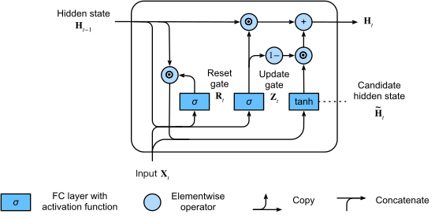
  <br>
  <em>The GRU cell: the reset and update gates.</em>
</p>

```math
r_t = \sigma(W_r [h_{t-1}, x_t]), \qquad z_t = \sigma(W_z [h_{t-1}, x_t])
```

```math
\tilde{h}_t = \tanh(W_h [r_t \odot h_{t-1},\, x_t]), \qquad h_t = (1 - z_t) \odot h_{t-1} + z_t \odot \tilde{h}_t
```

- The **reset** gate $r_t$ controls how much of the past to use when forming the candidate.
- The **update** gate $z_t$ blends the old state with the candidate.

### 3.7 RNN vs LSTM vs GRU

| | RNN | LSTM | GRU |
|---|---|---|---|
| Parameters | Fewest | Most (4 weight blocks) | Medium (3 blocks) |
| Speed | Fastest | Slowest | Medium |
| Long-term memory | Poor | Excellent | Good |
| Vanishing gradients | Severe | Largely solved | Largely solved |
| Use when | Short sequences, learning | Long, complex dependencies | A good default, about as accurate as LSTM |

---

## 4. Transformers: attention is all you need

<p align="center">
  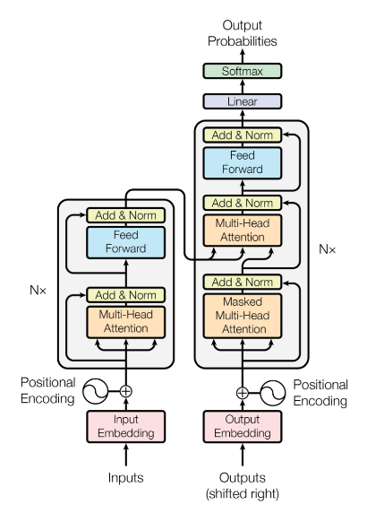
  <br>
  <em>The Transformer from Vaswani et al. (2017): an encoder (left) and a decoder (right).</em>
</p>

### 4.1 Why Transformers?

RNNs read a sequence **one token at a time**. That's slow (no parallelism), and information from far back has to survive many steps.

The Transformer drops recurrence entirely. With **self-attention**, every token looks directly at **every other token** in a single step:

- the path between any two positions has length 1, so long-range links are easy
- all positions are processed **in parallel**, so training is fast on GPUs

### 4.2 Scaled dot-product attention

Each token produces three vectors:

- a **query** $q$: "what am I looking for?"
- a **key** $k$: "what do I contain?"
- a **value** $v$: "what will I pass on?"

```math
\text{Attention}(Q, K, V) = \text{softmax}\left(\frac{QK^\top}{\sqrt{d_k}} + M\right) V
```

Step by step, for token $i$:

1. **Score** every token $j$: $e_{ij} = \frac{q_i \cdot k_j}{\sqrt{d_k}}$.
2. **Normalise** the scores with softmax, giving weights $\alpha_{ij}$ that sum to 1.
3. **Mix** the values: $o_i = \sum_j \alpha_{ij} v_j$.

> [!NOTE]
> **Why divide by $\sqrt{d_k}$?** Dot products of long vectors are large. Large scores push the softmax into a near one-hot region where the gradients are tiny. Dividing by $\sqrt{d_k}$ keeps the scores at unit variance.

The notebook checks its attention against `F.scaled_dot_product_attention`.

### 4.3 Masks

The mask $M$ is added to the scores before the softmax. Entries of $-\infty$ get zero attention.

- **Padding mask:** ignore `<pad>` tokens.
- **Causal (look-ahead) mask:** in the decoder, position $i$ may only see positions $j \le i$, so it can't peek at the answer:

```math
M_{ij} = \begin{cases} 0 & \text{if } j \le i \\ -\infty & \text{if } j > i \end{cases}
```

### 4.4 Multi-head attention

Instead of one attention, run $h$ smaller ones **in parallel**, each with its own learned projections, then concatenate the results:

```math
\text{head}_i = \text{Attention}(Q W_i^Q,\; K W_i^K,\; V W_i^V), \qquad \text{MultiHead} = \text{Concat}(\text{head}_1, \dots, \text{head}_h)\, W^O
```

Each head has size $d_k = d_{\text{model}} / h$. Different heads can learn different relationships, such as syntax, nearby words or coreference.

### 4.5 Positional encoding

Attention treats its input as a **set**: shuffling the tokens shuffles the output in the same way. To give the model a sense of order, a **positional encoding** is added to each token embedding:

```math
PE_{(pos,\, 2i)} = \sin\left(\frac{pos}{10000^{2i/d_{\text{model}}}}\right), \qquad PE_{(pos,\, 2i+1)} = \cos\left(\frac{pos}{10000^{2i/d_{\text{model}}}}\right)
```

Each position gets a unique pattern of waves at different frequencies, and $PE_{pos+k}$ is a linear function of $PE_{pos}$. That makes **relative** positions easy to learn.

### 4.6 The encoder and decoder layers

**Encoder layer** (stacked $N$ times):

1. multi-head **self-attention**, then add & norm
2. a position-wise **feed-forward network**, $\text{FFN}(x) = \max(0, xW_1 + b_1)\,W_2 + b_2$ with $d_{ff} = 4\, d_{\text{model}}$, then add & norm

**Decoder layer** (stacked $N$ times):

1. **masked** self-attention over the output so far
2. **cross-attention**: queries come from the decoder, keys and values from the encoder's output
3. a feed-forward network

There's an add & norm after each step.

**Add & norm** means a residual connection followed by layer normalisation, $\text{LayerNorm}(x + \text{Sublayer}(x))$. This is the original *post-norm* layout, and it's what the notebook implements. Many modern models use *pre-norm*, $x + \text{Sublayer}(\text{LayerNorm}(x))$, which trains more stably in deep stacks.

The notebook trains a small Transformer on a toy task, **reversing sequences**, and then decodes greedily one token at a time.

### 4.7 Training tricks from the paper

- **Adam** with $\beta = (0.9, 0.98)$ and $\epsilon = 10^{-9}$.
- **Warm-up, then decay:** the learning rate rises linearly for the first 4,000 steps, then decays with $1/\sqrt{\text{step}}$:

```math
\text{lr} = d_{\text{model}}^{-0.5} \cdot \min\left(\text{step}^{-0.5},\; \text{step} \cdot \text{warmup}^{-1.5}\right)
```

- **Dropout** on the attention weights and the sub-layer outputs.
- **Label smoothing** ($\epsilon = 0.1$): the target puts $1 - \epsilon$ on the true token and spreads $\epsilon$ over the rest, which discourages over-confidence.

### 4.8 Why it took over

Transformers have very few built-in assumptions, unlike CNNs (locality) or RNNs (order). That makes them flexible but data-hungry. Their performance improves predictably as model size, data and compute grow (*scaling laws*). That's why they now power language models, vision (ViT), audio and multimodal systems.

---

## 5. Optimisers, schedules and regularisation

Training a network involves three questions:

1. **Optimiser:** how do we step through the loss landscape?
2. **Schedule:** how should the step size change over time?
3. **Regularisation:** how do we make sure the model generalises?

The notebook compares the answers on **Fashion-MNIST** with a small MLP.

### 5.1 SGD

```math
\boldsymbol{\theta} \leftarrow \boldsymbol{\theta} - \eta\, \nabla_{\boldsymbol{\theta}} \mathcal{L}_{\text{batch}}
```

The mini-batch gradient is a **noisy but unbiased** estimate of the true gradient. Its variance falls as $1/B$ with the batch size $B$.

<p align="center">
  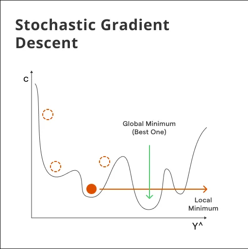
  <br>
  <em>On a non-convex loss, SGD can settle in a local minimum.</em>
</p>

Weaknesses:

- it zig-zags in narrow valleys
- every parameter shares the same learning rate
- it slows down near saddle points

### 5.2 SGD with momentum

Like a heavy ball rolling downhill, momentum **accumulates velocity**:

```math
\mathbf{v} \leftarrow \mu \mathbf{v} + \mathbf{g}, \qquad \boldsymbol{\theta} \leftarrow \boldsymbol{\theta} - \eta\, \mathbf{v}
```

- Gradients that consistently point the same way **add up**: the effective step grows towards $\frac{\eta}{1 - \mu}$.
- Gradients that keep flipping sign **cancel out**, which damps the oscillations.
- The typical value is $\mu = 0.9$.
- **Nesterov** momentum evaluates the gradient at the "looked-ahead" position $\boldsymbol{\theta} - \eta\mu\mathbf{v}$, which often converges a little faster.

### 5.3 Adaptive methods

These give **each parameter its own learning rate**, scaled by how large its recent gradients have been.

| Optimiser | Update | Key idea |
|---|---|---|
| **AdaGrad** | $G \mathrel{+}= g^2$, then $\theta \mathrel{-}= \frac{\eta}{\sqrt{G} + \epsilon}\, g$ | Rare features get bigger steps. But $G$ only grows, so learning eventually stops |
| **RMSProp** | $v \leftarrow \rho v + (1 - \rho)\, g^2$, then $\theta \mathrel{-}= \frac{\eta}{\sqrt{v} + \epsilon}\, g$ | A moving average, so old gradients are forgotten. $\rho = 0.9$ |
| **Adam** | Momentum *and* RMSProp, with bias correction (below) | The default choice |
| **AdamW** | Adam with weight decay applied **directly** to the weights | Better regularisation than Adam with an L2 term |

**Adam in full:**

```math
\mathbf{m} \leftarrow \beta_1 \mathbf{m} + (1 - \beta_1)\, \mathbf{g}, \qquad \mathbf{v} \leftarrow \beta_2 \mathbf{v} + (1 - \beta_2)\, \mathbf{g}^2
```

```math
\hat{\mathbf{m}} = \frac{\mathbf{m}}{1 - \beta_1^t}, \qquad \hat{\mathbf{v}} = \frac{\mathbf{v}}{1 - \beta_2^t}, \qquad \boldsymbol{\theta} \leftarrow \boldsymbol{\theta} - \eta\, \frac{\hat{\mathbf{m}}}{\sqrt{\hat{\mathbf{v}}} + \epsilon}
```

- $\mathbf{m}$ is the running average of the gradients (momentum).
- $\mathbf{v}$ is the running average of the squared gradients (scale).
- **Bias correction** fixes the fact that $\mathbf{m}$ and $\mathbf{v}$ start at zero, which would make the first steps too small.
- The defaults are $\beta_1 = 0.9$, $\beta_2 = 0.999$, $\epsilon = 10^{-8}$ and $\eta = 10^{-3}$.

The notebook implements Adam from scratch and checks it against `torch.optim.Adam`.

### 5.4 Learning-rate schedules

A high learning rate makes fast early progress but bounces around the minimum. A low one is precise but slow. So **start high and decrease**.

| Schedule | Formula / rule | PyTorch |
|---|---|---|
| Step decay | $\eta_t = \eta_0 \cdot \gamma^{\lfloor t / s \rfloor}$, for example ÷10 every $s$ epochs | `StepLR` |
| Exponential | $\eta_t = \eta_0 \cdot \gamma^t$ | `ExponentialLR` |
| Reduce on plateau | Multiply by `factor` when the validation loss stops improving for `patience` epochs | `ReduceLROnPlateau` |
| **Cosine annealing** | $\eta_t = \eta_{\min} + \frac{1}{2}(\eta_{\max} - \eta_{\min})\left(1 + \cos\frac{\pi t}{T}\right)$ | `CosineAnnealingLR` |
| Cosine with restarts | Cosine, periodically reset to $\eta_{\max}$ | `CosineAnnealingWarmRestarts` |
| **Warm-up** | Ramp up linearly from about 0 over the first steps | `LinearLR`, essential for Transformers |

```python
scheduler = torch.optim.lr_scheduler.StepLR(optimizer, step_size=10, gamma=0.1)
# call scheduler.step() once per epoch, after optimizer.step()
```

### 5.5 Regularisation

A network that is big enough can memorise its training set. Regularisation pushes it to learn patterns that **generalise** instead.

**L2 regularisation / weight decay**

```math
\mathcal{L}_{\text{total}} = \mathcal{L} + \frac{\lambda}{2} \lVert \boldsymbol{\theta} \rVert^2 \quad \Rightarrow \quad \boldsymbol{\theta} \leftarrow (1 - \eta\lambda)\,\boldsymbol{\theta} - \eta \nabla \mathcal{L}
```

Every step shrinks the weights slightly, which is why it's called *decay*. It is equivalent to a Gaussian prior on the weights. In PyTorch, pass `weight_decay=λ` to the optimiser, or better, use `AdamW`.

**Dropout**

During training, each unit is zeroed with probability $p$, and the survivors are scaled by $\frac{1}{1 - p}$ so the expected value stays the same. At evaluation time, nothing is dropped.

<p align="center">
  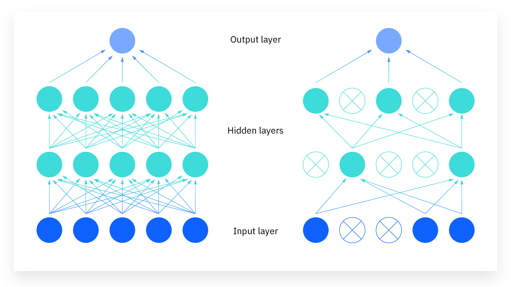
  <br>
  <em>Left: the full network. Right: one training step with dropout. Crossed-out units are switched off.</em>
</p>

- No unit can rely on any particular other unit, which prevents co-adaptation.
- It acts like training and averaging an **ensemble** of many thinned networks.
- Typical rates: $p$ = 0.1–0.5. Use it mostly in fully connected layers. For CNNs, *spatial dropout* drops whole channels.

**Other tools**

| Technique | How it helps |
|---|---|
| **Early stopping** | Track the validation loss, keep the best checkpoint, and stop after `patience` epochs without improvement |
| **Data augmentation** | Flips, crops and colour jitter (images), back-translation (text), noise (audio). Teaches invariances for free |
| Mixup / CutMix | Blend two examples, and their labels, into one |
| **BatchNorm / LayerNorm** | Mainly a training aid, but the noise from batch statistics also regularises slightly |

### 5.6 A practical recipe

| Decision | Good default |
|---|---|
| Optimiser | **Adam** or **AdamW** at $10^{-3}$ (Transformers: $3 \times 10^{-4}$ with warm-up). SGD + momentum 0.9 can generalise better with a tuned schedule |
| Schedule | Cosine annealing for a fixed budget. ReduceLROnPlateau if you watch the validation loss |
| Regularisation | Always early stopping. Weight decay $10^{-5}$ to $10^{-2}$. Dropout 0.1–0.5. Data augmentation where it makes sense |
| What to tune first | 1. learning rate → 2. batch size → 3. model size → 4. regularisation → 5. schedule |

> [!TIP]
> **Debugging a network:** first make sure it can **overfit a single small batch**. If it can't, there's a bug in the model, the loss or the data pipeline.
