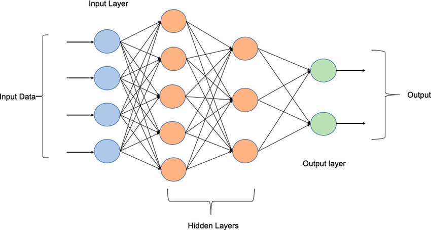

# Neural Networks & Deep Learning

## Multi-Layer Perceptrons (MLPs)
A Multi-Layer Perceptron (MLP) is a fundamental type of **feedforward artificial neural network**. It is characterized by having one or more **hidden layers** of neurons between its input and output layers, allowing it to learn non-linear relationships in data.

#### Basic Structure
An MLP typically consists of:
*   **Input Layer:** Receives the raw input features.
*   **One or More Hidden Layers:** These layers perform intermediate computations. Each neuron in a hidden layer typically applies a linear transformation to the outputs of the previous layer, followed by a non-linear **activation function**.
*   **Output Layer:** Produces the final output of the network (e.g., class probabilities for classification, a continuous value for regression). It also usually involves a linear transformation and an optional activation function suitable for the task.

Fig. Basic MLP Structure Diagram - Input, Hidden, Output Layers

**3-Layer MLP Architecture:**

-   **Input Layer:** $\large \mathbf{x} \in \mathbb{R}^{n_{input}}$
-   **Hidden Layer 1:** $\large n_1$ neurons with tanh activation
-   **Hidden Layer 2:** $\large n_2$ neurons with tanh activation
-   **Output Layer:** $\large n_{classes}$ neurons with softmax activation

**Mathematical Representation:** 

$$\large 
\mathbf{z}^{(1)} = \mathbf{x} \mathbf{W}^{(1)} + \mathbf{b}^{(1)}, \quad \mathbf{a}^{(1)} = \tanh(\mathbf{z}^{(1)})$$ $$\mathbf{z}^{(2)} = \mathbf{a}^{(1)} \mathbf{W}^{(2)} + \mathbf{b}^{(2)}, \quad \mathbf{a}^{(2)} = \tanh(\mathbf{z}^{(2)})$$ $$\mathbf{z}^{(3)} = \mathbf{a}^{(2)} \mathbf{W}^{(3)} + \mathbf{b}^{(3)}, \quad \mathbf{p} = \text{softmax}(\mathbf{z}^{(3)})
$$

#### Feedforward Operation
During the forward pass, data flows from the input layer, through the hidden layers, to the output layer. At each neuron in a hidden or output layer:
1.  A weighted sum of its inputs (outputs from the previous layer) plus a bias term is calculated. This is the **linear transformation** or **pre-activation** ($z$).
    For a neuron $\large j$ in layer $\large l$, receiving inputs $\large a_i^{(l-1)}$ from layer $\large l-1$:

$$\large 
z_j^{(l)} = \sum_i w_{ji}^{(l)} a_i^{(l-1)} + b_j^{(l)}
$$

In matrix form for all neurons in layer $\large l$: $\large \mathbf{z}^{(l)} = \mathbf{W}^{(l)} \mathbf{a}^{(l-1)} + \mathbf{b}^{(l)}$
2.  This sum $\large z_j^{(l)}$ is then passed through a non-linear **activation function** $\large g(\cdot)$ to produce the neuron's output $\large a_j^{(l)}$:

$$\large 
a_j^{(l)} = g(z_j^{(l)})
$$

### Key Components for a "Scratch" MLP
To build an MLP from scratch, we need to define:

#### Parameters (Weights and Biases)
*   **Weights ($\large W$):** Represent the strength of connections between neurons in successive layers. $\large W^{(l)}$ is the weight matrix connecting layer $\large l-1$ to layer $\large l$.
*   **Biases ($\large b$):** An additional parameter for each neuron (except input neurons) that allows the activation function to be shifted. $\large b^{(l)}$ is the bias vector for layer $\large l$.
These are the parameters the network learns during training.

#### Activation Functions (e.g., Hyperbolic Tangent) & Their Derivatives
Activation functions introduce non-linearity, enabling MLPs to learn complex patterns.
**Function:** 

$$\large 
\tanh(z) = \frac{e^z - e^{-z}}{e^z + e^{-z}} = \frac{e^{2z} - 1}{e^{2z} + 1}
$$

**Properties:**

-   Range: $\large (-1, 1)$
-   Zero-centered (unlike sigmoid)
-   Symmetric around origin

**Derivative:** 

$$\large 
\frac{d}{dz}\tanh(z) = 1 - \tanh^2(z)
$$

**Proof:** 

$$\large 
\frac{d}{dz}\tanh(z) = \frac{d}{dz}\left(\frac{e^z - e^{-z}}{e^z + e^{-z}}\right) = \frac{(e^z + e^{-z})^2 - (e^z - e^{-z})^2}{(e^z + e^{-z})^2} = 1 - \tanh^2(z)
$$

The derivative of the activation function is crucial for backpropagation.

#### Loss Function (e.g., Binary Cross-Entropy) & Its Derivative
The loss function measures the discrepancy between the network's predictions and the true target values.
*   **Binary Cross-Entropy (BCE) Loss (for binary classification):**

$$\large 
L = -\frac{1}{m} \sum_{i=1}^{m} [y^{(i)} \log(a_{out}^{(i)}) + (1-y^{(i)}) \log(1 - a_{out}^{(i)})]
$$

where $\large a_{out}$ is the output activation (predicted probability from the final sigmoid).
*   **Derivative of BCE Loss w.r.t. $a_{out}$:** Needed for backpropagation.

$$\large 
\frac{\partial L}{\partial a_{out}} = \frac{a_{out} - y}{a_{out}(1 - a_{out})}
$$ 

(for a single sample)

### The Forward Pass
This involves propagating the input data through the network, layer by layer, applying linear transformations and activation functions, until the final output is produced.

### Algorithm for Forward Pass 
Given input batch $\large \mathbf{X}$, weights $\large \mathbf{W}^{(1)}, \mathbf{W}^{(2)}$, biases $\large \mathbf{b}^{(1)}, \mathbf{b}^{(2)}$, and activation function $\large \tanh(\cdot)$:
**Layer 1:** 

$$\large 
\mathbf{Z}^{(1)} = \mathbf{X} \mathbf{W}^{(1)} + \mathbf{b}^{(1)} \in \mathbb{R}^{m \times n_1}
$$

$$\large 
\mathbf{A}^{(1)} = \tanh(\mathbf{Z}^{(1)}) \in \mathbb{R}^{m \times n_1}
$$

**Layer 2:** 

$$\large 
\mathbf{Z}^{(2)} = \mathbf{A}^{(1)} \mathbf{W}^{(2)} + \mathbf{b}^{(2)} \in \mathbb{R}^{m \times n_2}
$$

$$\large 
\mathbf{A}^{(2)} = \tanh(\mathbf{Z}^{(2)}) \in \mathbb{R}^{m \times n_2}
$$

**Output Layer:** 

$$\large 
\mathbf{Z}^{(3)} = \mathbf{A}^{(2)} \mathbf{W}^{(3)} + \mathbf{b}^{(3)} \in \mathbb{R}^{m \times n_{classes}}
$$

$$\large 
\mathbf{P} = \text{softmax}(\mathbf{Z}^{(3)}) \in \mathbb{R}^{m \times n_{classes}}
$$

Where $\large m$ is the batch size.

### Backpropagation
Backpropagation is an algorithm for efficiently computing the gradients of the loss function with respect to all the weights and biases in the network. It relies on the **chain rule** from calculus.

#### The Chain Rule
If $\large L$ is a function of $\large a$, $\large a$ is a function of $\large z$, and $\large z$ is a function of $\large w$, then $\large \frac{\partial L}{\partial w} = \frac{\partial L}{\partial a} \cdot \frac{\partial a}{\partial z} \cdot \frac{\partial z}{\partial w}$. Backpropagation systematically applies this rule layer by layer, starting from the output layer and moving backward.

### Algorithm (Conceptual Steps for a 3-Layer MLP) 
Let $\large L$ be the loss, $\large a^{(2)}$ the output activation, $\large z^{(2)}$ the output pre-activation, $\large a^{(1)}$ the hidden activation, $\large z^{(1)}$ the hidden pre-activation, and $\large \mathbf{X}$ the input.
Let $\large g'(\cdot)$ be the derivative of the activation function.

#### Output Layer Gradients

**Softmax + Cross-Entropy Gradient (Elegant Result):** For the gradient w.r.t. output logits: 

$$\large 
\frac{\partial \mathcal{L}}{\partial z_j^{(3)}} = p_j - \mathbf{1}_{j=y}
$$

Where $\large \mathbf{1}_{j=y}$ is 1 if $\large j$ is the true class, 0 otherwise.

**In matrix form for the batch:** 

$$\large 
\frac{\partial J}{\partial \mathbf{Z}^{(3)}} = \frac{1}{m}(\mathbf{P} - \mathbf{Y}_{one_hot})
$$

**Weight and Bias Gradients:** 

$$\large 
\frac{\partial J}{\partial \mathbf{W}^{(3)}} = (\mathbf{A}^{(2)})^T \frac{\partial J}{\partial \mathbf{Z}^{(3)}}
$$

$$\large 
\frac{\partial J}{\partial \mathbf{b}^{(3)}} = \sum_{i=1}^{m} \frac{\partial J}{\partial \mathbf{Z}^{(3)}}
$$

#### Hidden Layer 2 Gradients

**Error Propagation:** 

$$\large 
\frac{\partial J}{\partial \mathbf{A}^{(2)}} = \frac{\partial J}{\partial \mathbf{Z}^{(3)}} (\mathbf{W}^{(3)})^T
$$

**Tanh Derivative Application:** 

$$\large 
\frac{\partial J}{\partial \mathbf{Z}^{(2)}} = \frac{\partial J}{\partial \mathbf{A}^{(2)}} \odot (1 - (\mathbf{A}^{(2)})^2)
$$

**In your code:** `dL_dZ2 = dL_dA2 * (1 - A2**2)`

**Weight and Bias Gradients:** 

$$\large 
\frac{\partial J}{\partial \mathbf{W}^{(2)}} = (\mathbf{A}^{(1)})^T \frac{\partial J}{\partial \mathbf{Z}^{(2)}}
$$

$$\large 
\frac{\partial J}{\partial \mathbf{b}^{(2)}} = \sum_{i=1}^{m} \frac{\partial J}{\partial \mathbf{Z}^{(2)}}
$$

#### Hidden Layer 1 Gradients

**Error Propagation:** 

$$\large 
\frac{\partial J}{\partial \mathbf{A}^{(1)}} = \frac{\partial J}{\partial \mathbf{Z}^{(2)}} (\mathbf{W}^{(2)})^T
$$

**Tanh Derivative Application:** 

$$\large 
\frac{\partial J}{\partial \mathbf{Z}^{(1)}} = \frac{\partial J}{\partial \mathbf{A}^{(1)}} \odot (1 - (\mathbf{A}^{(1)})^2)
$$

**Weight and Bias Gradients:** 

$$\large 
\frac{\partial J}{\partial \mathbf{W}^{(1)}} = \mathbf{X}^T \frac{\partial J}{\partial \mathbf{Z}^{(1)}}
$$ 

$$\large 
\frac{\partial J}{\partial \mathbf{b}^{(1)}} = \sum_{i=1}^{m} \frac{\partial J}{\partial \mathbf{Z}^{(1)}}
$$

Fig. Backpropagation Flow Diagram - Showing error signals flowing backward

### Gradient Descent for Parameter Updates
Once the gradients are computed via backpropagation, parameters are updated using Gradient Descent (or its variants):
**Learning Rate:** $\large \alpha = 0.1$

$$\large 
\mathbf{W}^{(l)} \leftarrow \mathbf{W}^{(l)} - \eta \frac{\partial L}{\partial \mathbf{W}^{(l)}}
$$

$$\large 
\mathbf{b}^{(l)} \leftarrow \mathbf{b}^{(l)} - \eta \frac{\partial L}{\partial \mathbf{b}^{(l)}}
$$

Where $\large \eta$ is the learning rate.

### Why Backpropagation Works?

#### Theoretical Foundation

1.  **Universal Approximation Theorem:** MLPs with sufficient hidden units can approximate any continuous function on a compact set.
    
2.  **Gradient-Based Optimization:** Backpropagation provides exact gradients, enabling efficient optimization via gradient descent.
    
3.  **Error Signal Propagation:** The algorithm efficiently distributes the error signal from the output back through all parameters.
    

#### Intuitive Understanding

-   **Forward pass:** Information flows forward to make predictions
-   **Backward pass:** Error information flows backward to update parameters
-   **Learning:** Parameters adjust to minimize the difference between predictions and targets

### Key Mathematical Properties

#### Vanishing Gradient Problem

For deep networks with sigmoid activations: 

$$\large 
|\sigma'(z)| \leq 0.25
$$

This can cause gradients to vanish exponentially in deep networks: 

$$\large 
\left|\frac{\partial J}{\partial \mathbf{W}^{(1)}}\right| \propto \prod_{l=2}^{L} |\mathbf{W}^{(l)}| \cdot |\sigma'(\mathbf{z}^{(l)})|
$$

#### Weight Initialization

Proper initialization is crucial. For sigmoid networks, Xavier initialization: 

$$\large 
W_{ij} \sim \mathcal{N}\left(0, \frac{1}{n_{in}}\right)
$$

Where $\large n_{in}$ is the number of input connections to the neuron.

This mathematical framework provides the complete foundation for understanding and implementing MLPs with backpropagation from first principles.