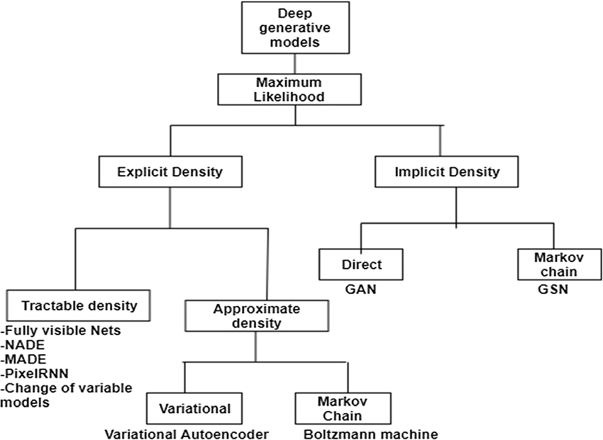
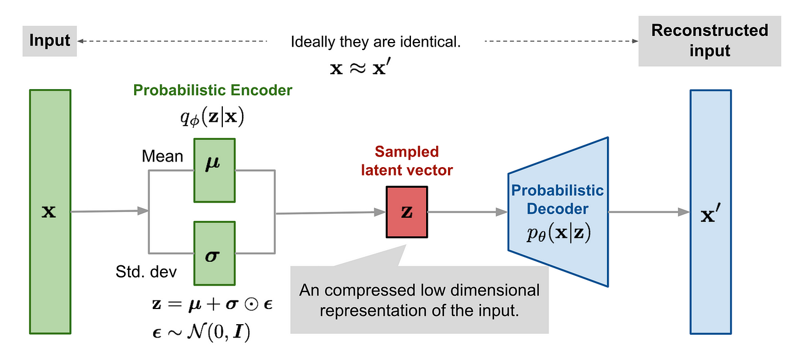
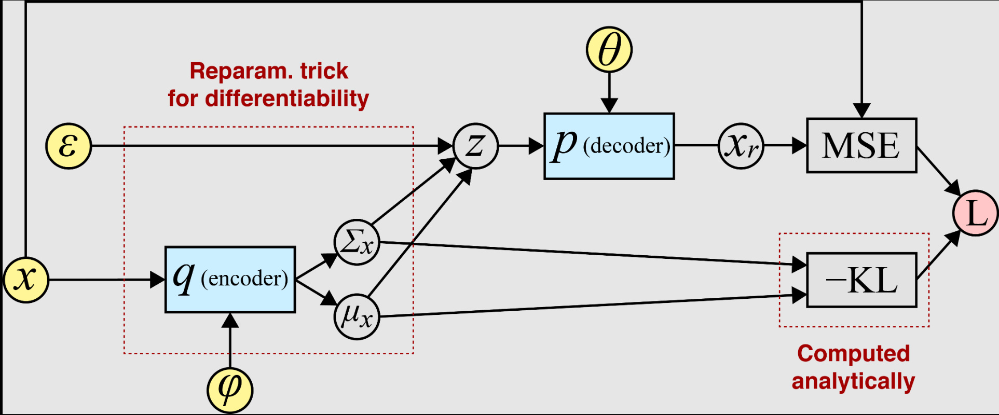
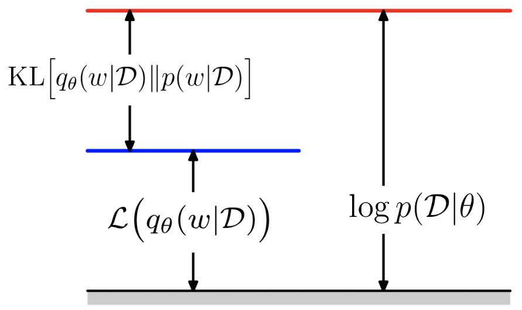
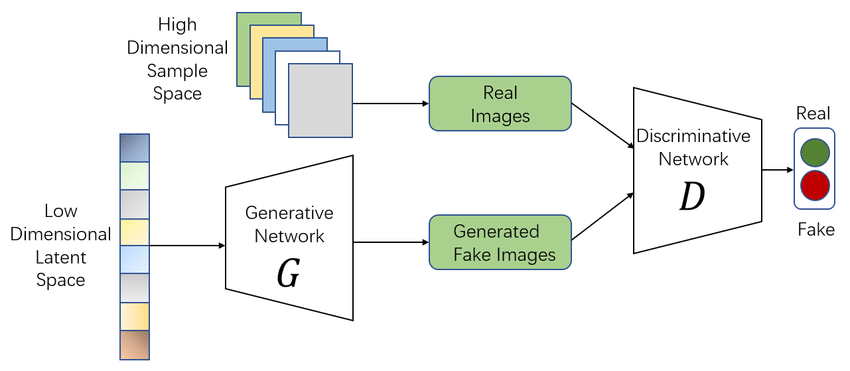
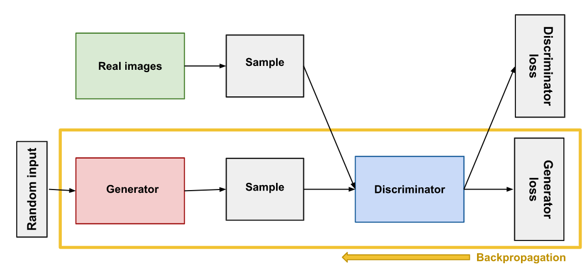

# Generative Models

Generative models constitute a fundamental class of machine learning algorithms that aim to learn and model the underlying probability distribution $\large p(\mathbf{x})$ of observed data $\large \mathbf{x}$. The primary objective is to capture the statistical structure of the data such that we can:

-   **Generate new samples**: Draw new data points $\large \mathbf{x}_{new} \sim p(\mathbf{x})$ that are statistically similar to the training data
-   **Density estimation**: Evaluate the likelihood $\large p(\mathbf{x})$ for any given data point
-   **Data completion**: Fill in missing parts of partially observed data
-   **Representation learning**: Learn meaningful low-dimensional representations of high-dimensional data

<div align="center">

<p>Fig. Taxonomy of Generative models</p>
</div>

### Mathematical Formulation

Given a dataset $\large \mathcal{D} = {\mathbf{x}^{(1)}, \mathbf{x}^{(2)}, \ldots, \mathbf{x}^{(N)}}$ where each $\large \mathbf{x}^{(i)} \in \mathbb{R}^D$, we seek to learn a model $\large p_{\theta}(\mathbf{x})$ parameterized by $\large \theta$ that approximates the true data distribution $\large p_{data}(\mathbf{x})$.

The maximum likelihood estimation (MLE) objective is: 

$$\large 
\theta^* = \arg\max_{\theta} \sum_{i=1}^{N} \log p_{\theta}(\mathbf{x}^{(i)})
$$

## Variational Autoencoders (VAEs)

### Variational Autoencoders vs. Standard Autoencoders

#### Standard Autoencoders

A standard autoencoder consists of:

-   **Encoder**: $\large f_{\phi}: \mathbb{R}^D \rightarrow \mathbb{R}^d$ mapping input $\large \mathbf{x}$ to latent code $\large \mathbf{h} = f_{\phi}(\mathbf{x})$
-   **Decoder**: $\large g_{\theta}: \mathbb{R}^d \rightarrow \mathbb{R}^D$ reconstructing $\large \hat{\mathbf{x}} = g_{\theta}(\mathbf{h})$

**Objective**: Minimize reconstruction error )|^2)

**Limitations**:

-   Deterministic encoding/decoding
-   No probabilistic interpretation
-   Latent space may have "holes" or discontinuities
-   Cannot generate new samples by sampling from latent space

#### Variational Autoencoders

VAEs introduce a probabilistic framework:

**Encoder (Recognition Model)**: 

$$\large 
q_{\phi}(\mathbf{z}|\mathbf{x}): \mathbb{R}^D \rightarrow \mathcal{P}(\mathbb{R}^d)
$$ 

Maps input to a probability distribution over latent variables

**Decoder (Generative Model)**: 

$$\large 
p_{\theta}(\mathbf{x}|\mathbf{z}): \mathbb{R}^d \rightarrow \mathcal{P}(\mathbb{R}^D)
$$ 

Maps latent variables to a probability distribution over data space

**Key Advantages**:

-   Probabilistic interpretation enables uncertainty quantification
-   Structured latent space suitable for generation
-   Principled regularization through prior matching
-   Enables sampling of new data points

<div align="center">

<p>Fig. Variational Autoencoders (VAEs)</p>
</div>

### Mathematical Foundation of VAEs

#### Latent Variable Model

VAEs are based on the latent variable model assumption: 

$$\large 
p(\mathbf{x}) = \int p(\mathbf{x}|\mathbf{z})p(\mathbf{z}),d\mathbf{z}
$$

Where:

-   $\large \mathbf{z} \in \mathbb{R}^d$ are latent variables (typically $\large d \ll D$)
-   $\large p(\mathbf{z})$ is the prior distribution over latent variables
-   $\large p(\mathbf{x}|\mathbf{z})$ is the likelihood of data given latent variables
-   $\large p(\mathbf{x})$ is the marginal likelihood (evidence)

#### The Intractability Problem

The posterior distribution $\large p(\mathbf{z}|\mathbf{x}) = \frac{p(\mathbf{x}|\mathbf{z})p(\mathbf{z})}{p(\mathbf{x})}$ is intractable because:

1.  **Marginal likelihood**: $\large p(\mathbf{x}) = \int p(\mathbf{x}|\mathbf{z})p(\mathbf{z}),d\mathbf{z}$ requires integration over all possible latent configurations
2.  **High-dimensional integration**: For neural networks, this integral has no closed form

#### Variational Inference Solution

VAEs employ **variational inference** to approximate the intractable posterior $\large p(\mathbf{z}|\mathbf{x})$ with a tractable variational distribution $\large q_{\phi}(\mathbf{z}|\mathbf{x})$.

The quality of approximation is measured by KL divergence: 

$$\large 
D_{KL}(q_{\phi}(\mathbf{z}|\mathbf{x}) | p(\mathbf{z}|\mathbf{x})) = \int q_{\phi}(\mathbf{z}|\mathbf{x}) \log \frac{q_{\phi}(\mathbf{z}|\mathbf{x})}{p(\mathbf{z}|\mathbf{x})} d\mathbf{z}
$$

### Core Components of VAEs

#### Probabilistic Encoder: $\large q_{\phi}(\mathbf{z}|\mathbf{x})$

The encoder network parameterizes the variational posterior. For computational tractability, we typically assume a factorized Gaussian form:

<div align="center">

%20=%20\mathcal{N}(\mathbf{z};%20\boldsymbol{\mu}_{\phi}(\mathbf{x}),%20\text{diag}(\boldsymbol{\sigma}^2_{\phi}(\mathbf{x}))))

</div>

Where:

-   $\large \boldsymbol{\mu}_{\phi}(\mathbf{x}) \in \mathbb{R}^d$ is the mean vector
-   $\large \boldsymbol{\sigma}^2_{\phi}(\mathbf{x}) \in \mathbb{R}^d$ is the variance vector (diagonal covariance)
-   $\large \phi$ represents the neural network parameters

**Neural Network Implementation**:

```
Input: x ∈ ℝᴰ
↓
Hidden Layers (ReLU/Tanh activations)
↓
Split into two heads:
μ_φ(x) ∈ ℝᵈ (linear output)
log σ²_φ(x) ∈ ℝᵈ (linear output, for numerical stability)

```

#### Probabilistic Decoder: $\large p_{\theta}(\mathbf{x}|\mathbf{z})$

The decoder network parameterizes the conditional likelihood of data given latent variables.

**For Continuous Data** (e.g., real-valued images): 

<div align="center">

%20=%20\mathcal{N}(\mathbf{x};%20\boldsymbol{\mu}_{\theta}(\mathbf{z}),%20\sigma^2_{dec}\mathbf{I}))

</div>

Where $\large \sigma^2_{dec}$ can be fixed or learned.

**For Binary Data** (e.g., binary images, text): 

$$\large 
p_{\theta}(\mathbf{x}|\mathbf{z}) = \prod_{i=1}^{D} \text{Bernoulli}(x_i; p_i)
$$

Where $\large p_i = \sigma(\mu_{\theta,i}(\mathbf{z}))$ and $\large \sigma(\cdot)$ is the sigmoid function.

#### Prior Distribution: $\large p(\mathbf{z})$

The prior distribution is typically chosen to be a standard multivariate Gaussian: 

$$\large 
p(\mathbf{z}) = \mathcal{N}(\mathbf{z}; \mathbf{0}, \mathbf{I})
$$

This choice provides several advantages:

-   **Simplicity**: Easy to sample from and compute KL divergence
-   **Regularity**: Encourages smooth latent space structure
-   **Interpretability**: Centered at origin with unit variance

**Alternative Priors**:

-   **Mixture of Gaussians**: $\large p(\mathbf{z}) = \sum_{k=1}^K \pi_k \mathcal{N}(\mathbf{z}; \boldsymbol{\mu}_k, \boldsymbol{\Sigma}_k)$
-   **Von Mises-Fisher**: For directional data
-   **Beta**: For bounded latent variables

#### The Reparameterization Trick

**Problem**: Direct sampling $\large \mathbf{z} \sim q_{\phi}(\mathbf{z}|\mathbf{x})$ is not differentiable with respect to $\large \phi$.

**Solution**: Reparameterize the sampling process to separate the stochastic and deterministic components.

**For Gaussian Distributions**: 

<div align="center">

%20+%20\boldsymbol{\sigma}_{\phi}(\mathbf{x})%20\odot%20\boldsymbol{\epsilon})

</div>

Where:

-   $\large \boldsymbol{\epsilon} \sim \mathcal{N}(\mathbf{0}, \mathbf{I})$ is auxiliary noise
-   $\large \odot$ denotes element-wise multiplication
-   %20=%20\exp(0.5%20\cdot%20\log%20\boldsymbol{\sigma}^2_{\phi}(\mathbf{x})))

**Gradient Flow**: 

<div align="center">

}[f(\mathbf{z})]%20=%20\mathbb{E}_{p(\boldsymbol{\epsilon})}\left[\frac{\partial%20f(\mathbf{z})}{\partial%20\mathbf{z}}%20\frac{\partial%20\mathbf{z}}{\partial%20\phi}\right])

</div>

<div align="center">

<p>Fig. The Reparameterization Trick</p>
</div>

### The VAE Objective: Evidence Lower Bound (ELBO) 

<div align="center">

<p>Fig. Evidence Lower Bound (ELBO)</p>
</div>

#### Problem Formulation

**Goal**: Maximize the marginal log-likelihood of observed data: 

<div align="center">

}))

</div>

**Challenge**: $\large \log p_{\theta}(\mathbf{x}) = \log \int p_{\theta}(\mathbf{x}|\mathbf{z})p(\mathbf{z}),d\mathbf{z}$ is intractable.

#### Variational Lower Bound

For any variational distribution $\large q_{\phi}(\mathbf{z}|\mathbf{x})$, we can write:

<div align="center">

%20=%20\mathbb{E}_{q_{\phi}(\mathbf{z}|\mathbf{x})}[\log%20p_{\theta}(\mathbf{x})]%20=%20\mathbb{E}_{q_{\phi}(\mathbf{z}|\mathbf{x})}\left[\log%20\frac{p_{\theta}(\mathbf{x},\mathbf{z})}{p_{\theta}(\mathbf{z}|\mathbf{x})}\right])

</div>

<div align="center">

}\left[\log%20\frac{p_{\theta}(\mathbf{x},\mathbf{z})q_{\phi}(\mathbf{z}|\mathbf{x})}{p_{\theta}(\mathbf{z}|\mathbf{x})q_{\phi}(\mathbf{z}|\mathbf{x})}\right])

</div>

<div align="center">

}\left[\log%20\frac{p_{\theta}(\mathbf{x},\mathbf{z})}{q_{\phi}(\mathbf{z}|\mathbf{x})}\right]}_{\text{ELBO}}%20+%20\underbrace{D_{KL}(q_{\phi}(\mathbf{z}|\mathbf{x})%20|%20p_{\theta}(\mathbf{z}|\mathbf{x}))}_{\geq%200})

</div>

#### ELBO Decomposition

The Evidence Lower Bound (ELBO) can be expressed as:

<div align="center">

%20=%20\mathbb{E}_{q_{\phi}(\mathbf{z}|\mathbf{x})}[\log%20p_{\theta}(\mathbf{x}|\mathbf{z})]%20-%20D_{KL}(q_{\phi}(\mathbf{z}|\mathbf{x})%20|%20p(\mathbf{z})))

</div>

**Two Interpretations**:

1.  **Reconstruction + Regularization**:
    
    -   **Reconstruction Term**: }[\log%20p_{\theta}(\mathbf{x}|\mathbf{z})])
    -   **Regularization Term**: $\large -D_{KL}(q_{\phi}(\mathbf{z}|\mathbf{x}) | p(\mathbf{z}))$
2.  **Rate-Distortion**:
    
    -   **Rate**: $\large D_{KL}(q_{\phi}(\mathbf{z}|\mathbf{x}) | p(\mathbf{z}))$ (information cost)
    -   **Distortion**: }[\log%20p_{\theta}(\mathbf{x}|\mathbf{z})]) (reconstruction error)

### Implementation Details

#### Network Architecture

**Encoder Architecture**:

```
Input: x ∈ ℝᴰ (e.g., 784 for MNIST)
↓
Linear(D, 512) + ReLU
↓
Linear(512, 256) + ReLU
↓
Split:
├── μ: Linear(256, d)
└── log σ²: Linear(256, d)

```

**Decoder Architecture**:

```
Input: z ∈ ℝᵈ
↓
Linear(d, 256) + ReLU
↓
Linear(256, 512) + ReLU
↓
Linear(512, D) + Sigmoid (for binary data)

```

#### Loss Function Implementation

**Total Loss (Negative ELBO)**: 


**Reconstruction Loss**:

-   **Binary Cross-Entropy** (for binary/normalized data): 

<div align="center">

\log(1-\hat{x}_i))

</div>
    
-   **Mean Squared Error** (for continuous data): 

<div align="center">

^2)

</div>
    

**KL Divergence Loss**: 

<div align="center">

)

</div>

#### β-VAE Extension

The β-VAE introduces a hyperparameter β to control the trade-off: 

<div align="center">

}[\log%20p_{\theta}(\mathbf{x}|\mathbf{z})]%20-%20\beta%20\cdot%20D_{KL}(q_{\phi}(\mathbf{z}|\mathbf{x})%20|%20p(\mathbf{z})))

</div>

**Effects of β**:

-   **β < 1**: Prioritizes reconstruction, may lead to posterior collapse
-   **β = 1**: Standard VAE
-   **β > 1**: Emphasizes disentanglement, may sacrifice reconstruction quality

## Generative Adversarial Networks (GANs)

Generative models aim to learn the underlying probability distribution $\large p_{data}(\mathbf{x})$ of a given dataset $\large \mathcal{D} = {\mathbf{x}^{(1)}, \mathbf{x}^{(2)}, \ldots, \mathbf{x}^{(N)}}$ where each $\large \mathbf{x}^{(i)} \in \mathbb{R}^d$. The ultimate goal is to generate new samples $\large \mathbf{x}_{new}$ that are indistinguishable from the original data distribution.

<div align="center">

<p>Generative Adversarial Networks (GANs)</p>
</div>

Traditional approaches to generative modeling include:

-   **Maximum Likelihood Estimation (MLE)**: Directly maximizing $\large \mathbb{E}_{\mathbf{x} \sim p_{data}}[\log p_{\theta}(\mathbf{x})]$
-   **Variational Autoencoders (VAEs)**: Using variational inference to approximate intractable posteriors
-   **Autoregressive Models**: Modeling $\large p(\mathbf{x}) = \prod_{i=1}^d p(x_i | x_{<i})$

#### The GAN Revolution

Generative Adversarial Networks, introduced by Goodfellow et al. (2014), revolutionized generative modeling by framing it as a **two-player zero-sum game** between:

1.  **Generator $\large G_{\theta_g}$**: Maps random noise $\large \mathbf{z} \sim p_z(\mathbf{z})$ to synthetic data $\large G(\mathbf{z})$
2.  **Discriminator $\large D_{\theta_d}$**: Distinguishes between real data $\large \mathbf{x} \sim p_{data}(\mathbf{x})$ and generated data $\large G(\mathbf{z})$

The key insight is that we don't need to explicitly model $\large p_{data}(\mathbf{x})$ instead, we implicitly learn it through adversarial training.

### Theoretical Foundations

#### Density Estimation vs. Implicit Generation

Classical generative models attempt to explicitly learn $\large p_{data}(\mathbf{x})$ by parameterizing a probability density function. This approach faces several challenges:

-   **Normalizing Constant**: Computing $\large \int p_{\theta}(\mathbf{x}) d\mathbf{x} = 1$ is often intractable
-   **Mode Coverage**: Ensuring the model captures all modes of complex, high-dimensional distributions
-   **Sample Quality**: Balancing likelihood maximization with sample quality

GANs sidestep these issues through **implicit density modeling**. Instead of learning $\large p_{data}(\mathbf{x})$ directly, GANs learn a transformation $\large G: \mathcal{Z} \rightarrow \mathcal{X}$ such that if $\large \mathbf{z} \sim p_z(\mathbf{z})$, then $\large G(\mathbf{z})$ follows a distribution close to $\large p_{data}(\mathbf{x})$.

#### Information-Theoretic Perspective

From an information theory standpoint, the discriminator $D$ estimates the density ratio:

$$\large 
D^*(\mathbf{x}) = \frac{p_{data}(\mathbf{x})}{p_{data}(\mathbf{x}) + p_g(\mathbf{x})}
$$

where $\large p_g(\mathbf{x})$ is the generator's induced distribution. This optimal discriminator provides a signal for improving the generator.

### Mathematical Formulation

#### The Minimax Objective

The GAN training objective is formulated as a minimax game:

<div align="center">

%20=%20\mathbb{E}_{\mathbf{x}%20\sim%20p_{data}(\mathbf{x})}[\log%20D(\mathbf{x})]%20+%20\mathbb{E}_{\mathbf{z}%20\sim%20p_z(\mathbf{z})}[\log(1%20-%20D(G(\mathbf{z})))])

</div>

Let's decompose this objective:

**Expected Value for Real Data:** 

<div align="center">

}[\log%20D(\mathbf{x})]%20=%20\int_{\mathcal{X}}%20p_{data}(\mathbf{x})%20\log%20D(\mathbf{x})%20d\mathbf{x})

</div>

**Expected Value for Generated Data:** 

<div align="center">

}[\log(1%20-%20D(G(\mathbf{z})))]%20=%20\int_{\mathcal{Z}}%20p_z(\mathbf{z})%20\log(1%20-%20D(G(\mathbf{z})))%20d\mathbf{z})

</div>

Using the change of variables $\large \mathbf{x} = G(\mathbf{z})$: 

$$\large 
= \int_{\mathcal{X}} p_g(\mathbf{x}) \log(1 - D(\mathbf{x})) d\mathbf{x}
$$

where $\large p_g(\mathbf{x})$ is the generator's induced distribution.

#### Optimal Discriminator Analysis

For a fixed generator $\large G$, the optimal discriminator $\large D^*$ maximizes:

$$\large 
V(D, G) = \int_{\mathcal{X}} [p_{data}(\mathbf{x}) \log D(\mathbf{x}) + p_g(\mathbf{x}) \log(1 - D(\mathbf{x}))] d\mathbf{x}
$$

Taking the functional derivative with respect to $\large D(\mathbf{x})$ and setting it to zero:

$$\large 
\frac{\delta V}{\delta D} = \frac{p_{data}(\mathbf{x})}{D(\mathbf{x})} - \frac{p_g(\mathbf{x})}{1 - D(\mathbf{x})} = 0
$$

Solving for $\large D^*(\mathbf{x})$:

$$\large 
D^*(\mathbf{x}) = \frac{p_{data}(\mathbf{x})}{p_{data}(\mathbf{x}) + p_g(\mathbf{x})}
$$

#### Global Optimum and Convergence

Substituting $\large D^*$ back into the value function:

<div align="center">

%20=%20\mathbb{E}_{\mathbf{x}%20\sim%20p_{data}}%20\left[\log%20\frac{p_{data}(\mathbf{x})}{p_{data}(\mathbf{x})%20+%20p_g(\mathbf{x})}\right]%20+%20\mathbb{E}_{\mathbf{x}%20\sim%20p_g}%20\left[\log%20\frac{p_g(\mathbf{x})}{p_{data}(\mathbf{x})%20+%20p_g(\mathbf{x})}\right])

</div>

This can be rewritten in terms of the Jensen-Shannon (JS) divergence:

$$\large 
V(D^*, G) = -\log 4 + 2 \cdot D_{JS}(p_{data} | p_g)
$$

where: 

$$\large 
D_{JS}(p_{data} | p_g) = \frac{1}{2}D_{KL}\left(p_{data} | \frac{p_{data} + p_g}{2}\right) + \frac{1}{2}D_{KL}\left(p_g | \frac{p_{data} + p_g}{2}\right)
$$

**Key Insight**: The global minimum is achieved when $\large p_g = p_{data}$, giving $\large V(D^_, G^_) = -\log 4$ and $\large D^*(\mathbf{x}) = \frac{1}{2}$ everywhere.

#### Alternative Generator Objectives

The original generator objective $\large \min_G \mathbb{E}_{\mathbf{z}}[\log(1 - D(G(\mathbf{z})))]$ can suffer from vanishing gradients. Common alternatives include:

**Non-saturating Loss:** 

$$\large 
\max_G \mathbb{E}_{\mathbf{z}}[\log D(G(\mathbf{z}))]
$$

**Least Squares GAN (LSGAN):** 

$$\large 
\min_G \mathbb{E}_{\mathbf{z}}[(D(G(\mathbf{z})) - 1)^2]
$$

**Wasserstein GAN:** 

<div align="center">

]%20-%20\mathbb{E}_{\mathbf{z}%20\sim%20p_z}[D(G(\mathbf{z}))])

</div>

### Game Theory Perspective

#### Nash Equilibrium

GANs can be viewed as a two-player zero-sum game where:

-   **Player 1 (Generator)**: Strategy space $\large \mathcal{G}$ (all possible generators)
-   **Player 2 (Discriminator)**: Strategy space $\large \mathcal{D}$ (all possible discriminators)
-   **Payoff Function**: $\large V(D, G)$

A Nash equilibrium $\large (G', D')$ satisfies: 

$$\large 
V(D', G') \leq V(D, G') \quad \forall D \in \mathcal{D}
$$ 

$$\large 
V(D', G') \geq V(D', G) \quad \forall G \in \mathcal{G}
$$

#### Mixed Strategy Interpretation

In practice, alternating optimization can be viewed as a mixed strategy where players alternate moves. The learning dynamics can be analyzed using concepts from evolutionary game theory.

#### Stackelberg Competition

Some GAN variants adopt a Stackelberg (leader-follower) framework where one network (typically the discriminator) acts as the leader, and the other responds optimally.

### Network Architectures

#### Deep Convolutional GANs (DCGANs)

For image generation, DCGANs use architectural guidelines:

<div align="center">

<p>Fig. Deep Convolutional GANs (DCGANs)</p>
</div>

**Generator Architecture:**

-   Input: Latent vector $\large \mathbf{z} \in \mathbb{R}^{n_z}$ (typically $\large n_z = 100$)
-   Fully connected layer: $\large \mathbf{z} \rightarrow \mathbb{R}^{4 \times 4 \times 512}$
-   Transposed convolutions with stride 2 for upsampling
-   Batch normalization after each layer (except output)
-   ReLU activation (except Tanh for output)

Mathematical representation: 

$$\large 
\mathbf{h}_0 = \text{Reshape}(\text{Linear}(\mathbf{z}))
$$ 

$$\large 
\mathbf{h}_{i+1} = \text{ConvTranspose2d}(\text{BatchNorm}(\text{ReLU}(\mathbf{h}_i)))
$$ 

$$\large 
\mathbf{x}_{gen} = \text{Tanh}(\text{ConvTranspose2d}(\mathbf{h}_L))
$$

**Discriminator Architecture:**

-   Input: Image $\large \mathbf{x} \in \mathbb{R}^{H \times W \times C}$
-   Strided convolutions for downsampling
-   LeakyReLU activation with slope 0.2
-   No batch normalization in first layer
-   Output: Single scalar (logit)

#### Progressive Growing

Progressive GANs start with low-resolution images and gradually increase resolution:

$$\large 
G_4: \mathbb{R}^{512} \rightarrow \mathbb{R}^{4 \times 4 \times 3}
$$ 

$$\large 
G_8: \mathbb{R}^{512} \rightarrow \mathbb{R}^{8 \times 8 \times 3}
$$ 

$$\large 
\vdots
$$ 

$$\large 
G_{1024}: \mathbb{R}^{512} \rightarrow \mathbb{R}^{1024 \times 1024 \times 3}
$$

#### StyleGAN Architecture

StyleGAN introduces style-based generation:

**Mapping Network:** $\large f: \mathcal{Z} \rightarrow \mathcal{W}$ 

$$\large 
\mathbf{w} = f(\mathbf{z})
$$

**Synthesis Network:** Uses adaptive instance normalization (AdaIN): 

<div align="center">

%20=%20\mathbf{y}_{s,i}%20\frac{\mathbf{x}_i%20-%20\mu(\mathbf{x}_i)}{\sigma(\mathbf{x}_i)}%20+%20\mathbf{y}_{b,i})

</div>

where ) are style parameters derived from $\large \mathbf{w}$.

### Loss Functions and Optimization

#### Binary Cross-Entropy Loss

The standard GAN loss uses binary cross-entropy:

**Discriminator Loss:** 

<div align="center">

]%20-%20\mathbb{E}_{\mathbf{z}%20\sim%20p_z}[\log(1%20-%20D(G(\mathbf{z})))])

</div>

**Generator Loss:** 

$$\large 
L_G = -\mathbb{E}_{\mathbf{z} \sim p_z}[\log D(G(\mathbf{z}))]
$$

#### Wasserstein Distance

WGAN uses the Wasserstein-1 distance: 

$$\large 
W_1(p_{data}, p_g) = \inf_{\gamma \in \Pi(p_{data}, p_g)} \mathbb{E}_{(\mathbf{x}, \mathbf{y}) \sim \gamma}[|\mathbf{x} - \mathbf{y}|]
$$

Using the Kantorovich-Rubinstein duality: 

<div align="center">

%20=%20\sup_{|f|_L%20\leq%201}%20\mathbb{E}_{\mathbf{x}%20\sim%20p_{data}}[f(\mathbf{x})]%20-%20\mathbb{E}_{\mathbf{x}%20\sim%20p_g}[f(\mathbf{x})])

</div>

#### Gradient Penalty

WGAN-GP adds a gradient penalty term: 

<div align="center">

]%20-%20\mathbb{E}_{\mathbf{x}%20\sim%20p_{data}}[D(\mathbf{x})]%20+%20\lambda%20\mathbb{E}_{\hat{\mathbf{x}}%20\sim%20p_{\hat{\mathbf{x}}}}[(|\nabla_{\hat{\mathbf{x}}}%20D(\hat{\mathbf{x}})|%20-%201)^2])

</div>

where $\large \hat{\mathbf{x}} = \epsilon \mathbf{x} + (1-\epsilon)\tilde{\mathbf{x}}$ with $\large \epsilon \sim \text{Uniform}[0,1]$.

#### Spectral Normalization

Spectral normalization constrains the Lipschitz constant: 

$$\large 
\bar{W} = W / \sigma(W)
$$

where $\large \sigma(W)$ is the spectral norm (largest singular value) of weight matrix $\large W$.