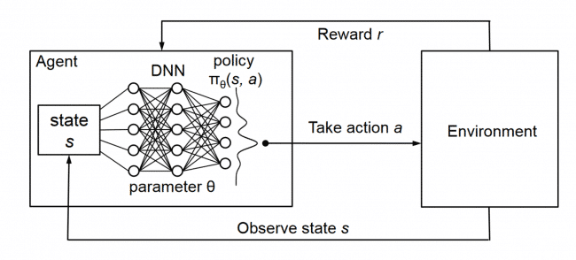
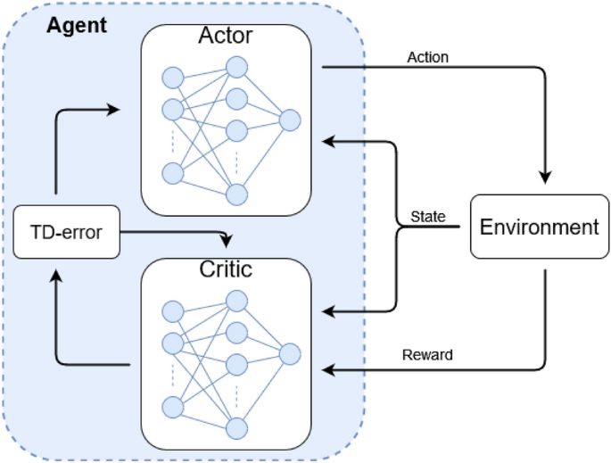

# Reinforcement Learning

## Fundamentals & Policy Gradients

### Introduction to Reinforcement Learning

#### The Agent-Environment Paradigm

Reinforcement Learning represents a computational approach to understanding and automating goal-directed learning and decision-making. Unlike supervised learning, where the correct action is provided, or unsupervised learning, where the goal is to find hidden structure, RL focuses on learning through interaction with an environment to maximize cumulative reward.

The fundamental interaction occurs through the **agent-environment loop**:

```
State(t) → Agent → Action(t) → Environment → Reward(t+1), State(t+1)

```

This cyclical process continues until either:

-   A terminal state is reached (episodic tasks)
-   A maximum number of steps is executed
-   The learning process is manually terminated

<div align="center">

<p>Fig. Reinforcement Learning</p>
</div>


#### Key Components and Terminology

**Agent ($\large \mathcal{A}$)**: The learner and decision-maker that perceives the environment and selects actions.

**Environment ($\large \mathcal{E}$)**: The external system with which the agent interacts. It encompasses everything outside the agent's direct control.

**State ($\large s \in \mathcal{S}$)**: A complete description of the world's current configuration that contains all information necessary for decision-making. The state space $\large \mathcal{S}$ contains all possible states.

**Action ($\large a \in \mathcal{A}$)**: A choice made by the agent that affects the environment. The action space $\large \mathcal{A}$ may be discrete (finite set) or continuous.

**Reward ($\large r \in \mathcal{R} \subseteq \mathbb{R}$)**: A scalar signal that indicates the immediate desirability of the agent's action. Rewards provide the only feedback mechanism for learning.

**Policy ($\large \pi$)**: The agent's strategy for selecting actions. It defines the mapping from states to actions or action probabilities.

**Value Function**: A function that estimates the expected long-term reward from states or state-action pairs under a given policy.

#### The RL Problem Statement

The central problem in RL can be formally stated as:

> **Given an environment modeled as an MDP, find a policy $\large \pi^*$ that maximizes the expected cumulative discounted reward.**

Mathematically, this translates to:

<div align="center">


</div>

where:

-   $\large \tau$ represents a trajectory (sequence of states, actions, and rewards)
-   $\large T$ is the time horizon (finite for episodic tasks, infinite for continuing tasks)
-   $\large \gamma \in [0,1]$ is the discount factor


### Mathematical Foundations: Markov Decision Processes

#### Formal MDP Definition

A Markov Decision Process provides the mathematical framework for modeling sequential decision-making problems. An MDP is formally defined by the tuple:

$$\large 
\mathcal{M} = (\mathcal{S}, \mathcal{A}, \mathcal{P}, \mathcal{R}, \gamma)
$$

where:

**State Space ($\large \mathcal{S}$)**: The set of all possible states. This can be:

-   Finite: $\large \mathcal{S} = {s_1, s_2, \ldots, s_n}$
-   Countably infinite: $\large \mathcal{S} = {s_1, s_2, s_3, \ldots}$
-   Continuous: $\large \mathcal{S} \subseteq \mathbb{R}^n$

**Action Space ($\large \mathcal{A}$)**: The set of all possible actions. Can be state-dependent $\large \mathcal{A}(s)$ or global $\large \mathcal{A}$.

**Transition Dynamics ($\large \mathcal{P}$)**: The probability distribution over next states given current state and action: 

$$\large 
\mathcal{P}(s' \mid s, a) = \Pr(S_{t+1} = s' \mid S_t = s, A_t = a)
$$

**Reward Function ($\large \mathcal{R}$)**: The expected immediate reward: 

$$\large 
\mathcal{R}(s, a) = \mathbb{E}[R_{t+1} \mid S_t = s, A_t = a]
$$

**Discount Factor ($\large \gamma$)**: A value in $\large [0, 1]$ that determines the present value of future rewards.

#### The Markov Property

The Markov property is the cornerstone assumption that makes RL mathematically tractable:

$$\large 
\Pr(S_{t+1} = s', R_{t+1} = r \mid S_0, A_0, R_1, \ldots, S_t, A_t) = \Pr(S_{t+1} = s', R_{t+1} = r \mid S_t, A_t)
$$

This states that the future depends only on the present state and action, not on the entire history. This assumption allows us to make optimal decisions based solely on current information.

#### Return and Discount Factor

The **return** $\large G_t$ represents the cumulative discounted reward from time $\large t$ onwards:

$$\large 
G_t = \sum_{k=0}^{\infty} \gamma^k R_{t+k+1}
$$

The discount factor $\large \gamma$ serves multiple purposes:

1.  **Mathematical Convenience**: Ensures convergence of infinite sums when $\large \gamma < 1$
2.  **Temporal Preference**: Models preference for immediate rewards over delayed ones
3.  **Uncertainty Modeling**: Accounts for uncertainty about the future

**Special Cases**:

-   $\large \gamma = 0$: Myopic agent (only immediate rewards matter)
-   $\large \gamma = 1$: Far-sighted agent (all future rewards equally important)
-   $\large \gamma \to 1$: Approaches undiscounted case

### Policies: The Heart of Decision Making

#### Deterministic vs. Stochastic Policies

**Deterministic Policy**: $\large \pi: \mathcal{S} \to \mathcal{A}$ 

$$\large 
a = \pi(s)
$$

**Stochastic Policy**: $\large \pi: \mathcal{S} \times \mathcal{A} \to [0, 1]$ 

$$\large 
\pi(a \mid s) = \Pr(A_t = a \mid S_t = s)
$$

with the constraint: $\large \sum_{a \in \mathcal{A}} \pi(a \mid s) = 1$ for all $\large s \in \mathcal{S}$.

#### Policy Representation

**Tabular Representation**: For small, discrete state and action spaces 

$$\large 
\pi(a \mid s) = \begin{cases} 0.7 & \text{if } a = a_1 \ 0.3 & \text{if } a = a_2 \ 0 & \text{otherwise} \end{cases}
$$

**Parametric Representation**: For large or continuous spaces 

$$\large 
\pi_\theta(a \mid s) = \frac{\exp(\phi(s, a)^T \theta)}{\sum_{a'} \exp(\phi(s, a')^T \theta)}
$$ 

(Softmax policy)

where $\large \phi(s, a)$ are feature vectors and $\large \theta$ are learnable parameters.

#### Policy Evaluation

Given a policy $\large \pi$, we can evaluate its performance through its value functions, which we'll explore in the next section.

### Value Functions: Quantifying Goodness

#### State-Value Functions

The **state-value function** $\large V^\pi(s)$ gives the expected return when starting in state $\large s$ and following policy $\large \pi$:

<div align="center">

%20=%20\mathbb{E}_\pi[G_t%20\mid%20S_t%20=%20s]%20=%20\mathbb{E}_\pi\left[\sum_{k=0}^{\infty}%20\gamma^k%20R_{t+k+1}%20\mid%20S_t%20=%20s\right])

</div>

#### Action-Value Functions

The **action-value function** $\large Q^\pi(s, a)$ gives the expected return when starting in state $\large s$, taking action $\large a$, and then following policy $\large \pi$:

<div align="center">

%20=%20\mathbb{E}_\pi[G_t%20\mid%20S_t%20=%20s,%20A_t%20=%20a]%20=%20\mathbb{E}_\pi\left[\sum_{k=0}^{\infty}%20\gamma^k%20R_{t+k+1}%20\mid%20S_t%20=%20s,%20A_t%20=%20a\right])

</div>

#### Bellman Equations

The Bellman equations express the recursive relationship between value functions:

**Bellman Expectation Equation for** : 

<div align="center">

%20=%20\sum_{a}%20\pi(a%20\mid%20s)%20\sum_{s%27,%20r}%20p(s%27,%20r%20\mid%20s,%20a)[r%20+%20\gamma%20V^\pi(s%27)])

</div>

**Bellman Expectation Equation for** : 

<div align="center">

%20=%20\sum_{s%27,%20r}%20p(s%27,%20r%20\mid%20s,%20a)\left[r%20+%20\gamma%20\sum_{a%27}%20\pi(a%27%20\mid%20s%27)%20Q^\pi(s%27,%20a%27)\right])

</div>

These equations form the basis for many RL algorithms, including temporal difference learning and Q-learning.

#### Optimal Value Functions

The **optimal state-value function** $\large V^(s)$ is the maximum value achievable from state $\large s$: 

$$\large 
V^(s) = \max_\pi V^\pi(s)
$$

The **optimal action-value function** $\large Q^(s, a)$ is the maximum value achievable from state $\large s$ taking action $\large a$: 

$$\large 
Q^(s, a) = \max_\pi Q^\pi(s, a)
$$

**Bellman Optimality Equations**: 

<div align="center">

%20=%20\max_a%20\sum_{s%27,%20r}%20p(s%27,%20r%20\mid%20s,%20a)[r%20+%20\gamma%20V^(s%27)])

</div>

<div align="center">

%20=%20\sum_{s%27,%20r}%20p(s%27,%20r%20\mid%20s,%20a)\left[r%20+%20\gamma%20\max_{a%27}%20Q^(s%27,%20a%27)\right])

</div>>

### Policy Gradient Methods: Direct Optimization

#### Motivation and Advantages

Policy gradient methods directly optimize the policy parameters $\theta$ to maximize expected return, offering several advantages:

1.  **Direct Optimization**: No need to compute value functions explicitly
2.  **Continuous Actions**: Natural handling of continuous action spaces
3.  **Stochastic Policies**: Can learn inherently stochastic optimal policies
4.  **Convergence Guarantees**: Under certain conditions, guaranteed to converge to local optima

#### Policy Gradient Theorem

The policy gradient theorem provides the foundation for policy gradient methods. It states that the gradient of the expected return with respect to policy parameters is:

<div align="center">

%20=%20\mathbb{E}_{\tau%20\sim%20\pi_\theta}\left[\sum_{t=0}^{T-1}%20\nabla_\theta%20\log%20\pi_\theta(A_t%20\mid%20S_t)%20G_t\right])

</div>

where:

-   %20=%20\mathbb{E}_{\tau%20\sim%20\pi_\theta}[R(\tau)]) is the objective function
-   $\large \tau$ is a trajectory sampled from policy $\large \pi_\theta$
-   $\large G_t$ is the return from time step $\large t$

#### Proof Sketch of Policy Gradient Theorem

The proof involves several key steps:

1.  **Express the objective function**: 

$$\large 
J(\theta) = \sum_\tau P(\tau \mid \theta) R(\tau)
$$
    
2.  **Take the gradient**: 

$$\large 
\nabla_\theta J(\theta) = \sum_\tau \nabla_\theta P(\tau \mid \theta) R(\tau)
$$
    
3.  **Use the log-derivative trick**: 

$$\large 
\nabla_\theta P(\tau \mid \theta) = P(\tau \mid \theta) \nabla_\theta \log P(\tau \mid \theta)
$$
    
4.  **Express trajectory probability**: 

$$\large 
P(\tau \mid \theta) = \rho_0(s_0) \prod_{t=0}^{T-1} \pi_\theta(a_t \mid s_t) p(s_{t+1} \mid s_t, a_t)
$$
    
5.  **Simplify the gradient**: 

$$\large 
\nabla_\theta \log P(\tau \mid \theta) = \sum_{t=0}^{T-1} \nabla_\theta \log \pi_\theta(a_t \mid s_t)
$$
    
6.  **Convert back to expectation**: 

<div align="center">

%20=%20\mathbb{E}_{\tau%20\sim%20\pi_\theta}\left[\sum_{t=0}^{T-1}%20\nabla_\theta%20\log%20\pi_\theta(A_t%20\mid%20S_t)%20R(\tau)\right])

</div>

### Gradient Ascent in Policy Space

With the policy gradient theorem, we can perform gradient ascent:

$$\large 
\theta_{t+1} = \theta_t + \alpha \nabla_\theta J(\theta_t)
$$

where $\large \alpha$ is the learning rate.

### REINFORCE Algorithm: Monte Carlo Policy Gradient

#### Algorithm Derivation

REINFORCE (REward Increment = Nonnegative Factor × Offset Reinforcement × Characteristic Eligibility) is the simplest policy gradient algorithm. It uses the policy gradient theorem directly with Monte Carlo sampling.

The key insight is to replace the return $\large R(\tau)$ in the policy gradient theorem with the actual return $\large G_t$ from each time step:

$$\large 
\nabla_\theta J(\theta) \approx \frac{1}{N} \sum_{i=1}^{N} \sum_{t=0}^{T_i-1} \nabla_\theta \log \pi_\theta(A_t^{(i)} \mid S_t^{(i)}) G_t^{(i)}
$$

#### Implementation Details

**Loss Function**: Since most optimizers perform gradient descent (minimization), we define: 

$$\large 
L(\theta) = -\frac{1}{N} \sum_{i=1}^{N} \sum_{t=0}^{T_i-1} \log \pi_\theta(A_t^{(i)} \mid S_t^{(i)}) G_t^{(i)}
$$

**Return Calculation**: For each time step $t$ in episode $\large i$: 

$$\large 
G_t^{(i)} = \sum_{k=t}^{T_i-1} \gamma^{k-t} R_{k+1}^{(i)}
$$

#### Variance Reduction Techniques

**Baseline Subtraction**: Subtract a state-dependent baseline $\large b(s)$ to reduce variance: 

<div align="center">

%20=%20\mathbb{E}_{\tau%20\sim%20\pi_\theta}\left[\sum_{t=0}^{T-1}%20\nabla_\theta%20\log%20\pi_\theta(A_t%20\mid%20S_t)%20(G_t%20-%20b(S_t))\right])

</div>

Common baselines include:

-   Moving average of returns
-   State-value function $\large V^\pi(s)$ (leading to Actor-Critic methods)

**Causality**: Only use future rewards for each action: 

<div align="center">

%20=%20\mathbb{E}_{\tau%20\sim%20\pi_\theta}\left[\sum_{t=0}^{T-1}%20\nabla_\theta%20\log%20\pi_\theta(A_t%20\mid%20S_t)%20\sum_{k=t}^{T-1}%20\gamma^{k-t}%20R_{k+1}\right])

</div>

## DQN & Actor-Critic Methods

### REINFORCE Limitations Recap

Basic policy gradients (REINFORCE) suffer from:

-   **High variance**: Monte Carlo returns $\large G_t = \sum_{k=0}^{T-t-1} \gamma^k R_{t+k+1}$ create noisy gradients
-   **Sample inefficiency**: On-policy learning discards old experiences
-   **Poor credit assignment**: Full episode returns may not accurately reflect individual action quality

### Deep Q-Networks (DQN)

DQN is a **value-based**, **off-policy** algorithm that learns the optimal action-value function using neural networks.

<div align="center">

<p>Fig. Deep Q-Learning </p>
</div>

#### Q-Learning Foundation

The optimal action-value function $\large Q^*(s,a)$ satisfies the Bellman optimality equation:

$$\large 
Q^*(s,a) = \mathbb{E}_{s'}[R(s,a,s') + \gamma \max_{a'} Q^*(s', a')]
$$

Traditional Q-learning update: 

$$\large 
Q(s,a) \leftarrow Q(s,a) + \alpha \underbrace{[r + \gamma \max_{a'} Q(s', a') - Q(s,a)]}_{\text{TD error}}
$$

#### Neural Network Approximation

DQN uses a neural network $\large Q(s,a;\theta)$ to approximate $\large Q^*(s,a)$:

-   **Input**: State $\large s$
-   **Output**: Q-values for all actions $\large [Q(s,a_1), Q(s,a_2), \ldots, Q(s,a_n)]$

#### Key Components

**Experience Replay Buffer**

-   Stores transitions $\large (s_t, a_t, r_{t+1}, s_{t+1}, \text{done}_t)$
-   Random sampling breaks temporal correlations and enables data reuse

**Target Network**

-   Separate network $\large Q_{\text{target}}$ updated periodically from main network
-   Stabilizes training by providing fixed targets: 

$$\large 
y_j = \begin{cases} r_j & \text{if terminal} \ r_j + \gamma \max_{a'} Q_{\text{target}}(s'_j, a') & \text{otherwise} \end{cases}
$$

**$\large \epsilon$-Greedy Exploration** 

$$\large 
a_t = \begin{cases} \text{random action} & \text{with probability } \epsilon \ \arg\max_{a} Q(s_t, a; \theta) & \text{with probability } 1-\epsilon \end{cases}
$$

#### DQN Loss Function

$$\large 
\mathcal{L}(\theta) = \mathbb{E}_{(s,a,r,s') \sim \mathcal{D}} \left[ \left(y - Q(s,a;\theta)\right)^2 \right]
$$

where $\large \mathcal{D}$ is the replay buffer and $\large y$ is the target value.

#### DQN Algorithm

1.  Initialize $\large Q(s,a;\theta)$ and target network $\large Q_{\text{target}}$
2.  Initialize replay buffer $\large \mathcal{D}$
3.  **For each episode:**
    -   Select actions using $\large \epsilon$-greedy policy
    -   Store transitions in $\large \mathcal{D}$
    -   Sample mini-batch from $\large \mathcal{D}$
    -   Compute targets using $\large Q_{\text{target}}$
    -   Update $\large Q$ via gradient descent on $\large \mathcal{L}(\theta)$
    -   Periodically update $\large Q_{\text{target}} \leftarrow Q$

### Actor-Critic Methods

Actor-Critic combines policy-based and value-based approaches using two networks:

-   **Actor** $\large \pi_\theta(a|s)$: Policy network (what to do)
-   **Critic** $\large V_w(s)$: Value network (how good is the state)

<div align="center">

<p>Fig. Actor-Critic reinforcement learning</p>
</div>

#### Advantage Function

Instead of raw returns, Actor-Critic uses the **advantage function**: 

$$\large 
A^\pi(s,a) = Q^\pi(s,a) - V^\pi(s)
$$

Common approximation using TD error: 

$$\large 
A(s_t, a_t) \approx R_{t+1} + \gamma V_w(S_{t+1}) - V_w(S_t)
$$

The advantage reduces variance by centering the policy gradient around the state value.

#### A2C (Advantage Actor-Critic)

**Actor Update**: Maximize expected advantage-weighted log-probability 

$$\large 
\nabla_\theta J(\theta) = \mathbb{E}\left[\nabla_\theta \log \pi_\theta(a_t|s_t) \cdot A(s_t, a_t)\right]
$$

Actor loss: 

<div align="center">

%20=%20-\sum_t%20\log%20\pi_\theta(a_t|s_t)%20\cdot%20A(s_t,%20a_t))

</div>

**Critic Update**: Minimize value prediction error 

<div align="center">

%20=%20\sum_t%20\left(V_{\text{target},t}%20-%20V_w(s_t)\right)^2)

</div>

where $\large V_{\text{target},t} = R_{t+1} + \gamma V_w(S_{t+1})$

#### A2C Algorithm

1.  Initialize Actor $\large \pi_\theta$ and Critic $\large V_w$
2.  **For each episode:**
    -   Collect trajectory using current policy $\large \pi_\theta$
    -   **For each step $\large t$:**
        -   Compute target: $\large V_{\text{target},t} = R_{t+1} + \gamma V_w(S_{t+1}) \cdot (1-\text{done}_{t+1})$
        -   Compute advantage: $\large A_t = V_{\text{target},t} - V_w(S_t)$
    -   Update Actor: $\large \theta \leftarrow \theta + \alpha_\theta \nabla_\theta \mathcal{L}_{\text{actor}}$
    -   Update Critic: $\large w \leftarrow w - \alpha_w \nabla_w \mathcal{L}_{\text{critic}}$