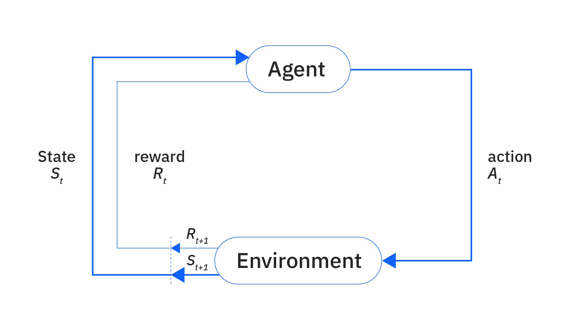
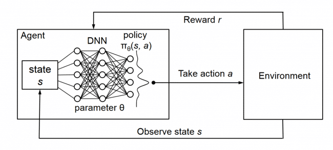
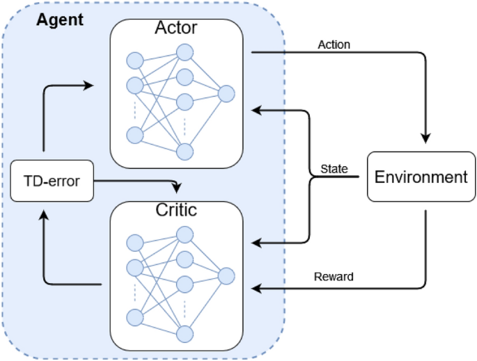

# 07 · Reinforcement Learning

In reinforcement learning (RL), nobody gives the model the right answers. An **agent** learns by **trial and error**: it acts, sees what happens, and is rewarded or penalised. Over time it learns a strategy that collects as much reward as possible.

> **Notebooks:** [rl_basics](rl_basics.ipynb) (MDPs, value iteration on a grid world, REINFORCE) · [dqn_and_actor_critic](dqn_and_actor_critic.ipynb) (DQN and A2C on CartPole)
>
> **Quick revision:** [CHEATSHEET.md](CHEATSHEET.md)

## Contents

1. [The RL setting](#1-the-rl-setting)
2. [Markov decision processes](#2-markov-decision-processes)
3. [Policies and value functions](#3-policies-and-value-functions)
4. [Value iteration: planning with a known model](#4-value-iteration-planning-with-a-known-model)
5. [Policy gradients: REINFORCE](#5-policy-gradients-reinforce)
6. [Q-learning and deep Q-networks (DQN)](#6-q-learning-and-deep-q-networks-dqn)
7. [Actor–critic (A2C)](#7-actorcritic-a2c)
8. [Comparing the methods](#8-comparing-the-methods)

---

## 1. The RL setting

### 1.1 The agent–environment loop

At every time step $t$:

1. the agent observes the **state** $S_t$
2. it chooses an **action** $A_t$
3. the environment responds with a **reward** $R_{t+1}$ and a new state $S_{t+1}$

<p align="center">
  
  <br>
  <em>The agent acts; the environment returns the next state and a reward.</em>
</p>

The loop repeats until the episode ends: the goal is reached, the agent fails, or a step limit runs out.

### 1.2 Vocabulary

| Term | Meaning | CartPole example |
|---|---|---|
| **Agent** | The learner and decision-maker | The controller |
| **Environment** | Everything the agent interacts with | The cart, the pole and the physics |
| **State** $s$ | What the agent observes | Cart position and velocity, pole angle and angular velocity |
| **Action** $a$ | A choice the agent makes | Push left or push right |
| **Reward** $r$ | Immediate feedback, a single number | +1 for every step the pole stays up |
| **Policy** $\pi$ | The agent's strategy: state → action | The network we train |
| **Value** $V$, $Q$ | Expected *future* reward | How many more steps the pole will likely stay up |

### 1.3 The goal

Find the policy that maximises the expected **return**, the total discounted reward:

```math
\pi^* = \arg\max_\pi \; \mathbb{E}_\pi\left[\sum_{t=0}^{T} \gamma^t R_{t+1}\right]
```

---

## 2. Markov decision processes

### 2.1 Definition

An RL problem is formalised as a **Markov decision process (MDP)**, $\mathcal{M} = (\mathcal{S}, \mathcal{A}, P, R, \gamma)$:

| Symbol | Name | Meaning |
|---|---|---|
| $\mathcal{S}$ | State space | All possible states (finite, or continuous like CartPole) |
| $\mathcal{A}$ | Action space | All possible actions (discrete or continuous) |
| $P(s' \mid s, a)$ | Transition dynamics | The probability of landing in $s'$ after taking $a$ in $s$ |
| $R(s, a)$ | Reward function | The expected immediate reward $\mathbb{E}[R_{t+1} \mid s, a]$ |
| $\gamma \in [0, 1]$ | Discount factor | How much future rewards count |

### 2.2 The Markov property

> **The future depends only on the present state, not on how you got there.**

```math
P(S_{t+1}, R_{t+1} \mid S_0, A_0, \dots, S_t, A_t) = P(S_{t+1}, R_{t+1} \mid S_t, A_t)
```

This is what lets the agent decide using only the current state.

### 2.3 Return and discounting

The **return** from time $t$ adds up all future rewards, each discounted by how far away it is:

```math
G_t = R_{t+1} + \gamma R_{t+2} + \gamma^2 R_{t+3} + \dots = \sum_{k=0}^{\infty} \gamma^k R_{t+k+1}
```

Discounting does three things:

- it keeps infinite sums finite (when $\gamma < 1$)
- it prefers sooner rewards
- it reflects uncertainty about the future

| $\gamma$ | Behaviour |
|---|---|
| 0 | Short-sighted: only the next reward matters |
| 0.9 | Looks about $\frac{1}{1 - \gamma} = 10$ steps ahead |
| 0.99 | Looks about 100 steps ahead, a common default |
| 1 | All future rewards count equally (only safe for episodes that are guaranteed to end) |

---

## 3. Policies and value functions

### 3.1 Policies

- **Deterministic:** $a = \pi(s)$, always the same action in a given state.
- **Stochastic:** $\pi(a \mid s)$, a probability for each action.

Stochastic policies explore naturally, and policy-gradient methods need them.

For large or continuous state spaces, the policy is a **neural network** $\pi_\theta(a \mid s)$, usually ending in a softmax over the actions.

### 3.2 Value functions

**State value:** how good is it to be in state $s$ and then follow $\pi$?

```math
V^\pi(s) = \mathbb{E}_\pi\left[G_t \mid S_t = s\right]
```

**Action value:** how good is it to take action $a$ in state $s$, and then follow $\pi$?

```math
Q^\pi(s, a) = \mathbb{E}_\pi\left[G_t \mid S_t = s,\; A_t = a\right]
```

**Advantage:** how much better is $a$ than the policy's average action in $s$?

```math
A^\pi(s, a) = Q^\pi(s, a) - V^\pi(s)
```

### 3.3 Bellman equations

The value of a state equals the **immediate reward** plus the **discounted value of where you end up**. This recursive relationship is the foundation of almost every RL algorithm.

**Expectation equation** (for a given policy $\pi$):

```math
V^\pi(s) = \sum_a \pi(a \mid s) \sum_{s'} P(s' \mid s, a) \big[ R + \gamma V^\pi(s') \big]
```

**Optimality equations** (for the best policy):

```math
V^*(s) = \max_a \sum_{s'} P(s' \mid s, a) \big[ R + \gamma V^*(s') \big]
```

```math
Q^*(s, a) = \mathbb{E}_{s'}\Big[ R + \gamma \max_{a'} Q^*(s', a') \Big]
```

Once you know $Q^*$, acting optimally is easy: in every state, pick $\arg\max_a Q^*(s, a)$.

---

## 4. Value iteration: planning with a known model

If you **know** the transition probabilities $P$, you can compute $V^*$ directly. Just apply the Bellman optimality equation over and over:

1. Start with $V(s) = 0$ for every state.
2. For every state, update:

```math
V(s) \leftarrow \max_a \sum_{s'} P(s' \mid s, a) \big[ R + \gamma V(s') \big]
```

3. Repeat until the largest change is smaller than a tolerance $\epsilon$.
4. **Extract the policy** by acting greedily: $\pi^*(s) = \arg\max_a \sum_{s'} P(s' \mid s, a) [R + \gamma V(s')]$.

The [rl_basics](rl_basics.ipynb) notebook runs this on a **4 × 4 grid world**. It shows the value of every cell, with arrows for the optimal policy, and has a slider for $\gamma$.

> [!NOTE]
> Value iteration is *planning*, not learning, because it needs the model $P$. All the methods below learn from **experience** alone.

---

## 5. Policy gradients: REINFORCE

<p align="center">
  
  <br>
  <em>In deep RL a neural network turns the observed state into a policy π<sub>θ</sub>(a | s).</em>
</p>

### 5.1 The idea

Instead of learning values, **learn the policy directly**. Make actions that led to high returns more likely, and actions that led to low returns less likely.

### 5.2 The policy gradient

The objective is the expected return, $J(\theta) = \mathbb{E}_{\pi_\theta}[G_0]$. The **policy gradient theorem** gives its gradient as:

```math
\nabla_\theta J(\theta) = \mathbb{E}_{\pi_\theta}\left[ \sum_t \nabla_\theta \log \pi_\theta(a_t \mid s_t) \cdot G_t \right]
```

Read it as: "push up the log-probability of each action, in proportion to the return that followed it."

### 5.3 The REINFORCE algorithm

1. Play one full episode with the current policy. Record each $\log \pi_\theta(a_t \mid s_t)$ and reward.
2. Compute the return $G_t$ for every step, working backwards: $G_t = r_{t+1} + \gamma G_{t+1}$.
3. Minimise the loss $\mathcal{L} = -\sum_t \log \pi_\theta(a_t \mid s_t)\, G_t$ with one gradient step.
4. Repeat.

### 5.4 Reducing the variance

REINFORCE is **unbiased but very noisy**. A single lucky episode can push the policy far off course. Some standard fixes:

- **Normalise the returns** within each episode (subtract the mean, divide by the standard deviation).
- **Subtract a baseline** $b(s)$, usually $V(s)$: use $G_t - b(s_t)$ instead of $G_t$. This leaves the gradient unbiased but much less noisy. It leads directly to **actor–critic** (section 7).
- Add an **entropy bonus** so the policy keeps exploring.

---

## 6. Q-learning and deep Q-networks (DQN)

### 6.1 Tabular Q-learning

Learn $Q^*$ from experience, without a model. After each transition $(s, a, r, s')$, nudge $Q(s, a)$ towards the Bellman target:

```math
Q(s, a) \leftarrow Q(s, a) + \alpha \Big[ \underbrace{r + \gamma \max_{a'} Q(s', a')}_{\text{TD target}} - Q(s, a) \Big]
```

The bracketed difference is the **temporal-difference (TD) error**. Q-learning is **off-policy**: it learns about the greedy policy while behaving more exploratively.

### 6.2 From a table to a network

CartPole's states are continuous, so a table won't work. A **DQN** uses a neural network $Q_\theta(s, \cdot)$:

- **input:** the state (4 numbers for CartPole)
- **output:** one Q-value per action (2 for CartPole)

Naively training a network on Bellman targets is **unstable**, for two reasons. Consecutive samples are highly correlated, and the target moves every time the network updates. DQN adds three ingredients to fix this.

### 6.3 The three ingredients of DQN

| Ingredient | What it does | Why it helps |
|---|---|---|
| **Experience replay** | Store transitions $(s, a, r, s', \text{done})$ in a buffer, then train on **random** mini-batches | Breaks the correlation between samples, and reuses data |
| **Target network** $Q_{\theta^-}$ | A slowly updated copy of the network, used only to compute targets | Keeps the targets stable. Updated by hard copy, or softly: $\theta^- \leftarrow \tau\theta + (1 - \tau)\theta^-$ with $\tau = 0.005$ in the notebook |
| **ε-greedy exploration** | Random action with probability ε, otherwise $\arg\max_a Q$. ε decays over time | Balances exploring with exploiting |

### 6.4 The DQN loss

```math
y = \begin{cases} r & \text{if } s' \text{ is terminal} \\ r + \gamma \max_{a'} Q_{\theta^-}(s', a') & \text{otherwise} \end{cases}
```

```math
\mathcal{L}(\theta) = \text{Huber}\big( Q_\theta(s, a),\; y \big)
```

The **Huber loss** acts like MSE for small errors and like MAE for large ones, so a few huge TD errors can't blow up the gradients.

### 6.5 The DQN algorithm

1. Initialise $Q_\theta$, the target network $Q_{\theta^-} \leftarrow Q_\theta$, and an empty replay buffer.
2. Each step:
   1. choose $a$ ε-greedily, act, and store the transition in the buffer
   2. sample a random mini-batch and compute the targets $y$ with $Q_{\theta^-}$
   3. take a gradient step on the Huber loss
   4. update the target network
3. Decay ε.

> [!WARNING]
> Only bootstrap when the episode **really** ended (`terminated`). If it was cut off by a **time limit** (`truncated`), the next state still has value, so keep the $\gamma \max Q$ term.

---

## 7. Actor–critic (A2C)

### 7.1 Two networks, two jobs

- The **actor** $\pi_\theta(a \mid s)$ decides what to do. It is a policy network, as in REINFORCE.
- The **critic** $V_w(s)$ judges how good the current state is. It is a value network.

<p align="center">
  
  <br>
  <em>The critic's TD error tells the actor whether an action turned out better or worse than expected.</em>
</p>

### 7.2 The advantage

The critic replaces REINFORCE's noisy return $G_t$ with an **advantage estimate**, based on the one-step TD error:

```math
A_t \approx \underbrace{r_{t+1} + \gamma V_w(s_{t+1})}_{\text{target}} - V_w(s_t)
```

- A positive $A_t$ means the action was **better than expected**, so make it more likely.
- A negative $A_t$ means it was **worse than expected**, so make it less likely.

### 7.3 The losses

```math
\mathcal{L}_{\text{actor}} = -\sum_t \log \pi_\theta(a_t \mid s_t) \cdot A_t \qquad\qquad \mathcal{L}_{\text{critic}} = \sum_t \big( \text{target}_t - V_w(s_t) \big)^2
```

The target is $r_{t+1} + \gamma V_w(s_{t+1}) \cdot (1 - \text{done})$.

> [!IMPORTANT]
> **Detach** the advantage (and the critic's target) in the actor loss. Otherwise the actor's gradient flows into the critic and corrupts it.

### 7.4 The A2C algorithm

1. Initialise the actor $\pi_\theta$ and the critic $V_w$.
2. For each episode:
   1. collect transitions with the current policy
   2. compute the targets and advantages with the critic
   3. take a gradient step on the actor loss and a gradient step on the critic loss

Using $V(s)$ as a **baseline** is exactly why A2C learns more smoothly than plain REINFORCE.

---

## 8. Comparing the methods

| Method | Learns | Needs a model? | On/off-policy | Actions | Notebook |
|---|---|---|---|---|---|
| Value iteration | $V^*$ | ✅ Yes | — | Discrete | rl_basics (grid world) |
| **REINFORCE** | $\pi_\theta$ | ❌ No | On-policy | Discrete or continuous | rl_basics |
| **DQN** | $Q_\theta$ | ❌ No | Off-policy (replay buffer) | Discrete only | dqn_and_actor_critic (CartPole) |
| **A2C** | $\pi_\theta$ and $V_w$ | ❌ No | On-policy | Discrete or continuous | dqn_and_actor_critic (CartPole) |

> [!TIP]
> RL training curves are **very noisy**. Plot a moving average and try several random seeds before drawing conclusions. Even CartPole can take hundreds of episodes to solve.
